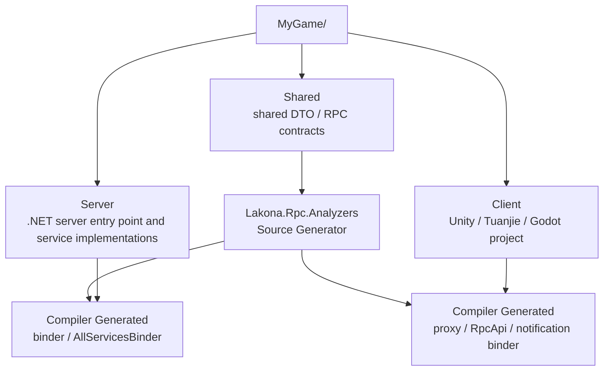
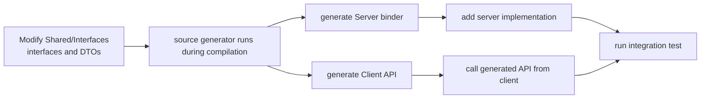

If you want to start a new two-sided C# project today, `Lakona.Rpc.Starter` is the recommended path.

It is no longer just an initialization scaffold. It is the project tool for Lakona.Rpc:

- Create new projects with `lakona-starter new`
- Generate projects with Roslyn Source Generator configuration, so later contract changes refresh server and client glue during normal compilation

It generates all of this at once:

- a `Shared` contract project
- a `Server` project and solution
- a `Client` skeleton for Unity 2022, Tuanjie Engine, or Godot 4.x
- a default `Ping` contract, service implementation, and client test entry point
- `Lakona.Rpc.Analyzers` source generator configuration

In other words, the recommended starting point is:

**Choose the transport and serializer first, then let the starter produce a runnable minimal project.**

## Prerequisites

Before starting, install the **.NET 10 SDK**:

- Download: https://dotnet.microsoft.com/en-us/download/dotnet/10.0

Commands such as `dotnet tool install`, `dotnet tool restore`, and `dotnet run` all require a working local .NET SDK.

## Quick Start

If you only want the fastest path to a running project:

1. Install the starter.
2. Generate a `websocket + json` project.
3. Start the server.
4. Open the client.
5. Restore dependencies for the selected engine.
6. Run the default connection test.

Commands:

```bash
dotnet tool install -g Lakona.Rpc.Starter
lakona-starter new --name MyGame --client-engine unity --transport websocket --serializer json

# Or
lakona-starter new --name MyGame --client-engine tuanjie --transport websocket --serializer json
cd MyGame
dotnet run --project Server/Server/Server.csproj
```

For Unity or Tuanjie Engine:

- Open `MyGame/Client` with Unity 2022 LTS or Tuanjie Engine.
- Wait for import to finish.
- Run `NuGet -> Restore Packages`.
- Open `Assets/Scenes/ConnectionTest.unity`.
- Click Play.

For Godot:

- Open `MyGame/Client` with Godot 4.x.
- Wait for Godot to generate and restore the C# solution.
- Open `Main.tscn`.
- Click Play.

For a first integration, do not start with `memorypack`. Get `websocket + json` running first, then upgrade to a higher-performance combination.

The shortest path is:

**Install starter -> generate project -> start Server -> open Client -> restore dependencies -> run the default test scene.**

## Understand the Final Structure First

The starter always generates a three-layer project:



```text
MyGame/
  Shared/
  Server/
    Server.slnx
    Server/
      Server.csproj
  Client/
```

Each layer has a clear role:

- `Shared/`
  Shared DTOs, RPC interfaces, and the UPM package definition used in Unity scenarios.
- `Server/Server/`
  Server entry point, service implementations, and server generated code.
- `Client/`
  Unity or Godot project, client generated code, and the default test entry point.

The important part is not that the structure looks tidy. The important part is:

- There is only one copy of each contract.
- Server and client both reference the same Shared project.
- Source generation always runs from the same contracts.

## Install the Starter

Install the global tool:

```bash
dotnet tool install -g Lakona.Rpc.Starter
```

If it is already installed, update it:

```bash
dotnet tool update -g Lakona.Rpc.Starter
```

## Generate a Project

The most common command is:

```bash
lakona-starter new --name MyGame --transport websocket --serializer json
```

You can also omit options and enter interactive mode:

```bash
lakona-starter new --name MyGame
```

Current options:

- `client-engine`
  - `unity`
  - `unity-cn`
  - `tuanjie`
  - `godot`

- `transport`
  - `tcp`
  - `websocket`
  - `kcp`
- `serializer`
  - `json`
  - `memorypack`

For example, to generate a `WebSocket + MemoryPack` project:

```bash
lakona-starter new --name MyGame --client-engine godot --transport websocket --serializer memorypack
```

## What the Starter Generates

The starter does more than create a few empty directories. It directly generates:

1. `Shared/Shared.csproj`, `Shared.asmdef`, and `package.json`
2. default DTOs and `IPingService`
3. `Server/Server/Program.cs` and `Services/PingService.cs`
4. `Server/Server.slnx` with both `Shared` and `Server` added
5. the selected client engine skeleton and test entry point
6. `manifest.json`, `packages.config`, and `NuGet.config` in Unity modes
7. `Assets/Scenes/ConnectionTest.unity` and `EditorBuildSettings.asset` in Unity modes
8. `project.godot`, `Client.csproj`, and `Main.tscn` in Godot mode
9. the `Lakona.Rpc.Analyzers` source generator dependency
10. server/client source generator configuration
11. automatic `git init`

Its goal is not to give you an empty template. Its goal is to give you a runnable starting point.

## How Code Updates During Daily Development

When the starter first creates the project, it configures `Lakona.Rpc.Analyzers` in the server and client projects. Later, whenever you build normally, the source generator emits server and client glue from the contracts under `Shared/Interfaces/`.

A realistic development loop usually looks like this:

1. Define new interfaces and DTOs under `Shared/Interfaces/`.
2. Build server / client normally, or wait for script compilation in the Unity / Tuanjie Editor.
3. Let the source generator generate both sides of the glue code at compile time.
4. Add the server implementation.
5. Call the generated type-safe API from the client.

In one sentence:

**When Shared contracts change, the normal build/editor flow generates the glue code; after compilation passes, continue with business logic.**



### A Practical Example: Add an Inventory Query

Suppose the default `Ping` already works and you now want the first real feature:

- The player opens the inventory screen.
- The client requests the item list from the server.
- The server returns the current inventory contents.

The first step is not editing `Server/Program.cs`, and it is not hand-writing network dispatch code.

The first step is changing `Shared/Interfaces/`.

For example, add these DTOs under `Shared/Interfaces/`:

```csharp
namespace Shared.Interfaces
{
    public sealed class InventoryItemDto
    {
        public int ItemId { get; set; }
        public string Name { get; set; } = string.Empty;
        public int Count { get; set; }
    }

    public sealed class GetInventoryRequest
    {
        public long PlayerId { get; set; }
    }

    public sealed class GetInventoryReply
    {
        public List<InventoryItemDto> Items { get; set; } = new();
    }
}
```

And add a new RPC interface:

```csharp
using System.Threading.Tasks;
using Lakona.Rpc.Core;

namespace Shared.Interfaces
{
    public static partial class RpcContractIds
    {
        public static class Services
        {
            public const int Inventory = 2;
        }

        public static class InventoryServiceMethods
        {
            public const int GetInventoryAsync = 1;
        }
    }

    [RpcService(RpcContractIds.Services.Inventory)]
    public interface IInventoryService
    {
        [RpcMethod(RpcContractIds.InventoryServiceMethods.GetInventoryAsync)]
        ValueTask<GetInventoryReply> GetInventoryAsync(GetInventoryRequest request);
    }
}
```

At this point, the next server and client compilation will see new glue code.

### What to Do Next

Build the relevant project normally.

For Server and Godot, build the project:

```bash
cd MyGame
dotnet build Server/Server/Server.csproj
```

For Unity, Unity CN, and Tuanjie projects, wait for the Editor to trigger script compilation.

No additional generation step is required. The build or editor script compilation itself triggers the source generator.

### What Happens After Compilation

During compilation, `Lakona.Rpc.Analyzers` generates glue code for both sides from `IInventoryService` and the DTOs.

On the server side, the compilation output gets `AllServicesBinder`, `InventoryServiceBinder`, and related callback proxies if you defined callbacks.

On the client side, the compilation output gets `RpcApi`, service client stubs, and notification binders.

This matters because:

- The server now knows how to route network requests to `IInventoryService`.
- The client now has a type-safe call entry point.
- You do not need to hand-write repetitive binders, stubs, or facades.

### Then Add the Server Implementation

After the compiler generates glue code, adding business logic under `Server/Server/Services/` is straightforward.

For example:

```csharp
using System.Threading.Tasks;
using Shared.Interfaces;

namespace Server.Services
{
    public sealed class InventoryService : IInventoryService
    {
        public ValueTask<GetInventoryReply> GetInventoryAsync(GetInventoryRequest request)
        {
            var reply = new GetInventoryReply();
            reply.Items.Add(new InventoryItemDto
            {
                ItemId = 1001,
                Name = "Health Potion",
                Count = 5
            });

            return new ValueTask<GetInventoryReply>(reply);
        }
    }
}
```

Now the server business logic is connected.

### How the Client Uses the New Generated Code

Next, client logic can send requests through the generated API instead of assembling protocol packets manually.

Conceptually, the call looks like this:

```csharp
var reply = await _client.Api.Shared.Inventory.GetInventoryAsync(
    new GetInventoryRequest
    {
        PlayerId = 10001
    });

foreach (var item in reply.Items)
{
    Debug.Log($"{item.ItemId} {item.Name} x{item.Count}");
}
```

The exact naming is less important than the workflow:

- You edit `Shared`.
- The Source Generator produces glue that connects Shared to the runtime.
- Server implementations only care about interfaces.
- Client calls only care about the generated strongly typed API.

### When Source Generator Must Run

The next build/editor compilation should generate new glue whenever you change:

- added / removed / modified RPC interfaces
- added / removed / modified DTOs
- method signatures, parameters, or return values
- callback interfaces

By contrast, changes that only affect service internals do not require attention to glue generation, such as:

- replacing the database query inside `InventoryService`
- changing client UI from a button click to auto-refresh on page open

### A Useful Rule of Thumb

Ask one question:

**Did this change touch contract definitions under `Shared/Interfaces/`?**

If yes, compile normally first and let the source generator emit new glue code.

If no, you can usually continue editing service implementations or client logic.

### What You Should Actually Maintain

During future development, the files you should maintain manually are:

- interfaces and DTOs under `Shared/Interfaces/`
- service implementations under `Server/Server/Services/`
- your own client business scripts

The core rule:

**When contracts change, rebuild; do not hand-write glue code.**

## Starting the Server

After generation, enter the project root:

```bash
cd MyGame
dotnet run --project Server/Server/Server.csproj
```

The default sample starts a minimal `Ping` service.

If you selected:

- `websocket`
  default listener: `ws://127.0.0.1:20000/ws`
- `tcp`
  default listener: `127.0.0.1:20000`
- `kcp`
  default listener: `127.0.0.1:20000`

## Starting the Client

For Unity or Tuanjie Engine, open this directory with the matching editor:

```text
MyGame/Client
```

On first open:

1. Wait for the editor to import the project.
2. Wait for `NuGetForUnity` to finish importing.
3. Run `NuGet -> Restore Packages` from the editor menu.
4. Open, or confirm that it has automatically opened, `Assets/Scenes/ConnectionTest.unity`.
5. Click Play.

The default scene already has `RpcConnectionTester` attached. It connects automatically and calls `Ping` once.

For Godot:

1. Open `MyGame/Client` with Godot 4.x.
2. Wait for Godot to generate and restore the C# project.
3. Open `Main.tscn`.
4. Click Play.

The default `Main.tscn` also has `RpcConnectionTester` attached. It connects automatically and calls `Ping` once.

## What the Default Code Looks Like

Default shared contracts are generated under:

```text
Shared/Interfaces/
```

For example:

```csharp
namespace Shared.Interfaces
{
    public sealed class PingRequest
    {
        public string Message { get; set; } = string.Empty;
    }

    public sealed class PingReply
    {
        public string Message { get; set; } = string.Empty;
        public string ServerTimeUtc { get; set; } = string.Empty;
    }
}
```

If you choose `memorypack`, the starter also adds the matching `MemoryPackable` annotations to DTOs and handles Unity-side `asmdef` references and `unsafe` configuration.

The default service implementation is:

```text
Server/Server/Services/PingService.cs
```

The default Unity connection script is:

```text
Client/Assets/Scripts/Rpc/Testing/RpcConnectionTester.cs
```

The default Godot connection script is:

```text
Client/Scripts/Rpc/Testing/RpcConnectionTester.cs
```

Together, these files form the smallest runnable loop.

## When to Choose JSON or MemoryPack

For a first Lakona.Rpc integration, start with:

- `websocket + json`

The reason is simple:

- easier debugging
- easier observation of request and response shapes
- fewer first-integration issues in Unity

After the full path is stable, switch to:

- `websocket + memorypack`
- `tcp + memorypack`
- `kcp + memorypack`

`MemoryPack` is a better fit later, when you are optimizing for higher performance or lower load.

## Known Behavior: Unity First Import of MemoryPack.Generator

If you generate a `memorypack` project, Unity may show analyzer reference warnings like this during the first open:

```text
Assembly '...MemoryPack.Generator.dll' will not be loaded due to errors:
Unable to resolve reference 'Microsoft.CodeAnalysis'
Unable to resolve reference 'Microsoft.CodeAnalysis.CSharp'
```

Current validation shows:

- These warnings can appear during the first import.
- Closing and reopening Unity usually makes them disappear.
- After they disappear, the project can run normally.

This is more like a first-import ordering issue between Unity, NuGetForUnity, and Roslyn analyzers than an unusable starter output.

If you see it, handle it in this order:

1. Complete `NuGet -> Restore Packages`.
2. Wait for import to finish.
3. Close Unity.
4. Reopen the project.

## How to Extend Next

After the default starter `Ping` sample works, continue along the same path as the `Inventory` example:

1. Define feature contracts under `Shared/Interfaces/`.
2. Compile normally and let the source generator produce glue code.
3. Add server implementations and client business integration.

The real source of truth in daily development is always:

**Shared contracts.**

## Read Next Before Production

After the default `Ping` works, real projects still need connection, error, security, versioning, and performance strategies. Continue with:

- [Error Handling](/rpc/posts/error-handling/)
- [Security Model](/rpc/posts/security-model/)
- [DTO Versioning](/rpc/posts/dto-versioning/)
- [Connection Lifecycle](/rpc/posts/connection-lifecycle/)
- [Threading Model](/rpc/posts/threading-model/)
- [Performance Tuning](/rpc/posts/performance-tuning/)
- [Godot Integration Guide](/rpc/posts/godot-guide/)
- [Technology Selection Guide](/rpc/posts/selection-guide/)

## Final Summary

The recommended Lakona.Rpc getting-started path is now clear:

1. Generate a project with `Lakona.Rpc.Starter`.
2. Get the default `Ping` sample running.
3. Replace it with your own contracts and business logic.

The benefits:

- consistent project structure
- Shared does not drift from day one
- clear server/client references
- fixed source generation flow
- transport / serializer choices are centralized in the template layer

For a first integration, keep growing from the starter's default structure instead of manually reshaping directories first. Stabilize the workflow before designing custom abstractions and project structure.
