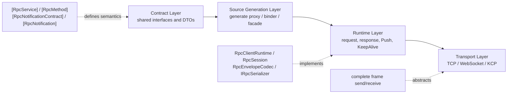
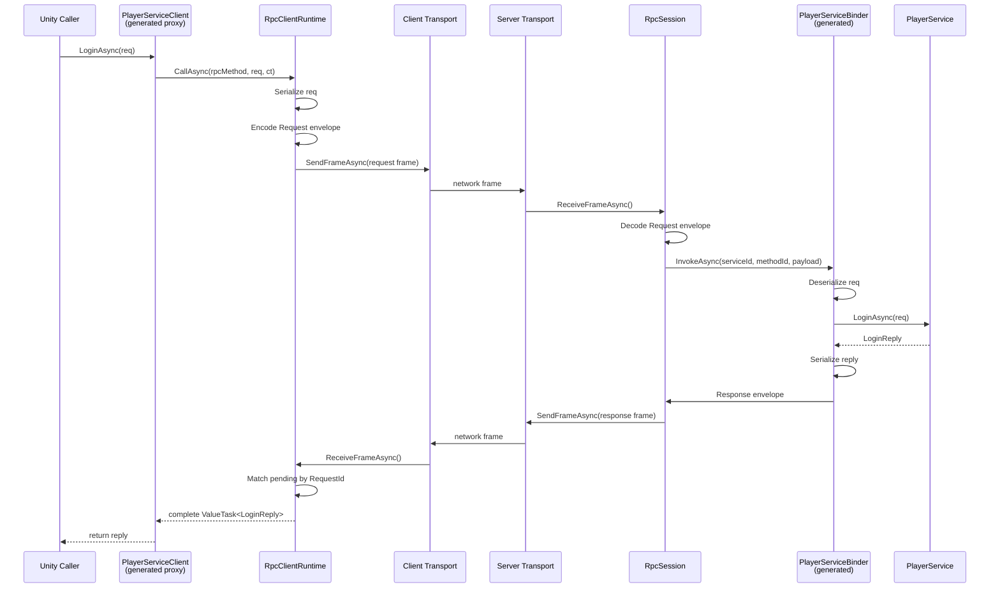
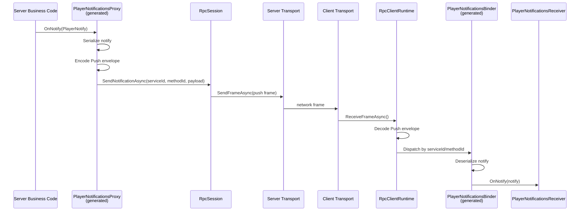
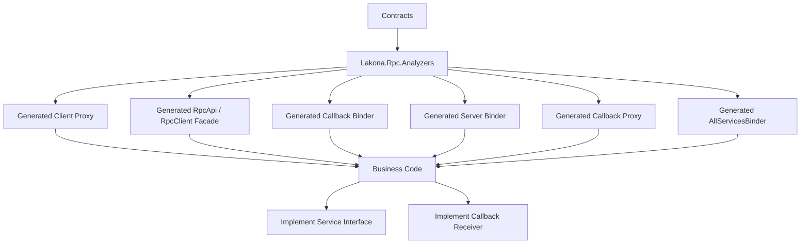

The previous article focused on usage:

- [Quickly Create a Shared-C# .NET Server and Game Client Project with Lakona.Rpc.Starter](/Lakona.Rpc/posts/lakona-rpc-getting-started/)

Once you consider putting Lakona.Rpc into a real project, the next questions are usually about design:

- Why center the framework on shared C# contracts?
- How is it fundamentally different from hand-written message ids plus `switch` dispatch?
- How does bidirectional communication fit onto one connection?
- How are Transport, Serializer, Runtime, and Source Generation decoupled?
- Which layer owns server callbacks, client pushes, request/response, keepalive, compression, and encryption?

This article does not cover environment setup. It explains the design itself: why the layers exist, why C# contracts are the communication boundary, and how bidirectional communication runs over one connection.

## One-Sentence Overview

Lakona.Rpc is a combination of **shared C# contracts + generated glue code + a frame-level runtime**.

The sentence to remember is: **server and client share the same C# contracts; the generator translates those contracts into glue code; the runtime turns that glue code into real network send/receive behavior.**

At a high level, it looks like this:



### 1. Contract Layer: Only Describe Who Can Call Whom

This layer only cares about shared interfaces and DTOs:

- `[RpcService]` marks service interfaces.
- `[RpcMethod]` marks methods clients can call.
- `[RpcNotificationContract]` marks the server-to-client notification interface for a service.
- `[RpcNotification]` marks server-to-client notification methods.

It defines what can be called and what notifications can be sent. It does not handle network details.

### 2. Source Generation Layer: Translate Contracts into Runnable Glue

This layer is handled by the Roslyn source generator in `Lakona.Rpc.Analyzers`. It reads RPC contract symbols from the current compilation and referenced assemblies, then generates:

- client service proxies
- client notification binders
- the client unified entry point `RpcApi`
- server binders
- server notification proxies
- server `AllServicesBinder`

The generation layer translates interface definitions into code that can send, receive, and dispatch packets.

### 3. Runtime Layer: Send Frames Over Connections

The runtime is built from several parts:

- `ITransport`: sends and receives complete frames.
- `IRpcSerializer`: converts objects to/from payloads.
- `RpcEnvelopeCodec`: converts RPC headers to/from binary frames.
- `RpcClientRuntime`: manages client requests, pending responses, and notifications.
- `RpcSession`: receives, dispatches, responds, and sends notifications on the server.
- `TransportFrameCodec` / `TransformingTransport`: compression and encryption.

The compact version is:

> **Contracts define semantics, Source Generator creates glue, Runtime sends and receives.**

---

## Why Lakona.Rpc Does Not Encourage Hand-Written Network Messages

Many Unity + server projects start from a familiar pattern:

1. Define a message id enum.
2. Hand-write request structures.
3. Send a `messageId` from the client.
4. Dispatch with a `switch` or dictionary on the server.
5. Hand-write another response structure.
6. Add a separate notification protocol when the server needs to notify the client.

That works, but the costs show up as the project grows:

- message ids and business method names become two separate concepts
- client and server can drift into maintaining separate protocol copies
- server notifications often become a different model from request/response
- new team members cannot easily tell which message maps to which business interface
- renaming interfaces or parameters does not automatically update dispatch code

Lakona.Rpc makes the opposite choice:

**The first abstraction is not the message id. The first abstraction is the interface method.**

`serviceId` / `methodId` are pushed down into implementation details.

You write:

```csharp
[RpcService(1, NotificationContract = typeof(IPlayerNotifications))]
public interface IPlayerService
{
    [RpcMethod(1)]
    ValueTask<LoginReply> LoginAsync(LoginRequest req);
}
```

The runtime still depends on stable numeric ids:

- `serviceId = 1`
- `methodId = 1`

This preserves both sides:

- **Business readability**: application code sees interfaces and methods.
- **Protocol stability**: the network still carries stable numeric ids.

That is the part that makes it more maintainable than a fully hand-written protocol over time.

---

## Why Each Method Takes One DTO

Lakona.Rpc now has a clear design convergence: **do not map method parameter lists directly to network payloads; `RpcMethod` and `RpcNotification` should each take one DTO argument.**

Write this:

```csharp
[RpcMethod(1)]
ValueTask<LoginReply> LoginAsync(LoginRequest req);

[RpcNotification(1)]
void OnNotify(PlayerNotify notify);
```

Not this:

```csharp
[RpcMethod(1)]
ValueTask<LoginReply> LoginAsync(string account, string password);

[RpcNotification(1)]
void OnNotify(string message);
```

### Why This Converged

Allowing no-argument, bare single-argument, and multi-argument methods looks flexible at first, but creates long-term problems:

- changing the method signature changes the wire payload shape
- multi-argument methods naturally depend on parameter order
- notification style becomes inconsistent if bare parameters are allowed
- the source generator must maintain branches for no-arg / DTO / multi-arg forms
- docs and samples cannot settle on one clear convention

This is fine for short demos, but it is not friendly to long-lived projects, multi-person work, or mismatched client/server versions.

### Why Not Use a Protobuf-Style Field Number Model

The practical reason is that Lakona.Rpc currently supports both JSON and MemoryPack, and neither serializer is naturally organized around an explicit field-number protocol. Forcing the whole contract model toward protobuf style would make usage heavier and lose the natural "plain C# interface" feel.

The current compromise is pragmatic:

- do not introduce a field-number system
- do not require a separate schema language
- remove the riskiest part: sending raw method parameter lists over the network
- unify on one request DTO / one response DTO / one notification DTO

### What This Tradeoff Buys

Benefits:

- more stable wire shapes for RPC methods
- much simpler source generator code
- a more consistent model for callback, request, and response
- easier samples, docs, and team conventions
- versioning discussions happen mainly at the DTO layer, not the parameter-list layer

Costs:

- you write more DTOs
- tiny interfaces look a little more verbose than bare-parameter methods
- this is not a full protobuf v3 compatibility model

This is not the strongest possible compatibility design. It is a balance between natural C# usage, implementation complexity, and long-term maintainability. For Lakona.Rpc's positioning, that tradeoff is appropriate: stabilize the contract style first, then tighten DTO versioning rules over time, instead of turning the whole framework into a heavy protocol system from day one.

---

## Layering: Semantics Above, Frames Below

Lakona.Rpc's layering is intentionally explicit.

## Layer 1: Contracts Own Semantics

In `Lakona.Rpc.Core`, the contract layer is thin. It is mainly attributes and method descriptor types:

- `RpcServiceAttribute`
- `RpcMethodAttribute`
- `RpcNotificationContractAttribute`
- `RpcNotificationAttribute`
- `RpcMethod<TArg, TResult>`
- `RpcNotificationMethod<TArg>`

This layer does not care whether you use TCP or WebSocket, JSON or MemoryPack, or how packets are sent and received.

It cares about one thing: **what this interface method means in RPC semantics.**

The important result is:

**The top-level mental model is not "packet". It is "service interface".**

---

## Layer 2: Envelopes Compress Semantics into Stable Binary Headers

The network eventually carries bytes, so Lakona.Rpc needs a stable middle format between Contract and Transport: the **Envelope**.

`RpcEnvelopes` / `RpcEnvelopeCodec` split RPC data into five frame types:

- `Request`
- `Response`
- `Push`
- `KeepAlivePing`
- `KeepAlivePong`

A rough view of the protocol headers, with integers in big-endian order:

```text
Request
+-----------+-----------------+-----------------+-----------------+------------------+
| Type(1B)  | RequestId(4B)   | ServiceId(4B)   | MethodId(4B)    | PayloadLen(4B)   |
+-----------+-----------------+-----------------+-----------------+------------------+
|                                  Payload bytes...                                 |
+------------------------------------------------------------------------------------+
Fixed header = 17 bytes

Response
+-----------+-----------------+------------+------------------+--------------+
| Type(1B)  | RequestId(4B)   | Status(1B) | PayloadLen(4B)   | HasError(1B) |
+-----------+-----------------+------------+------------------+--------------+
| Payload bytes... | ErrorLen(4B, optional) | Error bytes...(optional, UTF-8) |
+---------------------------------------------------------------------------+
Fixed header = 11 bytes
If HasError = 1, append ErrorLen(4B) + Error bytes

Push
+-----------+-----------------+-----------------+------------------+
| Type(1B)  | ServiceId(4B)   | MethodId(4B)    | PayloadLen(4B)   |
+-----------+-----------------+-----------------+------------------+
|                           Payload bytes...                           |
+----------------------------------------------------------------------+
Fixed header = 13 bytes

KeepAlivePing / KeepAlivePong
+-----------+----------------------+
| Type(1B)  | TimestampTicks(8B)   |
+-----------+----------------------+
Fixed header = 9 bytes
```

The key distinction:

- `Request / Response` need `RequestId` because they form a paired round trip.
- `Push` does not need `RequestId` because it is one-way.

Lakona.Rpc does not force every case into one universal message type. It splits semantics at the protocol layer, which keeps runtime decisions and generated code cleaner.

### Why Envelopes and Serializers Are Separate

`RpcEnvelopeCodec` only encodes headers and payload boundaries. It does not decide how objects inside the payload are serialized.

In other words:

- Envelope answers "is this a request, which service and method is it for, and how long is the payload?"
- Serializer answers "how are fields inside the payload object encoded?"

That separation is why JSON and MemoryPack can be swapped: **the protocol header is fixed, while payload encoding is replaceable.**

---

## Layer 3: Transport Only Cares About Complete Frames

`ITransport` is intentionally framed. It does not expose "send byte segment" or "read from stream" APIs. Its boundary is:

- `SendFrameAsync(ReadOnlyMemory<byte> frame)`
- `ReceiveFrameAsync()`

That means **the transport boundary is frame, not stream**.

### Why This Matters

It keeps complexity inside transport implementations instead of leaking it into the RPC runtime.

The runtime always sees:

- "I received one complete request frame."
- "I am sending one complete response frame."

Therefore:

- TCP solves stream splitting/coalescing internally.
- WebSocket already behaves closer to message frames.
- KCP has its own message boundary behavior.

Those differences are absorbed by the transport layer. The upper runtime does not need to know whether the underlying network is stream-based.

### Why Lakona.Rpc Can Swap Transports

Many frameworks claim multi-transport support but only wrap different socket clients. Lakona.Rpc's abstraction is stricter:

**If a transport implements complete-frame send/receive, the upper RPC layer does not change.**

TCP, WebSocket, and KCP can use the same runtime not because they are similar, but because the interface boundary is accurate.

---

## Layer 4: Runtime Turns Frames into Calls

Attributes and transports do not make RPC work by themselves. The runtime does.

The client core is `RpcClientRuntime`; the server core is `RpcSession`. They are mirror components.

### What the Client Runtime Does

`RpcClientRuntime` mainly:

1. assigns an increasing `requestId` to each request
2. serializes the request object and sends it as a `Request` frame
3. waits for responses in a `_pending` dictionary keyed by `requestId`
4. handles `Response`, `Push`, and `KeepAlivePong` in the background receive loop

The client is essentially a **multiplexed request manager**:

- multiple requests can be in flight on one connection
- each request finds its `TaskCompletionSource` by `requestId`
- responses wake the matching waiter

The public API is strongly typed `CallAsync<TArg, TResult>`, but underneath it is a typical asynchronous multiplexing model.

### What the Server Session Does

`RpcSession` represents one server-side connection session. It mainly:

1. starts the transport
2. receives complete frames in a loop
3. decodes `serviceId/methodId` from `Request` frames
4. finds the matching handler in the registry
5. runs business logic, serializes the result, and returns a `Response`

Server-to-client messages use:

- `RpcSession.SendNotificationAsync(serviceId, methodId, arg)`

So **server push and server response share the same connection and framing; only the frame type differs.**

That is the core of bidirectional communication:

- the client is not only a requester
- the server is not only a passive responder
- the connection is a full-duplex session

---

## Request/Response Flow: From Interface Call to Return Value

When Unity code calls:

```csharp
var reply = await client.Api.Game.Player.LoginAsync(req);
```

the lower layers roughly follow this path:



### Step 1: The Call Hits a Generated Client Proxy

It looks like an interface call, but the actual target is the generated `PlayerServiceClient`.

The proxy defines something like:

```csharp
private static readonly RpcMethod<LoginRequest, LoginReply> loginAsyncRpcMethod = new(ServiceId, 1);
```

Then it forwards to:

```csharp
_client.CallAsync(loginAsyncRpcMethod, req, ct)
```

**Generated code translates the interface method call into a runtime call with `serviceId/methodId`.**

### Step 2: Runtime Creates `requestId` and Serializes the Argument

`RpcClientRuntime.CallAsync`:

- creates a new `requestId`
- serializes `req` into payload bytes
- constructs `RpcRequestEnvelope`
- passes it to `RpcEnvelopeCodec.EncodeRequest`

Now a C# object call has become a binary frame ready to send.

### Step 3: Transport Sends the Frame

The runtime does not care whether the transport is TCP, WebSocket, or KCP. It calls:

```csharp
_transport.SendFrameAsync(frame)
```

If compression or encryption is enabled, the frame may first pass through `TransformingTransport`:

- compress
- encrypt and authenticate
- send through the underlying transport

### Step 4: Server Session Receives a Request Frame

`RpcSession` reads a frame and calls `PeekFrameType`.

- If it is `KeepAlivePing`, it replies with pong.
- If it is not `Request`, it ignores it.
- If it is `Request`, it decodes the request envelope.

Then it looks up a handler by `(serviceId, methodId)`.

### Step 5: The Handler Comes from a Generated Binder

The server does not hand-write a giant dispatch table. The source generator creates binders for each service. For example, `PlayerServiceBinder` binds:

- `(1, 1)` to `LoginAsync`
- `(1, 2)` to `IncrStep`

The binder:

- deserializes parameters from `req.Payload`
- obtains the service implementation
- calls the real business method
- serializes the result
- builds `RpcResponseEnvelope`

Its core role is:

**compile protocol dispatch into static, type-safe registration code.**

### Step 6: The Service Implementation Runs

Only now does your business class, such as `PlayerService`, execute.

The business class does not need to know:

- which network connection the request came from
- what the packet header looks like
- how responses are encoded

It only implements ordinary interface methods.

That is one of Lakona.Rpc's main goals:

**separate business code from network boilerplate.**

### Step 7: Response Returns to the Client by `requestId`

When the client receives a `Response`, `RpcClientRuntime.ReceiveLoopAsync`:

- decodes the response
- finds the matching `TaskCompletionSource` in `_pending` by `response.RequestId`
- completes the result

The outer `await client.Api.Game.Player.LoginAsync(req)` then resumes.

### Step 8: Failures Return Through the Protocol Too

If a server handler is missing, business code throws, or an error status is returned, the response contains:

- `Status`
- `ErrorMessage`

The client runtime throws when `Status != Ok`.

So callers still experience "await a method; failures throw", even though a full network round trip happened underneath.

---

## Server-to-Client Push: Callback Is Part of the Contract

One of Lakona.Rpc's practical strengths is that server push is not designed as a separate system.

The model is unified:

- client -> server: `[RpcService] + [RpcMethod]`
- server -> client: `[RpcNotificationContract] + [RpcNotification]`

The data flow looks like this:



### Why This Matters

Many projects handle request and push with separate systems:

- requests use RPC
- pushes use another message bus
- one business module maintains two protocol definitions

Lakona.Rpc puts callbacks into the same contract:

```csharp
[RpcService(1, NotificationContract = typeof(IPlayerNotifications))]
public interface IPlayerService
{
    [RpcMethod(1)]
    ValueTask<LoginReply> LoginAsync(LoginRequest req);
}

[RpcNotificationContract(typeof(IPlayerService))]
public interface IPlayerNotifications
{
    [RpcNotification(1)]
    void OnNotify(PlayerNotify notify);
}
```

This does not mean "the service also happens to have an event subscription." It means:

**`IPlayerService` naturally has a server-to-client notification contract.**

### How the Server Notification Proxy Works

Generated server code emits a `PlayerNotificationsProxy`. It implements `IPlayerNotifications`, but its method bodies do not run local logic. They:

- serialize the argument
- call `RpcSession.SendNotificationAsync`
- send a `Push` frame

So when service code writes:

```csharp
_callback.OnNotify(new PlayerNotify { Message = "hello" })
```

it looks like a local object call, but it actually sends a server-to-client notification through a notification proxy.

**Notification appears as "call an interface" in business code, not "hand-build a push packet."**

### What the Client Notification Binder Does

The generated `PlayerNotificationsBinder` maps `(serviceId, methodId)` to the notification receiver registered by client code.

When the client runtime receives a `Push` frame:

1. decode `serviceId` / `methodId`
2. find the matching notification handler
3. deserialize the payload
4. call the user's receiver

The two sides close the loop:

- server notification proxy turns interface calls into `Push` frames
- client notification binder turns `Push` frames back into interface calls

---

## Why Use Code Generation Instead of Reflection RPC

Runtime reflection is possible in theory:

- scan assemblies at startup
- find `[RpcService]`
- find `[RpcMethod]`
- build dynamic dispatch tables
- invoke methods by reflection after receiving requests

Lakona.Rpc chooses source generation because Unity scenarios make static generation more practical.



The point is not saving a few lines. The point is deciding who maintains the large amount of repetitive, fragile glue code that otherwise drifts from contracts.

### 1. Unity / AOT Prefer Static Generation

Unity, IL2CPP, and AOT environments are not friendly to runtime reflection plus dynamic generation. Generating static code ahead of time is more robust.

### 2. Generated Code Is Easier to Inspect

When debugging, generated files show:

- which `serviceId/methodId` maps to which method
- how request parameters are packed
- how the server deserializes
- how callbacks are bound

That is easier to inspect than hidden reflection logic.

### 3. Runtime Cost Is Lower

Compiling dispatch logic ahead of time reduces:

- runtime reflection scanning
- dynamic binding overhead
- generic boxing/unboxing paths

### 4. Constraints Are Clearer

The source generator validates contracts while scanning:

- duplicate `ServiceId`
- duplicate `MethodId`
- callback/service mismatch
- RPC return types must be `ValueTask` / `ValueTask<T>`

Many protocol mistakes are rejected during generation instead of failing at runtime.

Lakona.Rpc does not use code generation for its own sake. The generator is a practical tool for making shared C# contracts work, in exchange for:

- Unity compatibility
- static readability
- earlier errors

---

## What the Source Generator Actually Does

More concretely, the generator handles six kinds of work.

## 1. Parse Contract Source

`ContractParser` does not scan assemblies at runtime. It analyzes C# source files in the contracts directory.

It extracts:

- service interface name
- service id
- method list
- parameter type and order
- return type
- notification interface and notification methods
- required `using` directives

The input is source contracts, not DLLs. Benefits:

- richer information during generation
- validation before contracts are fully consumed by business projects
- a better fit for Unity / shared contract workflows

## 2. Generate Client Proxies

Each service gets an `XxxServiceClient`.

Its job is simple:

- bake method ids into `RpcMethod<TArg, TResult>` fields
- forward interface calls to `_client.CallAsync(...)`

Users get a call shape close to a local interface.

## 3. Generate Client Notification Binders

If a service declares a notification contract, the generator emits `XxxNotificationsBinder`.

It:

- predefines `RpcNotificationMethod<TArg>`
- registers notification handlers with the runtime
- deserializes notification arguments
- invokes the notification receiver supplied by user code

## 4. Generate the Unified Client Facade `RpcApi`

When a project has multiple services, users should not manually construct many client proxies. The generator emits:

- `RpcApi`
- grouped `xxxRpcGroup` types
- extensions on `RpcClient`

The end-user experience becomes:

```csharp
client.Api.Game.Player.LoginAsync(...)
client.Api.Game.Inventory.GetRevisionAsync(...)
```

This organizes independent proxies into a facade that is easier for business code to consume.

## 5. Generate Server Binders

Server binders are one of the most important outputs.

They register each `(serviceId, methodId)` with `RpcServiceRegistry` and, inside each handler, handle:

- argument decoding
- service implementation lookup
- business method invocation
- return value encoding
- response assembly

Client proxies translate local calls into network requests. Server binders translate network requests back into local calls.

## 6. Generate Server Notification Proxies and the Aggregate Binder

If a service has notifications, the server also gets notification proxies. Together with `AllServicesBinder`, this supports:

- automatic service implementation discovery
- automatic rule-based binding
- explicit service instances / factories for larger projects

Small projects work out of the box, while larger projects keep explicit control.

---

## Why the Server Has Both Registry and Session-Scoped Services

First-time readers often notice two server structures:

- a global `RpcServiceRegistry`
- `_scopedServices` inside `RpcSession`

They are not duplicates. They operate at different levels.

### `RpcServiceRegistry` Answers "How Do I Find the Handler?"

The registry key is:

- `serviceId`
- `methodId`

It stores `RpcSessionHandler`, meaning:

- what logic should run when a session receives this RPC method

So the registry owns **protocol-level dispatch**.

### `_scopedServices` Answers "Which Service Instance Does This Connection Reuse?"

Before a binder calls business code, it gets the service instance with:

```csharp
server.GetOrAddScopedService(ServiceId, implFactory)
```

The default semantics are:

- **one scoped service instance per session / serviceId**

Benefits:

- state on one connection can naturally live on the service instance
- notification proxy can be tied to the current session
- users do not need to maintain a "connection -> service object" map

This fits connection-stateful business logic such as:

- login state
- current player context
- room session state
- callback channel for one connection

The design is not redundant. It pushes connection scope into the framework.

---

## Why Keepalive Lives in Runtime, Not Transport

Keepalive in Lakona.Rpc is not implemented separately by each transport. The RPC runtime handles it consistently:

- the client sends `KeepAlivePing` / receives `KeepAlivePong`
- server sessions reply pong when they receive ping
- clients can measure RTT
- servers can also decide a connection is dead based on timeout

### Benefits

If keepalive lived in the transport layer, each transport would need its own version:

- TCP version
- WebSocket version
- KCP version

The semantics might diverge.

At the RPC frame layer, keepalive becomes cross-transport behavior:

- any transport that can send frames can support keepalive

In other words, **keepalive is part of RPC session semantics, not a property of one concrete socket.**

This matches the rest of Lakona.Rpc:

- transport provides "frame delivery"
- runtime provides "connection session semantics"

---

## Why Compression and Encryption Are in `TransformingTransport`

Between the RPC runtime and low-level transport, Lakona.Rpc inserts `TransformingTransport`.

The idea is deliberately engineering-focused:

- transport owns connectivity
- runtime owns RPC semantics
- security and compression are frame transformations

Therefore:

- compression threshold is controlled by `TransportSecurityConfig`
- encode/decode logic lives in `TransportFrameCodec`
- composition wraps the real transport with `TransformingTransport`

### Benefits

It avoids two common forms of confusion.

#### Confusion 1: Put Compression into the Serializer

That couples object encoding to network optimization, and each serializer's behavior becomes more complex.

#### Confusion 2: Put Encryption into Every Transport

Then TCP, WebSocket, and KCP each need their own compression/encryption implementation, creating duplication.

Lakona.Rpc instead:

- first obtains a standard frame
- optionally applies frame-level compression/encryption
- decrypts/decompresses on receive, then restores the standard frame

This keeps "security" and "protocol" separated.

One caveat: this encryption is a framework-level symmetric encryption scheme for frame content protection. It is not a full TLS replacement. If your transport already runs over TLS/WSS, whether to add another layer depends on your deployment environment.

---

## Bidirectional RPC Is One Full-Duplex Session, Not Two Systems

This is the most useful mental model.

People often imagine bidirectional RPC as:

- one client -> server system
- a separate server -> client push system

Lakona.Rpc is not split that way.

It is closer to:

- one full-duplex session underneath
- several frame types on that session
- request/response is one frame combination
- server push is another frame combination

So:

- **bidirectional ability comes from the connection model itself**
- **it does not come from a second protocol stack**

This has two practical benefits.

### 1. Unified Mental Model

Requests, responses, pushes, and keepalive all revolve around:

- frame
- service id
- method id
- payload

### 2. Lower Maintenance Cost

You do not need a second serializer, message bus, or handler system for push.

This matters especially for Unity clients, which are already a poor place to carry duplicated infrastructure.

---

## Where This Design Fits

After the design, the fit becomes clearer.

## Good Fits

### 1. Unity + .NET Projects with Shared Contracts

This is Lakona.Rpc's natural home. You already have:

- a Unity client
- a C# server
- shared DTOs / interfaces

Lakona.Rpc extends the same C# type system across the client/server communication boundary.

### 2. Business Domains with Clear Service Boundaries

Examples:

- login
- inventory
- quests
- rooms
- battle control commands
- small-scale state synchronization

These modules naturally split into services.

### 3. Teams That Want Strong Typing + Bidirectional Callbacks Without Hand-Written Protocols

If you are tired of:

- message id management
- hand-written encode/decode maps
- split push and request protocols

Lakona.Rpc directly addresses those problems.

## Poorer Fits

### 1. You Need Extremely Free Binary Layout

If you need bit-level control, field compression, or extreme packet layout design, a general RPC abstraction like Lakona.Rpc will not be the closest fit.

### 2. You Are Sending High-Frequency Streaming Data, Not Service Calls

Very high-frequency, fine-grained synchronization streams may not be worth modeling as RPC methods. Lakona.Rpc is better used for:

- control plane
- business call plane
- medium/low-frequency state distribution

Use a more specialized protocol for extremely high-frequency data channels.

### 3. Server and Client Are Not Both in the C# Stack

Lakona.Rpc starts from the assumption that a C# server and a C# game client share the same communication contract. If your client is mainly TypeScript, C++, Java, Go, or native mobile, schema-first or multi-language IDL tools are usually a better fit.

---

## Seven Principles for Real Projects

### 1. Treat Contracts as First-Class

The long-term stable artifact is not the generated file. It is the contract.

### 2. Do Not Casually Change `serviceId` / `methodId` After Release

They are stable protocol identifiers, not just decorative numbers in code.

### 3. Treat Callback as Part of Service Design

If a service naturally pushes from server to client, put that in the contract from the start instead of adding a side-channel protocol later.

### 4. Use Lakona.Rpc for Control Plane and Clear Semantic Calls First

Login, matchmaking, inventory, quests, room management, gameplay commands, and similar APIs are good fits.

### 5. Let Transport and Serializer Follow the Scenario

- Need easier debugging: start with JSON.
- Need better efficiency: evaluate MemoryPack.
- Need web compatibility: use WebSocket.
- Need a real-time networking prototype: evaluate TCP / KCP.

### 6. Do Not Hand-Edit Generated Code

Generated code is a projection of contracts, not a manual maintenance layer. Change behavior in contracts or runtime.

### 7. Keep Business Code Away from Network Details

If business implementations constantly care about headers, message ids, or serialization details, the abstraction has leaked.

---

## Closing: Lakona.Rpc Solves Boundary Maintenance, Not Just Packet Sending

Many frameworks can move data from A to B. The hard part is keeping all of these true over time:

- C# contracts can be shared between server and client
- interfaces stay strongly typed
- client calls and server pushes share one model
- the transport can be replaced
- the serializer can be replaced
- the Unity / .NET workflow remains usable
- new maintainers can understand the system quickly

Lakona.Rpc's answer is simple:

1. **Use interfaces to define communication boundaries.**
2. **Use source generation to remove binder / proxy / facade boilerplate.**
3. **Use a lightweight runtime for request, response, push, and keepalive.**
4. **Use transport / serializer abstractions to keep low-level infrastructure replaceable.**

It is not an all-in-one networking framework. It is a clear composition:

- strongly typed contracts at the top
- generated glue in the middle
- unified framing and replaceable infrastructure at the bottom

For Unity + .NET projects, the workflow is direct: write C# contracts, compile normally, connect the runtime, and let business code implement interfaces and handle callbacks.

The final line:

> **Lakona.Rpc is not mainly saving a few packet-sending lines. It is helping you maintain a bidirectional RPC boundary over the long term.**
