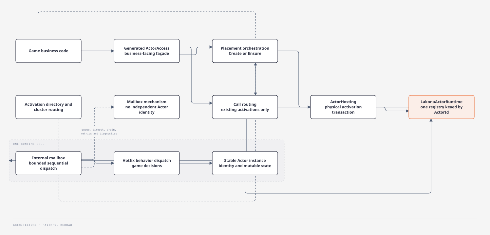
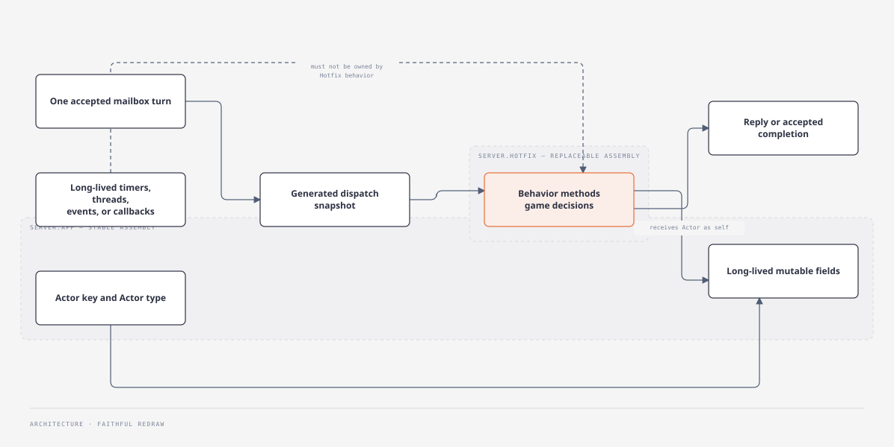
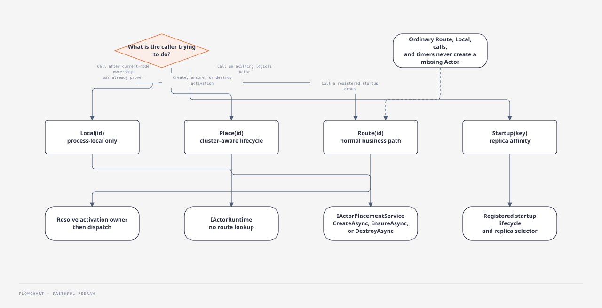
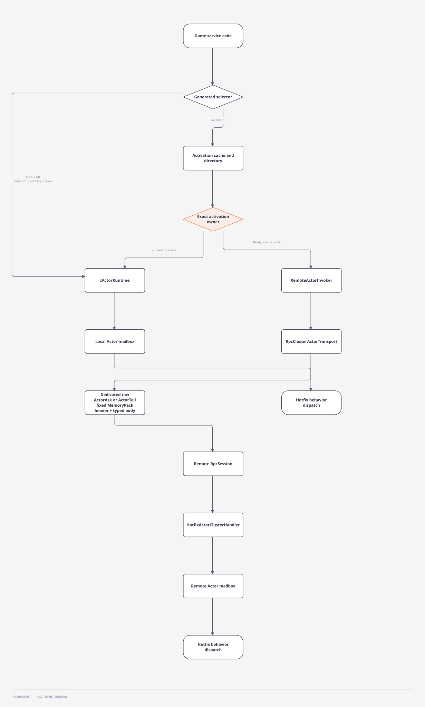
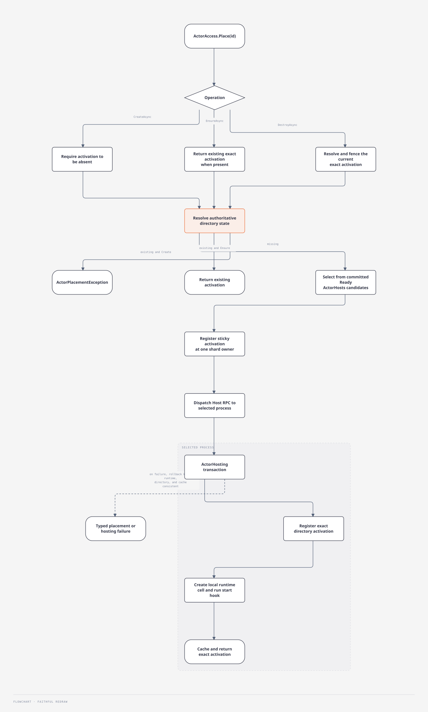
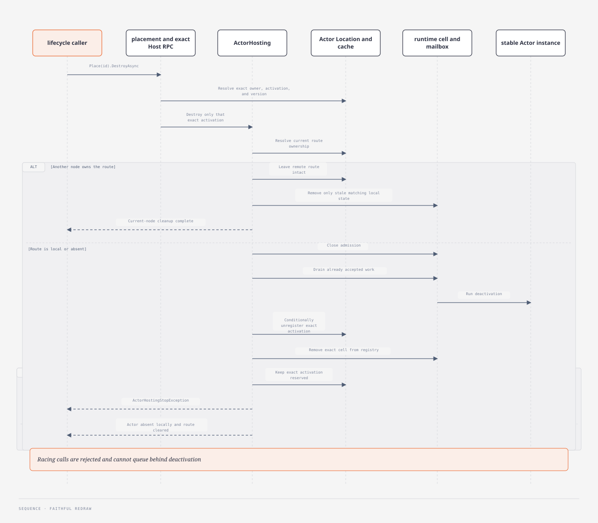
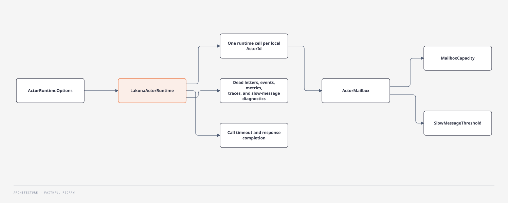

# Actor Model

Lakona exposes one public actor API for game code:
`Lakona.Game.Server.Actors`. The same runtime owns actor identity, lifecycle,
dispatch, and diagnostics. Its internal mailbox implementation is a queueing
mechanism, not a second actor API or independently usable actor system.

Actors are the recommended way to model long-lived mutable game state such as
rooms, players, lobbies, matchmaking queues, leaderboards, and schedulers. An
actor is a concurrency boundary. It is not an ECS entity, an ORM model, or a
transparent distributed object.

The diagrams establish the ownership and execution model. The rules, API
shapes, and failure semantics following them remain the precise contract.

## Reading Map

| Question | Start here |
| --- | --- |
| Where do Actor state and game decisions live? | [Stable Actor, Hotfix Behavior](#stable-actor-hotfix-behavior) |
| Which generated selector should business code use? | [Generated Actor Access](#generated-actor-access) |
| How is an Actor identified? | [Actor Key Model](#actor-key-model) |
| What happens on a local or remote call? | [Runtime Layers](#runtime-layers) |
| How is an Actor created or destroyed safely? | [Managed Lifecycle](#managed-lifecycle) |
| How do startup replicas and timers work? | [Timers](#timers) |

## Responsibility Split



`LakonaActorRuntime` keeps one registry keyed by the public `ActorId`. A runtime
cell owns the actor instance and one mailbox; queued `ActorWorkItem` values are
invoked directly by that cell. There is no numeric kernel actor id, actor ref,
adapter actor, or envelope-to-envelope conversion between the public runtime
and mailbox.

## Stable Actor, Hotfix Behavior

Hotfix is mandatory for Lakona game servers. User-authored actor classes in
`Server.App` are stable state holders. Game decisions belong in matching
`Server.Hotfix` behavior classes.



```csharp
// Server.App
public readonly record struct RoomId(string Value);

public sealed class RoomActor : Actor<RoomId>
{
    internal readonly HashSet<string> Members = new(StringComparer.Ordinal);
}
```

```csharp
// Server.Hotfix
[HotfixBehaviorOf(typeof(RoomActor))]
public sealed partial class RoomBehavior
{
    public ValueTask<JoinRoomReply> JoinAsync(
        RoomActor self,
        JoinRoomRequest request,
        CancellationToken cancellationToken = default)
    {
        self.Members.Add(request.PlayerId);
        return new ValueTask<JoinRoomReply>(new JoinRoomReply { Accepted = true });
    }
}
```

Public behavior extension methods are the actor API exposed through generated
selectors and refs. They execute inside an actor turn and may read and mutate
the actor's stable fields, but hotfix code must not own long-lived timers,
threads, static event subscriptions, or callbacks that can keep an old hotfix
assembly alive.

The detailed authoring rules are in
[hotfix/actor-behavior.md](hotfix/actor-behavior.md).

## Generated Actor Access

Generated actor APIs expose one injectable access root for local, routed,
placement, and startup calls. Business code does not import one collection
class per actor or hand-write actor ids, route keys, serializers, or
reply-correlation plumbing.

```csharp
public sealed class ActorAccess
{
    public LocalActor<TActor> Local<TActor>(RoomId id)
        where TActor : Actor<RoomId>;

    public ActorRoute<TActor> Route<TActor>(RoomId id)
        where TActor : Actor<RoomId>;

    public ActorPlacement<TActor, RoomId> Place<TActor>(RoomId id)
        where TActor : Actor<RoomId>;

    public StartupActor<TActor, string> Startup<TActor>(string key)
        where TActor : Actor;
}
```

Inside the same actor turn, call the actor instance directly. Across actor
boundaries, use the generated access root:

```csharp
await actors.Route<RoomActor>(roomId).CallAsync(static behavior => behavior.JoinAsync, request, cancellationToken);
await actors.Local<RoomActor>(roomId).PostAsync(static behavior => behavior.RunTickAsync, request, cancellationToken);
```



The generated overloads bind each business key type to `Actor<TKey>`, so an
actor/key mismatch is a compile error. The returned selectors are readonly
value types. Selecting an actor does not use `dynamic`, reflection-based
construction, boxing, or a per-call heap allocation. The single root also
holds shared routing dependencies once instead of repeating them in every
per-actor collection instance.

Selector semantics:

- `Route(id)` is the normal business path. It owns actor-directory lookup and
  node selection before dispatch.
- `Local(id)` invokes only the process-local actor runtime and should be used
  only after the caller has already proven current-node ownership.
- `Place(id)` is the cluster-aware activation-lifecycle path. `CreateAsync`
  fails if the logical actor already has an activation; `EnsureAsync` returns
  the existing activation or creates one when absent; `DestroyAsync` retires
  the exact activation found by the operation and is idempotent when absent.
  Placement never moves an existing activation.
- `Startup(key)` routes through the lifecycle of an Actor group registered by
  `[HotfixConfigureActors]`.

`ActorAccess` is the only business-facing Actor façade. It expresses logical
Actor call and provisioning intent but owns no lifecycle state machine.
Generated placement selectors delegate cluster orchestration to
`IActorPlacementService`; the selected process always performs physical
activation work through the internal `ActorHosting` module. Generated access
exposes logical cluster destruction, but it does not expose current-node
hosting, directory mutation, or hidden call-triggered creation.

Generated actor selectors expose generic `CallAsync` and `PostAsync` helpers.
`CallAsync` is completion-aware and surfaces the behavior reply or a typed
actor call failure. `PostAsync` is acceptance-only and completes once the
mailbox or remote transport accepts the work. Lower-level status-returning
APIs remain available for framework internals and boundary services.

Remote Actor request and reply payloads use the fixed MemoryPack serializer
owned by the `Lakona.Game.Server` cluster channel. They do not use the
client-facing endpoint serializer.

Actor API DTOs are protocol contracts rather than Actor state. They must live
in stable, non-hotfix assemblies and use
`[MemoryPackable(GenerateType.VersionTolerant)]` with explicit,
never-reassigned `MemoryPackOrder` values. This permits additive rolling
changes while keeping hotfix generations out of the serialized type graph.

Generated remote calls keep the request as its compile-time DTO type until the
cluster client writes it. A typed MemoryPack codec is closed once when the
Hotfix dispatch snapshot is published; invocation performs no
`Type`-based serialization, `MakeGenericMethod`, or reflective serializer
dispatch. The request header and DTO body are written directly into the final
RPC request frame. The receiver decodes a slice of that frame, dispatches the
cached typed method codec, and writes the reply header and result directly into
the final RPC response frame.

The Actor request/reply RPC methods are dedicated raw methods on the private
cluster service. They do not pass through `ClusterActorEnvelope`,
`ClusterMessage`, or the general cluster message DTO. This boundary has one
explicit owner at each stage: the RPC client owns the outbound frame until
send completes, the RPC session owns the inbound frame while dispatch runs,
and the caller owns and disposes the returned response frame after the typed
reply has been materialized. Copied `byte[]` payload wrappers and a replaceable
Actor serializer seam are forbidden.

Every routed request also carries the exact cluster, node, membership, Actor
activation, and deadline proof required before mailbox dispatch. Their
different lifetimes, validation rules, and retry boundary are defined in
[Distributed Identity And Request Lifetime](cluster.md#distributed-identity-and-request-lifetime).

Direct `AddLakonaGameServerActors()` usage remains process-local and installs
neither cluster membership nor a cluster endpoint. Generated non-local
references require `AddLakonaGameServer`, whose endpoint is always backed by
committed membership.

Process-local actor-only hosts install no directory. `Local` and local
placement operate directly on the process runtime; `Route` requires clustered
composition and fails loudly when Actor Location is absent.

## Actor Key Model

Actor key type is declared in the actor base type:

```csharp
public sealed class RoomActor : Actor<RoomId>
{
}
```

This avoids separate key attributes and avoids generator guessing. The
generator uses `TKey` to generate constrained
`Local<TActor>(TKey id)` and `Route<TActor>(TKey id)` overloads.

Default key-to-string conversion:

1. If `TKey` has a readable `Value` property, use `Value.ToString()`.
2. Otherwise use `TKey.ToString()`.

Default actor id shape:

```txt
<actor-name>/<key-value>
```

`ActorContext.Id` is that complete, type-qualified runtime identity.
`ActorContext.Key` is the decoded business-key portion. Actor behavior that
needs the room, user, queue, or zone key uses `Key`; it must not treat the
complete `Id` as a business value or strip the actor-name prefix itself.

Long-lived protocols can pin the Actor wire name with `[ActorName]` and a
behavior method's wire name with `[ActorMethod("stable-name")]`. Generated
method keys and ids use the explicit method wire name, so the C# method can be
renamed without changing that part of the protocol identity. Actor, request,
and result type identities remain part of the method id.

Public behavior methods are remotely callable by default. Mark public
composition helpers with `[ActorIgnore]` to exclude them before method-shape
validation, code generation, and runtime dispatch. `[ActorMethod]` and
`[ActorIgnore]` are mutually exclusive, and an explicit method wire name must
not be empty.

Actor ids are global, stable business ids. They must not encode node id,
transport endpoint, callback state, connection id, or RPC session objects.
Good ids are shaped around the business object:

```txt
user/player-123
matchmaking/default
room/room-456
leaderboard/current
```

`ActorHosting` owns route registration for actors it creates. User code should
not separately publish an actor route for a local actor created through
framework lifecycle APIs.

## Failure Model

Generated `CallAsync` operations return a reply on success and throw typed
exceptions on local or routed failure.

```csharp
try
{
    var reply = await actors
        .Route<RoomActor>(roomId)
        .CallAsync(static behavior => behavior.JoinAsync, request, cancellationToken);
}
catch (ActorCallException ex) when (ex.Status == ActorCallStatus.ActorNotFound)
{
    // The room has gone away or was never registered.
}
```

Actor failures should carry structured details such as status, node, actor id,
actor name, method name, and correlation id. Initial status values should cover
route not found, expired route, timeout, backpressure, handler unavailable,
node unavailable, serialization failure, deserialization failure, and
cancellation.

## Actor Diagnostics Privacy

Default actor diagnostics expose aggregate actor type counts and mailbox
counters. They must not expose per-actor identity or request state.

Default diagnostics JSON, metric tags, and trace attributes must not include
actor ids, actor names, call chains, message payloads, request values, session
ids, tokens, or user-specific identifiers.

Allowed low-cardinality fields include actor type, message type, timeout
reason, mailbox queue totals, processed counts, rejected counts, and
slow-message counters.

Mailbox queue totals are maintained at enqueue, dequeue, rejection, and drain
boundaries. Metrics collection reads the aggregate counter in constant time;
it must not enumerate every live Actor mailbox during a scrape.

Detail endpoints are disabled by default. Any endpoint that exposes more than
aggregate actor diagnostics requires explicit diagnostics detail mode.

## Runtime Layers

The generated typed API has separate local and remote execution branches:



Generated business behavior calls resolve ownership through the Actor
activation directory, then send directly to the exact Ready owner over the
private cluster RPC connection. There is no parallel generic message or route
directory stack.

Membership consensus and Actor ownership have separate responsibilities.
Membership consensus publishes which exact Ready nodes advertise the required
`ActorHosts` capability; it does not decide or log the concrete owner of every
Actor. The placement selector uses that committed candidate set only when an
activation is missing. The Actor Location shard owner then conditionally
publishes the sticky exact activation. The complete coordination
boundary belongs to
[Consensus Model And Scope](./cluster.md#consensus-model-and-scope).

Every full Lakona server node can own Actor Location shards. Each shard has one
exact owner; affected shards seal and transfer on planned ownership change,
while owner-loss recovery scans surviving activation registries as defined by
[Actor Location DHT](./cluster.md#actor-location-dht).

There is no additional actor-directory endpoint or provider configuration.
Ownership records remain in memory; complete cluster loss discards them.
Actor fields and mailbox contents are not replicated by either membership
consensus or the activation directory.

`ActorDirectory` lives in `Lakona.Game.Server`. Business code should not
receive endpoint addresses or directory endpoint names.

`IActorRuntime` is a generated-support and advanced local runtime API. It
remains public because generated actor refs, hotfix service boundaries, tests,
diagnostics, and framework integrations may live in user assemblies, but it is
process-local and not the recommended daily business API. Ordinary gameplay
code should use generated actor selectors so local and routed placement intent
remains visible at the call site.

Framework code which already holds a canonical `ActorId` may use generated
`LocalExact<TActor>(actorId)` to avoid interpreting that identity as a business
key a second time. It is current-process-only and performs neither location
lookup nor creation; gameplay code normally keeps using typed business keys.

## Managed Lifecycle

Actor lifecycle has one business façade, one cluster orchestration seam, and
one local transaction owner:

- generated `ActorAccess.Place<TActor>(id)` is the business-facing lifecycle
  façade;
- `IActorPlacementService` resolves existing activations, discovers candidate
  hosts, applies rendezvous or a custom placement strategy, acquires activation
  ownership, and dispatches to the selected process;
- internal `ActorHosting` is the only current-node physical activation owner.
  It runs `CreateAsync`, `EnsureAsync`, or `DestroyAsync` while keeping the
  local runtime, `ActorDirectory`, and `ActorDirectoryCache` consistent.



Framework startup, remote Host RPC, placement, and hotfix rollback all converge
on `ActorHosting`; business code does not inject it or mutate directory/cache
state separately. `Route`, `Local`, ordinary Actor calls, and timer callbacks
never create missing actors.

Creation, placement, capacity, and idempotency belong at the actor placement
boundary. Once an actor exists, services and gateways should call ordinary
business behavior through generated actor refs. Raw `IActorRuntime.AskAsync`
and `TellAsync` remain framework-level escape hatches.

Business placement semantics:

- `ActorAccess.Place<TActor>(id).CreateAsync()` is strict across the cluster.
  It fails with `ActorPlacementException` if the directory already contains an
  activation, another concurrent caller wins activation ownership, or the
  selected host reports an existing owner.
- `ActorAccess.Place<TActor>(id).EnsureAsync()` is idempotent. It returns the
  existing activation or creates one when absent.
- `ActorAccess.Place<TActor>(id).DestroyAsync()` is idempotent when absent. It
  captures the current exact owner, activation id, and version, then asks only
  that activation to retire. A delayed request cannot destroy a replacement.

An Actor that owns the decision that its business lifetime has ended calls
`Context.RequestDeactivation()`. This does not synchronously destroy the Actor
from inside its own mailbox. The runtime accepts the request only during an
active turn, discards it if that turn fails, and closes admission after a
successful reply before scheduling the same `ActorHosting` destruction
transaction. Coordinators use `Place(id).DestroyAsync()` for rollback and
external lifecycle decisions; normal self-completion does not require a
manager Actor.

If the post-turn destruction transaction itself fails, the runtime logs the
failure without actor identity, keeps admission closed, and leaves the exact
location reserved. The application or an operations path must retry
`Place(id).DestroyAsync()`; the runtime never guesses whether a partially
completed stop hook is safe to reverse, reopens a retired object, or releases
the route after a failed stop.

Current-node hosting semantics:

- `CreateAsync<TActor>` is strict. It fails if the actor id is already hosted
  locally, if the local id belongs to a different actor type, or if the
  directory reports an owner on another node.
- `EnsureAsync<TActor>` is idempotent only for an active local actor of exactly
  the requested type. It still fails for type mismatch, non-active local state,
  or a remote directory owner.
- `DestroyAsync<TActor>` is current-node cleanup. It is successful when the
  actor and local route are already absent, but it must not delete a route owned
  by another node or stop a local actor of a different type.
- `[ActorLocalOnly]` actors skip directory and cache work. Distributed actors
  publish or clear current-node routes as part of the hosting transaction.

Hosting failures are typed exceptions derived from `ActorHostingException`.
Important cases include `ActorAlreadyHostedException`,
`ActorHostingTypeMismatchException`, `ActorHostedElsewhereException`,
`ActorDirectoryUnavailableException`, and `ActorHostingStopException`.
They are internal hosting details reached by framework lifecycle paths;
business placement failures are surfaced as `ActorPlacementException`.
Actor call exceptions remain separate; they describe failed calls to already
selected actors, not actor lifecycle operations.

In a multi-node cluster, transport failure, serialization or deserialization
failure, and an unavailable or invalid directory reply are all surfaced as
`ActorDirectoryUnavailableException`. Caller-requested cancellation remains an
`OperationCanceledException` and is not wrapped as directory unavailability.

Missing actor behavior is deterministic:

- `AskAsync`, `TellAsync`, and generated actor refs return or throw structured
  `ActorNotFound` failures.
- timer callbacks target existing actors through normal actor calls and report
  diagnostics when the actor is missing.
- no normal actor call path implicitly creates the actor.

Distributed actor destroy order is:



Closing mailbox admission first stops new work while keeping the exact activation
reserved until all accepted work and the stop hook have finished. Only then does
`ActorHosting` conditionally unregister it. If stop or drain cannot finish, the
route remains reserved and no replacement can overlap. If another node owns the route,
`DestroyAsync` leaves that route intact and only removes stale current-node
cache/local actor state for the requested type.

Local stop closes mailbox admission before deactivation is queued. Calls that
race with stop are rejected through the normal rejection and dead-letter
diagnostic path; they cannot queue behind deactivation and reactivate the actor.
If the caller's drain timeout expires, the cell remains `Draining` until its
already accepted work finishes, then the runtime removes that exact cell from
the registry so the public `ActorId` can be created again.

Runtime disposal is terminal. It closes every current mailbox without running
actor deactivation hooks, waits for their completion, and rejects later
lifecycle, dispatch, state, metrics, or diagnostics operations with
`ObjectDisposedException`. Actor construction racing disposal cannot publish a
new registry cell after disposal begins.

## Timers

Hotfix timers are framework-owned callbacks created through `LakonaTimer`.
Startup service groups are declared from the Hotfix assembly's single optional
`[HotfixStartup]` composition root. Large Actor registration sets should be
split into explicit helper or extension-method calls from that root; multiple
startup roots reject the candidate before any registration executes. Periodic
work should stay inside hotfix actor behavior or explicit timer callbacks:

```csharp
[HotfixStartup]
public static class GameHotfixStartup
{
    [HotfixConfigureActors]
    public static void Actors(ActorHostBuilder actors)
    {
        actors.RegisterStartup<MatchmakingActor, MatchmakingQueueId>();
    }
}

public sealed record BattleRuntimeTick(string QueueId);

[HotfixTimer]
public sealed partial class BattleRuntimeTimers
{
    public ValueTask TickAsync(TimerTick<BattleRuntimeTick> tick)
    {
        // Enter generated actor selectors or services here.
        return default;
    }
}
```

Each capable node starts one physical replica. Generated business code calls
`.Startup(key)`; the key only supplies affinity to the fixed selector and is not
an actor id. The parameterless registration uses rendezvous hashing by default;
pass a selector to `RegisterStartup<TActor, TKey>(selector)` when the product
requires another affinity algorithm. The framework advertises a replica after
`[ActorStart]` succeeds and withdraws it before removal. Same-key failover is
limited to attempts known not to have executed. State is local to each replica,
so failover does not preserve an in-memory queue. Use the exact physical actor
id only for internal lifecycle work such as a replica-owned timer.

The method name is explicit on purpose. Use `nameof(...)` so the call site shows
which callback will run and normal refactoring tools keep the declaration in
sync. The scheduler stores the method name rather than a delegate because a
delegate could keep an old reloadable hotfix assembly generation alive after
reload.

One process-wide scheduler owns all Hotfix timer registrations across reloadable
generations. Its active population is bounded by
`Lakona:Timers:MaxActiveTimers`; capacity exhaustion rejects creation instead of
silently dropping or replacing a business timer. Destroy remains constant-time
on the ordinary path, while accumulated stale priority-queue entries trigger an
amortized rebuild. Timer population and rejection diagnostics use the
low-cardinality `Lakona.Game.Timer` meter.

## Analyzer Boundary

Analyzer rules apply at the public actor and hotfix boundary:

| Rule | Scope |
| --- | --- |
| `LKNHOTFIX011` no actor business methods in stable app | hotfix authoring |

Actor isolation and thread-safety rules target the public game-facing facade,
not the internal mailbox implementation.

## Configuration Flow



The runtime also owns call timeout, diagnostic events, dead letters, slow
message reporting, and call-timeout handling. These signals therefore carry
the public actor identity directly and need no mapping layer.
