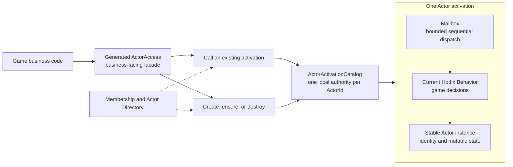
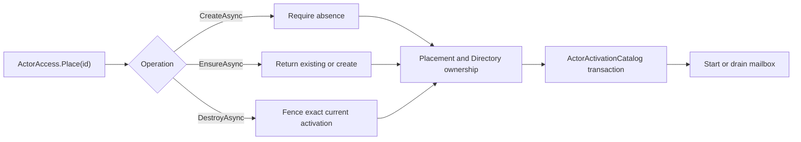

# Actors and Hotfix Behavior

A Lakona game Actor is one programming model split across two application
assemblies. Stable `Server.App` owns identity and long-lived mutable state;
reloadable `Server.Hotfix` owns the behavior that reads and changes that state.
Neither half is an independently usable Actor model.

Actors model long-lived mutable game state such as rooms, players, lobbies,
matchmaking queues, leaderboards, and schedulers. An Actor is a concurrency
boundary. It is not an ECS entity, an ORM model, a persistence mechanism, or a
transparent distributed object.

Lakona exposes one public Actor API for game code:
`Lakona.Game.Server.Actors`. The same runtime owns identity, lifecycle,
sequential dispatch, and diagnostics. Its mailbox is an execution mechanism,
not a second Actor API or activation registry.

## Reading Map

| Question | Start here |
| --- | --- |
| How do stable state and reloadable behavior form one Actor? | [Defining An Actor](#defining-an-actor) |
| Which generated selector should business code use? | [Calling Actors](#calling-actors) |
| What happens during one call or timer callback? | [Actor Turns And Hotfix Generations](#actor-turns-and-hotfix-generations) |
| How is an Actor identified? | [Identity And Keys](#identity-and-keys) |
| How is an Actor created or destroyed? | [Lifecycle](#lifecycle) |
| How do fixed replicas and scheduled work behave? | [Startup Actors](#startup-actors) and [Timers](#timers) |
| How do failures and diagnostics surface? | [Failure Model](#failure-model) and [Diagnostics And Privacy](#diagnostics-and-privacy) |
| Where are the distributed and internal algorithms? | [Runtime And Cluster Internals](#runtime-and-cluster-internals) |

## Mental Model



`ActorActivationCatalog` owns the exact local activation, lifecycle state,
Actor instance, Directory claim, and mailbox for each `ActorId`. Calls enter
the mailbox and execute the current Hotfix Behavior against the stable Actor
instance. Membership and Actor Directory locate and fence an activation; they
do not store application state.

## Defining An Actor

Hotfix is mandatory for Lakona game servers. User-authored Actor classes in
`Server.App` are stable state holders. Matching Behavior classes in
`Server.Hotfix` contain game decisions.

```csharp
// Server.App
public readonly record struct RoomId(string Value);

[NodeRole("battle")]
public sealed class RoomActor : Actor<RoomId>
{
    internal readonly HashSet<string> Members = new(StringComparer.Ordinal);
}
```

```csharp
// Server.Hotfix
[HotfixBehaviorOf(typeof(RoomActor))]
public sealed partial class RoomBehavior
{
    public ValueTask<JoinRoomReply> JoinAsync(
        RoomActor self,
        JoinRoomRequest request)
    {
        self.Members.Add(request.PlayerId);
        return new ValueTask<JoinRoomReply>(
            new JoinRoomReply { Accepted = true });
    }
}
```

Public Behavior methods form the remotely callable Actor API by default. Use
`[ActorMethod("stable-name")]` to preserve wire identity while a C# method name
changes. Use `[ActorIgnore]` for public composition helpers that must not enter
generation or remote dispatch. The attributes are mutually exclusive, and an
explicit method name must not be empty.

Behavior methods mutate only their target Actor's state. Calls to another
Actor go through generated selectors so routing and placement intent remain
explicit. Actor state must not store transport callbacks, session callback
objects, Behavior instances, Hotfix delegates, or hand-written string
dispatch.

Stable Actor fields and properties should be `internal` unless they are an
intentional public application contract. `Server.App` grants internal
visibility only to its paired `Server.Hotfix` assembly. The Hotfix analyzer
then limits non-public Actor state to the Actor itself and the unique class
whose `[HotfixBehaviorOf]` targets it. Access from a service, lifecycle helper,
or another Actor's Behavior produces `LAKONA20031` as a build error.
Explicitly public members are not restricted by this diagnostic.

Actor classes do not expose activation or deactivation overrides. Initialize
context-independent collections and value state with field initializers. Any
initialization or cleanup that needs the Actor context, application services,
timers, or business rules belongs exclusively in the matching Behavior's
`[ActorStart]` or `[ActorStop]` method. This keeps stable Actors as state
holders and gives each lifecycle phase one user-authored entry point.

Actor request, reply, timer, and lifecycle DTOs are stable protocol contracts,
not Actor state. Remote request and reply DTOs live in non-Hotfix assemblies
and use `[MemoryPackable(GenerateType.VersionTolerant)]` with explicit,
never-reassigned `MemoryPackOrder` values. This permits additive rolling
changes without putting Hotfix types in the serialized graph.

Lifecycle and timer methods also live on the Behavior:

```csharp
[ActorStart]
public ValueTask StartAsync(RoomActor self, ActorStartCall call) => default;

[ActorStop]
public ValueTask StopAsync(RoomActor self, ActorStopCall call) => default;
```

`LAKONA20011` rejects Actor business methods placed in the stable App. Store
long-lived runtime handles in stable Actor state; Hotfix objects must never
keep an old generation alive.

## Calling Actors

Generated APIs expose one injectable `ActorAccess` root:

```csharp
public sealed class ActorAccess
{
    public LocalActor<TActor> Local<TActor>(RoomId id)
        where TActor : Actor<RoomId>;

    public ActorRoute<TActor> Route<TActor>(RoomId id)
        where TActor : Actor<RoomId>;

    public ActorPlacement<TActor, RoomId> Place<TActor>(RoomId id)
        where TActor : Actor<RoomId>;

    public StartupActor<TActor, string> Startup<TActor>(string key)
        where TActor : Actor;
}
```

Use the selector that expresses the caller's intent:

- `Route(id)` is the normal business path. It locates and calls an existing
  logical Actor locally or remotely.
- `Local(id)` bypasses route lookup and calls only the current process. Use it
  only after current-node ownership has already been proven.
- `Place(id)` creates, ensures, or destroys an activation through the
  cluster-aware lifecycle boundary.
- `Startup(key)` calls an Actor group registered by
  `[HotfixConfigureActors]` and preserves affinity for the business key.

Ordinary `Route`, `Local`, calls, posts, and timers never create a missing
Actor. Actor/key mismatches are compile errors because generated overloads bind
each business key type to `Actor<TKey>`.

```csharp
var reply = await actors
    .Route<RoomActor>(roomId)
    .CallAsync(
        static behavior => behavior.JoinAsync,
        request,
        cancellationToken);

await actors
    .Local<RoomActor>(roomId)
    .PostAsync(
        static behavior => behavior.RunTickAsync,
        request,
        cancellationToken);
```

`CallAsync` waits for the Behavior reply and surfaces a typed call failure.
`PostAsync` is acceptance-only: it completes when the local mailbox or remote
transport accepts ownership of the work.

The method selector must be a direct static lambda in the form
`static behavior => behavior.MethodAsync`. This keeps Go to Definition pointed
at the implementation and binds method identity without retaining an old
Hotfix generation. The calling node does not construct the Behavior; only the
node executing the Actor resolves its application dependencies.

Inside one Actor turn, code may call methods on `self` directly. Across Actor
boundaries, use `ActorAccess`. `IActorRuntime` is a generated-support and advanced local runtime API.
It remains public because generated code, tests,
diagnostics, and framework integrations may live in user assemblies, but it is
process-local and not the recommended daily business API. Framework code that
already holds a canonical `ActorId` may use generated
`LocalExact<TActor>(actorId)`; this performs neither route lookup nor creation.

## Actor Turns And Hotfix Generations

One accepted call, post, lifecycle hook, or timer callback executes as one
serialized mailbox turn. When execution begins, the runtime acquires one
Hotfix dispatch snapshot and uses it for the whole turn. Publishing a newer
generation affects later turns; it cannot switch Behavior midway through an
in-flight turn.

Generated dispatch retains stable method identity and serialized arguments,
never a Behavior delegate. The executing node resolves the Behavior from the
acquired generation and releases that generation after the turn completes.
This lets an old collectible assembly unload after all of its accepted work
has drained.

Actor work items also carry the originating RPC publication scope across the
mailbox boundary. Notifications published during an awaited `CallAsync` can
therefore join the originating response's delivery barrier. This does not
change mailbox serialization. Posted work and work that outlives the request
cannot extend an already closed response scope.

Caller cancellation and timeout stop waiting for a result. Before mailbox
admission, cancellation can prevent admission; after admission, queued and
running work continues. Behavior methods accept only the Actor and request DTO,
with no caller `CancellationToken`. Cancellation does not roll back side effects
or prove that work stopped. Model cancellable business operations explicitly,
for example with an operation id and a separate cancellation command. Framework
lifecycle and timer cancellation remain independent of ordinary calls.

## Identity And Keys

The Actor base type declares its business key:

```csharp
public sealed class RoomActor : Actor<RoomId>
{
}
```

The default key formatter uses a readable `Value` property when present and
otherwise uses `ToString()`. The default identity is:

```text
<actor-name>/<key-value>
```

`ActorContext.Id` is the complete type-qualified runtime identity.
`ActorContext.Key` is the decoded business-key portion. Behavior that needs a
room, user, queue, or zone key uses `Key`; it must not strip the Actor-name
prefix from `Id` itself.

Use `[ActorName]` to pin a long-lived Actor wire name and `[ActorMethod]` to pin
a method wire name. Actor, request, and result type identities remain part of
the generated method id.

Actor ids are global business ids. They must not encode a node id, endpoint,
connection id, callback state, or RPC session. Useful identities look like:

```text
user/player-123
matchmaking/default
room/room-456
leaderboard/current
```

## Lifecycle

Lifecycle has one business facade and one local transaction owner:



- `CreateAsync()` is strict across the cluster and fails if the logical Actor
  already has an activation or another caller wins ownership.
- `EnsureAsync()` is idempotent. It returns the existing activation or creates
  one when absent.
- `DestroyAsync()` is idempotent when absent. It captures and retires only the
  exact activation found by the operation; a delayed request cannot destroy a
  replacement.

Create and Ensure carry the Hotfix version that minted the lifecycle
capability. The selected owner rejects an obsolete generation before creating
state. Destroy remains valid across a Hotfix reload when its exact activation
proof still matches, so replacing Behavior cannot strand an activation that
must be released.

An Actor that owns the decision that its business lifetime has ended calls
`Context.RequestDeactivation()`. The request is valid only during an active
turn, is discarded if that turn fails, and closes new admission after a
successful reply before scheduling normal destruction. External coordinators
use `Place(id).DestroyAsync()`.

Creation attaches the stable Actor to its runtime context, then opens admission
only after Directory ownership and `[ActorStart]` succeed. Destruction closes
admission first, drains already accepted work, runs `[ActorStop]`, conditionally
releases the exact Directory claim, and then removes the activation. Calls
racing with stop are rejected; they cannot queue behind deactivation and reopen
the Actor. Stop-hook exceptions are reported while cleanup continues.

If drain or exact claim release cannot be confirmed, admission remains closed
and the fenced claim remains recoverable for a later destroy retry. Lifecycle
state never moves backward, and a retired Actor is never reopened.

`[ActorLocalOnly]` Actors skip Directory and route-cache work. Process-local
composition supports `Local` and local placement; `Route` requires clustered
composition and fails when Actor Directory is absent.

Business placement errors surface as `ActorPlacementException`. Framework
integration may receive typed `ActorHostingException` cases for duplicate
hosting, type mismatch, remote ownership, Directory unavailability, or stop
failure. These are activation failures, not call failures.

## Startup Actors

Startup Actors are explicitly deployed, strongly stateful Actor groups. Each
capable node hosts one physical replica, while `.Startup(key)` binds a business
key to one exact replica. They are not stateless workers, ordinary
load-balanced calls, or virtual Actors.

The Actor's `[NodeRole]` and the node's `Lakona:Node:Roles` determine capable
hosts. Register a group from the Hotfix assembly's single optional startup
root:

```csharp
[HotfixStartup]
public static class GameHotfixStartup
{
    [HotfixConfigureActors]
    public static void Actors(ActorHostBuilder actors)
    {
        actors.RegisterStartup<MatchmakingActor, MatchmakingQueueId>();
    }
}
```

The parameterless registration uses rendezvous hashing for the first owner.
Pass a selector to `RegisterStartup<TActor, TKey>(selector)` when the product
needs another initial placement policy. Policy changes affect only keys without
an existing affinity unless the product performs an explicit migration.

Startup affinity guarantees at most one live owner for each Actor type and
business key. Node joins, load changes, candidate ordering, selector changes,
and Hotfix publication do not move an existing key while its exact owner
incarnation remains live. An unreachable or indeterminate owner is not treated
as dead; ambiguity fails closed. Only Membership committing that incarnation
out permits selection of a replacement.

Hotfix publication replaces Behavior on the existing replica without changing
its affinity identity. An incompatible Behavior change requires explicit state
migration or unavailability; it must not create a parallel owner. Failover
preserves single ownership but does not preserve process-memory Actor state.

The framework advertises a replica only after `[ActorStart]` succeeds and
withdraws it before removal. Detailed affinity partitioning, recovery, and
Membership transitions belong to
[Sticky Actor Placement](cluster.md#sticky-actor-placement).

## Timers

Create Actor-owned timers inside the owner's active turn and select a method on
its Behavior directly:

```csharp
self.TimerId = self.CreatePeriodicTimer(
    static (RoomBehavior behavior) => behavior.OnTimerAsync,
    TimeSpan.Zero,
    TimeSpan.FromSeconds(1),
    new RoomTimerArgs());

[ActorTimer]
private ValueTask OnTimerAsync(
    RoomActor self,
    TimerTick<RoomTimerArgs> tick)
{
    return default;
}
```

`CreateOnceTimer` omits the period. Both creation methods register
synchronously and return `TimerId`; store the id in stable Actor state only
when early cancellation is needed. `DestroyTimer` is synchronous and prevents
future delivery without waiting for a callback already running.

An `[ActorTimer]` method returns `ValueTask`, accepts
`(ActorType, TimerTick<TArgs>)`, and is excluded from Actor RPC even when
public. It cannot also declare `[ActorMethod]`, `[ActorIgnore]`, `[ActorStart]`,
or `[ActorStop]`. Registrations retain serialized arguments and method
identity, never a Hotfix delegate. The callback acquires the current generation
when its mailbox turn begins.

Timer argument declarations are checked during compilation (`LAKONA20055`
and `LAKONA20056`) and again against the candidate's actual load context before
publication. Argument types, including array elements and generic arguments,
must come from stable assemblies such as `Server.App`. Hotfix-private
dependencies cannot own these types either.

The root argument cannot be generic except for nullable supported scalar values;
wrap a collection in a stable named DTO. Supported data consists of scalar
values (including enums, `Guid`, dates, and `TimeSpan`), single-dimensional
zero-based arrays, nested `List<T>` values, and concrete DTO classes using public
properties. Public fields, `object`, interfaces, delegates, abstract types,
custom structs, and unsupported framework types are rejected, including when
nested in DTO properties. Declared type traversal is bounded to 32 levels;
self-referential DTO declarations remain valid. Validation does not execute
DTO constructors or getters. Actual reference cycles, excessive payload depth,
and lossy serialization are still rejected by the registration-time round-trip
check.

A timer belongs to one exact activation. Stopping that activation cancels
future callbacks, and a pending tick cannot reach a replacement with the same
key. Creation and cancellation require the owner's active turn and Hotfix
scope. Missing or completed timers are ignored; canceling a timer owned by
another activation is rejected.

Each timer has at most one pending or running callback. For a periodic timer,
the next due time is `max(actualStart + period, completion)` using a monotonic
clock. Slow callbacks do not build a historical backlog. Queue pressure delays
accepted callbacks rather than silently dropping them. Callback failures are
reported without retrying that execution; periodic timers continue with their
next round, while one-shot timers end.

Timers are process-memory resources and do not provide exactly-once business
side effects. Process loss requires application recovery or a durable
scheduler. The process-wide capacity and diagnostics are defined in
[Timer Configuration](configuration.md#timers) and
[Observability](observability.md#instrumentation-scopes).

## Failure Model

Generated `CallAsync` operations return the Behavior reply on success and
throw `ActorCallException` with a structured `ActorCallStatus` on failure:

```csharp
try
{
    var reply = await actors
        .Route<RoomActor>(roomId)
        .CallAsync(
            static behavior => behavior.JoinAsync,
            request,
            cancellationToken);
}
catch (ActorCallException ex)
    when (ex.Status == ActorCallStatus.ActorNotFound)
{
    // The room has gone away or was never created.
}
```

Statuses distinguish missing or expired routes, timeout, backpressure,
unavailable Behavior, unavailable node, serialization failure,
deserialization failure, and cancellation. Transport exceptions are translated
at the Actor boundary so application code does not catch private cluster-RPC
exceptions.

Automatic retry is permitted only when local or remote evidence proves the
Behavior did not enter its mailbox. A stale exact route may be invalidated,
resolved again, and retried once under that proof. Timeout, disconnect,
cancellation, and any other failure after possible execution are indeterminate
and are not retried automatically.

Missing Actor behavior is deterministic: calls return or throw
`ActorNotFound`, and timers never resolve or recreate an Actor by id.

## Diagnostics And Privacy

Default Actor diagnostics expose aggregate Actor-type and mailbox counts, not
per-Actor identity or request state. Metrics and default diagnostic JSON must
not include Actor ids, message payloads, request values, session ids, tokens,
or user identifiers. Metric collection reads maintained aggregate counters; it
must not enumerate every live mailbox during a scrape.

Low-cardinality fields may include Actor type, message type, timeout reason,
queue totals, and processed, rejected, or slow-message counts. Detail endpoints
remain disabled unless diagnostics detail mode is explicitly enabled.

Concrete meters, activities, tags, dashboards, and alert guidance belong to
[Observability](observability.md).

## Runtime And Cluster Internals

The programming model above is authoritative for game code. Framework
maintenance follows these ownership boundaries:

- `Lakona.Game.Server.Actors` owns the process-local runtime, mailbox,
  `ActorActivationCatalog`, and the narrow `IActorDirectory` port.
- Cluster owns Membership, the distributed Actor Directory adapter, placement
  candidate publication, range transfer and recovery, Startup affinity, and
  private node-to-node RPC.
- Hotfix owns generation validation, publication, dispatch snapshots, service
  providers, retirement, and unload.
- Configuration owns node roles, process budgets, and defaults; Observability
  owns concrete instruments and operational guidance.

The process-local Catalog is the only local activation authority. Framework
startup, placement, remote Host RPC, Hotfix rollback, shutdown, and recovery
all converge on it; business code never mutates Catalog or Directory state.
`AddLakonaGameServerActors()` installs only this process-local Actor runtime;
`AddLakonaGameServer()` adds Membership, Actor Directory, and cluster routing.
Every Directory acquire or release uses an exact `NodeReference` and
`ActorActivationId`; there is no node-only ownership fallback.

Failed-create compensation has a framework-owned 30-second lifetime independent
of caller cancellation. If exact release cannot be confirmed before that
deadline, the operation reports an unconfirmed compensation failure and keeps
the fenced Catalog entry available to recovery. Graceful shutdown drains
activations while Directory and cluster transport are still available; runtime
disposal is the final safety net and does not rerun lifecycle hooks.

Continue with the owning authority for deeper mechanics:

- [Distributed identity and request lifetime](cluster.md#distributed-identity-and-request-lifetime)
- [Cluster RPC composition](cluster.md#cluster-rpc-composition)
- [Actor Directory DHT](cluster.md#actor-directory-dht)
- [Node roles and Actor hosting](configuration.md#node-roles-and-actor-hosting)
- [Hotfix architecture](hotfix/architecture.md)
- [RPC source generation](rpc/source-generation.md)
- [Runtime performance](performance.md)
