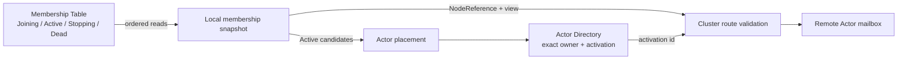
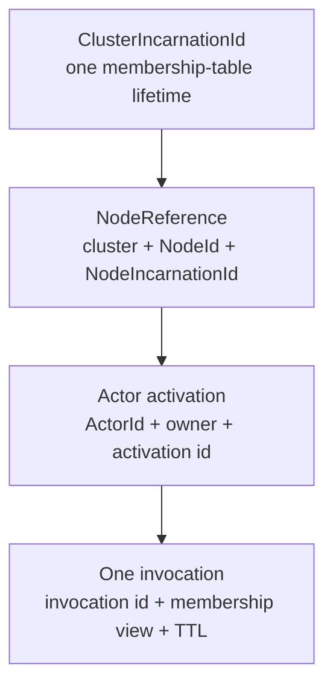
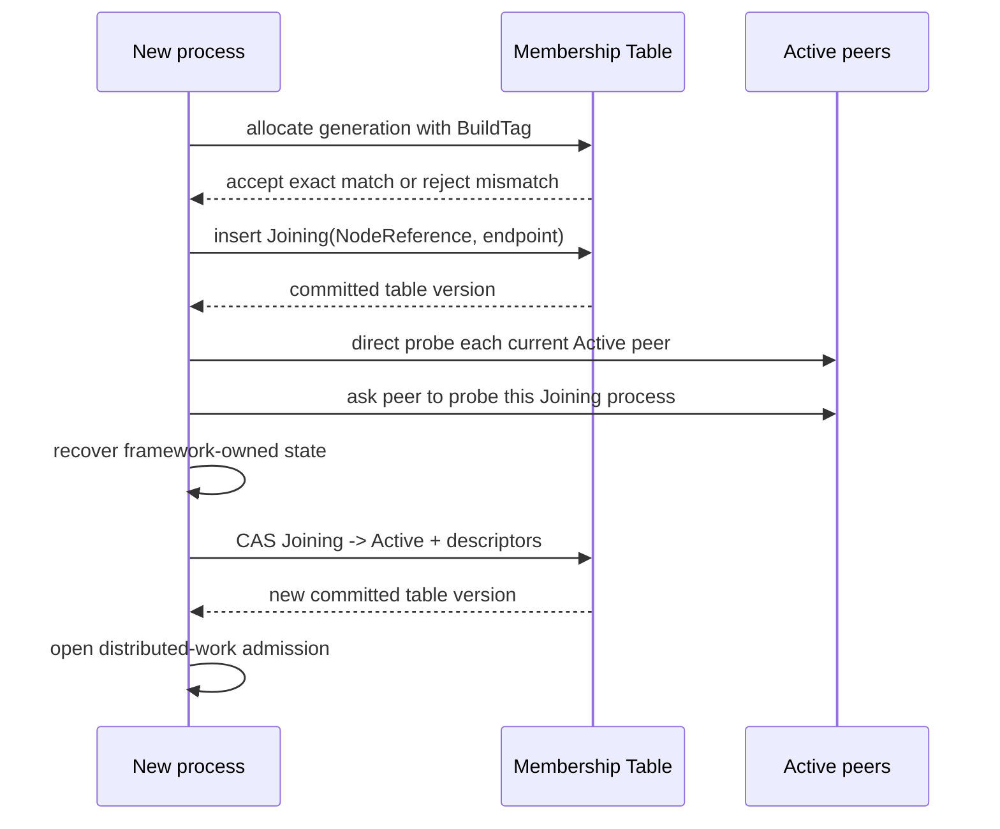
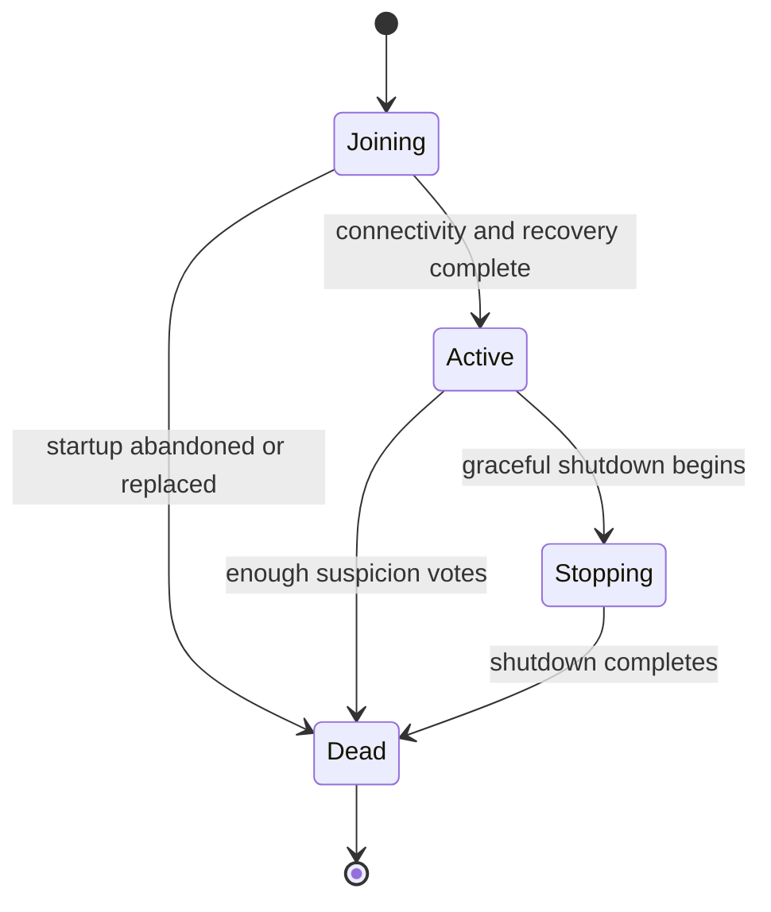
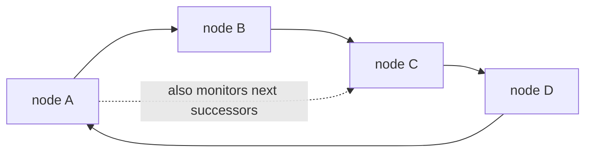

# Cluster

Lakona uses one shared Membership Table as the source of truth for a cluster.
Every server process reads and updates that table; server processes do not
elect a leader and do not copy a membership log between themselves.

For local development, the default in-memory table gives one process the same
lifecycle as a distributed node. A multi-process deployment selects an
external Membership Adapter package. The game servers may still be stateless
with respect to business data: the table stores only framework membership
metadata.

The cluster has three cooperating parts:

1. Membership says which exact process incarnations are `Active`.
2. Actor Directory records the exact node and activation which currently own an
   Actor.
3. Routing checks both facts before a remote request enters an Actor mailbox.



## Terms

| Term | Meaning |
| --- | --- |
| `NodeId` | Stable operator-facing process slot, such as `data-1`. |
| `BuildTag` | Exact application compatibility identity shared by every node in one cluster, such as `Release1`. |
| `ClusterIncarnationId` | Random fencing identity created when an environment first creates its Membership metadata. |
| `NodeIncarnationId` | Random identity for one process lifetime. It changes on every restart. |
| Membership generation | Monotonic number allocated by the shared table for one join attempt. It orders competing incarnations without comparing machine clocks. |
| `NodeReference` | Exact cluster, node id, and process-incarnation identity. |
| `MembershipViewId` | Monotonically increasing version of the committed table. |
| `IAmAliveTime` | Low-frequency evidence that one process can still reach the table. It is not the failure detector. |
| Suspicion vote | A committed report that one observer repeatedly failed to probe one target. |

`NodeId` is a readable name, not a fencing token. Two process lifetimes may
both be called `battle-1`, but their `NodeReference` values differ.

## Distributed Identity And Request Lifetime

Cluster safety uses several identities with different lifetimes:



| Value | Changes when | Purpose |
| --- | --- | --- |
| `NodeId` | Configuration changes | Names one deployment slot. |
| `ClusterIncarnationId` | Membership metadata is created again | Rejects traffic belonging to another table lifetime. |
| `NodeIncarnationId` | The process restarts | Rejects traffic for the previous process in the same slot. |
| `MembershipViewId` | A membership row or descriptor commits | Proves which committed membership view selected a route. |
| `ActorActivationId` | An Actor is recreated | Rejects traffic for an older in-memory Actor instance. |
| Invocation id | Every call | Correlates one best-effort cancellation signal with one remote execution. |
| Time to live (TTL) | Every call | Bounds the call without comparing clocks from different machines. |

A routed request carries the exact target `NodeReference`, Actor activation
id, membership view, invocation id, and remaining TTL. The sender converts its
local deadline into a duration before serialization. The receiver starts a new
monotonic countdown from that duration, so clock skew between two machines
cannot expire a healthy request early. A receiver may be on a newer table view, but
it must still see its exact incarnation as `Active` and the activation id must
still match the `Valid` entry in its `ActorActivationCatalog`. Validation and
dispatch use the same Catalog entry, so a delayed request for activation A7
cannot pass validation and then execute on replacement A8. A receiver behind
the sender's view rejects the request rather than guessing.

Cancellation after mailbox admission is cooperative. The caller stops waiting
immediately and sends a best-effort cancellation signal for the invocation id.
The signal can cancel queued work or code which observes its
`CancellationToken`, but it cannot prove that product behavior has stopped or
roll back behavior which already executed. Cancellation, timeout, disconnect,
and any other failure after sending are therefore indeterminate and are never
retried automatically. A stale exact route may be resolved and retried once
only when the receiver or local Membership check proves that the Actor method
did not enter its mailbox.

An accepted resultless tell is deliberately different: acceptance transfers
ownership to the remote Actor mailbox, so the work outlives the caller's RPC
wait and is not withdrawn by a later cancellation signal.

## Formation, Admission, And Identity Conflicts

There is no peer discovery phase and no permanent coordinator. Before a process
can write a `Joining` row, it must match the exact BuildTag stored in Membership
metadata. The first joining process establishes that value. A mismatch fails
before the node becomes visible to the cluster; there are no compatibility
ranges or per-Actor exceptions.

A compatible process joins by writing a `Joining` row to the Membership Table
with a compare-and-swap (CAS):



The two-way connectivity check catches advertised endpoints which other nodes
cannot reach. It applies to Active rows whose table heartbeat is recent. A node
does not become `Active` merely because it can write to PostgreSQL.

Only one non-`Dead` row may use a stable `NodeId`. Before joining, a process
allocates a monotonically increasing generation from the shared table. A
higher generation atomically marks the older incarnation `Dead` and inserts
the replacement. This does not depend on host clock order. The older process
is fenced as soon as it reads the table or handles a request against a newer
membership view. This rule also handles a full deployment restart without
requiring operators to clear membership rows.

Running two live processes intentionally configured with the same `NodeId` is
an operator error. The newer process wins; the displaced process stops instead
of allowing two owners for one logical slot.

## Membership Table

### Providers

`Memory` is the default provider. Its scope is one process, so it is suitable
only for local single-node development and unit tests.

`Postgres` is supplied by the optional `Lakona.Game.Clustering.Postgres`
package. The application registers that Adapter in Server.App, while
`Lakona.Game.Server` retains the Membership state machine and has no Npgsql
dependency. Its deployment schema defines:

- one singleton row in `lakona_membership_cluster` for the cluster incarnation,
  exact BuildTag, and global version;
- `lakona_membership_member` for member rows, descriptors, liveness time, and
  suspicion votes;
- a partial unique index preventing two live rows for one stable `NodeId`.

The game-server process never creates or alters these objects. Before the first
node starts, apply the package's single
`database/postgresql/membership.sql` file with a deployment account. The file
is both the current schema definition and the upgrade path: it runs in one
transaction, serializes concurrent deployment jobs with a PostgreSQL advisory
lock, and is safe to execute repeatedly. Every later Membership schema change
belongs in that same convergent file; operators do not choose from a migration
directory.

For an upgrade:

1. Stop every node which uses the Membership schema.
2. Apply the latest `database/postgresql/membership.sql` with the schema owner.
3. Start the new nodes.

For example, after extracting the SQL from the
`Lakona.Game.Clustering.Postgres` package:

```bash
psql "$LAKONA_DEPLOYMENT_CONNECTION" \
  --set ON_ERROR_STOP=1 \
  --file database/postgresql/membership.sql
```

`LAKONA_DEPLOYMENT_CONNECTION` belongs to deployment automation, not to the
game-server container or process.

Known pre-namespace-removal tables containing `cluster_id` are incompatible.
The SQL replaces only those framework Membership tables while the cluster is
stopped. Membership rows are process-lifetime coordination metadata; business
tables and application state are not touched.

The runtime connection must belong to a different, low-privilege role. A
typical PostgreSQL grant, adjusted for the deployment's schema and role names,
is:

```sql
GRANT USAGE ON SCHEMA game_cluster TO lakona_runtime;
GRANT SELECT, INSERT, UPDATE, DELETE
    ON game_cluster.lakona_membership_cluster,
       game_cluster.lakona_membership_member
    TO lakona_runtime;
```

Do not make `lakona_runtime` the schema or table owner and do not grant it
`CREATE`, `ALTER`, or `DROP`. At startup the provider performs one read-only
shape check. A missing or incompatible schema and insufficient table access
fail startup immediately with instructions to apply `membership.sql`; they are
deployment errors, not transient table outages to retry.

`MySql` is supplied by the optional `Lakona.Game.Clustering.MySql` package and
uses InnoDB transactions for the same table-wide and row-wide CAS contract.
MySQL has no partial unique index, so the schema exposes a generated
`live_node_id` only for non-Dead rows and places a unique index on that value.
This preserves the rule that one stable NodeId has at most one live process
incarnation.

As with PostgreSQL, game servers do not create or alter MySQL tables. Stop the
cluster and apply the package's single, repeatable
`database/mysql/membership.sql` file with a deployment account. The runtime
account needs only `SELECT`, `INSERT`, `UPDATE`, and `DELETE` on
`lakona_membership_cluster` and `lakona_membership_member`; do not grant it DDL
or database ownership. The Adapter verifies the schema marker and required
columns before joining.

Local development may apply the same SQL with a development database owner
before starting game nodes. Business database schemas remain application-owned
and use the application's chosen migration process; Lakona's Membership SQL
never creates business tables.

`Redis` is supplied by the optional `Lakona.Game.Clustering.Redis` package. It
stores the complete Membership Table in one Redis hash and executes every CAS
transition atomically with Lua. No schema deployment step or DDL permission is
needed. The configured key must contain a Redis Cluster hash tag, such as the
default `lakona:{membership}:table`, so every field remains in one slot.

Membership is control-plane data, not a disposable cache. A production Redis
deployment must use persistence and high availability appropriate to the
environment, must not evict the Membership key, and must restrict access to
that key. Lakona deliberately does not set a TTL: deleting or evicting it while
nodes are running creates a different cluster incarnation and fences the old
nodes. Use a separate Redis deployment or an operationally isolated keyspace
when application cache policy can evict data.

The Membership Table has no logical cluster or service namespace. One database,
relational schema, or Redis Membership key belongs to one Lakona environment
and therefore one cluster. Separate games, deployment environments, regions,
or blue/green stacks use separate storage. `ClusterIncarnationId` remains an
automatic runtime fence; it is not a user-selected namespace.
Numeric RPC `ServiceId` values still identify method groups on the wire; they
are protocol constants and are unrelated to deployment or environment
isolation.

BuildTag and Hotfix version serve different purposes. BuildTag says whether two
server processes may belong to the same cluster at all. Hotfix version names one
reloadable package generation. Adjacent Hotfix versions may coexist during a
rolling update only when their BuildTag is identical.

Each structural change advances the global version and the affected row version
in one transaction. Callers supply the versions they read; stale writers lose
the CAS and retry from a fresh snapshot. Heartbeat writes update only
`IAmAliveTime`, so routine liveness does not create a constant stream of new
membership views.

`Dead` rows are retained for a bounded diagnostic period and then removed in
small batches. Cleanup does not advance the Membership view because those rows
have already left every routing snapshot.

### Member states



`Dead` is final. A restarted process creates a new incarnation; it never
revives an old row.

Only `Joining` and `Active` rows are projected into normal routing
snapshots. `Stopping` immediately removes a node from new placement and
routing, while retaining an auditable transition in the table.

### Failure detection

The table is authoritative, but PostgreSQL does not decide whether a game
server is reachable. Active nodes probe a small, deterministic set of
successors on a hash ring:



The default is three monitored successors per node. Cluster-wide probe traffic
therefore grows roughly in proportion to the node count instead of every node
probing every other node.

One missed direct probe is not a death decision:

1. The observer tries a direct probe.
2. It asks up to two other Active nodes to probe the target.
3. After three failed probe rounds, it commits a suspicion vote.
4. The target becomes `Dead` only after enough distinct, non-expired votes.
5. The committing node gossips the new table version; receivers fetch rows from
   the table instead of trusting gossip payloads.

The effective vote threshold cannot exceed what the current cluster can
provide. This preserves progress in a small cluster while requiring
corroboration when several nodes are available.

A suspicion vote counts only when its timestamp is not later than the deciding
node's current time and remains inside the configured vote lifetime. A vote
from a machine whose clock is ahead is retained for diagnosis but cannot cause
an early death decision.

`IAmAliveTime` has a different job: it helps operators and startup distinguish
old rows. A slow table heartbeat does not itself evict a process. During
startup, only the combination of an expired table heartbeat and failed two-way
network probes lets the joining node clear a defunct Active row. This lets a
cluster recover after a complete crash without treating database congestion
alone as network death.

### Table outages

When a table read temporarily fails, a node keeps its last committed snapshot
for at most the configured `IAmAliveSeconds` safety window and retries. It does
not invent a smaller cluster, elect a local leader, or rewrite membership from
memory. If table contact is not restored inside that window, the node closes
distributed-work admission and stops itself. This bounds how long a replaced
but table-isolated process can continue serving.

A short table outage therefore favors continuity for already-known routes but
pauses membership changes. Once a node observes that its own exact row is
`Dead` or absent—or exceeds the table-contact safety window—it closes
distributed-work admission and stops; this is a terminal fence.

## Cluster RPC Composition

Node-to-node RPC is framework-owned TCP plus MemoryPack. It is separate from
client-facing endpoints and serializers.

The protocol identifier is `lakona.cluster.v4`. Peers negotiate this
identifier before decoding cluster payloads. There is no compatibility path
for the removed replicated-membership protocol: mismatched generations fail
the connection.

Membership RPC contains only probes and version gossip. The selected Membership
Adapter remains the authority for state transitions. Gossip is an optimization
which asks another node to refresh; it cannot directly install a membership
row.

Types below `Lakona.Game.Cluster.Rpc` are internal implementation details.
Applications compose the high-level game server and use the public membership
identity and snapshot contracts rather than replacing the wire protocol.

## Consensus Model And Scope

Membership no longer runs consensus among game-server processes. The selected
Membership Adapter serializes table creation and CAS updates in its external
store.

Actor Directory remains a separate cluster subsystem. It chooses one exact Actor
activation owner and uses its own transfer/recovery rules. Membership says
which process incarnations may participate; it does not store game Actor state
and does not turn PostgreSQL into an Actor database.

This boundary is intentional:

- Membership answers “which processes are currently allowed to receive work?”
- Actor Directory answers “which exact activation owns this Actor?”
- Application storage answers “which business data survives?”

## Heartbeat Failure, Fencing, Gate, And Barrier

The distributed-work admission gate is closed while a node is `Joining`,
while graceful shutdown drains work, and after terminal fencing. Client and
application HTTP readiness report this state instead of accepting work which
cannot be routed safely.

Before activation, recovery participants rebuild framework-owned state against
the committed snapshot. Only after every participant succeeds may the node
publish its descriptors as `Active` and open admission. Startup failure keeps
the node out of placement.

The exact `NodeReference` is checked at ingress and again where ownership
matters. Consequently, delayed requests for a replaced process cannot become
valid merely because the replacement reused its endpoint or stable name.

## Sticky Actor Placement

Placement considers only `Active` members whose published actor-host
descriptors match the requested Actor and placement policy. The selected
candidate does not become authoritative until Actor Directory commits an exact
owner and activation id. Placement itself does not reserve that record. It
sends an exact `ActorId + NodeReference + ActorActivationId` proposal, and the
selected node first records it as a non-callable `Creating` Catalog entry, then
acquires the claim before opening mailbox admission. Recovery therefore cannot
miss an acquisition in flight, and failed callers never release ownership on
behalf of another process.

If an owner leaves membership, new routing cannot use that incarnation.
Recovery inspects surviving `ActorActivationCatalog` snapshots and re-establishes
one authoritative owner. Incomplete recovery remains unavailable rather than
pretending that the Actor is absent.

### Actor Directory DHT

Actor Directory builds a deterministic hash ring from the exact `NodeReference`
values in one committed Membership view. Every Active node contributes 30
virtual partitions. An Actor id therefore has one directory partition owner;
it does not have a per-Actor database row or a fixed three-node replica set.

When Membership advances, each node installs the new ring and locks every hash
range whose owner changed before serving that range. A request using the old
view is redirected to the new owner and cannot write behind the lock. For two
consecutive views, the previous owner freezes the moved records and hands that
snapshot directly to the new owner. The receiver applies the records before it
acknowledges the snapshot.

A transport failure while reading that snapshot is retried while the exact
previous owner remains `Active`. It is not interpreted as an empty range. If
the previous owner leaves Membership before transfer succeeds, the receiver
switches to activation-catalog recovery and remains fail-closed on conflicts.

Both snapshot paths reject stale Membership views. Partition handoff also
rejects repeated Actor records and incomplete non-final pages. These responses
restart the whole range read instead of turning a malformed partial snapshot
into missing Actor locations.

Every snapshot page declares the total record count. The receiver verifies one
consistent total across the sequence and requires the final page to end exactly
at that total, so a truncated final page cannot masquerade as a complete empty
snapshot.

Activation-catalog recovery also assigns each paged read a snapshot id. The
source captures and retains one ordered claim set for that id until the final
page, so Actor creation or removal between pages cannot shift offsets and
silently omit a claim. Retention is bounded; an evicted or view-mismatched
session is reported unavailable and the receiver restarts the whole read.

If a view was skipped or the previous owner cannot supply its snapshot, the new
owner rebuilds the range from the exact Catalog entries of all surviving Active
nodes. Two different live claims for the same Actor are treated as a
conflict and the range remains unavailable. The directory never guesses that a
failed recovery means “Actor not found.”

Partition transitions are ordered locally and carry their success status into
the next Membership view. After a failed transition, a node does not advertise
the incomplete range as a valid empty snapshot. Its next transition rebuilds
every range it still owns from surviving activation catalogs; ranges moving
away are reported unavailable so their new owners perform the same recovery.
This prevents rapid Membership changes from turning one interrupted handoff
into a chain of apparently successful empty handoffs.

Every mutation is conditional on `NodeReference + ActorActivationId`. A delayed
release from an old activation cannot delete its replacement, and a process
restart cannot inherit claims from the previous process incarnation. Calls may
cache that exact proof, but must invalidate it when Membership or directory
evidence changes.

The location record is framework state, not application persistence. Product
state should be loaded and saved by Actor behavior using application-owned
storage.

### Default And Custom Placement

The default selector deterministically spreads actors across compatible Active
nodes. Custom placement may filter or rank candidates, but it cannot make a
Joining, Stopping, Dead, or descriptor-incompatible node eligible.

## Session Ownership And Notification Routing

A Game Session belongs to the exact gateway `NodeReference` which accepted
it. Session ids contain an opaque locator so another node can route a
notification to that gateway without scanning all nodes.

Before sending, routing verifies that the exact gateway incarnation is still
Active. A restarted gateway with the same `NodeId` does not inherit old
in-memory sessions. Reliable-push replay remains bounded by the configured
resume window and targets the original gateway incarnation.

## Agar Gameplay Endpoints

The Agar sample demonstrates the intended separation:

- `gateway-1` accepts client login and matchmaking;
- `data-1` hosts user, matchmaking, and leaderboard Actors and owns business
  PostgreSQL/Redis clients;
- `battle-1` hosts room Actors;
- all three game servers share one Redis Membership Table;
- OpenTelemetry flows to the monitoring node and does not participate in
  membership decisions.

See [Game.Unity.Agar](../samples/Game.Unity.Agar/README.md) for commands and the
full deployment topology.

## Performance Boundaries And Risks

- Table refreshes and probes are periodic, not on every gameplay request.
- Probe fan-out is bounded by `MonitoredNodes` and `IndirectProbes`.
- Descriptor and state mutations use CAS and may retry under contention.
- A PostgreSQL outage pauses joins, replacement, and eviction.
- A too-aggressive probe interval can create false suspicion during pauses or
  overload; defaults favor stability over instant eviction.
- Actor routing still depends on the Actor Directory completing the affected
  range transition; an incomplete transition fails closed.

For tens or hundreds of nodes, keep the probe ring bounded and run PostgreSQL
as production infrastructure with backups, connection limits, and monitoring.
Do not switch to all-to-all probing to reduce detection time.

## Startup And Shutdown

Startup order:

1. start role-selected application modules and load the initial Hotfix;
2. bind node-to-node RPC, verify the exact cluster BuildTag, and join the
   Membership Table as `Joining`;
3. verify two-way connectivity and run recovery participants;
4. become control-plane `Active` with no business descriptors;
5. install the Actor Directory view and create role-selected Startup Actors;
6. open distributed-work admission, publish complete Actor descriptors, and
   become Ready for client traffic.

`Active` proves that the node participates in cluster coordination. It does not
mean the node can already execute game requests. The empty-descriptor step
prevents another node from routing business work into a half-started process.

Graceful shutdown reverses the safety boundary:

1. become NotReady, close admission, and drain admitted work;
2. publish `Stopping` so new placement cannot choose this node;
3. stop Startup Actors, then ask the authoritative `ActorActivationCatalog` to
   retire every remaining local activation while Actor Directory and cluster
   transport are still available;
4. stop Actor Directory, publish `Dead`, and stop the node-to-node listener;
5. retire Hotfix and stop application modules in reverse order.

The separation between `Stopping` and `Dead` is intentional. `Stopping` removes
the node from new routing before cleanup starts. Directory and transport stay
alive long enough for deactivation hooks and exact route release; only after
that work finishes may Membership declare the incarnation `Dead`.

The node lifecycle is single-use: a process may start it once and stop it once;
recovering from a failed start requires a new process. A stage owns cleanup as
soon as its start method is entered, so a stage which fails halfway through is
still stopped together with every earlier stage. Shutdown always attempts every
entered stage in reverse order. A canceled shutdown token is passed to each
stage as its deadline signal, but it does not prevent cleanup from starting or
skip the remaining stages; non-cancellation failures are reported together
after all cleanup has been attempted.

An abrupt exit cannot publish those transitions. Probe failures and committed
suspicion votes eventually mark the old incarnation `Dead`; an immediate
replacement with the same `NodeId` can also atomically fence it during join.

Each active node monitors only its deterministic probe targets. A failed direct
probe is followed by indirect probes through other active nodes; any success
resets that exact incarnation's consecutive-failure count. Counts are keyed by
the full `NodeReference`, so restarting the same node id never inherits failures
from its predecessor. Defunct-row cleanup is also assigned deterministically to
one active node per committed view, avoiding the same database scan on every
member of a large cluster.

## In-process TestCluster

`Lakona.Game.Testing` runs several real Lakona Generic Hosts inside one test
process. Every node gets a separate dependency-injection container and executes
the normal node lifecycle, Membership, Actor Directory, activation catalog,
and cluster RPC stack. The package supplies two test-only boundaries:

- one shared in-memory Membership Table, replacing the production PostgreSQL
  table;
- one in-memory cluster transport whose links can be partitioned and healed.

The network control supports both two-way partitions and one-way link blocks.
One-way faults are useful for checking that request and reply paths fail
independently instead of assuming every network failure is symmetric.

Convergence timeout diagnostics include every node's current Membership view
and the directed links blocked by the test. During whole-cluster disposal,
nodes with live Actors drain before nodes that only provide cluster services;
the remaining nodes converge between stops so Directory ownership stays
available until the last activation has released its route. Cleanup continues
across node or hosted-service failures and reports all collected errors.

An application test can call `UseHotfixAssembly` for each node that hosts game
logic. TestCluster then scans the same generated Hotfix registrations used by a
real server, advertises only the Actors allowed by that node's roles, and lets
the test call them through `ActorAccess`. This exercises placement, Directory
lookup, remote RPC, mailbox dispatch, and activation uniqueness together; it
does not replace those layers with test doubles.

This makes node join, graceful stop, abrupt stop, restart with a new
incarnation, role-specific configuration, and membership convergence practical
inside ordinary integration tests. It does not replace tests for PostgreSQL
transactions, real network stacks, TLS, separate process death, or deployment
configuration.

External product dependencies remain application concerns. A test fixture may
start PostgreSQL, MySQL, Redis, or another disposable resource and inject its
connection string into selected nodes with `ConfigureNodes`. Keeping that
lifecycle outside TestCluster prevents the cluster API from accumulating a
special adapter for every database and lets one expensive dependency be shared
across many short-lived cluster tests.
