# Cluster

Lakona cluster support is process-local game state coordinated by an ephemeral,
replicated control plane. Every node, including a single process, stores
membership state; peer hints are used only during discovery and formation.
Framework state is intentionally not persisted to Postgres.

There is no standalone local cluster-endpoint mode. `AddLakonaGameServer`
installs replicated membership even for one process (quorum one), so every
cluster route is backed by an exact committed `NodeReference`.

The cluster has three cooperating layers. Membership decides which exact node
incarnations are authoritative and Ready. The Actor Location DHT records one
exact activation independently of Membership consensus. Routing validates both
facts before work enters a remote mailbox.

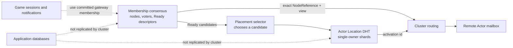

The diagrams in this document build intuition; the tables and rules following
them remain the precise contract.

## Reading Map

| Question | Start here |
| --- | --- |
| Which identity prevents stale work? | [Distributed Identity And Request Lifetime](#distributed-identity-and-request-lifetime) |
| How do several fresh nodes become one cluster? | [Formation, Admission, And Identity Conflicts](#formation-admission-and-identity-conflicts) |
| How does a learner become a Ready voter? | [Replicated Membership](#replicated-membership) |
| What happens when membership changes overlap or replication is interrupted? | [Membership Change Serialization And Recovery](#membership-change-serialization-and-recovery) |
| What happens during a partition or restart? | [Heartbeat Failure, Fencing, Gate, And Barrier](#heartbeat-failure-fencing-gate-and-barrier) |
| How is one sticky Actor owner selected? | [Sticky Actor Placement](#sticky-actor-placement) |
| How do notifications reach the owning gateway? | [Session Ownership And Notification Routing](#session-ownership-and-notification-routing) |
| In what order does a host become ready or stop? | [Startup And Shutdown](#startup-and-shutdown) |

## Terms

| Term | Meaning |
| --- | --- |
| `NodeId` | Stable operator-facing process name, such as `data-1`. It is not a fencing token. |
| `ClusterIncarnationId` | Identity of one complete in-memory cluster lifetime. A deliberate complete restart creates a new value. |
| `NodeIncarnationId` | Identity of one process lifetime. Restarting the same `NodeId` creates a new value. |
| `MembershipViewId` | Monotonic identity of a committed membership or descriptor change. |
| `NodeReference` | Exact `(cluster, node, node incarnation)` identity used for authoritative dispatch. |
| Peer | Stable `NodeId` and endpoint hint used to discover or form a cluster. It is not a leader or current-membership declaration. |
| Actor activation | Sticky `(actor, owner reference, activation id)` ownership record. |

Peer lists may differ between nodes. They are discovery hints, not an
operator-assigned leader or an authoritative current-member list.

Formation contacts are addressed only by `NodeEndpoint`. They do not create a
synthetic route or claim a node, cluster, incarnation, or Membership view.
After formation, every routed client is keyed by the exact `NodeReference` and
endpoint from committed Membership; there is no `NodeId`-only or lease-based
fallback identity.

## Distributed Identity And Request Lifetime

Distributed Actor safety depends on several identities with different scopes.
They are not interchangeable. The same model applies to one-node and
multi-node deployments; a single process is a cluster whose quorum is one.

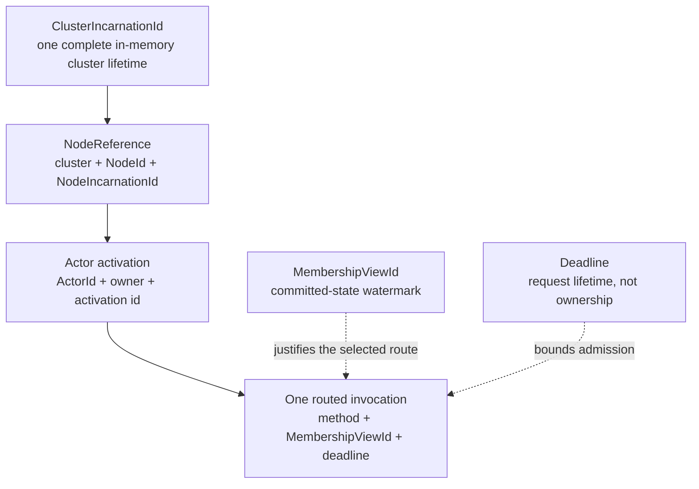

| Value | Stable across | Changes when | What it proves |
| --- | --- | --- | --- |
| `NodeId` | Restarts of one configured process role | Configuration changes | Operator-facing logical node name only; it is never a fencing token. |
| `ClusterIncarnationId` | Joins, leaves, and ordinary node restarts in one live cluster | Formation after complete cluster loss | The message belongs to this complete in-memory cluster lifetime. |
| `NodeIncarnationId` | Nothing beyond one process lifetime | The process restarts, even with the same `NodeId` | The target is this exact process instance. |
| `MembershipViewId` | Reads of one committed membership snapshot | A membership or published-descriptor change commits | The exact committed cluster state used for the routing decision. |
| `ActorId` | Actor destruction and recreation | The business identity changes | Which logical game object is addressed. |
| `ActorActivationId` | One materialization of an Actor | The Actor is recreated or safely superseded | The request targets this exact in-memory Actor lifetime. |
| Deadline | One invocation | Every call chooses its own absolute expiry | The invocation was still eligible to enter remote execution when checked. |

The cluster incarnation prevents delayed traffic from a previous complete
cluster lifetime from entering a newly formed cluster with the same
configuration. The node incarnation prevents an old process from being
confused with a replacement that reused its `NodeId`. The Actor activation id
prevents a delayed request for a destroyed Actor from entering a newly created
Actor with the same `ActorId`. The activation id and exact node incarnation
fence delayed traffic after explicit recreation.

`MembershipViewId` is a committed-state watermark, not an exact-match lease.
A cross-node Actor request carries the view used to select its target. The
receiver rejects the request when its current view is older than that target
view. A receiver on a newer view may continue only when the exact target
`NodeReference` and Actor activation still match its current membership and
activation-directory state. This permits harmless membership progress without
allowing a lagging receiver or stale owner.

### Cross-Node Actor Request Proof

A generated routed Actor invocation carries:

- the target cluster incarnation, `NodeId`, and node incarnation;
- the membership view used to select that exact Ready node;
- the stable `ActorId`;
- the Actor activation id;
- the stable Actor method id; and
- an absolute deadline.

Before business mailbox dispatch, the receiving node must prove all of the
following:

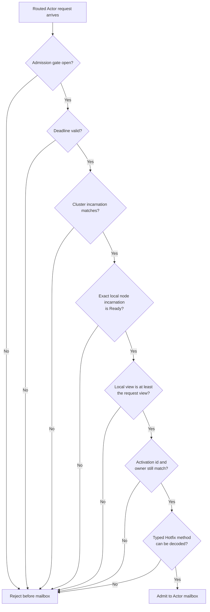

1. distributed-work admission is open;
2. the deadline has not expired;
3. the current cluster incarnation matches the request;
4. the local Ready member is the exact requested node incarnation;
5. the receiver's committed membership view is not behind the request's view;
6. the current activation-directory record names that exact local
   `NodeReference` and activation id; and
7. the current Hotfix snapshot contains the requested typed method and can
   deserialize its body.

Failure closes the request before mailbox execution. A route or activation
failure is safe to classify as definitely not executed only when rejection
happened before admission to the Actor mailbox. Once execution may have been
accepted, retry safety is indeterminate unless the business operation supplies
its own idempotency key or durable fencing rule.

The receiving Actor RPC handler requires the committed `IClusterMembership`
owner at construction. Missing Membership is a cluster-composition error and
never disables the incarnation, view, or exact-activation proof.

### Deadline And Cancellation

The Actor deadline is an absolute `DateTimeOffset` carried on the wire. The
sender first derives a remaining timeout from it and cancels the outbound
transport operation or local response wait when that interval expires. The
receiver independently checks the same deadline before mailbox dispatch, so a
delayed frame cannot become valid merely because caller-side cancellation
failed to cross the process boundary.
Cluster hosts therefore require reasonably synchronized UTC clocks for useful
cross-node expiry decisions; ownership safety still comes from incarnation and
activation tokens rather than wall-clock time.

Deadline expiry is not a rollback mechanism. Cancelling an outbound `Ask`
stops the caller's send or wait, but the current protocol has no per-request
remote cancellation frame. Once the remote mailbox accepts the call, caller
cancellation or deadline expiry does not prove that behavior stopped or that
its effects were rolled back. A `Tell` reports `Accepted` after mailbox
admission and is likewise not removed merely because its deadline passes while
queued. Product operations that cannot tolerate an ambiguous retry must remain
idempotent or persist and compare an application-level
fencing/idempotency token.

## Formation, Admission, And Identity Conflicts

The exact `Lakona:Cluster` and `Lakona:ActorHosts` shapes belong to
[Configuration](./configuration.md#cluster). Every process starts
uninitialized, listens for cluster control traffic, and then either discovers
an established incarnation or participates in formation. There is no
operator-designated first node and no separate local hosting mode.

`Peers` contains stable node identities and endpoints used as discovery hints.
Lists may differ. Uninitialized peers exchange their known hints recursively,
canonicalize the resulting formation view, and confirm the same digest before
deterministic genesis coordination. A node never removes an unreachable known
peer merely to form a smaller cluster. If any peer presents an established
incarnation, joining it as a learner takes precedence over formation.

During a concurrent cold start, every reachable node first converges on the
same canonical `(NodeId, endpoint)` formation view. The lexicographically first
`NodeId` in that view performs genesis and becomes the initial consensus
leader. The other processes continue discovery, observe the established
incarnation, and join it as learners. Genesis coordination is only a
deterministic tie break for creating one cluster incarnation; it gives that
node no permanent role or preference in later leader elections.

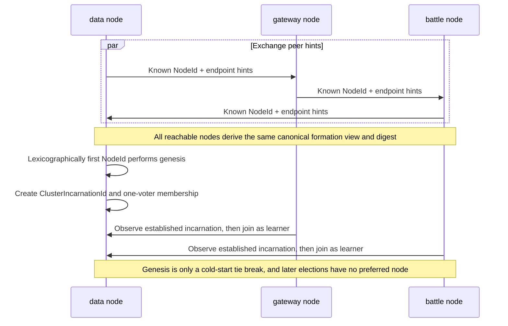

Formation requires a one-to-one mapping between stable node identities and
cluster endpoints. The same `NodeId` advertised with different endpoints, or
the same endpoint advertised under different node ids, fails formation rather
than guessing which declaration is authoritative. Operators must not run two
live processes with the same `NodeId`.

A one-process deployment has no remote peers and forms a one-voter cluster.
For a multi-process cold start, configured hints must connect the intended
formation graph. Two completely disconnected graphs are indistinguishable from
two deployments and may form separate incarnations; deployments that cannot
provide a connected static graph require a shared formation authority.

After complete quorum loss, forming a fresh incarnation accepts that all
in-memory Actors, sessions, membership metadata, and reliable-push state from
the prior incarnation are gone. A surviving minority remains fenced and cannot
serve distributed work.

## Cluster RPC Composition

Configuration describes addresses and topology. `Lakona.Game.Server` owns the
node-to-node RPC implementation: TCP transport and MemoryPack serialization.
Generated applications register only their client-facing endpoint
implementations. Their exact generated startup shape belongs to
[Generation Architecture](./tool/generation-architecture.md#server-renderers);
endpoint names and settings belong to
[Configuration](./configuration.md#endpoints).

The cluster channel, transport, routing RPC, and protocol DTOs are implementation
details of `Lakona.Game.Server`; there are no separately selected cluster
adapter packages. `ClusterRpcChannel` is the single internal authority. It
validates endpoint schemes, creates pooled outgoing clients, creates the local
listener, and performs a small fixed-format protocol negotiation before the
RPC serializer sees a frame. The fixed protocol ID is
`lakona.cluster.memorypack.v2`; incompatible nodes are rejected as
connection-local failures. The negotiation adds one round trip only when a
cluster connection is established; steady messages reuse pooled clients.
When a pooled client disconnects, its exact cache entry is evicted. The next
call for that route creates one replacement shared by concurrent callers;
the framework does not reconnect in the background or replay an ambiguous RPC.

`ClusterProtocol` is the assembly-internal catalog for the current protocol
identifier, service ID, active RPC method IDs, and retired method tombstones.
Every new method receives an unused catalog entry; removed methods remain
reserved for the lifetime of that protocol identifier. The same catalog keeps
Membership frame kinds and snapshot format versions in separate numbering
domains consumed by their codecs. Unlisted method IDs have never been assigned
and remain available. An incompatible change to any domain requires a new
cluster protocol identifier.

No type under `Lakona.Game.Cluster.Rpc` is a public extension interface. Raw
frames, protocol IDs and DTOs, binders, client factories, Membership nodes,
transport adapters, and their Actor/session handlers remain assembly-internal.
The supported public cluster interface consists of high-level server
composition plus committed Membership identity, descriptor, snapshot, and
authority-observation contracts; applications cannot replace or invoke the
node-to-node protocol directly.

Framework protocol DTOs use MemoryPack source generation with
`GenerateType.VersionTolerant` and explicit `MemoryPackOrder` values. Remote
Actor request and result DTOs follow the same rule and must live in stable,
non-hotfix assemblies. Adding a field requires a new unused order; existing
orders must never be reassigned.

Cross-node Hotfix Actor calls use two dedicated raw cluster RPC methods for
ask and tell. Their fixed header and typed MemoryPack body are written directly
into the final RPC envelope buffer; replies use the same writer-owned path.
They do not allocate an intermediate serialized Actor payload or wrap it in
the general `ClusterMessage` protocol. Reflection is allowed only while a
Hotfix snapshot closes and caches its typed method codecs, never during
per-call encode, decode, or dispatch.

## Consensus Model And Scope

Cluster membership is a specialized Raft-style replicated state machine. It
uses terms, leader election, follower log replication, majority commit,
snapshots, and joint-consensus membership changes. It is not a general-purpose
Raft store exposed to applications and does not replicate game data.

| Concern | Membership consensus owns | Membership consensus does not own |
| --- | --- | --- |
| Nodes | Exact node incarnations, voter membership, admission, removal, and lifecycle state | Process supervision or durable node recovery |
| Capabilities | Cluster endpoint, labels, `ActorHosts`, Startup Actor descriptors, and descriptor metadata | Concrete Actor instances or their mutable fields |
| Actors | The committed member view from which eligible owners are selected | Actor activation records, business state, mailbox contents, or migration |
| Connections | Exact gateway membership used to validate session locators | Sessions, reliable-push queues, callbacks, or connection state |
| Applications | Nothing from application databases | Database rows, timers, jobs, or product decisions |

Actor Host capabilities and Startup Actor publication remain distinct public
descriptor contracts because they have different lifecycle meaning. Their
required fields, immutable metadata copy, 256-descriptor bound, Actor-name
uniqueness, and ordinal ordering are enforced by one internal normalization
authority so the two contracts cannot drift.

Actor placement crosses two independent modules. Membership supplies the
committed Ready/`ActorHosts` candidate set. A placement selector chooses an
initial candidate, then the Actor Location shard owner conditionally publishes
the exact activation. Actor creation therefore does not append to Membership's
Raft log or wait for multiple Actor metadata replicas.

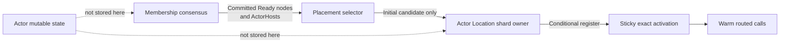

## Replicated Membership

Every joined node automatically participates in the same in-memory membership
state machine. There is no manually assigned directory-replica role and no
cluster Postgres requirement.

### Consensus Roles And Member States

Three independent dimensions describe a node:

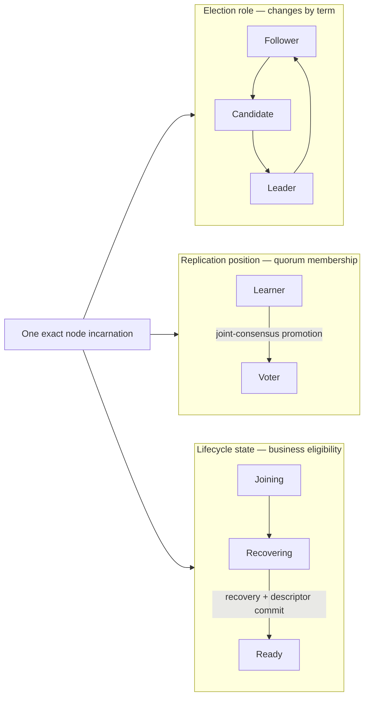

| Dimension | Values | Meaning |
| --- | --- | --- |
| Election role | Leader, Follower, Candidate | Transient role within one consensus term. A higher term or election can change it. |
| Replication position | Voter, Learner | Whether the exact incarnation counts toward membership quorum. |
| Lifecycle state | Joining, Recovering, Ready | Whether the node is being admitted, proving recovery, or eligible for distributed work. |

There is no permanent “follower node” type. In a stable term, ordinary
non-leader voters are followers; a follower may later become a candidate and
then leader. A learner follows the leader to catch up but does not vote until
joint-consensus promotion commits. Lifecycle readiness is independent:
becoming a voter does not open business admission until recovery succeeds and
the Ready descriptor commits.

Only a Ready voter may campaign for leadership in a multi-voter cluster. A
Recovering voter still participates in quorum and may vote for a Ready
candidate, but cannot raise the term before completing its own recovery. The
sole Recovering voter in a new one-node cluster is the deliberate bootstrap
exception; otherwise no leader could exist to commit its first Ready state.

A joining node:

1. creates a fresh `NodeIncarnationId`;
2. contacts any known peer and follows the current leader;
3. installs the committed snapshot and log tail as a non-voting learner;
4. is promoted through joint consensus after catch-up;
5. runs recovery while distributed admission remains closed;
6. commits its Ready descriptor and opens admission only after authority is
   proven.

```mermaid
flowchart LR
    I["Create fresh<br/>NodeIncarnationId"] --> C["Contact configured peers"]
    C --> L["Reach the current leader<br/>directly or through one hint"]
    L --> A["Commit learner admission"]
    A --> S["Install committed snapshot<br/>and log tail"]
    S --> P["Catch up and request promotion"]
    P --> J["Joint-consensus promotion"]
    J --> R["Run recovery barrier<br/>admission remains closed"]
    R --> D["Commit Ready descriptor"]
    D --> O["Prove authority and<br/>open admission"]
```

### Leader-Only Ingress And NotLeader

Join admission, learner promotion, and Ready-descriptor commit are mutations
that only the committed voter leader may apply. Any node that receives one of
these requests but is not the leader returns a `NotLeader` protocol result
instead of executing the mutation:

- with the leader endpoint attached when the node knows the current leader;
- without an endpoint when the node does not yet know the leader.

Nodes never proxy these requests to the leader on the caller's behalf, so a
stale or fabricated hint cannot form a server-side forwarding chain. The
caller follows the attached leader endpoint at most once per retry round and
otherwise treats `NotLeader` as a normal, retryable outcome that feeds the
existing formation or promotion backoff. `NotLeader` without an endpoint is
expected while a freshly formed cluster has not yet elected its leader through
the authority control loop. It may continue to the next configured contact;
after following one endpoint hint, another `NotLeader` or a transport failure
ends the round for backoff. Continuing after an unknown-leader response is
required because the first configured contacts may all be non-leaders while a
later contact can already accept the request. The `RequireLeadership()` safety
guard remains the final protection and is not part of the routing contract.

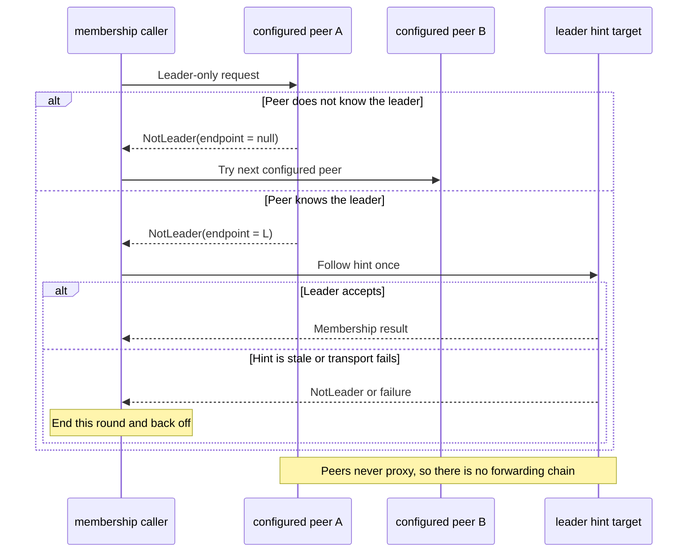

Before a process has published its formed membership node, non-formation
control ingress (append, vote, proof, and snapshot traffic) returns the typed
`MembershipUnavailable` result. It carries no leader hint and means only that
the caller should use its existing bounded control-loop backoff; it is not a
handler exception, forwarding instruction, or relaxation of quorum fencing.

Membership snapshots contain exact node references, lifecycle state, cluster
RPC endpoints, actor-host descriptors, Startup descriptors, labels, and opaque
metadata on those descriptors. High-cardinality Actor activations and sessions
do not enter the global membership log.

Every caught-up member is currently a voter. This deliberately targets small,
normally odd-sized clusters. Leader heartbeat, replication, election, and
majority work grow with member count. A bounded automatic voting committee is
not part of the contract and requires measurements that justify its
complexity. Operators do not manually manage replica assignments.

The replicated log and snapshots are bounded and validated. One process-local
state owner performs bootstrap, restore, committed-view publication, and
waiter completion, and is the sole `IClusterMembership` implementation used by
the default server composition. The Membership hosted service owns only
formation and process lifecycle; it does not forward the read interface.
It requires its Membership transport and state owner explicitly at construction;
there is no partially usable fallback transport for tests or single-node mode.
Installed snapshots can update only an initialized owner; formation must first
validate and explicitly initialize the admitted local incarnation.
Steady discovery and exact endpoint lookup therefore use one atomically
published local snapshot without a peer or leader round trip.

Replication progress is tracked per exact voter. Append responses report the
receiver's actual membership view and log match index. If a voter misses a
commit or rejects a heartbeat because it is behind, the leader backs up to the
last matching position and sends bounded committed batches on later heartbeat
rounds. A voter counts toward a quorum proof only after both its log and its
published view have caught up. A transient commit-delivery failure therefore
cannot leave a running voter permanently stranded on an old view.

### Membership Change Serialization And Recovery

Membership changes are deliberately serialized. Every Join, Promote, Ready,
descriptor refresh, and member removal must acquire one fail-fast
membership-change slot before it can append a proposal. If the slot or an
uncommitted proposal is already busy, the request is rejected as transient;
it is never queued behind an unknown quorum wait and never creates a second
proposal.

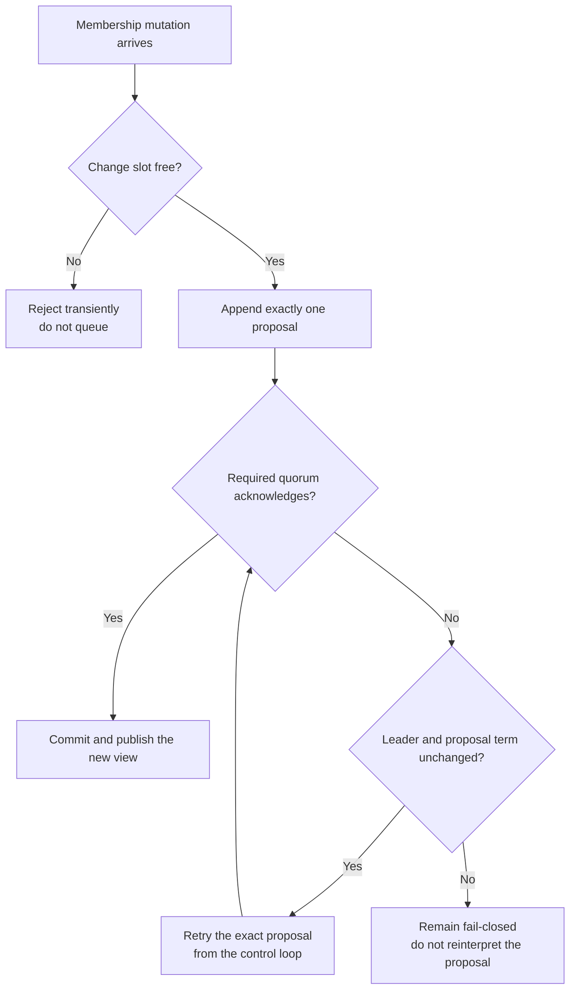

Protocol ingress exposes a busy slot as the normal endpoint-less `NotLeader`
transient result. Direct callers receive
`ClusterMembershipProposalUnavailableException`. Both results mean “retry
later”; neither grants permission to enqueue, replace, or merge a proposal.
Append, vote, proof, and snapshot-install ingress bypasses the mutation slot
and never queues behind a mutation's network wait. Append, vote, and
snapshot-install requests use the node's consensus-state locks, while proof
ingress uses its lock-free proof tracker. Only Join, Promote, Ready, descriptor
refresh, and removal compete for the fail-fast membership-change slot.

Same-term recovery preserves proposal identity. An ordinary mutation retains
the committed voter set. A joint mutation, including learner promotion,
retains the exact old and new voter sets and still requires an independent
majority of each:

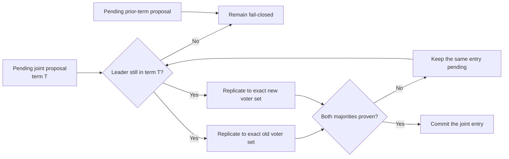

A pending learner promotion retains one `PendingLearnerPromotion` containing
the exact learner, old and new membership snapshots, append proposal, and
originating term. The control loop or a repeated Promote request may resend
that same proposal only while the leader and term remain unchanged. It cannot
be converted into an ordinary heartbeat or committed through the currently
published view.

Prior-term recovery remains outside the contract. It would require a
current-term commit barrier plus newly proven replication progress. Treating a
prior-term entry as a same-term heartbeat retry could commit a joint change
with only one side's majority, so the control loop fails closed instead.

### Adding And Restarting Nodes

Adding a fourth node follows learner catch-up and joint-consensus promotion.
It does not move hosted Actors. It may become the deterministic owner of some
Actor Location shards after recovering their records from surviving activation
registries, and becomes eligible for future placements; it receives no
Membership-log Actor records.

Restarting a process with the same stable `NodeId` creates a different exact
reference. The leader waits through the old incarnation's authority window,
joint-removes it, and then admits the replacement as a learner. An old process
cannot become authoritative again merely by reconnecting.

Presenting a second incarnation for an existing `NodeId` is interpreted as a
replacement request, not as an additional member. A joining process cannot
replace the active leader's own stable node id. Reusing a `NodeId` concurrently
is therefore invalid deployment configuration even though the replacement path
can recover the stable slot after the old incarnation loses authority.

Cluster-node authentication and authorization are separate from this identity
and fencing design. Deployments must still isolate and protect the cluster
network.

### Unreachable Member Eviction

The cluster cannot determine that a process is permanently dead. It can observe
only that one exact node incarnation has stopped acknowledging the current
leader. Removing that incarnation is therefore an irreversible availability
decision, not a claim that the process can never recover:

- before removal, the cluster preserves the possibility that the process and
  its in-memory Actor state will return;
- after removal, the cluster prefers progress, accepts loss of that process's
  ephemeral state, and permits higher-generation Actor activations elsewhere.

Authority expiry and member eviction use separate time horizons. Quorum-proof
validity is short: it closes a disconnected node's distributed-work admission
gate before that node can overlap a replacement owner. The member-eviction
grace period is longer: it defines how long the cluster preserves the old
incarnation and its inaccessible in-memory state before choosing availability.
The eviction grace period is framework-owned policy, is currently one minute,
must remain longer than quorum-proof validity, and is not public
`Lakona:Cluster` configuration.

Every outbound Membership RPC has a finite request deadline configured by
`Lakona:Cluster:SendTimeoutMilliseconds` (default 1.5 seconds). Vote, heartbeat,
and proof requests fan out concurrently within their respective control phases;
decoded replies are then applied sequentially to Membership state. The request
timeout is validated against the final registered Membership options and must
leave enough proof-renewal budget for both a proof-delivery timeout
and the next heartbeat timeout, plus the heartbeat interval. A silent minority
therefore costs at most one request timeout per phase instead of one timeout per
peer. When an in-flight control round reaches the current quorum-proof deadline,
the runtime cancels and observes that round before publishing authority loss;
an old round cannot continue mutating Membership in parallel with a later retry.

Only the current leader may initiate automatic eviction. It tracks the last
valid current-term consensus response from each exact voter. A response before
the grace period expires clears the suspicion; the member catches up and passes
the recovery barrier without changing incarnation. A newly elected leader
starts a fresh grace period rather than inheriting another process's local
failure-detector timestamp. This may delay eviction during leadership churn but
cannot discard state early because of an unverifiable clock value.

After the grace period, the leader may propose removing the exact incarnation
through joint consensus. Time alone never creates authority: the old
configuration must still have a majority capable of committing the removal. A
three-voter cluster with two connected voters can remove the third; one
survivor of a two- or three-voter cluster cannot remove the missing voters or
form a new authoritative cluster.

Once removal commits, the old incarnation is permanently fenced even if its
network recovers later. It must not resume as a follower or expose its old
Actors. The host remains unready and stops; a subsequent process start creates
a fresh `NodeIncarnationId` and joins as a learner. Actor state on the removed
process is lost unless the application can reconstruct it from application
persistence.

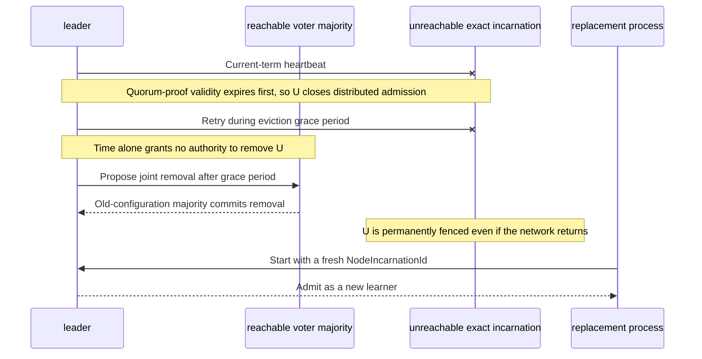

An unreachable member without a replacement follows the same joint-consensus
removal path. A joining process that presents the same stable `NodeId` remains
the explicit replacement path and waits through the shorter authority window
before removing the old incarnation.

## Heartbeat Failure, Fencing, Gate, And Barrier

The heartbeat/control loop is supervised. A transient exception cannot silently
terminate it: failures are observed, retried with bounded backoff, and reflected
in authority state. The safety decision is based on recent quorum proof rather
than on whether one asynchronous loop happened to be running.

### Failure And Recovery Matrix

| Event | Authoritative result |
| --- | --- |
| Leader loses contact while the other voters retain a majority | Its quorum proof expires and its admission gate closes. The connected majority elects a leader for a higher term. |
| Old leader reconnects before its incarnation is removed | It observes the higher term, becomes a follower, catches up, and passes the recovery barrier before reopening admission. |
| Old leader reconnects after removal committed | Its exact incarnation remains fenced. The host stops and a later process start joins with a new incarnation. |
| Non-leader voter disconnects briefly | It closes admission when authority expires but remains a member. On return it follows the leader, repairs its log and view, and recovers without changing incarnation. |
| A member remains unreachable beyond the eviction grace period | A leader with the old configuration's majority may joint-remove the exact incarnation. Actor ownership may be superseded only after that removal commits. |
| No partition retains a majority | No side may commit membership changes, acquire or supersede Actor ownership, or reopen distributed admission. Waiting longer does not create authority. |
| Every prior member is lost and a fresh cluster is deliberately formed | The new cluster receives a new `ClusterIncarnationId`; all framework-owned in-memory state from the previous incarnation is gone. |

Elapsed wall time has no special recovery meaning. A node returning after five
minutes follows the “before removal” or “after removal” rule according to the
committed membership view, not according to the number five. Leadership is
also not restored by identity: a former leader returns as a follower of the
current higher term.

### Epoch Fencing

Epoch fencing means every authoritative message carries enough generation
identity to prove which lifetime it belongs to. For node work this includes
cluster incarnation, node incarnation, and committed view. Actor work also
carries `ActorActivationId`.

A receiver rejects an old cluster, replaced node incarnation, or stale Actor
activation before business mailbox dispatch. Fencing prevents a delayed old
process or cached route from becoming a second owner. External databases that
require strict single-writer behavior must also store and compare the Actor
fencing token; the framework cannot fence writes after they leave the process.
The exact identity scopes, membership-view watermark, request validation, and
deadline boundary are defined in
[Distributed Identity And Request Lifetime](#distributed-identity-and-request-lifetime).

### Distributed-Work Admission Gate

The gate is a process-wide valve in front of new distributed work. It remains
open only while the node has valid majority authority. Loss of authority closes
it and stops new Actor activation/delivery work; consensus, management, health,
and recovery traffic remain available.

This separates “the process is alive” from “the process is currently allowed
to act as an owner.” A minority partition therefore fails closed instead of
continuing to serve conflicting state.

### Recovery Barrier

Regaining cluster contact is not enough to reopen the gate. The recovery
barrier runs registered recovery participants in order while admission remains
closed. Membership and descriptors are validated and committed before the
coordinator marks the node active. Any participant failure leaves the gate
closed; it cannot expose a half-recovered runtime.

Together these mechanisms address the heartbeat-loop failure mode:

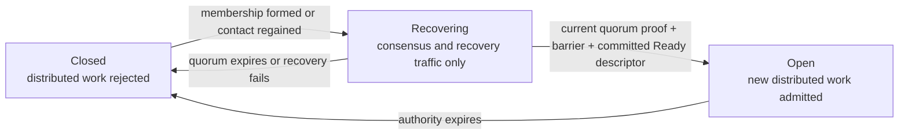

Loss of a majority intentionally stops control-plane changes and new
distributed admission. Retrying forever while continuing business work would
hide a split brain and is not considered recovery.

## Sticky Actor Placement

Rendezvous hashing is the default initial-placement policy, not live ownership.
Hashing alone would remap roughly one quarter of keys when a fourth equal node
joins a three-node cluster. That is unacceptable for strong in-memory game
Actors, so an activation record remains authoritative after first placement.

The flow is:

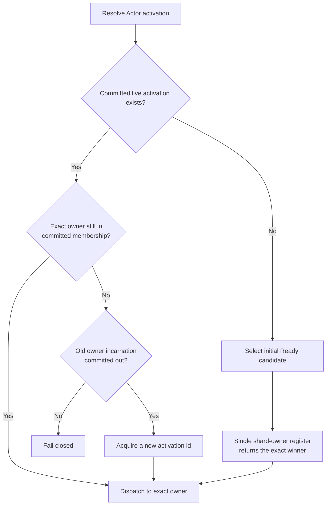

Adding a node moves zero existing Actors. New Actors may select it. A failed
owner can be superseded only after its exact incarnation has been committed out
of membership; the replacement receives a new activation id. Because Actor
state is in memory, the replacement starts without the
failed process's state unless the application provides its own persistence or
recovery.

### Actor Location DHT

Actor Location and Membership are separate authorities. Membership publishes
only exact live node facts and opaque capability descriptors; it contains no
Actor ids, activations, affinity keys, or Actor lifecycle commands. Actor
Location consumes committed Membership snapshots to derive a 1,024-shard ring,
using length-prefixed SHA-256 rendezvous scores, but its writes never mutate
Membership.

The distributed implementation is owned by the internal `Cluster/Actors`
module: it contains shard layout and state, survivor recovery, the membership
coordinator, Startup affinity authority, and Actor Location/lifecycle RPC
binding. The process-local Actors module exposes only the directory,
exact-activation, and Startup-affinity ports consumed by actor hosting and
invocation; lifecycle materialization itself remains an ActorHosting operation.

One exact Ready node owns each shard and conditionally registers or removes the
complete value `ActorId -> NodeReference + ActorActivationId`. Normal Create and
Destroy therefore require one owner operation rather than a majority write.
Warm calls use a bounded cache and send directly to the exact activation.
Destroyed records are removed; there are no tombstones, automatic persistence,
implicit activation, or virtual-Actor semantics.

Membership-view equality is deliberately not part of a normal lookup or call.
A descriptor-only Membership commit does not invalidate the unchanged exact
shard owner or Actor owner. Whenever committed Membership changes a shard
owner, the old owner redirects new requests according to the current layout and
the new owner reconstructs the shard from every surviving Ready-era activation
registry after those registries cross the recovery-view barrier. This single
recovery model applies whether the old owner remains Ready or its exact
incarnation was committed out. A conflict or incomplete barrier is
`ActorLocationUnavailable`, never `Absent`. Unchanged shards keep serving
throughout the transition.

Each surviving process advances a monotonic recovery-view watermark before it
exports activation evidence. That scan barrier is paired with lifecycle
ordering: Create publishes evidence and then revalidates the exact directory
claim before an executable mailbox can open; Destroy and failed Create rollback
retain evidence until exact unregister succeeds. Recovery therefore cannot
publish `Absent` for a create that later opens admission, or lose a retiring
reservation merely because its release attempt failed.

Failed Create compensation runs in a framework-owned 30-second lifetime rather
than the canceled caller lifetime. The bound covers directory resolution and
exact release even if an adapter ignores cancellation. Deadline expiry returns
an explicit unconfirmed-compensation failure and preserves the exact activation
evidence; it never claims that a release succeeded.

The Actor Location coordinator permits at most eight concurrent shard
recoveries. One stabilization attempt has a five-second deadline, and a newer
Membership view cancels obsolete stabilization so convergence proceeds directly
from the latest committed snapshot instead of queueing every intermediate view.

Explicit Create conditionally registers a unique activation before constructing
an executable mailbox, then runs its start hook. Only the registered winner can
execute business work. Destroy first closes admission,
drains admitted turns, and runs the stop hook; it then conditionally unregisters
the exact activation and disposes the local object. Delayed operations cannot
remove a replacement because every mutation compares the exact activation.
Business code invokes this through generated `ActorAccess.Place(id).DestroyAsync()`.
An Actor may instead call `Context.RequestDeactivation()` to request the same
transaction after its current turn succeeds; a failed turn discards the request.

### Default And Custom Placement

Actor placement uses rendezvous hashing by default, so `RoomActor` needs no
placement declaration in `HotfixStartup`. Startup Actors still need a
registration to declare that their replicas exist; its parameterless overload
selects rendezvous affinity:

```csharp
actors.RegisterStartup<MatchmakingActor, MatchmakingQueueId>();
```

Ordinary Actor types are discovered from their Hotfix behavior and lifecycle
descriptors, independently of placement overrides. Omitting a placement entry
therefore does not remove the Actor from node host descriptors or remote
creation; `Lakona:ActorHosts` still chooses which nodes can host it.

Applications may preserve a product-specific algorithm:

```csharp
actors.RegisterPlacement<UserActor, UserId>(static context =>
    context.Candidates[(int)(StableHash(context.Key.Value)
        % (uint)context.Candidates.Count)]);
```

The selector runs only for a missing or safely supersedable activation and must
return one exact offered candidate. Candidate order, membership, or selector
code changes never rehash an existing live Actor. Agar intentionally keeps its
existing FNV-1a modulo selector for `UserActor` and its Startup Actors, while
`RoomActor` uses the framework rendezvous default by having no placement entry
in `HotfixStartup.cs`.

Placement registration is therefore an override, not a requirement. Startup
registration retains both parameterless and selector overloads because it also
declares the replica type. The implicit placement default and parameterless
Startup registration use the same canonical rendezvous score and node-id tie
break, so the two defaults cannot drift apart.

Startup Actor selection uses the same sticky idea for a business key. The
first selected replica is recorded under an internal Startup-affinity Actor id,
so adding a Startup replica affects only new keys. The selected replica Actor
also has its own activation record. The affinity record answers “which replica
owns this key”; the replica activation supplies the exact `NodeReference`,
and activation id checked before mailbox dispatch. Keeping these two
responsibilities separate preserves sticky affinity without weakening node or
Actor fencing.

Live Actor migration and automatic rebalance are unsupported because they
require an application-owned snapshot contract and mailbox barriers.

## Session Ownership And Notification Routing

Framework-created session ids contain an opaque, versioned locator for the
exact gateway owner:

```text
version + cluster incarnation + gateway NodeId
        + gateway node incarnation + random local id
```

Business code still treats `SessionId` as opaque. During notification delivery,
the framework decodes the locator, validates it against the local membership
snapshot, and either dispatches locally or sends directly to that exact gateway.
No peer or route-directory network lookup is required. A malformed locator or
old incarnation is rejected rather than redirected to a process that reused the
same stable name.

`MatchmakingNotifier.Publish` illustrates the complete path:

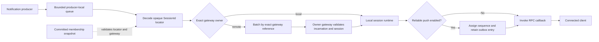

1. generated synchronous notification code builds one command per target
   session;
2. the local router reserves per-session and process-wide queue capacity;
3. background delivery decodes each session's exact gateway locator;
4. local targets enter the local session/reliable-push runtime directly;
5. remote targets are grouped by exact gateway and sent as bounded batches;
6. the owner validates its exact incarnation and local session, assigns reliable
   sequence/outbox state when enabled, and invokes the connection callback.

Session routing has no generic route-directory seam. The notification router
decodes the locator directly and checks the current Membership snapshot. The
target gateway repeats exact-incarnation validation and enters the distributed
authority gate before assigning a reliable sequence or mutating its outbox.
Process-local session composition owns a rejecting remote dispatcher, while
Cluster composition replaces that internal registration with the exact-gateway
dispatcher. This mode choice is framework-owned and is not a public adapter
seam.

### Synchronous Admission Is Intentional

Generated notification methods remain synchronous for high-frequency Room
broadcasts. `Accepted` means the producer-local bounded queue owns the complete
command; it does not mean the remote gateway or client has accepted it.
Changing this default to owner-confirmed async delivery would add a route/network
wait to every push. Such a mode requires a separate measured contract.

The queue never overwrites, coalesces, or deduplicates an older accepted
notification. Those are business semantics, not framework policy.

Remote batches are keyed by exact gateway reference. The default maximum wait
is 10 ms and can be set to zero. Count and byte limits flush a batch early; an
individual command that cannot fit the byte budget returns `Backpressure`.
The exact batching and capacity keys belong to
[Configuration](./configuration.md#notifications).

The router preserves FIFO per session with one active drain per session. A
fixed session-affine worker pool is not part of the contract and requires
large-session-count measurements. Process-local admitted queues and reliable
outboxes may be lost with their process; the accepted ephemeral model does not
turn them into durable delivery.

## Agar Gameplay Endpoints

The framework owns only its node-to-node cluster endpoint. Client and gameplay
transports remain business concerns. Agar matchmaking first places and creates
the Room Actor. `RoomBehavior.CreateAsync` runs on the exact owner, reads that
process's battle service endpoint, stores the full advertised transport, host,
port, and path in Room state, and returns it through
`RoomSettlementResult.Snapshot.RuntimeGateway`. Matchmaking then copies this
authoritative value into player assignments. Endpoint selection and Actor
placement therefore cannot choose different nodes.

The Room behavior selects endpoints by the application service labels `battle`
and `battle-runtime`, not by a framework transport type. Agar currently uses
KCP, but changing the gameplay transport does not require cluster or placement
changes. The advertised address must be used instead of the listener bind
address because wildcard binds, containers, NAT, and proxies may make them
different.

Agar no longer needs `LakonaClusterPostgres`. Its separate `AgarGamePostgres`
setting remains application persistence and is unrelated to cluster authority.
Existing node business roles and custom placement selectors remain intact.

## Performance Boundaries And Risks

| Area | Current decision | Recorded risk |
| --- | --- | --- |
| Actor scale-out | Existing Actors remain sticky; only new activations use new capacity. | A hot node is not immediately relieved. |
| Membership | Every caught-up node is a voter; target small clusters. | Heartbeat, election, and replication costs grow with node count. |
| Actor Location | One owner operation per Create/Destroy; 1,024 SHA-256 shards; 4,096 records per shard; paged survivor-registry recovery for every ownership change. | A changing shard is temporarily unavailable while recovery scans every surviving Ready-era activation registry. Actor state is not recovered. |
| Notifications | Synchronous bounded admission; exact-gateway batching, 10 ms default. | `Accepted` can still be lost before owner delivery; per-session drains may cost at very high session counts. |
| Memory | Actor state, affinities, queues, logs, and replicas stay in memory. | Long-lived populations require deployment-specific capacity budgets. |

The cluster contract does not provide live migration, persistent framework
state, owner-confirmed async push, a fixed notification worker pool, or a
large-cluster voting committee.

## Startup And Shutdown

Replicated startup orders authority before business readiness:

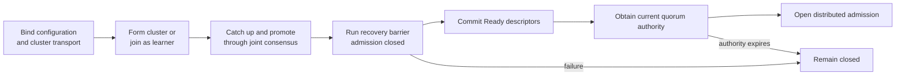

The order is strict: control transport comes before formation, voter promotion
comes before business recovery, and the Ready descriptor plus current quorum
authority come before distributed admission. A failure at any step leaves
admission closed; it does not skip forward or infer readiness from process
liveness.

Descriptor refreshes after hotfix or Startup changes commit a new membership
view even when the member was already Ready. If rollback cannot republish the
descriptor, the node enters a process-lifetime local-unavailable state: it
closes and drains distributed admission, rejects later descriptor refreshes,
and ignores subsequent authority-available callbacks until process restart.
Starting this terminal fence is intentionally non-cancelable; the call returns
only after the bounded admission drain succeeds or reports a fencing failure.
Peers may retain the last committed Ready descriptor until normal authority and
eviction rules advance the replicated view, but the fenced process rejects
distributed work locally throughout that interval.

The readiness endpoint follows this same authority boundary. A live process is
not ready while its distributed-work admission gate is closed, including when
it has not yet obtained current quorum authority or has lost that authority.
The local Membership diagnostics endpoint remains a snapshot inspection tool;
it is not a readiness substitute.

Shutdown closes admission before stopping business work. An ungraceful failure
does not prove that the process is permanently dead. The surviving majority
follows [Unreachable Member Eviction](#unreachable-member-eviction); a minority
cannot remove members, elect a valid authority, acquire or supersede Actors, or
reopen its gate.

### Why Actor Location was redesigned

The triggering failure was [GitHub Actions job 93874465263](https://github.com/bruce48x/Lakona/actions/runs/31520013969/job/93874465263), a three-node CI run in which three equivalent
Startup Actor preparations ran concurrently: two passed and one failed while
resolving activation metadata. The failed node had not lost its exact owner;
Membership had only advanced through an unrelated descriptor commit. The old
activation protocol failed with `ActorDirectoryUnavailableException: Activation
replica send failed with status 'StaleRoute'` because it treated the caller's
older global Membership view as stale. Its in-process test sender did not
exercise the same validation,
so repeated green unit tests had hidden a cross-module race.

This was structural rather than a one-line retry bug. Membership consensus and
the replicated activation directory both tried to provide ordering and
fencing, and the activation layer coupled an Actor operation to every unrelated
Membership view change. The fix was therefore to separate the authorities:
Membership orders node facts; Actor Location owns Actor records and compares
exact owners and activations. A harmless Membership advance no longer rejects
an unchanged owner, while an incarnation replacement is still rejected before
mailbox admission.
