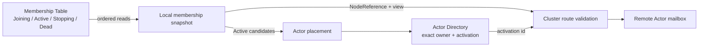
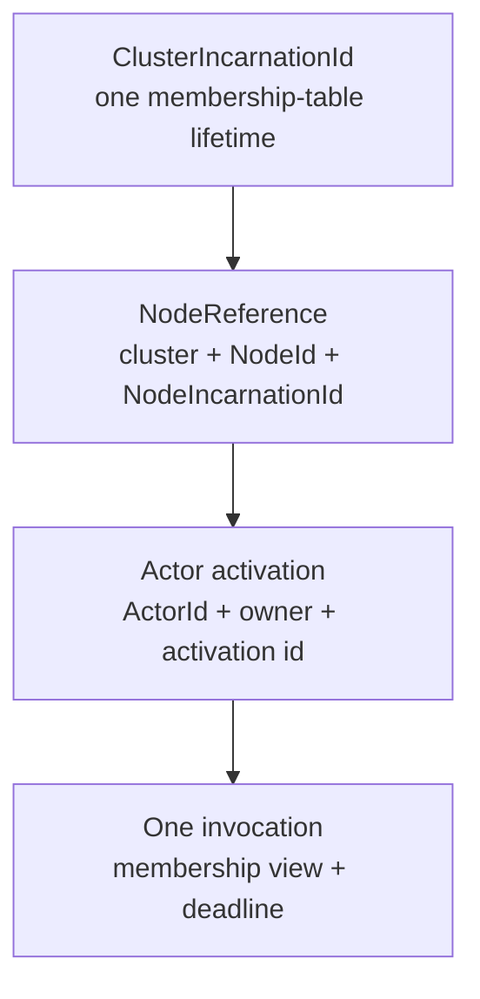
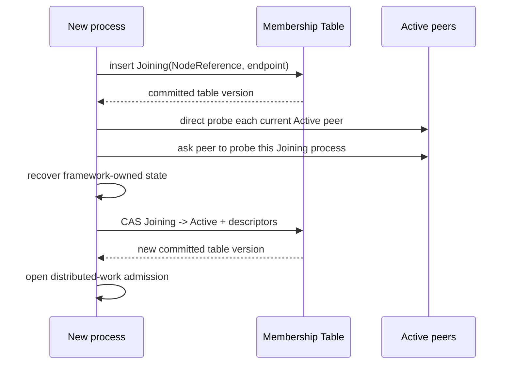
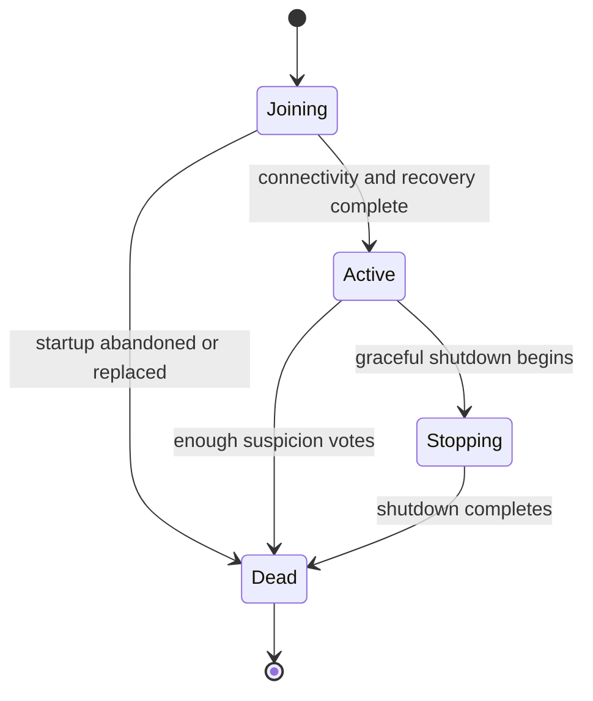
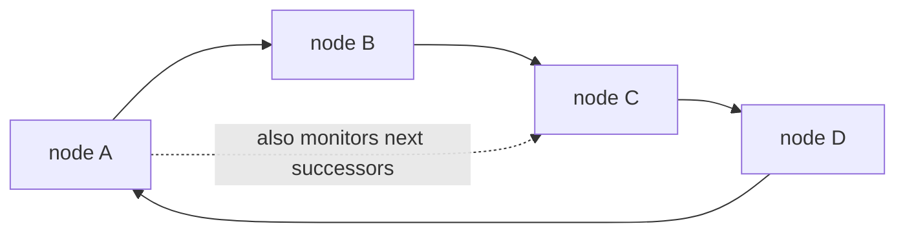

# Cluster

Lakona uses one shared Membership Table as the source of truth for a cluster.
Every server process reads and updates that table; server processes do not
elect a leader and do not copy a membership log between themselves.

For local development, the default in-memory table gives one process the same
lifecycle as a distributed node. A multi-process deployment must use the
PostgreSQL table provider. The game servers may still be stateless with respect
to business data: the table stores only framework membership metadata.

The cluster has three cooperating parts:

1. Membership says which exact process incarnations are `Active`.
2. Actor Directory records the exact node and activation which currently own an
   Actor.
3. Routing checks both facts before a remote request enters an Actor mailbox.

## Terms

| Term | Meaning |
| --- | --- |
| `Cluster.Id` | Stable deployment name selecting rows in the shared Membership Table. |
| `NodeId` | Stable operator-facing process slot, such as `data-1`. |
| `ClusterIncarnationId` | Identity created when a cluster id first creates its table metadata. |
| `NodeIncarnationId` | Random identity for one process lifetime. It changes on every restart. |
| Membership generation | Monotonic number allocated by the shared table for one join attempt. It orders competing incarnations without comparing machine clocks. |
| `NodeReference` | Exact cluster, node id, and process-incarnation identity. |
| `MembershipViewId` | Monotonically increasing version of the committed table. |
| `IAmAliveTime` | Low-frequency evidence that one process can still reach the table. It is not the failure detector. |
| Suspicion vote | A committed report that one observer repeatedly failed to probe one target. |

`NodeId` is a readable name, not a fencing token. Two process lifetimes may
both be called `battle-1`, but their `NodeReference` values differ.

## Distributed Identity And Request Lifetime

Cluster safety uses several identities with different lifetimes:

| Value | Changes when | Purpose |
| --- | --- | --- |
| `NodeId` | Configuration changes | Names one deployment slot. |
| `ClusterIncarnationId` | New metadata is created for a cluster id | Rejects traffic belonging to another table lifetime. |
| `NodeIncarnationId` | The process restarts | Rejects traffic for the previous process in the same slot. |
| `MembershipViewId` | A membership row or descriptor commits | Proves which committed membership view selected a route. |
| `ActorActivationId` | An Actor is recreated | Rejects traffic for an older in-memory Actor instance. |
| Deadline | Every call | Stops expired work from entering remote execution. |

A routed request carries the exact target `NodeReference`, Actor activation
id, membership view, and deadline. A receiver may be on a newer table view, but
it must still see its exact incarnation as `Active` and the activation id must
still match. A receiver behind the sender's view rejects the request rather
than guessing.

Cancellation after mailbox admission is cooperative. A deadline prevents late
admission; it does not roll back product behavior which has already executed.

## Formation, Admission, And Identity Conflicts

There is no peer discovery phase and no special first node. A process joins by
writing a `Joining` row to the Membership Table with a compare-and-swap (CAS):

The two-way connectivity check catches advertised endpoints which other nodes
cannot reach. It applies to Active rows whose table heartbeat is recent. A node
does not become `Active` merely because it can write to PostgreSQL.

Only one non-`Dead` row may use a stable `NodeId`. Before joining, a process
allocates a monotonically increasing generation from the shared table. A
higher generation atomically marks the older incarnation `Dead` and inserts
the replacement. This does not depend on host clock order. The older process
is fenced as soon as it reads the table or handles a request against a newer
membership view. This rule also handles a full deployment restart without
requiring operators to clear membership rows.

Running two live processes intentionally configured with the same `NodeId` is
an operator error. The newer process wins; the displaced process stops instead
of allowing two owners for one logical slot.

## Membership Table

### Providers

`Memory` is the default provider. Its scope is one process, so it is suitable
only for local single-node development and unit tests.

`Postgres` is the distributed provider. It creates and uses:

- `lakona_membership_cluster` for the cluster incarnation and global version;
- `lakona_membership_member` for member rows, descriptors, liveness time, and
  suspicion votes;
- a partial unique index preventing two live rows for one stable `NodeId`.

Each structural change advances the global version and the affected row version
in one transaction. Callers supply the versions they read; stale writers lose
the CAS and retry from a fresh snapshot. Heartbeat writes update only
`IAmAliveTime`, so routine liveness does not create a constant stream of new
membership views.

`Dead` rows are retained for a bounded diagnostic period and then removed in
small batches. Cleanup does not advance the Membership view because those rows
have already left every routing snapshot.

### Member states

`Dead` is final. A restarted process creates a new incarnation; it never
revives an old row.

Only `Joining` and `Active` rows are projected into normal routing
snapshots. `Stopping` immediately removes a node from new placement and
routing, while retaining an auditable transition in the table.

### Failure detection

The table is authoritative, but PostgreSQL does not decide whether a game
server is reachable. Active nodes probe a small, deterministic set of
successors on a hash ring:

The default is three monitored successors per node. Cluster-wide probe traffic
therefore grows roughly in proportion to the node count instead of every node
probing every other node.

One missed direct probe is not a death decision:

1. The observer tries a direct probe.
2. It asks up to two other Active nodes to probe the target.
3. After three failed probe rounds, it commits a suspicion vote.
4. The target becomes `Dead` only after enough distinct, non-expired votes.
5. The committing node gossips the new table version; receivers fetch rows from
   the table instead of trusting gossip payloads.

The effective vote threshold cannot exceed what the current cluster can
provide. This preserves progress in a small cluster while requiring
corroboration when several nodes are available.

`IAmAliveTime` has a different job: it helps operators and startup distinguish
old rows. A slow table heartbeat does not itself evict a process. During
startup, only the combination of an expired table heartbeat and failed two-way
network probes lets the joining node clear a defunct Active row. This lets a
cluster recover after a complete crash without treating database congestion
alone as network death.

### Table outages

When a table read temporarily fails, a node keeps its last committed snapshot
for at most the configured `IAmAliveSeconds` safety window and retries. It does
not invent a smaller cluster, elect a local leader, or rewrite membership from
memory. If table contact is not restored inside that window, the node closes
distributed-work admission and stops itself. This bounds how long a replaced
but table-isolated process can continue serving.

A short table outage therefore favors continuity for already-known routes but
pauses membership changes. Once a node observes that its own exact row is
`Dead` or absent—or exceeds the table-contact safety window—it closes
distributed-work admission and stops; this is a terminal fence.

## Cluster RPC Composition

Node-to-node RPC is framework-owned TCP plus MemoryPack. It is separate from
client-facing endpoints and serializers.

The protocol identifier is `lakona.cluster.v3`. Peers negotiate this
identifier before decoding cluster payloads. There is no compatibility path
for the removed replicated-membership protocol: mismatched generations fail
the connection.

Membership RPC contains only probes and version gossip. PostgreSQL remains the
authority for state transitions. Gossip is an optimization which asks another
node to refresh; it cannot directly install a membership row.

Types below `Lakona.Game.Cluster.Rpc` are internal implementation details.
Applications compose the high-level game server and use the public membership
identity and snapshot contracts rather than replacing the wire protocol.

## Consensus Model And Scope

Membership no longer runs consensus among game-server processes. PostgreSQL
serializes Membership Table transactions and CAS updates.

Actor Directory remains a separate cluster subsystem. It chooses one exact Actor
activation owner and uses its own transfer/recovery rules. Membership says
which process incarnations may participate; it does not store game Actor state
and does not turn PostgreSQL into an Actor database.

This boundary is intentional:

- Membership answers “which processes are currently allowed to receive work?”
- Actor Directory answers “which exact activation owns this Actor?”
- Application storage answers “which business data survives?”

## Heartbeat Failure, Fencing, Gate, And Barrier

The distributed-work admission gate is closed while a node is `Joining`,
while graceful shutdown drains work, and after terminal fencing. Client and
application HTTP readiness report this state instead of accepting work which
cannot be routed safely.

Before activation, recovery participants rebuild framework-owned state against
the committed snapshot. Only after every participant succeeds may the node
publish its descriptors as `Active` and open admission. Startup failure keeps
the node out of placement.

The exact `NodeReference` is checked at ingress and again where ownership
matters. Consequently, delayed requests for a replaced process cannot become
valid merely because the replacement reused its endpoint or stable name.

## Sticky Actor Placement

Placement considers only `Active` members whose published actor-host
descriptors match the requested Actor and placement policy. The selected
candidate does not become authoritative until Actor Directory commits an exact
owner and activation id.

If an owner leaves membership, new routing cannot use that incarnation.
Recovery inspects surviving activation registries and re-establishes one
authoritative owner. Incomplete recovery remains unavailable rather than
pretending that the Actor is absent.

### Actor Directory DHT

Actor Directory builds a deterministic hash ring from the exact `NodeReference`
values in one committed Membership view. Every Active node contributes 30
virtual partitions. An Actor id therefore has one directory partition owner;
it does not have a per-Actor database row or a fixed three-node replica set.

When Membership advances, each node installs the new ring and locks every hash
range whose owner changed before serving that range. A request using the old
view is redirected to the new owner and cannot write behind the lock. For two
consecutive views, the previous owner freezes the moved records and hands that
snapshot directly to the new owner. The receiver applies the records before it
acknowledges the snapshot.

A transport failure while reading that snapshot is retried while the exact
previous owner remains `Active`. It is not interpreted as an empty range. If
the previous owner leaves Membership before transfer succeeds, the receiver
switches to activation-registry recovery and remains fail-closed on conflicts.

Both snapshot paths reject stale Membership views. Partition handoff also
rejects repeated Actor records and incomplete non-final pages. These responses
restart the whole range read instead of turning a malformed partial snapshot
into missing Actor locations.

If a view was skipped or the previous owner cannot supply its snapshot, the new
owner rebuilds the range from the exact activation registries of all surviving
Active nodes. Two different live claims for the same Actor are treated as a
conflict and the range remains unavailable. The directory never guesses that a
failed recovery means “Actor not found.”

Every mutation is conditional on `NodeReference + ActorActivationId`. A delayed
release from an old activation cannot delete its replacement, and a process
restart cannot inherit claims from the previous process incarnation. Calls may
cache that exact proof, but must invalidate it when Membership or directory
evidence changes.

The location record is framework state, not application persistence. Product
state should be loaded and saved by Actor behavior using application-owned
storage.

### Default And Custom Placement

The default selector deterministically spreads actors across compatible Active
nodes. Custom placement may filter or rank candidates, but it cannot make a
Joining, Stopping, Dead, or descriptor-incompatible node eligible.

## Session Ownership And Notification Routing

A Game Session belongs to the exact gateway `NodeReference` which accepted
it. Session ids contain an opaque locator so another node can route a
notification to that gateway without scanning all nodes.

Before sending, routing verifies that the exact gateway incarnation is still
Active. A restarted gateway with the same `NodeId` does not inherit old
in-memory sessions. Reliable-push replay remains bounded by the configured
resume window and targets the original gateway incarnation.

## Agar Gameplay Endpoints

The Agar sample demonstrates the intended separation:

- `gateway-1` accepts client login and matchmaking;
- `data-1` hosts user, matchmaking, and leaderboard Actors and owns business
  PostgreSQL/Redis clients;
- `battle-1` hosts room Actors;
- all three game servers share the separate PostgreSQL Membership Table;
- OpenTelemetry flows to the monitoring node and does not participate in
  membership decisions.

See [Game.Unity.Agar](../samples/Game.Unity.Agar/README.md) for commands and the
full deployment topology.

## Performance Boundaries And Risks

- Table refreshes and probes are periodic, not on every gameplay request.
- Probe fan-out is bounded by `MonitoredNodes` and `IndirectProbes`.
- Descriptor and state mutations use CAS and may retry under contention.
- A PostgreSQL outage pauses joins, replacement, and eviction.
- A too-aggressive probe interval can create false suspicion during pauses or
  overload; defaults favor stability over instant eviction.
- Actor routing still depends on the Actor Directory completing the affected
  range transition; an incomplete transition fails closed.

For tens or hundreds of nodes, keep the probe ring bounded and run PostgreSQL
as production infrastructure with backups, connection limits, and monitoring.
Do not switch to all-to-all probing to reduce detection time.

## Startup And Shutdown

Startup order:

1. bind node-to-node RPC;
2. join the Membership Table as `Joining`;
3. verify two-way connectivity with current Active nodes;
4. run recovery participants;
5. publish descriptors and become `Active`;
6. open distributed-work admission;
7. start application startup Actors and serve traffic.

Graceful shutdown reverses the safety boundary:

1. close admission and drain admitted work;
2. publish `Stopping`;
3. publish `Dead`;
4. stop the node-to-node listener.

An abrupt exit cannot publish those transitions. Probe failures and committed
suspicion votes eventually mark the old incarnation `Dead`; an immediate
replacement with the same `NodeId` can also atomically fence it during join.
