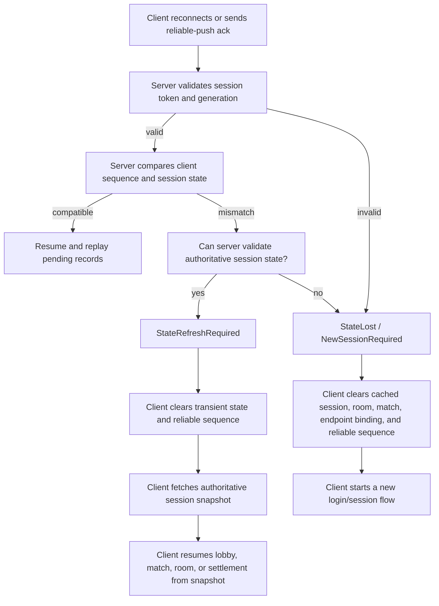

# Imported Contributing Notes

This document preserves the contributor guidance imported from the former
Lakona.Game, Lakona.Actor, and Lakona.Rpc repositories during the monorepo
consolidation. The active contributor policy lives in
[CONTRIBUTING.md](../../CONTRIBUTING.md); use this file as historical detail and
as a checklist when validating migration completeness.

## Former Lakona.Game Contributing Notes

This document is for people working on the Lakona.Game repository itself. User-facing package information belongs in `README.md`.

## Design Documentation

Before contributing, read the design philosophy and architectural boundary documents. This list names the stable documentation entry points; implementation plans are historical once their work lands.

- **[Design Philosophy](docs/actor/design-philosophy.md)** — The design principles (influenced by skynet), analysis of four reference frameworks (skynet, ET, Fantasy, GeekServer), what we absorb and reject, and the development roadmap.
- **[Lakona.Actor Boundary](docs/lakona-actor-boundary.md)** — The responsibility split between Lakona.Actor (process-local actor runtime) and Lakona.Game (distributed game server), the facade pattern, and configuration flow.
- **[Lakona.Tool Default Experience](docs/lakona-default-experience.md)** — The generated project experience, reduced default configuration surface, derived runtime state, and check-command direction for `lakona new`.
- **[Lakona.Game Configuration And Startup Model](docs/lakona-game-configuration-startup.md)** — The canonical `Lakona.Game` configuration schema, Feature Catalog startup model, endpoint rules, and local validation boundary.
- **[Lakona.Game Runtime Guardrails](docs/lakona-game-runtime-guardrails.md)** — The framework-level validation model for preventing invalid Cluster, Hotfix, Reliable Push, endpoint, and production-profile states.

The core principle: **skynet compatibility is the litmus test.** Features from ET, Fantasy, or GeekServer are adopted only when they do not conflict with skynet's philosophy of explicit boundaries, fail-fast behavior, and bounded resources.

## Repository Map

```txt
src/
  Lakona.Game.Abstractions/  Cross-side framework-owned session and reliable push primitives
    Sessions/              Session identity, endpoint names, and resume decisions
    ReliablePush/          Reliable push sequence and acknowledgement primitives
  Lakona.Game.Server/       Server-side RPC hosting, session lifecycle, reliable push outbox, guardrails, health checks, and Lakona.Actor-based execution
  Lakona.Game.Client/       Engine-neutral client helpers, currently reliable push tracking
  Lakona.Game.Cluster/      Optional explicit cluster route contracts and in-memory routing primitives
    Actors/                Cluster actor route keys and envelopes
    Diagnostics/           Cluster tracing and metric names
    Messaging/             Cluster router, messages, handlers, and node messenger abstractions
    Nodes/                 Node identity and endpoint value types
    Routes/                Route keys, locations, leases, and route directory implementations
  Lakona.Game.Cluster.Rpc/ Lakona.Rpc cluster messenger and route-directory adapter
    Clients/               Lakona.Rpc cluster client cache and factory
    Diagnostics/           Lakona.Rpc cluster dependency health probes
    Messaging/             Lakona.Rpc cluster message binder, converter, and node messenger
    Protocol/              Lakona.Rpc cluster service and method identifiers
    Routes/                Lakona.Rpc route-directory client, binder, and DTO conversion
    Transports/            Lakona.Rpc transport endpoint and factory abstractions
  Lakona.Game.Server.*      Hotfix, generator, and other server-adjacent packages
  Lakona.Tool/         Project management tool entry point
    Cli/                   CLI entry point, parser, application flow, and localized text
    Infrastructure/        Process execution helpers
    Scaffolding/           Project scaffolder, templates, and tool models

samples/
  Game.Cluster.TwoNode/         Multi-process Lakona.Rpc route-directory and node-messenger smoke sample
  Game.Unity.Agar/             Unity + .NET multiplayer sample
    docs/                 Sample gameplay design and development plan
    tests/                Sample gameplay and server policy tests
  Game.Godot.Chat/             Godot .NET single-endpoint Chat sample

Tests/
  tests.slnx              Framework test entry point
  Lakona.Game.Client.Tests/ Client package unit tests
  Lakona.Game.Cluster.Tests/ Cluster package unit tests
  *.Tests/                Package and sample test projects included by tests.slnx

blog/
  Hugo blog and user-facing article source
```

User-facing articles live in the Hugo site under root `blog/`. Do not put internal architecture RFCs, repository design decisions, migration plans, or contributor-only technical notes under `blog/`; keep cross-cutting package decisions and repository architecture notes in this guide. Package-specific design notes are maintained in this guide when they affect package boundaries, server behavior, client behavior, or sample integration.

### Samples

The repository currently contains one cluster infrastructure sample and two game samples:

```txt

samples/Game.Cluster.TwoNode/
  Multi-process Lakona.Rpc route-directory and node-messenger smoke sample

samples/Game.Godot.Chat/
  Godot .NET single-endpoint Chat sample demonstrating the generated default model

samples/Game.Unity.Agar/
  Unity .NET multi-endpoint realtime sample with WebSocket control plus KCP realtime
```

- `samples/Game.Godot.Chat` is the single-endpoint Godot Chat sample. It demonstrates the generated default model with one RPC endpoint, Actor-owned Chat state, and Hotfix message filtering.
- `samples/Game.Unity.Agar` is the multi-endpoint Unity realtime sample. It demonstrates WebSocket control plus KCP realtime, matchmaking/rooms, reliable push, Actor state, and Hotfix gameplay rules.

Agar.Godot was replaced by Game.Godot.Chat so the sample set contains a clear single-endpoint Godot project and a separate multi-endpoint Unity project.

`samples/Game.Cluster.TwoNode` starts a directory process and worker process, then verifies Lakona.Rpc-based node registration, route registration, local dispatch, remote dispatch, route not found, expired message rejection, timeout, handler unavailable, backpressure, stale registration rejection, clear-by-node-epoch, and node restart with a new directory-assigned epoch.

Run the cross-process cluster smoke sample:

```powershell
dotnet run --project samples/Game.Cluster.TwoNode/Game.Cluster.TwoNode.csproj -- --mode driver
```

`samples/Game.Unity.Agar` demonstrates:

- a Unity client plus .NET server game layout
- WebSocket as the long-lived control connection
- KCP for realtime gameplay traffic
- reconnect-aware login flow
- business-level reliable push for server notifications
- an agar-style arena built on a shared simulation kernel

Sample-specific documentation and local infrastructure live with the sample:

- `samples/Game.Unity.Agar/README.md`
- `samples/Game.Unity.Agar/docs/GAMEPLAY_DESIGN.md`
- `samples/Game.Unity.Agar/docs/DEVELOPMENT_PLAN.md`
- `samples/Game.Unity.Agar/docker-compose.yml`
- `samples/Game.Unity.Agar/.env.example`
- `samples/Game.Unity.Agar/infra/`

Run the sample server:

```powershell
dotnet run --project samples/Game.Unity.Agar/Server/Gateway/Gateway.csproj
```

Open `samples/Game.Unity.Agar/Client` in Unity for the client.

Open `samples/Game.Godot.Chat/Client` in Godot 4 .NET for the Godot client.

## Contributor Workflow

### Git Commit Checklist

Run this checklist before every commit:

1. Inspect the staged diff. If it changes shippable package content under `src/<PackageName>/`, bump that package's `<Version>` in `src/<PackageName>/<PackageName>.csproj` in the same commit.
2. Update `CHANGELOG.md` with every package id and version that will be released from the commit.
3. If the changed package version is consumed by `Lakona.Tool` scaffolding or samples, update the generated template constants, package-version readers, sample package references, or changelog entries in the same commit so newly scaffolded projects consume the intended package version.
4. Do not bump package versions for test-only or docs-only changes unless those changes alter files packed into a package or otherwise need to ship in a NuGet artifact.
5. Run the relevant local tests before committing.
6. Delete `docs/superpowers/` before finishing a development branch. Superpowers specs and plans are temporary working notes. Move durable decisions into the stable docs under `docs/` first, then remove the temporary directory.

Package version bumps are a commit-time rule. The publish workflow pushes with `--skip-duplicate`; if a changed package keeps an already-published version, the CI run can still succeed while nuget.org silently skips that package. Downstream consumers then keep receiving the stale package.

### Build And Test

Use the solution file instead of maintaining package-by-package command lists in this document:

```powershell
dotnet build Tests/tests.slnx
dotnet test Tests/tests.slnx
```

Sample-specific tests live with their sample, for example `samples/Game.Unity.Agar/tests/BusinessLogic.Tests`.

The Unity project may generate local `Library`, `Temp`, `obj`, and restored NuGet package folders. These are ignored and should not be committed.

### NuGet Release

Framework packages are published to nuget.org by GitHub Actions:

```txt
.github/workflows/publish-nuget.yml
```

The workflow runs on pushes to `main` that change `.github/workflows/publish-nuget.yml`, `Directory.Build.props`, `NuGet.config`, `src/**`, or `Tests/**`. It restores test and package projects, runs `Tests/tests.slnx`, packs every project under `src/*/*.csproj`, then pushes generated `.nupkg` files with `--skip-duplicate`.

Each published package is versioned by the `<Version>` property in its own `src/<PackageName>/<PackageName>.csproj`. Version bump and changelog rules live in [Git Commit Checklist](#git-commit-checklist) because they must be handled before the commit, not during release.

Release credentials are managed through the GitHub `release` environment with `NuGet/login@v1`. Normal releases should not use a local `NUGET_API_KEY`.

Useful local checks:

```powershell
dotnet test Tests/tests.slnx
Get-ChildItem src -Filter *.csproj -Recurse | ForEach-Object { dotnet pack $_.FullName -c Release -o artifacts/nuget }
```

## Package Boundaries

### Lakona.Game.Server

`Lakona.Game.Server` is the server-side framework package. It currently owns:

- the `ILakonaGameServer` main entry point for session, endpoint, and reliable push workflows
- hosting helpers for Lakona.Rpc server lifecycle
- Lakona.Actor-based process-local game state execution integration
- a generic reliable push outbox for business-level server push delivery
- extension points for project-specific RPC server configurators

It should stay infrastructure-oriented. `Lakona.Actor` is a foundational runtime dependency for Lakona.Game's actor execution model, while matchmaking rules, room rules, user DTOs, and gameplay state belong in the game project or sample, not in the framework core.

### Lakona.Game.Client

`Lakona.Game.Client` is an engine-neutral client helper package. It currently contains the `Lakona.GameClient` main entry point plus lower-level reliable push and reconnect state helpers that can be reused by Unity, Godot, or plain .NET clients.

### Lakona.Game.Abstractions

`Lakona.Game.Abstractions` owns cross-side framework concepts that must be named and interpreted the same way by server and client packages:

- `GameSessionKey`
- `GameEndpointName`
- `ReliablePushSequence`
- reliable push acknowledgement outcomes
- session resume outcomes

It must stay small. User-owned contracts still belong in a game `Shared` project, and Unity-specific wrappers should wait until repeated integration code becomes stable enough to justify a package.

### Lakona.Game.Cluster

`Lakona.Game.Cluster` is the optional cluster routing package. It owns explicit node identity, node directory abstractions, route identity, route locations, message envelopes, route directory abstractions, router abstractions, and in-memory implementations for tests or local validation.

It must stay transport-neutral and actor-boundary-aware. The package must not own generated business actor accessors, actor lifecycle APIs, actor migration, durable route storage, Redis-specific state, external platform discovery bindings, production transport, or gameplay concepts. Production adapters should be added only after the in-memory contract proves route lookup, expiration, local dispatch, remote dispatch, backpressure, and trace propagation.

`Lakona.Game.Cluster.Rpc` is the first transport adapter package. It owns the Lakona.Rpc method contract, client-side node messenger, client cache over Lakona.Rpc transports, endpoint parsing, TCP transport factory, server-side binder for internal node traffic, and Lakona.Rpc-managed remote node-directory and route-directory clients/binders. It must not own durable route storage, external platform discovery bindings, durable queues, gameplay DTOs, actor migration, generated business actor accessors, or managed actor lifecycle policy. Additional concrete transports must come with cross-process smoke tests.

### Lakona.Tool

`Lakona.Tool` is the project tool package. Its command name is:

```bash
lakona
```

It is separate from runtime packages. Runtime code belongs in `Lakona.Game.Server` or `Lakona.Game.Client`; project scaffolding and maintenance commands belong in the tool.

Package README files under `src/Lakona.Game.Abstractions`, `src/Lakona.Tool`, `src/Lakona.Game.Server`, and `src/Lakona.Game.Client` are user-facing package documentation. Keep contributor-only implementation policy, maintenance boundaries, release process, and design decisions in this `CONTRIBUTING.md` file instead of package README files.

#### Lakona.Tool Starter Boundary

In this repository's tool documentation, `starter` means `lakona-starter`, not `Lakona.Tool` or any internal Lakona.Game scaffolding phase.

`Lakona.Tool` delegates the base project shape to `lakona-starter`. Treat `lakona-starter` generated Lakona.Rpc content as owned by `lakona-starter`, not by Lakona.Game.

`Lakona.Tool` must not rewrite, replace, or version-pin starter-owned content:

- `Lakona.Rpc.*` package references and versions
- Unity, Tuanjie, Godot, or plain .NET client project structure
- Lakona.Rpc source-generator package references and generated namespace settings
- serializer and transport package selection beyond forwarding the user's `new` command options to `lakona-starter`

When `lakona new` augments a generated project, it should preserve starter output and add only Lakona.Game-owned infrastructure:

- `Lakona.Game.Server` and `Lakona.Game.Client` package references when needed
- Lakona.Game gateway hosting projects and configuration
- `Lakona.Actor` package references for process-local actor execution
- Lakona.Game-specific server startup, gateway, and tool configuration
- project metadata that keeps Lakona.Game-owned options visible without reintroducing manual RPC code generation

If a generated project needs a different `Lakona.Rpc.*` package version or client layout, fix `lakona-starter` first and then update the `lakona-starter` version consumed by `Lakona.Tool`.

## Product Line Boundaries

`Lakona.Game` clearly communicates that this layer is above raw RPC and standalone actor hosting, and is intended for game networking workflows. The relationship should be:

- `Lakona.Rpc`: transport, serialization, RPC calls, and generated bindings
- `Lakona.Actor`: process-local actor identity, mailbox execution, timers, backpressure, diagnostics, and source-generated typed spawn helpers
- `Lakona.Game`: game-session infrastructure that integrates Lakona.Rpc, Lakona.Actor execution, reconnect, named endpoint hosting, and reliable push
- user game code: matchmaking, room rules, gameplay state, rewards, inventory, and other domain features

This keeps the product line understandable without forcing a thick game framework.

### Shared Contracts

`Lakona.Game.Abstractions` exists because session identity, reliable push sequence values, and acknowledgement outcomes are now genuinely shared framework concepts. Keeping these types in either `Lakona.Game.Server` or `Lakona.Game.Client` makes the opposite side depend on the wrong runtime package.

Do not rename this package to `Lakona.Game.Shared`. Users already have:

- `Lakona.Rpc`
- their own shared RPC contract project
- server code
- client code

Adding `Lakona.Game.Shared` too early creates a naming collision with user-owned `Shared` projects and makes it unclear where business DTOs should live.

For now, shared business contracts should remain in the user's own shared project. Examples:

- login request/reply DTOs
- matchmaking status payloads
- reliable sequence fields on business messages
- app-specific result codes

`Lakona.Game.Abstractions` communicates framework-owned contracts only. Keep it limited to primitives that both runtime packages need.

### Unity Package Boundary

Unity-specific integration is useful, but it should not be the first client package. The reusable core should not depend on:

- `MonoBehaviour`
- Unity main-thread APIs
- `Time.time`
- Unity logging
- Unity assembly definition layout

The first client package should be a plain .NET library. Unity projects can consume it through normal package/import mechanisms while keeping Unity-specific glue in the sample or in the user's project.

`Lakona.Game.Unity` can be added later only when repeated Unity-specific integration code becomes stable enough to justify a package.

`Lakona.Game.Client` should own client-side mechanisms that are not engine-specific:

- latest applied reliable push sequence tracking
- duplicate reliable message detection
- ack decision helpers
- state-mismatch result handling
- reconnect state transitions that are independent of UI rendering

It should not own:

- Unity scene state
- UI text
- gameplay-specific callbacks such as `MatchmakingStatusUpdate`
- transport creation details unless they can be expressed through small interfaces

Unity sample code should remain responsible for:

- copying RPC DTOs into a main-thread inbox
- mutating Unity UI and scene state on the main thread
- choosing how to display reconnect/new-session outcomes
- calling generated RPC clients

## Framework Scope

Lakona.Game should not become a full game business framework. Keep the boundary narrow:

- Framework: connection lifecycle, host integration, session infrastructure, reliable push mechanics, reusable client state helpers.
- Game project: accounts, matchmaking policy, room rules, gameplay simulation, UI, persistence schema, and product-specific DTOs.

When a capability is only useful to one sample, keep it under that sample in `samples/`. Move it into `src` only when it is demonstrably reusable across games.

### Admission Rules

A concept belongs in Lakona.Game only when it is infrastructure, not gameplay semantics; useful across multiple game genres; compatible with low-latency online workflows; and able to expose failure, backpressure, and state mismatch explicitly.

Good candidates:

- session identity and endpoint binding
- reliable business push
- named RPC endpoint hosting
- cluster node identity and route location
- route directory and node messenger abstractions
- diagnostics, health checks, and metrics
- optional tool templates for deployment infrastructure

Bad candidates:

- account schemas
- matchmaking rules
- room rules
- battle or skill systems
- AOI implementation
- inventory, guild, leaderboard policy, rewards, quests, or product DTOs
- Unity/Godot UI architecture

## Runtime Architecture

### Actor Runtime Boundary

`Lakona.Actor` owns the process-local actor/mailbox runtime. Lakona.Game builds on it but should not absorb it.

`Lakona.Actor` is responsible for:

- actor identity and creation (monotonic, non-reusable `long`-based `ActorId`)
- in-process message delivery (`Tell`/`Call` with typed responses)
- mailbox serialization and backpressure (`MailboxFull`, `ActorUnavailable`)
- timers and local scheduling (monotonic, dispatched through mailbox)
- execution timeout (interrupt stuck handlers, mailbox continues)
- actor lifecycle state machine (`Active` → `Draining` → `Dead`)
- message interceptor hooks (`OnBeforeMessage` / `OnAfterMessage`)
- deadlock detection (circular call chains throw immediately)
- source-generated typed actor helpers and analyzers
- distributed tracing (Activity propagation) and metrics (Meter)

Lakona.Game is responsible for:

- Lakona.Rpc hosting integration
- session lifecycle and endpoint callback binding
- reliable business push
- route location and node-to-node messaging integration
- generated managed actor accessors over local runtime and cluster routing
- typed actor call exceptions for business-level distributed failures
- `ActorDirectory` contracts, host discovery, and actor placement cache
- tool templates and operational glue
- message recording/replay (using Lakona.Actor interceptor hooks)
- actor state observation and cluster-aware lifecycle
- execution timeout configuration exposed through `ActorRuntimeOptions`

Lakona.Game's managed actor API is the default business-facing model:

```csharp
await rooms.Get(roomId).JoinAsync(request, cancellationToken);
await rooms.Local(roomId).JoinAsync(request, cancellationToken);
await rooms.Remote(nodeId, roomId).JoinAsync(request, cancellationToken);
```

`Get(id)` is distributed by default: it checks the local runtime first, then uses `ActorDirectory` placement. `Local(id)` targets only the current process. `Remote(nodeId, id)` targets only the specified node and does not query placement. Business code should not handle endpoint addresses, `clusterName`, `endpointName`, route-directory endpoints, or switch over `RemoteAskResult`-style transport results. Generated business calls return business replies directly and throw typed actor call exceptions for distributed failures such as route not found, stale placement, timeout, overload, handler unavailable, or node unavailable.

Actor creation and destruction are local lifecycle operations generated as `SpawnAsync` and `DestroyAsync`. Cross-node create or destroy requests should be explicit business commands to a manager actor or service on the target node. The first managed actor version treats every `[Actor]` actor as framework-managed; do not introduce a `UserManaged`/`ActorLifetime` split until a concrete repeated need exists.

#### Lakona.Actor Facade Principles

Lakona.Game should expose its own narrow `Lakona.Game.Server.Actors` facade instead of leaking `Lakona.Actor.ActorRef<TMessage>`, generated actor clients, scheduler details, or native typed actor message families into Lakona.Game's public API. Lakona.Actor runtime capabilities belong in Lakona.Game only when they strengthen the game-session infrastructure boundary.

Lakona.Game-owned actor facade capabilities should follow these rules:

- Default business calls should return business results directly or throw typed actor exceptions. Do not generate `TryXxxAsync` methods by default and do not push `RemoteAskResult`/status-switch handling into ordinary game code.
- Explicit local overload should be represented by Lakona.Game-owned local actor exceptions or lifecycle results. One-way cluster-to-actor dispatch should translate local overload into `ClusterSendStatus.Backpressure`.
- Actor stop and drain should be explicit. Generated `DestroyAsync` is local-only; cross-node destroy is a manager command. Stop APIs should remove local actors, optionally wait for mailbox drain, and return or throw Lakona.Game-owned outcomes that support room shutdown, matchmaking teardown, session actor cleanup, and node draining without exposing Lakona.Actor lifecycle enums directly.
- Mailbox metrics should use Lakona.Game-owned snapshots. Operators need capacity, queued count, processed count, rejected count, and completion state to diagnose hot rooms, overloaded queues, and stuck state services, but public APIs should not expose Lakona.Actor runtime types.
- Timeout diagnostics should preserve root-cause distinctions (queue timeout, response timeout). Circular wait is no longer a timeout reason — it throws immediately as `InvalidOperationException`. Publish these through logging, metrics, or tracing with low-cardinality fields.
- Dead-letter and slow-message diagnostics should stay configurable through `ActorRuntimeOptions`, preserving low-cardinality metric and log fields.
- Timers should be delivered through the actor mailbox. Timer callbacks must not bypass sequential actor execution.
- Lifecycle hooks should be tied to explicit actor lifecycle operations. Startup should remain compatible with `Actor.OnActivateAsync`, and graceful deactivation should run only on explicit actor stop, not on best-effort process disposal cleanup.

Do not adopt these as Lakona.Game facade features by default:

- Lakona.Actor source-generated actor clients, because they are useful for projects that choose native Lakona.Actor APIs but would make the Lakona.Game facade thicker and less stable.
- Native `ActorRef<TMessage>` exposure, because callers could accidentally depend on process-local runtime semantics or write local-looking code across future cluster boundaries.
- Lakona.Actor named actor lookup as public Lakona.Game API, unless it is first mapped to Lakona.Game's own `ActorId` and route concepts.

### Endpoint Model

Lakona.Game should support multiple named RPC endpoints or channels, but it should not force every game to understand a fixed "control connection plus realtime connection" split.

The reusable framework capability is:

- host several named Lakona.Rpc servers in the same .NET process
- let projects choose transport, serializer, endpoint names, and lifecycle policy
- provide connection/session lifecycle helpers that can work with one endpoint or several endpoints
- keep logging, health checks, and diagnostics understandable per endpoint

The default user mental model should remain simple: one session endpoint can handle login, normal requests, reliable business push, and reconnect for light online games.

The control/realtime split is only an optional example for games that need high-frequency, low-latency gameplay traffic. In that model:

- the control endpoint handles login, matchmaking, room entry, settlement, low-frequency queries, and reliable business push
- the realtime endpoint handles input, snapshots, and other high-frequency gameplay traffic

This split belongs in samples or templates that explicitly opt into that shape. It should not become a mandatory package concept, and starter output should avoid introducing realtime attach, room runtime, or dual-connection terminology unless the selected project shape needs it.

### Reliable Business Push

#### Problem

Server callbacks are currently fire-and-forget at the business layer. A transport can report that a push write was accepted, while the target player reconnects before the client applies the business event.

Example:

1. Players A and B enter matchmaking.
2. The server creates a room and pushes `Matched` to both clients.
3. A receives and handles the push.
4. B reconnects during the push window.
5. The old connection is gone, but the server has no business-level proof that B handled `Matched`.
6. B may stay on the waiting screen forever.

The transport can reduce packet loss, but it cannot prove that the client applied a business event after a reconnect. The fix needs to be above transport: reliable, idempotent business push.

#### Recommended Model

Use at-least-once delivery with per-player monotonic sequence numbers.

This is a better fit than trying to implement exactly-once delivery:

- Exactly-once is not realistic across reconnects, retries, client crashes, and server failover.
- At-least-once plus idempotent client handling is predictable and common for low-frequency session and business flows.
- Sequence numbers let clients discard duplicates and let servers prune acknowledged messages.
- The mechanism is generic enough for `Lakona.Game.Server`; matchmaking, rooms, mail, rewards, and other features can opt in without entering host core as business concepts.

#### Layering

`Lakona.Game.Server` owns the generic mechanism:

- allocate a per-owner sequence number
- store pending reliable push records
- replay pending records after reconnect
- accept acknowledgements and prune old records
- apply retention and pending-count limits

Business code owns business semantics:

- choose which push messages require reliability
- include the reliable sequence in its payload
- expose an ack RPC or piggyback ack on an existing request
- make client handlers idempotent by ignoring already applied sequence numbers

This keeps `Lakona.Game.Server` as host infrastructure rather than a matchmaking or room framework.

#### Message Flow

Publishing a reliable push:

1. Business code asks `IReliablePushOutbox` to publish a payload for `ownerKey`.
2. The outbox assigns `sequence = lastSequence(ownerKey) + 1`.
3. The outbox stores `{ ownerKey, sequence, kind, payload }`.
4. The business delivery delegate sends the payload to the current callback, including `sequence`.
5. If the current callback is missing or disconnected, the record stays pending.

Acknowledging:

1. The client applies the business message.
2. The client sends the latest applied sequence to the server.
3. The outbox removes records with `sequence <= latestAppliedSequence`.

Reconnecting:

1. The client reconnects through normal login/resume flow.
2. The server rebinds the new callback.
3. The server calls `ReplayPendingAsync(ownerKey, deliver)`.
4. Pending records are pushed again through the new callback.
5. The client ignores duplicates whose sequence is not newer than its local latest applied sequence.

#### State Mismatch

Reliable push must also handle the case where the client believes it is resuming a valid session, but the server no longer has compatible state. This can happen when:

- the client stayed offline beyond the reconnect grace period
- the gateway process restarted and lost its in-memory outbox
- server-side cleanup removed the session before the client returned

The server should not silently accept this as a successful reconnect. It must return an explicit "state lost" result and require a new session.

Prefer authoritative-state refresh before declaring the session lost:



There are two detection points:

- `LoginAsync(reconnect: true)`: before accepting the reconnect, the server verifies that the session still exists and that the token matches. If not, it returns a reconnect-state-lost code.
- reliable push ack: if the client acknowledges a sequence greater than the server's last known sequence, the server knows the client has state from a different or expired server session. The ack response should request a new session.

Client behavior:

1. Stop treating the current flow as recoverable.
2. Clear cached room, endpoint bindings, pending callbacks, and latest reliable sequence.
3. Start a normal login/new-session flow instead of retrying reconnect.
4. Return the player to a coherent lobby or login state; do not leave them on a stale matchmaking or in-match screen.

#### Persistence

The default outbox is process-local and in-memory. Reliable push is a short-window, low-frequency session/business notification mechanism, not a durable business event log and not the source of truth for game state.

If a server process restarts or otherwise loses the outbox, the server should not pretend that replay is still possible. It should return an explicit state-lost result when reconnect or acknowledgement proves that the client has state the server can no longer validate. The client must then clear local session state, reset reliable sequence tracking, and start a new session or return to a coherent lobby/login flow.

Business code should recover from missing reliable pushes through authoritative state queries when the authoritative state still exists. If the authoritative state is gone, forcing a new session is preferred over replaying stale notifications.

Projects may still replace `IReliablePushOutbox` with a durable implementation for specialized low-frequency business events, but that is a project-specific choice. A durable outbox must preserve consistency with the authoritative business state and absorb the added performance, storage, retention, and operations costs. It should not be the Lakona.Game default or a reason to turn framework reliable push into a general event-sourcing system.

#### Retention

Reliable push is not an infinite event log.

Defaults:

- pending retention: 2 minutes
- max pending records per owner: 256

If a client does not reconnect and ack within the retention window, business code must recover via authoritative state queries or force the player back to a coherent screen.

#### Client Rules

Clients must:

- store the latest applied reliable sequence per player/session
- apply messages only when `sequence > latestAppliedSequence`
- ack only after the UI/session state transition has been applied
- tolerate receiving the same business message more than once

Reliable push is for low-frequency business or session transitions where missing one event can block the user flow. High-frequency realtime snapshots should be superseded by newer snapshots, not replayed as reliable history.

### Hotfix Boundary

Hotfix is an engineering goal, but it should not pollute the core actor or session APIs.

The authoritative design model is:

```txt
stable runtime state + replaceable business logic
```

Long-lived mutable state should live in stable runtime-owned types or in explicit serialized state. Replaceable business logic can live in a hotfix assembly and operate on that stable state. Large structural changes, protocol changes, and persistence schema changes should use deployment or migration workflows, not pretend to be safe hotfixes.

Hotfix code is behavior, not ownership. The stable actor or runtime host owns execution, mailbox or loop scheduling, cancellation, I/O, persistence, logging, network push, and other side effects. The stable state object owns long-lived mutable data. The hotfix system owns replaceable rules that operate on the stable state object and return stable DTOs describing the result.

The first Lakona.Game hotfix implementation uses attribute-discovered static system methods, source-generated friend accessors, and explicit stable wrapper methods at hotfix entry points. Actors and stable state objects remain in stable assemblies. Hotfix systems operate on those objects through generated friend accessors and `HotfixDispatch`-backed stable wrappers. Hotfix systems must not own long-lived timers, threads, callbacks, static event subscriptions, cached delegates, or other references that would keep an old `AssemblyLoadContext` alive.

Reload replaces the immutable dispatch table only after the new hotfix assembly loads, scans, and validates. Reload failure keeps the previous dispatch table active. A hotfix method already executing keeps the version it resolved; the next dispatch call sees the new table after a successful reload. Stable actors and room loops must not cache hotfix implementation instances across calls.

The first runtime has one process-global dispatch table and should be treated as one hotfix domain per server process. Do not create multiple unrelated hotfix managers in the same process expecting independent active logic tables.

Generated friend accessors are public members on `[HotfixState]` partial types because a separate hotfix assembly must call them. `[FriendOf]` records the intended system relationship for tooling and readability; it is not a CLR-enforced permission boundary. Mark only stable state types whose generated `__hotfix_` accessors are acceptable to expose to project code, and keep sensitive runtime internals out of those hotfix state types.

Hotfix system method rules:

- Methods must be `public static` extension methods.
- The first parameter must be `this TState self`.
- `TState` must match the `[HotfixSystemOf(typeof(TState))]` state type.
- Method name, return type, and parameter types form the dispatch key.
- Duplicate keys are invalid.
- By-ref, out, pointer, and open generic signatures are not supported.

Package responsibilities:

- `Lakona.Game.Server.Hotfix.Abstractions`: stable attributes and reload result contracts shared by stable projects, hotfix projects, runtime, and generators.
- `Lakona.Game.Server.Hotfix`: runtime loading, source resolution, collectible `AssemblyLoadContext`, scanner, dispatch table, reload manager, and optional file watcher.
- `Lakona.Game.Server.Hotfix.Generators`: source-generated friend accessors for `[HotfixState]` partial types. Full generated call wrappers and call-site caches are deferred; v1 entry points use explicit stable wrapper methods that call `HotfixDispatch`.

For Agar, `RoomRuntime` is stable and owns the tick loop, cancellation, session cleanup, user profile writes, leaderboard writes, logging, and network publishing. `ArenaSimulation` is the stable state object. `ArenaSimulationSystem` and settlement systems are reloadable rule implementations and are not actors.

First versions should avoid hotfixing:

- actor runtime internals
- serializer protocol structure
- transport protocol structure
- persistent state schema
- low-level schedulers

Generated Lakona.Game project templates must show live runtime paths for core capabilities. If a template creates `Server/Hotfix`, stable server code must call a Hotfix method on the default business path. If a template creates stateful server behavior, that state must live behind the Lakona.Game actor facade, not in static mutable process objects guarded by ad hoc locks.

## Cluster Architecture

### Node And Execution Model

A node is a server process participating in a Lakona.Game cluster. In Lakona.Game cluster terminology, machine, process, and node are treated as the same deployment unit; use `node` when discussing cluster membership and lifecycle. The framework should prefer neutral node concepts over business node types. `Gateway`, `Lobby`, `Match`, `Room`, `Chat`, or `Battle` are services that can be composed inside a node, not fixed node types.

Services are node-local capabilities loaded by configuration. A development node may run gateway, lobby, match, room, chat, node-directory, and route-directory services in one process. A production deployment may split those same services across several nodes. This difference should be a deployment configuration choice, not a different programming model.

Suggested node concepts:

- `NodeId`: stable runtime node identity
- node epoch/generation: changes when the process re-registers after restart
- node exposure: client-facing or internal-only
- node services: configured service descriptors such as gateway, lobby, match, room, chat, node-directory, route-directory, actor host, client session host, reliable push host, or scheduler host
- node endpoints: named addresses for internal or external communication
- node state: starting, ready, draining, suspect, dead

Actor execution remains process-local first. Cross-thread or cross-node communication should use message delivery, not shared mutable objects. Actor location is separate from actor identity: stable actor ids should not encode node id, ports, endpoints, business category, or local runtime scheduling details.

Cross-node actor communication is placement-based, not endpoint-based. The generated `Get(id)` accessor uses `ActorDirectory` placement for the default business path. The generated `Remote(nodeId, id)` accessor is the explicit node-targeted path. Lower-level cluster APIs still expose route lookup, timeout, expiration, and delivery results for infrastructure code, but ordinary actor business code should call generated refs and receive typed exceptions on failure.

Cluster state should route only to `NodeId` and `RouteLocation`; the receiving node then hands the message to its local actor runtime, which owns mailbox dispatch and scheduling. Cluster code must not store, expose, or target local actor runtime scheduler identifiers.

### Cluster Location And Messaging

Cluster routing uses two separate responsibilities:

- `IRouteDirectory`: stores `RouteKey -> RouteLocation` with expiration, route generation, and node epoch.
- `IClusterRouter`: applies route lookup, TTL checks, local dispatch, remote dispatch, and backpressure behavior.

Node communication is a lower layer:

- `INodeMessenger`: sends a `ClusterMessage` to a resolved `RouteLocation`.
- `IClusterMessageHandler`: receives a cluster message on the target node and dispatches it locally.

Expected flow:

1. Caller submits a `ClusterMessage` to `IClusterRouter`.
2. Router rejects expired messages before doing directory or network work.
3. Router resolves the current `RouteLocation` through `IRouteDirectory`.
4. If the target node is local, router calls local `IClusterMessageHandler`.
5. If the target node is remote, router calls `INodeMessenger.SendAsync(location, message)`.
6. The receiving adapter handles authentication, TLS, compression, and wire format, then invokes local `IClusterMessageHandler`.

Route locations are generation-aware. A new owner should publish a higher route generation; a restarted node should publish a higher node epoch. The directory must reject stale registrations, support conditional lease refresh by the current owner, and allow clearing routes for a specific node epoch so a restarted node does not accidentally inherit old traffic.

The first implementations provide in-memory directory and loopback messenger behavior for local validation, plus a Lakona.Rpc-managed remote route directory adapter for multi-process validation. Production adapters should stay pluggable and should not change the transport-neutral `IRouteDirectory` or `IClusterRouter` contracts.

### Production Adapter Decision

The first production adapter direction is the Lakona.Rpc internal transport adapter in `Lakona.Game.Cluster.Rpc`. It contains the protocol, client-side messenger, remote route directory client/binder, client cache, TCP transport factory, and server binder foundation. A real multi-process sample or generated template is still required before making cluster mode a recommended default for users.

Decision:

- Preferred first adapter: Lakona.Rpc internal transport.
- Package shape: keep it outside `Lakona.Game.Cluster` as `Lakona.Game.Cluster.Rpc`, so the core cluster contracts remain transport-neutral and do not force Lakona.Rpc server/client packages into every cluster consumer.
- Lakona.Rpc adapter scope: node-to-node `ClusterMessage` delivery, remote `IRouteDirectory` calls, adapter-owned authentication/TLS/compression/wire format, trace propagation, timeout mapping, and explicit `ClusterSendStatus` results.
- Lakona.Rpc adapter non-goals: durable route storage, external platform discovery bindings, gameplay DTOs, durable queues, actor lifecycle policy, or generated business actor accessors.
- Direction for gRPC: keep as the second candidate when a project needs a conventional service-to-service protocol or polyglot operations story.
- Direction for Redis pub/sub or streams: use only for fanout or brokered delivery after ordering, backpressure, expiry, and observability semantics are explicit; do not serialize live RPC callbacks or actor references into Redis.
- Direction for custom message buses: keep as an adapter pattern, not a framework default.

Implementation gates before making `Lakona.Game.Cluster.Rpc` a recommended generated-template option:

1. A sample or template needs two independent .NET processes exchanging `ClusterMessage`.
2. The adapter can authenticate node-to-node traffic without embedding production secrets in templates.
3. Timeout, expired message, route-not-found, handler-unavailable, backpressure, and failed-send paths remain mapped to `ClusterSendStatus`.
4. Metrics and activity spans preserve the current low-cardinality cluster tags.
5. The adapter does not change `IRouteDirectory`, `IClusterRouter`, `INodeMessenger`, or `IClusterMessageHandler` into transport-specific APIs.

### Prior Art And Direction

Skynet-derived cluster principles:

- Keep cluster support as infrastructure, not a full distributed actor platform. Provide node identity, route location, message delivery, diagnostics, and explicit failure results first.
- Make target selection visible in API names. `Get(id)`, `Local(id)`, and `Remote(nodeId, id)` are distinct selectors even though business methods return business replies directly.
- Treat overload as a normal result, not an exceptional surprise. Route lookup success does not guarantee delivery; node messenger, remote inbox, and target actor mailbox can all reject work with backpressure.
- Keep trace context in the message envelope. Cluster messages should carry correlation data that lets tools reconstruct route lookup, remote send, receive, local dispatch, and actor handling time.
- Do not use `ClusterMessage` as a generic large-state sync protocol. Large snapshots, fanout target sets, and repeated state should use application-owned versioning, caching, or diff protocols.

Skynet and ET framework comparison:

- Skynet cluster RPC is closest to explicit node-to-node message delivery. Callers address a node plus service name or address, the local cluster sender writes a request over TCP, the remote cluster agent dispatches to the target service, and call responses are correlated back to the waiting coroutine by session id. This is useful prior art for a future `INodeMessenger`: keep node messaging simple, expose send versus call semantics clearly, and do not pretend the cluster is a complete deployment, discovery, or failover system.
- ET's ActorLocation model is closer to location-transparent actor messaging. A stable entity id is resolved through a Location Server to a current actor instance id; senders cache the resolved location, retry after actor-not-found or migration failures, and use location locks during migration so concurrent sends can wait for a new location. This is useful prior art for route directory behavior: generation-aware locations, cache invalidation, bounded retry, and migration or rebinding locks.
- Lakona.Game borrows ET's location-directory mechanics without adopting an unqualified transparent actor surface. The default `Get(id)` selector is distributed and placement-aware; `Local(id)` and `Remote(nodeId, id)` remain explicit selectors for local-only and specified-node calls.
- Generated actor refs may use the same business method shape across selectors, but failure is typed exception-first. Do not expose `RemoteAskResult` or switch-heavy transport status handling as the default business API.
- Do not turn actor placement into an invisible global singleton. `ActorDirectory` lives in `Lakona.Game.Server`, is found through cluster feature discovery, and caches directory host and actor placement with explicit invalidation, retry, and diagnostic behavior.
- Do not make migration a default framework promise. Lakona.Game may support rebinding route locations and rejecting stale generations; application-owned room transfer, snapshot handoff, and authoritative state repair remain game protocols unless repeated projects prove a reusable infrastructure shape.

### Cluster Management

The first cluster model should be simple and lease-based. Avoid starting with a fully decentralized consensus system.

Cluster membership should follow a static-bootstrap plus dynamic-node-directory model. Static configuration should only tell a node how to join the cluster: cluster name, its own node id, advertised endpoints, configured services, labels, and one or more seed or directory endpoints. It should not be the source of truth for every live node in the cluster.

The live cluster view should come from a dynamic node directory. The node-directory service is configured like any other node-local service; development deployments may run it in the same all-in-one node as gateway, lobby, match, room, and chat, while production deployments may place it on a dedicated control node or another operationally suitable node. A node registers itself with the directory, receives or records a `NodeEpoch`, publishes its service descriptors and endpoints, and refreshes a lease through heartbeat. Other nodes may cache directory results for short windows, but stale cached entries must be handled as a normal distributed condition through re-resolution and explicit send failures.

The first node-directory version must support persistence. In-memory mode is still required for tests, local validation, and simple development, but production-oriented configuration must be able to use a durable backing store so node epochs do not roll back after a directory restart and active leases can be recovered or expired consistently. Persistence is for live membership metadata and epoch monotonicity, not a durable business event log.

The node directory and route directory are separate responsibilities:

- `NodeDirectory`: tracks live nodes, node epochs, service descriptors, endpoints, labels, readiness, draining state, and leases.
- `RouteDirectory`: tracks application route ownership such as `RouteKey -> RouteLocation`, using node id and node epoch to prevent old locations from surviving node restarts. Routes may also record the target service name or service kind when a node hosts multiple services.

The route directory should treat locations as expiring records. When a node dies or stops heartbeating, its temporary route locations should expire or be cleared. A stale location is a normal distributed condition, not a fatal error.

Recommended lifecycle:

1. Node starts and reads cluster name, node id, configured services, endpoints, and labels.
2. Node uses static bootstrap configuration to find a seed or directory endpoint.
3. Node registers with the node directory.
4. Directory assigns or records a node epoch and lease.
5. Node heartbeats until it drains or dies.
6. During draining, node stops accepting new ownership but may finish existing work.
7. Expired node leases make the node unavailable for discovery.
8. Expired route leases make affected routes unavailable until another node registers a new location.

Shutdown should use explicit draining rather than destructor-style cleanup. A draining node should stop accepting new route ownership, reject or redirect new remote sends, finish only bounded in-flight work, close external connections, flush required state, and then let process shutdown terminate anything still unfinished. The framework should not promise that every pending distributed request naturally completes during shutdown.

### Implemented Cluster Management

Current cluster management support includes:

1. Transport-neutral node directory contracts for registration, heartbeat, readiness, draining, node lookup, service queries, expired-node cleanup, and node epoch allocation.
2. In-memory node-directory storage for tests/local development and SQL-backed storage for production-oriented deployments.
3. Lakona.Rpc node-directory messages, client, and binder in `Lakona.Game.Cluster.Rpc`, parallel to the route-directory adapter.
4. A split-process cluster sample where the directory process hosts both node-directory and route-directory services, and workers use directory-assigned node epochs before publishing routes.
5. `lakona new --network-profile cluster` templates that emit bootstrap settings, node-local service lists, and explicit node-directory storage mode settings rather than treating static configuration as the authoritative live cluster view.
6. Diagnostics and dependency probes for node-directory and route-directory operations.

Keep Consul, etcd, Kubernetes API, Redis, or Raft-backed discovery as optional future adapters; do not make any of them a dependency of the core cluster contracts unless a later design explicitly selects one as the first persistent backing store.

### Deferred Cluster Capabilities

Do not implement these as default framework behavior in the first cluster module:

- automatic actor migration
- unqualified transparent remote actor calls that hide target selection
- distributed transactions
- exactly-once cross-node delivery
- battle live migration
- fully decentralized route directory
- Raft-based cluster consensus
- cross-node shared mutable objects

### Deliberately Not Default Work

- Durable reliable push is not a default framework goal. The default remains an in-memory short-window outbox plus explicit state-lost/new-session behavior when authoritative state cannot be validated.
- `Lakona.Game.Shared` is not planned. Cross-side framework-owned contracts belong in `Lakona.Game.Abstractions`; user-owned business DTOs belong in the game's own shared contract project.
- `Lakona.Game.Unity` is not planned until repeated Unity-specific integration code becomes stable enough to justify a package.
- Game business systems stay out of the framework: accounts, matchmaking policy, room rules, gameplay simulation, rewards, inventory, leaderboard rules, UI, and product DTOs belong in the game project or sample.

## Former Lakona.Actor Contributing Notes

This document is for Lakona.Actor framework contributors. For user-facing introductions, quick starts, and feature descriptions, see [README.md](./README.md).

For the design rationale behind Lakona.Actor's choices, see **[docs/actor/design-philosophy.md](./docs/actor/design-philosophy.md)**.

## Documentation Map

This file is the single authority for all contributor and maintenance rules. Supporting documents provide deeper rationale:

| Document | Purpose |
| --- | --- |
| [README.md](./README.md) | User-facing introduction, quick start, and feature reference |
| [docs/actor/design-philosophy.md](./docs/actor/design-philosophy.md) | Design principles, influences, tradeoffs, and rationale |
| [src/Lakona.Actor/README.md](./src/Lakona.Actor/README.md) | NuGet package page (condensed) |
| [src/Lakona.Actor.SourceGenerator/README.md](./src/Lakona.Actor.SourceGenerator/README.md) | Source generator API and usage |

Add new docs under `docs/` and link them here when they address contributor or maintenance concerns.

## Contributor Checklist

Before changing Lakona.Actor:

- Confirm the change fits the small, process-local runtime boundary.
- Keep network, persistence, distributed identity, Unity, and gameplay concepts outside this repository.
- Preserve actor state access through mailbox-mediated actor turns.
- Add or update tests for the affected runtime contract.
- Keep Roslyn dependencies out of the `Lakona.Actor` runtime assembly.
- Use .NET 10 and the repository `.slnx` solution format.

## Runtime Identity

Lakona.Actor is a:

```text
message-driven service runtime
```

It is not an:

```text
enterprise distributed actor platform
```

Preserve that distinction when changing the runtime. The core model is:

```text
actor = mailbox + state + message handler
```

Each actor:

- Owns its state.
- Owns its mailbox.
- Communicates only through messages.
- Processes messages sequentially.
- Receives explicit dependencies through construction, actor refs, or messages rather than through `ActorContext<TMessage>`.

Because of this, state inside a single actor usually does not need `lock`, `ConcurrentDictionary`, or CAS-style concurrency protection.

## Core Boundaries

Keep the core small and process-local.

| Boundary | Includes | Excludes |
| --- | --- | --- |
| **Messaging** | Typed actors, local refs, `Send`, `Call<T>`, timers | Cluster, virtual actors, transparent remoting |
| **Mailbox** | Bounded capacity, backpressure, stop/drain | Unbounded queues, supervisor trees |
| **Lifecycle** | Optional `IActorStarted`/`IActorStopping` hooks | Persistence, event sourcing, DI activation |
| **Registry** | Named local actor lookup with type validation | Distributed registry, service discovery |
| **Diagnostics** | `ActivitySource`, `Meter`, dead letters, slow-message | APM binding, structured logging framework |
| **Tooling** | Compile-time generators, analyzer diagnostics | Runtime reflection dispatch, dynamic proxies |
| **Application** | Process-local actor/mailbox runtime | Network, RPC, serialization, game concepts, Unity |

See [docs/actor/design-philosophy.md](./docs/actor/design-philosophy.md) for the rationale behind each boundary.

## Project Structure

| Path | Responsibility |
| --- | --- |
| `src/Lakona.Actor` | Runtime public API, mailbox execution, timers, lifecycle hooks, diagnostics, metrics, and named actors. |
| `src/Lakona.Actor.SourceGenerator` | Typed spawn generation, actor client generation, and actor usage analyzer diagnostics. |
| `tests/Lakona.Actor.Tests` | Runtime behavior tests, source generator tests, and analyzer tests. |

## Engineering Conventions

Only .NET 10 is supported:

```xml
<TargetFramework>net10.0</TargetFramework>
```

The repository uses the .NET 10 `.slnx` solution format:

```text
tests/test.slnx
```

The package version is defined by `src/Lakona.Actor/Lakona.Actor.csproj`.

`src/Lakona.Actor.SourceGenerator` is an internal build project. It is not independently packable and should not be published as a standalone NuGet package.

The `Lakona.Actor` runtime targets .NET 10 only and does not declare an extra `System.Threading.Tasks.Dataflow` package reference.

## Build And Test Commands

Use the repository solution for normal validation:

```powershell
dotnet test tests/test.slnx
```

## Runtime Principles

### Local Runtime Model

Actor execution is process-local. A local actor call can be ergonomic, but a remote actor call must use a different API shape because it has serialization, routing, retry, timeout, and remote backpressure costs.

### Mailbox And Backpressure

Mailbox overload is a normal runtime condition. Prefer bounded capacity, send failure, timeout diagnostics, dead-letter publication, and metrics over unbounded queues that fail later through memory pressure.

### Scheduler Encapsulation

Execution-lane or scheduler details are implementation details. Public APIs and generated code should expose actor ids, actor refs, and mailboxes, not scheduler lanes or logic-thread concepts.

### Blocking Work

Long-running or blocking work must not monopolize actor execution while touching actor state. Follow the `Long-Running Work` rules below for concrete offload patterns.

### Shutdown Semantics

Shutdown should be explicit and bounded. Graceful stop hooks are for explicit stop paths. During explicit stop, new application messages are rejected, queued messages drain, and `IActorStopping<TMessage>` runs as the final mailbox turn before completion. If a drain timeout elapses, the actor remains `Draining` until the current work and final stop hook finish. System disposal is a cleanup path and should not run user graceful-stop logic that depends on mailbox delivery.

## Source Generation Boundaries

### Generated API Shape

Source generation is part of the intended developer experience. It should remove repetitive code, improve IDE completion, and keep actor APIs strongly typed while preserving the small runtime model.

The runtime model remains:

```text
typed generated API -> ActorHandle<TMessage> / ActorRef<TMessage> / ActorSystem -> mailbox -> actor handler
```

Generated code should call normal public runtime APIs such as `Spawn`, `Send`, and `Call<T>`. It must not depend on runtime method lookup, dynamic invocation, dynamic proxy libraries, or reflection-driven dispatch.

Acceptable compile-time generation targets include:

- Typed spawn extension methods.
- Strongly typed request/response helpers.
- Local actor client code that lowers method-like calls into `Send` or `Call<T>`.
- Diagnostics that catch unsafe actor usage at compile time.

Generated actor clients are local runtime ergonomics only. They must not become transparent remote actor proxies or hide cluster routing, serialization, network latency, timeout, retry, or remote backpressure costs.

Do not add implicit conversions between owner/admin handles and message-only refs. Code should use `.Ref` explicitly when downgrading `ActorHandle<TMessage>` to `ActorRef<TMessage>`.

### Roslyn Dependency Boundary

Roslyn dependencies must stay in generator or analyzer projects. The `Lakona.Actor` runtime assembly must not reference Roslyn packages. If generators or analyzers are distributed through the main `Lakona.Actor` package, they should be packed under analyzer paths such as:

```text
analyzers/dotnet/cs
```

### No Reflection Dispatch

Avoid adding runtime reflection-based alternatives unless they are optional tooling paths and not part of normal dispatch.

## Lifecycle Hooks

Lifecycle hooks are optional public contracts:

- `IActorStarted<TMessage>` runs after the actor is registered.
- `IActorStopping<TMessage>` runs during explicit graceful stop as the final mailbox turn before the mailbox is completed.

The minimum actor contract remains `IActor<TMessage>`. Do not require lifecycle hooks for ordinary actors.

Lifecycle hooks are local runtime hooks, not supervision, persistence, dependency injection, or distributed activation. `IActorStopping<TMessage>` should do final cleanup directly because the actor is already closed to new application messages when it runs.

## Long-Running Work

Actor context is intentionally narrow. It exposes the current actor ref, response helpers, and timer helpers, but not `ActorSystem`. Do not add broad service-locator access to actor handlers.

Actor state should be touched only during actor turns. For long-running work:

1. Capture the input needed for the work.
2. Start the work outside the actor turn.
3. Send a completion message back to the actor.
4. Update actor state when the completion message is processed.

Analyzer warnings should focus on high-confidence blocking patterns inside actor types, such as `.Wait()`, `.Result`, `Task.WaitAll(...)`, `Task.WaitAny(...)`, `.GetAwaiter().GetResult()`, and `Thread.Sleep(...)`. Avoid noisy warnings for safe offload patterns such as `Task.Run` followed by `ctx.Self.Send(...)`.

## Observability

Diagnostics should make hidden scheduling and mailbox costs visible without binding the runtime to a specific backend.

Use standard .NET APIs:

- `ActivitySource` for traces.
- `Meter` for metrics.
- Events for dead letters, slow messages, and call timeouts.

Metric tags must stay low-cardinality. Do not put actor ids, actor names, message payloads, or request values into metric tags. Diagnostic events should expose message/request type names rather than payload objects. Trace tags may include actor ids because they belong to individual spans.

## Test Responsibility

Tests should protect the actor runtime contract rather than mirror implementation details.

| Area | Required coverage when changed |
| --- | --- |
| Messaging | Send dispatch, Call<T> responses, timeout behavior, response type validation, and dead-letter behavior. |
| Mailbox | Send order, single-actor non-concurrency, bounded backpressure, stop drain behavior, and mailbox metrics. |
| Scheduler | Execution remains mailbox-mediated, scheduler lanes stay private implementation details, and long-running work cannot bypass actor state safety. |
| Timers | Timer delivery through the mailbox and timer disposal during stop. |
| Lifecycle | Startup hook behavior, graceful stop hook behavior, startup failure rollback, and disposal behavior. |
| Observability | ActivitySource tracing, Meter metrics, slow message detection, call-timeout diagnostics, and dead-letter publication. |
| Registry | Named actor lookup and typed lookup validation. |
| Source generation | Generated spawn extensions, actor client proxies, generated source shape, and unsupported interface diagnostics. |
| Analyzer | Actor self-calls, blocking waits inside actors, discarded request calls, and any newly added diagnostics. |

## NuGet Publishing

NuGet publishing is handled by GitHub Actions, not by a local manual push.

Pushing to `main` triggers `.github/workflows/publish-nuget.yml`. The workflow restores test and package projects, runs the test suite, packs `src/Lakona.Actor/Lakona.Actor.csproj` into `artifacts/nuget`, and pushes the package to nuget.org with `--skip-duplicate`.

The workflow uses the `release` GitHub environment and `NuGet/login@v1` with `secrets.NUGET_USER`. Do not rely on a local `NUGET_API_KEY` for the normal release path.

`src/Lakona.Actor.SourceGenerator` is not independently packable. It is packed inside the `Lakona.Actor` package under `analyzers/dotnet/cs`.

### Version bumping

The package version is defined in `src/Lakona.Actor/Lakona.Actor.csproj` via the `<Version>` property.

**Critical rule — any change to library code under `src/` MUST bump the package version before pushing.** The CI workflow pushes to nuget.org with `--skip-duplicate`, so a push without a version bump silently skips publishing. The new code never reaches nuget.org, and downstream consumers get stale packages.

- Bump the `<Version>` in `src/Lakona.Actor/Lakona.Actor.csproj` whenever you change source files in `src/`.
- Bump even for small bug fixes — the version is the only signal that triggers a publish.
- Do not bump versions for test-only or docs-only changes unless changes in `src/` also need to ship.

If you forget: the CI run will succeed (pack + push with `--skip-duplicate`), but the updated package won't appear on nuget.org. The fix is to bump the version in a follow-up commit and push again.

For local verification only, pack the package without publishing:

```powershell
dotnet pack src/Lakona.Actor/Lakona.Actor.csproj -c Release -o artifacts/nuget
```

## Former Lakona.Rpc Contributing Notes

This document is for contributors, maintainers, and AI agents working on the repository itself.

User-facing introduction, samples, and tutorial links live in [README.md](./README.md). Package-specific user docs live in each package `README.md`, such as [src/Lakona.Rpc.Starter/README.md](./src/Lakona.Rpc.Starter/README.md).

Lakona.Rpc targets **Unity 2022 LTS** with **iOS / IL2CPP / HybridCLR** compatibility. Stability and platform compatibility take priority over convenience.

---

## 1. Quick Workflow

Use the narrowest verification that covers your change, then run broader tests when touching shared runtime behavior.

Common commands:

```powershell
dotnet test tests\Tests.slnx
```

Focused test projects:

- Analyzer/source generation: `dotnet test tests/Lakona.Rpc.Analyzers.Tests/Lakona.Rpc.Analyzers.Tests.csproj`
- Core client/server runtime: `dotnet test tests/Lakona.Rpc.Tests/Lakona.Rpc.Tests.csproj`
- Transport implementations: `dotnet test tests/Lakona.Rpc.Transport.Tests/Lakona.Rpc.Transport.Tests.csproj`
- Serializers: `dotnet test tests/Lakona.Rpc.Serializer.Tests/Lakona.Rpc.Serializer.Tests.csproj`
- Starter templates and CLI: `dotnet test tests/Lakona.Rpc.Starter.Tests/Lakona.Rpc.Starter.Tests.csproj`

Before committing:

- Keep changes scoped to the package, sample, or test area implied by the task.
- Do not bump package versions unless the work is intended for a package release.
- Update tests when moving source files that source-scan tests read directly.
- Avoid committing generated RPC glue, build output, editor caches, or local tool artifacts.

---

## 2. Repository Layout

### Runtime and tooling packages

- `src/Lakona.Rpc.Core`: transport abstraction, framing/security helpers, envelopes, serializer abstractions.
- `src/Lakona.Rpc.Client`: RPC client runtime and generated-client support types.
- `src/Lakona.Rpc.Server`: RPC server runtime, host builder, dispatching, and sessions.
- `src/Lakona.Rpc.Transport.Tcp` / `src/Lakona.Rpc.Transport.WebSocket` / `src/Lakona.Rpc.Transport.Kcp` / `src/Lakona.Rpc.Transport.Loopback`: transport implementations.
- `src/Lakona.Rpc.Serializer.MemoryPack` / `src/Lakona.Rpc.Serializer.Json`: payload serializer implementations.
- `src/Lakona.Rpc.Analyzers`: analyzer and source generator package.
- `src/Lakona.Rpc.Starter`: CLI tool that scaffolds runnable shared/server/client workspaces.

### Tests, samples, and docs

- Core .NET test projects live under `tests/Lakona.Rpc.*.Tests/**`.
- Unity test assemblies use `*.Tests.Editor` / `*.Tests.PlayMode` with NUnit + Unity Test Framework.
- Server-side .NET sample projects live under `samples/**`.
- Design notes and maintainer-facing decisions live under `docs/rpc/**`; do not overload package README files with internal design history.

No circular dependencies between assemblies.

---

## 3. Architecture Rules

### Assembly boundaries

- `Lakona.Rpc.Core` defines shared abstractions and protocol primitives. It must not depend on concrete transports, serializers, client runtime, server runtime, Unity, or Godot.
- `Lakona.Rpc.Client` and `Lakona.Rpc.Server` depend on `Lakona.Rpc.Core`, not on concrete transport or serializer packages.
- Transport packages implement `ITransport` and connection acceptors without leaking transport-specific assumptions into core RPC code.
- Serializer packages implement `IRpcSerializer` without owning transport or session behavior.
- Starter code may reference package names and versions for generation, but generated projects must preserve normal runtime package boundaries.

### Contracts are the single source of truth

- Do not duplicate sample contracts into server-local copies.
- Shared contracts should live in the shared/client contract package or project used by both server and client.
- Sample server projects must reference or link the shared contract sources from the matching sample shared/client package.
- If a server change requires a contract update, edit the shared contract source, not a server-local copy.

For Unity samples that keep contracts in a local UPM package, server projects should link those sources, for example:

```xml
<Compile Include="..\..\Client\Packages\com.samples.contracts\**\*.cs" />
```

---

## 4. Unity / IL2CPP Compatibility

Allowed Unity-compatible runtime dependencies:

- `System.Threading.Channels` is intentionally used by Lakona.Rpc runtime packages and Unity samples. Keep it as an explicit package dependency when runtime code needs async producer/consumer queues.
- `System.IO.Pipelines` may appear through transport or serializer package dependency chains. Do not treat its presence alone as a Unity / IL2CPP violation; validate the affected package path on Unity 2022 LTS, iOS, IL2CPP, and HybridCLR before expanding support claims.

Forbidden in Unity client code, including Unity tests:

- `System.Reflection.Emit`
- Runtime code generation
- APIs relying on JIT-only behavior

If an API is common on server-side .NET but not explicitly supported by Unity IL2CPP, treat it as **unsafe**.

Unity client code and shared contracts must compile with **C# 9.0**. Do not use C# 10+ syntax in Unity-facing code.

---

## 5. Runtime Safety

### Async and lifetime rules

- Prefer explicit lifetimes: `DisposeAsync`, `StopAsync`, and clear ownership of transports/sessions.
- Clean up background loops in tests.
- Avoid implicit global state.
- Favor clarity over micro-optimizations in shared infrastructure.

Allowed `ValueTask` patterns only:

- `return default;` for `ValueTask`
- `return new ValueTask<T>(value);`
- `async` methods returning `ValueTask<T>` with `return value;`

Forbidden:

- `ValueTask.CompletedTask`
- calling the `FromResult` factory on `ValueTask`

### Transport and networking rules

- All transports must implement `ITransport`.
- RPC code must not depend on a specific transport.
- Transport implementations must be cancellation-safe.
- Transport implementations must avoid background thread leaks.
- Disconnect behavior must be explicit and testable.
- Prefer `LoopbackTransport` for local RPC tests that do not need real sockets.

---

## 6. Source Generation

RPC client facades, service clients, callback binders, server binders, callback proxies, and binder discovery attributes are generated by `Lakona.Rpc.Analyzers` during compilation.

- New starter projects must use `Lakona.Rpc.Analyzers` source generation as the normal RPC glue path.
- Do **not** reintroduce starter-scaffolded `Generated/` source folders, Unity Editor codegen postprocessors, MSBuild codegen targets, `codegen.ps1` / `codegen.sh`, CLI tool manifests, or committed generated RPC glue for new starter projects.
- Unity, Unity CN, and Tuanjie starter fixes must make the analyzer/source-generator package work in the Unity compiler pipeline. Do **not** solve Unity compile failures by falling back to checked-in generated client source.
- Generated code must be deterministic, IL2CPP-friendly, and avoid heavy reflection.
- If Unity source generation fails, the fix must target analyzer compatibility, packaging, import metadata, or Unity compiler integration. Treat any fallback to generated source as a product regression.

---

## 7. Starter Rules

`Lakona.Rpc.Starter` is a user-facing CLI package. Its README should explain how to install, generate, and run starter projects. Internal design tradeoffs belong under `docs/rpc/starter/**`.

Starter templates must:

- Generate runnable projects for the selected client, transport, and serializer.
- Use analyzer source generation for RPC glue.
- Keep generated namespaces stable and independent of the user-provided project name unless intentionally changed.
- Avoid checked-in generated RPC source.
- Keep Unity-compatible templates aligned with Unity / IL2CPP rules in this document.
- Add focused tests when adding or changing client templates, dependency plans, CLI parsing, or generated file layout.

---

## 8. Testing Rules

### .NET tests

- `tests/Lakona.Rpc.*.Tests/**` uses xUnit and standard .NET test conventions.
- Prefer focused tests for transport cancellation, session cleanup, source generation output, serializer roundtrips, and starter generated-file contents.
- Source-scan tests that read files from `src/**` must be updated when source files move.

### Unity tests

- NUnit + Unity Test Framework only.
- Live under `samples/**/Assets/Tests/**`.
- EditMode tests default for RPC/runtime logic.
- PlayMode tests only for MonoBehaviour, scene, or platform-specific behavior.
- EditMode tests must live under `Assets/Tests/Editor/**`.
- PlayMode tests must live under `Assets/Tests/PlayMode/**` or an asmdef not restricted to Editor.
- EditMode test asmdefs should reference only the assemblies needed by the test, such as shared contracts, `Lakona.Rpc.Core`, `Lakona.Rpc.Client`, and the serializer under test.

EditMode asmdefs must include:

```json
"optionalUnityReferences": ["TestAssemblies"],
"includePlatforms": ["Editor"]
```

### Async Unity tests

Do **not** use `async Task` with `[Test]`. Use `[UnityTest]` + `IEnumerator`:

```csharp
[UnityTest]
public IEnumerator Example_Async_Test()
{
    var task = RunAsync();
    yield return new WaitUntil(() => task.IsCompleted);
    if (task.IsFaulted)
        throw task.Exception!;
}

private async Task RunAsync()
{
    // async test logic
}
```

### Unity assertions

Each Unity test file must include:

```csharp
using NUnitAssert = NUnit.Framework.Assert;
```

Use `NUnitAssert.*` only. Do not use unqualified `Assert.*` or `UnityEngine.Assertions.Assert`.

---

## 9. NuGet Publishing

NuGet publishing is handled by GitHub Actions, not by a local manual push.

Pushing to `main` triggers `.github/workflows/publish-nuget.yml` when any of these paths change:

- `.github/workflows/publish-nuget.yml`
- `Directory.Build.props`
- `src/**`

The workflow restores test and package projects, runs the core/analyzer/serializer/transport test suites, packs every `src/*/*.csproj` project into `artifacts/nuget`, and pushes the packages to nuget.org with `--skip-duplicate`.

The workflow uses the `release` GitHub environment and `NuGet/login@v1` with `secrets.NUGET_USER`. Do not rely on a local `NUGET_API_KEY` for the normal release path.

### Version bumping

Each package version is defined in its `.csproj` via the `<Version>` property.

**Critical rule — any change to library code under `src/` MUST bump the package version before pushing.** The CI workflow pushes to nuget.org with `--skip-duplicate`, so a push without a version bump silently skips publishing. The new code never reaches nuget.org, and downstream consumers get stale packages.

- Bump the `<Version>` in every modified `src/*/*.csproj` whenever you change source files in that package.
- Bump even for small bug fixes — the version is the only signal that triggers a publish.
- Do not bump versions for pure refactors, test-only changes, or docs-only changes unless those changes are in `src/` and need to ship.

If you forget: the CI run will succeed (pack + push with `--skip-duplicate`), but the updated package won't appear on nuget.org. The fix is to bump the version in a follow-up commit and push again.

**Starter sync rule — when you bump a library package version, you MUST also update `src/Lakona.Rpc.Starter/ReleaseVersions.json`** so that newly scaffolded projects reference the latest package. Bump the Starter's own `<Version>` in its `.csproj` at the same time (the Starter is itself a published package that changed).

For local verification only, pack all package projects without publishing:

```powershell
mkdir artifacts/nuget
Get-ChildItem src/*/*.csproj | ForEach-Object {
  dotnet pack $_.FullName --no-restore -c Release -o artifacts/nuget
}
```

---

## 10. Assistant / Maintainer Guardrails

- Follow all rules above.
- Preserve assembly boundaries and package ownership.
- Fix Unity / IL2CPP violations before committing.
- Do not solve source generation failures by committing generated RPC glue.
- Prefer changes that preserve existing tests and add focused coverage for new behavior.
- Keep package README files user-facing; put maintainer rationale in `docs/rpc/**`.
- Avoid unrelated refactors unless they are explicitly requested or necessary to complete the task safely.
