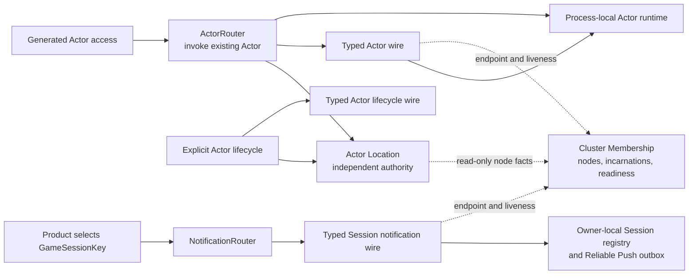

# Cluster Membership, Actor Location, And Notification Routing Redesign

This active plan replaces the rejected proposal to store node authority and
Actor routes in one replicated `ClusterKernel` state machine. It records the
constraints which are already accepted and keeps the selected Actor Location
direction plus its remaining implementation obligations explicit. It does not
describe the current implementation as if the redesign had already landed.
Until implementation and validation are complete, this plan is also the only
record of the incident, root cause, architectural correction, accepted
decisions, and migration work. Current authority documents continue to
describe the shipped implementation and will be updated only when the
replacement becomes true.

Lakona does not implement Virtual Actors and does not automatically persist
Actor state. Actor creation and destruction are explicit application-visible
lifecycle operations. A routed Actor call invokes an existing Actor; it never
creates, restores, or relocates one as a side effect.

## Origin: the three-node CI incident

This redesign is a correctness response to an observed failure, not an
aesthetic preference.

### What happened

On 2026-08-12 China Standard Time, GitHub Actions run
[`31520013969`](https://github.com/bruce48x/Lakona/actions/runs/31520013969)
tested commit `33d9449b4a926134fa67d0a897b3caf29438f9f9` with three parallel
generated-project jobs. The WebSocket + MemoryPack and TCP + JSON three-node
jobs passed. The KCP + MemoryPack three-node job
[`93874465263`](https://github.com/bruce48x/Lakona/actions/runs/31520013969/job/93874465263)
failed because World-A exited during host startup with:

```text
ActorDirectoryUnavailableException:
Activation replica send failed with status 'StaleRoute'.
```

The transport label is not evidence of a KCP defect. The failure happened in
the server's Actor activation control path before the generated-project
scenario became ready. The two passing matrix jobs are also not evidence that
the path was correct: the failure depends on whether Membership advances in a
small interval during startup, so scheduling differences can hide it.

The observed call chain was:

```text
StartupActorHostedService.StartAsync
  -> ActorHosting.EnsureAsync
  -> ActorHosting.RegisterLocalRouteAsync
  -> ReplicatedActorActivationDirectory.AcquireAsync
  -> ExecuteAtPrimaryAsync
  -> SendRequestAsync
  -> ClusterNodeSender.SendAsync
  -> StaleRoute
  -> ActorDirectoryUnavailableException
  -> host startup aborted
```

### Direct trigger

`ReplicatedActorActivationDirectory.ExecuteAtPrimaryAsync` read
`membership.Current`, selected an activation-directory replica, and retained
that snapshot's `MembershipViewId`. Its later `SendRequestAsync` supplied the
captured view to the exact cluster sender.

`ClusterNodeSender.SendAsync(NodeReference, MembershipViewId, ...)` then read
`membership.Current` again and required its view to equal the captured view.
If an unrelated Membership or descriptor change committed between those two
reads, the sender returned `StaleRoute` without attempting network delivery,
even when the exact target node incarnation was still Ready and unchanged.
The activation directory retried only the separate `Rejected` result, so
`StaleRoute` immediately became `ActorDirectoryUnavailableException`.

In plain language: Actor Location chose a still-valid node, Membership's global
version number changed before the message was sent, and the framework treated
the version change as proof that the node was invalid. It then allowed this
Actor metadata failure to stop the whole server during Startup Actor creation.

### Structural root cause

Changing the equality check or adding a retry would treat the symptom. Four
structural mistakes made the race possible and dangerous:

1. **A Membership view was misused as per-Actor and dispatch authority.** A
   `MembershipViewId` identifies one committed node snapshot. It is neither an
   Actor activation identity nor a lease on every node selected from that
   snapshot. Harmless global progress therefore invalidated an unrelated Actor
   operation.
2. **The Actor Location protocol depended on Membership's exact moment in
   time.** Replica selection, primary dispatch, quorum work, repair, and owner
   validation crossed the Module boundary using a captured global view. The
   modules were stored separately but were not behaviorally decoupled.
3. **Startup coupled node availability to ordinary Actor registration.** A
   transient activation-directory disagreement while registering a Startup
   Actor escaped through `ActorHosting` and aborted host startup. An Actor
   lifecycle concern therefore became a Cluster formation failure.
4. **Tests proved the pieces but not their composition.** A
   `ClusterNodeSender` unit test explicitly required a different Membership
   view to produce `StaleRoute`. Activation-directory tests used an in-process
   sender that forwarded requests without applying the production sender's
   view-equality validation unless a status was injected. Both local contracts
   passed while the real seam between them remained schedule-dependent.

The root cause is therefore not merely one stale read. Actor activation and
location inherited Membership's version, timing, and startup failure domain.
This is the coupling the redesign removes.

### Why this leads to an architectural replacement

The accepted constraints below remove the exact causal class seen in the
incident only if they survive implementation. In particular, recreating the
old exact-view equality check inside a nominally separate Actor Location
transport would reproduce the defect under a new name.

The incident is not closed merely because this plan records a better boundary.
The replacement Actor Location protocol, explicit lifecycle rules, Startup
contract, range recovery, and node-authority fencing are now selected. Their
quantitative limits still require benchmarks, and their replacement
Implementation remains to be built and validated.
The new design removes the original failure path by construction: an ordinary
Actor location mutation is one single-owner Directory operation, Startup
preparation uses that same typed lifecycle path, Directory requests use a view
only to find the current shard owner, and a stable shard owner can serve across
an unrelated newer view. There is no per-Activation replica send whose exact
global-view equality can return the observed `StaleRoute`.

That is a design proof, not yet an implementation result. Before closure, a
deterministic cross-Module test must advance Membership after Actor Location
selects an unchanged exact target but before dispatch. The operation must not
fail merely because the view advanced, while a replaced node incarnation must
still be rejected. The same test must cover Startup Actor preparation and prove
that harmless Membership progress cannot abort host readiness. Repeated three-
node matrix runs remain useful stress evidence, but they do not replace that
deterministic regression test.

The design intentionally does not promise that every three-node startup always
succeeds. It converts legitimate failures into explicit bounded outcomes:
quorum loss closes node authority, a changed Directory shard can be temporarily
unavailable, a Startup start hook or descriptor commit can fail, and transport
failure after mailbox admission remains indeterminate. None of these is the
original false `StaleRoute`, and none may be hidden by automatic replay.

The public failure mapping is closed here rather than left to migration-time
interpretation:

- an authoritative missing ordinary Actor remains the existing
  `ActorNotFoundException` / `ActorCallStatus.ActorNotFound`;
- Directory lock, owner recovery, authority loss, or lifecycle-control
  transport failure remains `ActorDirectoryUnavailableException` internally
  and is wrapped by the existing `ActorPlacementException` for public
  Place/Create/Ensure operations;
- an ordinary call rejected before mailbox admission uses the nearest existing
  typed Actor call failure (`ActorNotFound`, `NodeUnavailable`, `Timeout`, or
  `Backpressure`) and may take the one bounded safe refresh described below;
- a timeout or disconnect after mailbox admission is represented by the
  existing call failure/timeout surface but is internally marked not safe to
  replay. No new public “indeterminate” status is added by this redesign;
- Startup selector bugs remain `StartupActorSelectionException`; no compatible
  target, affinity capacity exhaustion, or temporary affinity authority loss
  remains `StartupActorUnavailableException`;
- caller cancellation remains `OperationCanceledException` and is never
  relabeled as Directory failure.

Tests must assert both the public type/status and the internal pre-admission or
possibly-executed retry classification. Raw Directory, wire, Membership, and
replica statuses never cross the public Actor Interface.

## Accepted non-negotiable constraints

1. **Cluster Membership and Actor Location are separate Modules and separate
   authorities.** They do not share a replicated log, state machine, snapshot,
   write transaction, Actor records, or lifecycle. Actor Location may label a
   deterministically derived directory-ring snapshot with the Membership
   version it consumed; it neither owns nor advances that version, and Actor
   records are not Membership entries.
2. **The dependency is one-way.** Actor Location consumes committed Membership
   facts about exact node incarnations and liveness. Membership has no Actor
   Location dependency and contains no ordinary Actor identifiers, locations,
   activations, affinity keys, or lifecycle commands. A node may attach opaque
   Actor-host and Startup-replica capability descriptors to its own readiness
   advertisement; Membership stores and transports them without interpreting
   Actor lifecycle or selection policy.
3. **Actor Location churn never changes Membership.** Actor create, destroy,
   claim, release, repair, or lookup operations must not append Membership log
   entries or advance a Membership view.
4. **Membership change does not recreate Actor state.** When an owner process
   is lost, its process-local Actor state is lost. The framework may invalidate
   its location, but must not silently create an empty replacement on another
   node.
5. **Actor calls do not materialize Actors.** An absent location fails as
   `ActorNotFound`; an authoritative range which is still changing fails as
   `ActorLocationUnavailable`. Neither outcome creates an Actor.
6. **Notification routing is a Session concern.** It does not use Actor
   Location and does not use the generic Cluster route directory.
7. **Shared physical transport does not imply shared protocol ownership.**
   Membership, Actor Location, Actor invocation, and Session notification may
   multiplex one node channel while retaining separate typed protocols and
   failure meanings.
8. **Startup Actor functionality and public Interfaces are frozen.** The
   redesign must preserve registration, generated `.Startup(key)` calls,
   selector inputs, sticky key affinity, replica preparation, compatibility
   filtering, and safe failover behavior. Only the internal coordination and
   storage mechanisms may change.

`Actor Location depends on Membership` is not a contradiction of decoupling.
Decoupling means that Membership publishes only node facts through its small
Interface and remains ignorant of every consumer. Actor Location may observe
those facts just as messaging and placement do, and may deterministically
derive its directory range owners from a committed Membership view. It may not
extend Membership into an Actor database or use global view equality as an
Actor activation or invocation fence.

## Module and dependency shape

Arrows below show dependency direction. No arrow points from Membership to an
Actor or Session Interface.



### Knowledge budget

| Module | Owns | Must not know |
| --- | --- | --- |
| Cluster Membership | Exact `NodeReference`, readiness/liveness, advertised node endpoints and node-owned capability descriptors, ordered Membership views | Ordinary Actor IDs, Actor Location records, Startup key affinity, Session IDs, notification queues |
| Actor Location | Which exact Actor activation is hosted by which exact node; lookup and stale-location rejection | Membership consensus roles, Membership log commands, Session ownership, notification delivery |
| Actor lifecycle | Explicit create/destroy orchestration and its result | Membership replication internals, notification routing |
| ActorRouter | Locate an existing activation, select local/remote invocation, bounded stale refresh, execution ambiguity | Actor creation policy, Actor state reconstruction, Session routing |
| Actor runtime | Local mailboxes, Actor instances, ordering, backpressure, stop/drain | Cluster Membership and distributed location algorithms |
| Startup Actor | Prepared node-local replicas, compatible candidate selection, sticky business-key affinity, safe reselection | Ordinary Actor Location records, Membership consensus roles, Session routing |
| NotificationRouter | Bounded admission, per-Game-Session FIFO, exact-gateway batching, reliable/best-effort owner delivery | Actor Location and Actor lifecycle |
| Typed node transport | Connections and framed delivery to an exact node incarnation | Actor placement policy, Session business ownership, distributed authority |

The generated access root depends on one internal facade, `ActorClient`, not
directly on Membership, a Directory cache, placement, Host RPC, Startup
affinity, and a service provider. `ActorClient` owns the existing Local, Route,
Place/Create/Ensure, and Startup behaviors and delegates internally to
ActorRouter and the typed lifecycle/Startup seams. It is one generated-code
dependency without pretending that invocation and lifecycle are one protocol.
The only lifecycle-facing Actor Location seam has three semantic operations:

```csharp
internal interface IActorLocation
{
    ValueTask<ActorLocation?> LookupAsync(ActorId id, DateTimeOffset deadline, CancellationToken cancellationToken);
    ValueTask<ActorLocation> RegisterAsync(ActorLocation candidate, DateTimeOffset deadline, CancellationToken cancellationToken);
    ValueTask UnregisterAsync(ActorLocation exact, DateTimeOffset deadline, CancellationToken cancellationToken);
}
```

Concrete result records may distinguish conflict, redirect, and temporary
unavailability internally, but range ids, replicas, Membership roles, handoff
generations, and recovery watermarks never cross this seam. `RegisterAsync`
returns the one exact current winner; retrying the same complete candidate is
idempotent. `UnregisterAsync` removes only the complete exact value. Startup
affinity and notifications each keep their own typed internal seam rather than
turning `IActorLocation` into a generic route database. Successful unregister
means the supplied exact activation is proven no longer current—removed,
already absent, or superseded—so callers do not need an implementation-shaped
status enum; temporary lack of authority remains typed unavailability.

`ActorRouter` and the lifecycle wire are different deep seams behind
`ActorClient`. ActorRouter
invokes one already located exact activation. The lifecycle wire asks one exact
capable host to construct or retire a candidate; it carries typed lifecycle
requests and never a generic route key or arbitrary message kind. Shared node
transport remains an Adapter below both.

## Cluster Membership

Membership answers only:

- which exact node incarnations belong to this cluster;
- which are eligible for cluster-control and Directory responsibility;
- which endpoint reaches an exact node incarnation;
- what ordered Membership view is currently committed.

Committed `Ready` is deliberately not the same fact as external load-balancer
readiness or local Actor business admission. A joining node becomes a core
Directory participant before advertising Actor hosts, and a shutting-down node
closes business admission before it leaves Membership. Treating all three facts
as one state is what would force more replicated lifecycle values. Membership
publishes node authority; each consuming Module applies its own capability and
local-admission conditions.

Membership can expose snapshots or change notifications through
`IClusterMembership`. Actor Location is one consumer among messaging,
placement, readiness, and diagnostics. Membership must remain independently
testable without constructing an Actor runtime, Actor directory, placement
service, Session registry, or notification pipeline.

Membership may carry a node-owned capability descriptor as part of the exact
node's Ready advertisement. This includes Actor host capability and Startup
replica compatibility metadata needed by the current product Interface. It is
not Actor Location authority: Membership does not choose a Startup candidate,
store a business key, or process an Actor lifecycle command. Directory range
ownership depends only on the eligible exact-node set; a descriptor-only view
change neither moves a range nor invalidates an operation for a still-current
range owner.

The descriptor is an immutable, size-bounded value for one committed view.
Membership accepts only framework-known descriptor schema versions, maximum
counts, string/metadata byte limits, and unique Actor wire names; incompatible
Directory layout or node protocol versions fail before `Ready`. Actor Location
and placement interpret a copied snapshot outside the Membership state-machine
lock. This preserves the opaque dependency direction without allowing
application cardinality or mutable Actor state to leak into the consensus log.

Membership protocol v1 also fixes `MaximumClusterMembersV1 = 1,024`, matching
the existing snapshot codec's safety ceiling. The limit counts every committed
exact member in `Joining`, `Recovering`, or `Ready`; it is independent of the
coincidentally equal Directory shard count. A Join which would exceed it is
rejected before appending a member or allocating recovery state and cannot
become Ready. This bounds the member table, voting work, descriptor aggregate,
transport peers, and each 1,024-shard owner-array derivation. Raising it is a
protocol/layout change requiring a new cluster incarnation, not a dynamic
configuration disagreement between members.

The following are forbidden Membership state and commands:

- ordinary `ActorId`, `ActorActivationId`, or Actor Location assignment;
- Startup business keys or sticky-affinity records;
- Actor location entries, tombstones, leases, or route epochs;
- Actor create, destroy, place, move, repair, or release commands;
- Session routes, Player routes, reliable-push ownership, or outbox metadata.

The replicated member lifecycle remains small: `Joining`, `Recovering`, and
`Ready`, with removal represented by absence. These states describe only the
node protocol. Failure suspicion is a local failure-detector observation, not
a committed eligibility state; fencing and shutdown are local admission
effects, not replicated member values. In particular the redesign adds no
`Draining`, `DirectoryReady`, or Actor-derived Membership state.

### Membership-change behavior matrix

The following table is the complete cross-Module contract. “Unavailable” means
that an operation waits within its existing deadline or returns the typed
temporary-unavailability result; it never guesses `Absent`.

| Event | Membership result | Actor Create/Ensure | Actor Lookup/call | Actor Destroy |
| --- | --- | --- | --- | --- |
| Descriptor-only change | A newer ordered view; exact Ready set unchanged | Unaffected except that future placement sees the new capability set | Cached exact activation stays valid; no exact-view rejection | Unaffected |
| New node becomes Ready | New exact member enters the derived Directory ring | Only Actors whose Directory shard is locked are temporarily unavailable; new placements may use the node only after its full host descriptor is published | Existing physical Actors never move; only location metadata for changed shards transfers or recovers | Unchanged shards proceed; changed shards wait for authority |
| Node is unreachable but not removed | No committed topology change | A location on that node remains reserved; no replacement Create | Calls to it are unavailable or indeterminate according to admission point; another node is not guessed | Exact Destroy waits or fails unavailable; it cannot declare the Actor absent |
| Exact node is committed out | The exact incarnation is absent after authority fencing | After affected range recovery, lost Actors are `Absent` and may be explicitly created; none are created automatically | Cache entries and records pointing to it are invalid; surviving exact activations remain | A lost activation is already absent; delayed exact cleanup cannot touch a replacement |
| Same `NodeId` starts a new process | A new incarnation joins only after the old exact member is fenced/removed | It is an ordinary new host candidate | Old locations never become valid for the new process | Old exact operations cannot affect new activations |
| Local graceful shutdown | No intermediate replicated state; one bounded exact removal is attempted at the end | New work is rejected locally; existing locations stay reserved until removal | Admitted work drains; new work is rejected before execution | Framework shutdown owns local cleanup; callers do not race it into a second lifecycle |
| All nodes stop close together | Removal attempts may fail as quorum disappears; every process still exits | No surviving cluster performs Create | The in-memory cluster lifetime ends | A later formation has a new cluster incarnation and empty Directory |

## Actor identity, activation, and location

Lakona needs three distinct meanings:

- **`ActorId`** identifies the application Actor requested by business code.
  Its canonical string is `<stable actor name>/<canonical key>`; Actor type is
  therefore part of logical identity rather than separate lookup metadata.
- **Activation identity** distinguishes one concrete creation of that Actor
  from an older destroyed or failed incarnation.
- **`NodeReference`** identifies the exact process hosting that activation.

The authoritative Actor Location value is one exact current activation:
`ActorId -> exact NodeReference + ActorActivationId`, with the compatible Actor
type/generation information required for invocation validation. The Directory
stores either that `Present` value or no value; provisional, retiring, and dead
local lifecycle states are Actor Runtime state, not additional authoritative
location values. Stale messages must not be accepted after destroy/recreate of
the same `ActorId`, node restart, or a later successful activation claim. A
Membership view number is not an Actor identity and must not be used as a
substitute for activation fencing.

All generated `Route`, `Local`, `Place`, `Create`, and `Ensure` paths call one
internal Actor-identity Module. No generated selector or placement path calls
arbitrary `key.ToString()` directly. The Module combines the Actor's stable
wire name (`[ActorName]` or the generated default) with a canonical key using
one unambiguous encoding, and renders the readable slash-separated ActorId.

The default key contract stays deliberately closed rather than adding an
application formatter seam:

- `string`, integral types, `bool`, `char`, `Guid`, and enums use invariant,
  round-trippable forms;
- a simple strongly typed wrapper such as `readonly record struct UserId(string
  Value)` uses one supported scalar `Value` property;
- culture-sensitive formatting, nested object graphs, arbitrary JSON, and an
  unconstrained fallback to `ToString()` are rejected by the generator;
- actor wire names are non-empty, globally unique within the generated Actor
  set, and cannot contain `/`; key text uses deterministic escaping so two
  distinct `(actor name, key)` pairs cannot render the same ActorId.

Custom key formatting is rejected for now. It would create a public protocol
extension point whose determinism, versioning, Hotfix lifetime, and cross-node
deployment rules every application would have to learn. Add one only if a real
key type cannot be represented by the closed scalar/wrapper model.

Actor Location may react when Membership commits an owner node out:

1. resolve/claim operations stop returning that exact owner as executable;
2. cached locations referring to it become invalid;
3. range recovery retains registrations only for exact activations which still
   exist on surviving nodes; an entry on the removed process becomes absent;
4. no replacement Actor is created automatically.

This is a one-way reaction to a node fact. It is not a joint node-and-Actor
transaction.

### Accepted dead-host location cleanup

Directory shard ownership and Actor hosting are independent. A node can host
Actors whose location records are spread across shards owned by many other
nodes, so transferring only the removed node's Directory shards cannot remove
all records which point to that node.

Actor Location therefore treats an exact host `NodeReference` which Membership
has committed out after the accepted fencing/drain contract as semantically
invalid everywhere:

- Lookup, Create, Ensure, Destroy, cache refresh, snapshot application, and
  recovery validate a stored exact host against the consumed committed
  Membership snapshot. They never return or preserve an invalid host;
- a transport failure, timeout, or merely suspected node is not evidence of
  absence. Until Membership completes the accepted fencing/removal contract,
  the old location remains authoritative and Create/Ensure cannot replace it;
- after committed removal, a stale record is semantically `Absent` even before
  physical cleanup reaches it. Create may conditionally replace that exact
  stale `NodeReference + ActorActivationId` with a new provisional winner;
- physical cleanup is always conditional on the complete stale record. A
  delayed cleanup pass or Destroy for the old activation cannot remove a
  concurrently created replacement;
- identical stable `NodeId` with a new process incarnation is a different
  exact host and never revalidates the old record.

There is no distributed reverse index from `NodeReference` to Actor ids. Each
Directory process owns one bounded cleanup worker which scans only the records
in its locally owned stable shards against the latest committed Membership
snapshot. It processes fixed item/time batches through the shard's serialized
mutation path, so lifecycle operations may interleave safely. It retains a
single latest cleanup target version rather than one task or removed-node set
per Membership update; if Membership advances during a scan, it performs one
more pass to the newest target. Once every locally owned stable shard has been
scanned at that target, no cleanup history or tombstone is retained.

Changed or recovering shards need no competing cleanup pass: their snapshot
application and registry recovery already filter invalid exact hosts before
publishing the replacement dictionary. Because every operation performs the
same semantic validation, cleanup batching affects memory reclamation and scan
cost only, never routing correctness.

## Explicit Actor lifecycle

The previous plan accidentally introduced Virtual Actor semantics by making
the first routed call assign an owner and lazily create a mailbox. That is
rejected.

The target behavior is:

- explicit create/place operations are the only normal path that may produce
  an Actor activation and publish its location;
- explicit destroy retires that exact activation and removes or supersedes its
  location according to the approved Actor Location protocol;
- `Route<TActor>(id).CallAsync(...)` resolves and invokes an existing
  activation;
- Actor Location exposes only `Present(exact activation)` or `Absent`; it does
  not retain whether an absent Actor was never created, explicitly destroyed,
  or lost with a removed process;
- a routed call to an absent Actor returns `ActorNotFound` and never creates
  one;
- after owner loss and directory recovery, an activation which did not survive
  is absent. Before the affected range has authoritative ownership, operations
  return `ActorLocationUnavailable` rather than guessing `ActorNotFound`;
- live migration remains unsupported until Lakona has an explicit Actor state
  transfer contract, mailbox barrier, and external-side-effect fencing model.

The public lifecycle Interface retains `Place`, `Create`, and `Ensure` with its
current product meaning:

- `Place(id).CreateAsync()` requires authoritative `Absent` and fails when an
  exact activation already exists or a concurrent Create wins;
- `Place(id).EnsureAsync()` returns the existing compatible activation or
  explicitly creates one after authoritative `Absent`;
- `ActorLocationUnavailable` is never treated as `Absent` by either operation;
- `Route(id)` and ordinary Actor calls never invoke Ensure implicitly.

Removing Ensure would force every caller to duplicate Lookup/Create/conflict
handling and would make the Module shallower. These names, functions, and the
generated public Interface are therefore frozen; only their Implementation is
replaced.

### Absence has no lifecycle history

Actor Location is a present-location index, not an Actor lifecycle database.
Its authoritative state for one `ActorId` is exactly one of:

```text
Present(NodeReference, ActorActivationId)
Absent
```

`Absent` deliberately does not say whether the Actor never existed, completed
Destroy, or disappeared when its owner process was committed out. Those facts
are indistinguishable to routing and creation. If a product needs historical
existence, deletion auditing, or state recovery, that is business data and
must live in application-owned persistence rather than Actor Location.

Consequences:

- authoritative Lookup of `Absent` returns `ActorNotFound`;
- explicit Create may conditionally publish a new unique activation;
- Destroy is idempotent when the exact activation is already absent, matching
  the current hosting contract;
- completed Destroy and completed dead-owner cleanup retain no Actor
  tombstone;
- delayed calls and delayed Destroy operations are fenced by exact
  `NodeReference + ActorActivationId`, not by retained lifecycle history;
- while a range is locked, recovering, or has no authoritative owner, its
  answer is `ActorLocationUnavailable`, not `Absent`.

Strong single-owner range transfer prevents an old directory replica from
resurrecting a removed record. This is why the old majority protocol's
versioned tombstones are unnecessary in the replacement.

This two-state authoritative model does not erase short-lived implementation
states. A creating Actor may be `Provisional` with admission closed; a
destroying Actor may be `Retiring` with new admission closed; an affected range
may be locked or recovering. These states belong to the lifecycle/runtime or
directory transition Implementation and are not durable answers returned by
Actor Location. A lifecycle cell separately remembers whether its exact
registration and exact unregister completed. Recovery exports every
registration which is still authoritative, including admission-closed
`RegisteredStarting` and `Retiring` cells whose unregister has not completed.
It excludes `Provisional`, confirmed-unregistered, stopped-unreserved, and
invalid cells. Thus recovery preserves a retiring reservation without claiming
that the Actor can execute. The recovery-version fence makes that selection
atomic with concurrent Create and Destroy.

### Accepted Create contract

Concurrent Create calls may construct more than one provisional local object,
but that is not more than one executable Actor. Every candidate has a unique
`ActorActivationId`, keeps business mailbox admission closed, and competes in
one conditional registration at the authoritative range owner. Exactly one
candidate can win; losers are local objects with no business execution and are
destroyed.

The accepted order is:

```text
construct a Provisional Actor with mailbox admission closed
  -> conditionally register its exact NodeReference + ActorActivationId
  -> discard a losing candidate
  -> run the winner's start hook
  -> open the winner's mailbox admission
```

The conditional registration is the Create ownership linearization point, but
Create is not reported successful until the winner's start hook completes and
admission opens. Therefore:

- construction, DI, or cancellation failure before registration leaves the
  directory `Absent` and requires only local candidate cleanup;
- a lost registration reply is resolved by retrying or looking up the same
  `ActorActivationId`; it does not require a separate `OperationId`;
- if the exact candidate owns the registration, creation continues; if another
  activation owns it, the candidate loses; if the record is absent, the same
  candidate may retry while its admission remains closed;
- the start hook runs only for the registered winner, so losing candidates
  cannot perform application startup side effects;
- start-hook failure marks the registered cell `Retiring`, keeps admission
  closed, conditionally unregisters the exact winner, and destroys the local
  object;
- a lost cleanup reply is resolved against the authoritative range owner until
  the failed exact activation is absent or superseded. An unexecutable location
  must not be left published.

Placement chooses one currently advertised compatible Actor host, creates the
`ActorActivationId` at the lifecycle coordinator, and sends a typed create
request containing that complete candidate identity. The host must use that id
for its Provisional cell and conditional Directory registration. Retrying the
same request after a lost reply can only return the same winner or a conflict;
it cannot construct a second identity. `Create` reports conflict, whereas
`Ensure` reads and returns the current compatible exact winner. The selector is
not rerun after an indeterminate request until the same candidate is resolved.
This removes the old `ActorHostClient` generic message protocol without moving
construction into ActorRouter or into the Directory owner.

### Accepted Destroy contract

Destroy is an exact-activation operation. A public lifecycle request may begin
with an `ActorId`, but the framework must resolve and retain the exact
`NodeReference + ActorActivationId` which that operation is retiring. Every
later local and directory mutation is conditional on that identity; a delayed
Destroy can never affect a replacement activation.

The accepted order is:

```text
mark the exact local activation Retiring and close new mailbox admission
  -> drain calls which were admitted before Retiring
  -> run the stop hook
  -> conditionally invalidate that exact cached location
  -> conditionally remove that exact directory registration
  -> conditionally invalidate the same exact cached location again
  -> destroy the local Actor object
```

The successful exact directory removal is the Destroy visibility linearization
point and occurs only after old admitted business work and the stop hook have
completed. Concurrent lifecycle operations on one `ActorId` are serialized by
the host's lifecycle cell from the initial `Retiring` transition through exact
unregister; therefore another Destroy joins that operation instead of observing
the still-present registration and running a second stop hook.
The second conditional cache invalidation is required because a Lookup may race
the first invalidation and repopulate the retiring exact value before unregister
linearizes. Neither invalidation removes a concurrent replacement because both
compare the complete exact activation.
From that point the Actor is authoritatively `Absent`, and a concurrent explicit
Create may publish a new activation. This ordering preserves the strong
single-executable-activation property across destroy/recreate: the Directory
never says `Absent` while a turn or stop hook from the old activation can still
execute application code. Therefore:

- no new business call may enter the retiring activation after its admission
  gate closes;
- Destroy of an already absent exact activation is idempotent success;
- concurrent Destroy calls for the same exact activation share one retirement
  outcome; the stop hook and unregister execute at most once;
- an exact unregister for an older activation must not remove or stop a newer
  activation;
- a drain timeout or stop-hook exception happens before the linearization
  point. The old exact location stays reserved and admission stays closed;
  framework cleanup retries only within its bounded lifecycle path and then
  fails the host stopped rather than reopening an uncertain Actor;
- once directory removal succeeds, local disposal failure must not restore the
  old directory record or cache. The old activation remains closed and local
  cleanup has one framework-owned retry/termination path;
- if directory removal is definitely rejected because another exact activation
  is current, the retiring old object stays closed and is disposed; it is
  never reopened as the authoritative Actor;
- if the removal reply is lost, the operation must keep the activation closed
  and resolve the exact registration at the authoritative range owner. It may
  finish disposal only after proving that it is absent or superseded. It does
  not rerun the stop hook and does not reopen after that hook has completed.

This intentionally replaces the current behavior which can restore a removed
route after a stop hook or local deactivation failure. Removing before drain
would let a replacement start while old admitted work still executes; restoring
after removal would race that valid replacement. The accepted order permits
neither overlap.

A remote Destroy is likewise one typed request to the exact current host. The
host serializes it through the same lifecycle cell and returns the exact
unregister outcome. Lost replies are resolved by Actor Location using the
complete activation identity; another node never tries to stop a process-local
object, and the Directory owner never calls application hooks.

### Frozen Startup Actor contract

Startup Actor is a product feature, not a migration convenience. Its existing
public Interface and user experience remain unchanged:

```csharp
actors.RegisterStartup<MatchmakingActor, MatchmakingQueueId>();

await actors.Startup<MatchmakingActor>(queueId)
    .CallAsync(static behavior => behavior.MatchAsync, request, cancellationToken);
```

The following are compatibility requirements, including behavior which is not
spelled out by a method signature:

- keep both `RegisterStartup<TActor,TKey>()` and its custom-selector overload;
- keep generated `ActorAccess.Startup<TActor>(key)` and its typed
  `CallAsync`/`PostAsync` surface;
- every capable node prepares one physical replica and advertises it only after
  its start hook succeeds;
- selector candidates remain Ready, policy-compatible, build-compatible exact
  nodes, sorted deterministically and carrying the same product metadata;
- the business key supplies affinity and is not an Actor id;
- the first selection for a key is sticky; adding another node must not move an
  existing valid affinity or reinvoke the selector;
- a withdrawn, incompatible, or failed exact replica permits reselection only
  when the previous attempt is definitely known not to have executed;
- an indeterminate call is never replayed at another replica;
- replica state remains process-local and is not transferred on failover;
- existing `StartupActorSelectionException` and
  `StartupActorUnavailableException` behavior remains public truth.

The replacement Implementation separates ordinary physical-Actor lifecycle
from business-key affinity:

1. A Startup replica is an ordinary explicit distributed Actor whose stable
   `ActorId` is produced by the same canonical Actor-identity Module from a
   reserved Startup-replica key domain and the unique `NodeId`. Its readable
   rendering preserves the current form such as
   `matchmaking/@startup/node-a`; no caller or Startup implementation builds
   that string by concatenation. Since `NodeId` is unique within the cluster,
   one Startup Actor type has at most one logical replica Actor per node.
2. The ordinary Create contract gives each concrete replica incarnation an
   exact `NodeReference + ActorActivationId`. Reusing the same `NodeId` after a
   process restart reuses the logical Startup `ActorId` but cannot make the old
   process or activation valid again.
3. Startup Actor preparation runs after the node has committed Ready and the
   Directory can authorize ordinary Actor registration. A short interval in
   which the node is Ready but has not yet advertised a Startup descriptor is
   safe: callers do not see it as a candidate.
4. After ordinary Actor Create and the replica start hook succeed and mailbox
   admission opens, the node publishes a Startup capability descriptor
   containing enough exact replica generation, policy, build, and metadata
   information for fenced invocation. Normal Hotfix replacement withdraws that
   descriptor before closing admission. Uniform process shutdown is the one
   exception: it closes admission immediately and returns a definite pre-
   execution rejection until exact Membership removal, so it never waits for a
   descriptor commit merely to stop safely.
5. Ready-node capability advertisement may continue to travel with the
   Membership node descriptor. It is opaque node-owned data to Membership, not
   an Actor Location record. Descriptor publication can advance the Membership
   view, but exact-view equality is never an invocation requirement.
6. A typed Startup affinity table maps an internal hash of `(Actor type,
   selector policy, build compatibility, business key)` to one exact advertised
   replica. It is not an Actor and does not manufacture a synthetic affinity
   `ActorId` or Activation. The physical target stored by affinity is an
   ordinary Startup Actor location.
7. The affinity table uses the same strong single-owner range-transition
   principles as Actor Location: one owner performs the conditional bind on
   the stable path, and only affected ranges coordinate during Membership
   change. Reuse may remain internal Implementation; it must not widen the
   public Actor Location Interface into a generic route database.
8. If the bound exact replica remains Ready and compatible, Lookup returns it
   unchanged. If it is authoritatively withdrawn, the calling ActorClient
   invokes the configured selector over the candidates from its current
   Hotfix declaration and proposes that exact result. The affinity owner never
   loads or executes product code: it validates the proposal against the
   committed compatible candidate set and conditionally binds one winner.
9. Physical replica invocation may use the ordinary Actor Location cache and
   typed Actor invocation path, validating exact `NodeReference +
   ActorActivationId` before mailbox admission. Sticky affinity selects the
   logical replica Actor; it does not replace ordinary Actor fencing.

#### Accepted Startup affinity recovery contract

Startup affinity is the one typed mapping which cannot be recovered from the
ordinary Actor registry: that registry knows the physical Startup replica, but
not which business keys selected it. Therefore merely placing the affinity
table on a one-owner DHT and copying it during graceful handoff would silently
lose stickiness when the affinity owner crashes. The replacement closes that
gap without putting business keys in Membership or synchronously replicating
every ordinary Actor location.

The internal identity is a full 32-byte SHA-256 digest over length-prefixed
canonical fields:

```text
affinity id v1 = SHA-256(
  domain "lakona.startup-affinity.v1",
  stable Actor wire name,
  policy hash,
  normalized build-compatibility tag,
  canonical business-key bytes)
```

It uses the same closed canonical key codec as Actor identity, not JSON or
`ToString()`. The first ten digest bits select one of the same fixed 1,024
logical shards, but the shard contains a typed `StartupAffinityRecord`, never
an ordinary `ActorId`. One affinity id has exactly one owner-side row in one of
three states:

- `Bound(generation, exact Startup replica)` contains `NodeReference + physical
  ActorId + ActorActivationId + descriptor generation`;
- `Unbound(generationFloor)` contains no target but preserves the greatest
  generation observed for this still-live affinity identity;
- `Pending(generation, exact proposed replica)` records one retained-or-being-
  retained proposal whose result must be resolved before another target can be
  proposed.

The generation orders safe reselection; it is not a Membership epoch, Actor
activation version, or general operation id. `Unbound` is internal protocol
state, not an Actor location or evidence that a business Actor exists.

Each physical Startup replica owns a small process-local binding catalog for
the affinity records which selected it. The catalog is keyed by affinity id
and retains only that replica's highest observed generation, never an append-
only history. A first bind or safe replacement follows one order:

```text
the calling ActorClient acquires its Hotfix lease and builds the current
    deterministic compatible candidate list
  -> invoke the configured selector locally and propose one exact candidate
  -> the current affinity-shard owner atomically reserves an absent key as
     Unbound(0) under the shard capacity gate, or reads its existing row
  -> validate the proposal against the latest committed compatible candidates
  -> choose N = generationFloor + 1 and record Pending(N, target)
  -> make that exact replica idempotently retain generation N in its catalog
  -> conditionally replace Pending(N, target) with Bound(N, target), or return
     the already valid concurrent Bound winner
  -> only then return the selected target
```

Only insertion of a previously absent affinity takes the short shard capacity
gate. It installs and counts `Unbound(0)` before any remote catalog retain;
therefore concurrent distinct keys cannot create more recoverable catalog rows
than the shard limit. If the owner fails before retain, recovery has no remote
side effect to discover. If it fails after retain, the catalog reconstructs
`Bound(N, target)`. A definite pre-execution retain rejection converts Pending
to `Unbound(N)`, never `N - 1`: allocating a generation consumes it even when
the retain did not complete. A lost response does not clear Pending or select
a different replica. The next operation idempotently helps retain the same
generation at the same exact target and resolves it as Bound, `Unbound(N)`, or
unavailable until that exact node is authoritatively removed. Pending owns no
background retry task; callers help resolve it within their deadlines.
Existing-key Lookup and replacement do not acquire another slot.

The proposal carries only framework data: affinity id, policy/build identity,
the deterministic candidate identities used by the caller, and the selected
exact replica. The owner recomputes eligibility from committed Membership and
the Startup descriptors; it does not trust the caller's list as authority. A
proposal invalidated by a concurrent descriptor or Membership change is a
definite pre-bind rejection, so the caller may refresh candidates and run the
selector again within the original deadline. Selector exceptions remain
caller-side `StartupActorSelectionException`s. This placement is essential
during rolling Hotfix updates: a Directory owner is not required to load the
caller's build or its custom selector delegate.

If the owner fails after the target retained the binding but before publishing
or replying, recovery may retain that harmless choice; no earlier call was
reported against another generation. If the target fails first, its exact
incarnation is filtered and the unpublished choice disappears. Reply loss is
resolved by reading the same affinity id. Concurrent first binds serialize at
one owner and return one generation.

Graceful affinity-shard movement uses the same sealed snapshot engine as Actor
Location. Ungraceful or skipped movement locks the shard and scans the binding
catalog of every surviving exact Startup replica, just as ordinary range
recovery scans Actor registries. Before either handoff or recovery consumes a
catalog, the new owner sends a typed fence-and-scan request for that shard to
every surviving exact Startup replica. Each replica owns a fixed 1,024-entry
catalog-admission gate. Under that gate it advances the shard's accepted range-
authority stamp, waits for all retains admitted under an earlier stamp to
finish, and only then returns its catalog page. A retain delayed in the network
past the barrier is rejected because its stamp is older.

The range-authority stamp is `(shard id, exact owner, acquisition view)`. When
the Directory coordinator actually acquires and stabilizes a shard, it fixes
the then-current target `MembershipViewId` as that ownership run's acquisition
view. It retains the stamp in the shard state and carries it in Directory
requests, sealed snapshots, and catalog fence/retain messages. Descriptor-only
views and unrelated shard changes do not alter it. Moving away and back must
complete another acquisition and therefore fixes a later view even when the
exact owner happens to compare equal again.

A replica gate starts empty. It accepts or advances a stamp only after checking
that its exact owner is the shard owner in the replica's current committed
Membership snapshot and that the acquisition view is not from the future; a
newer acquisition view for that same current exact owner supersedes an older
one. Snapshot catch-up does not reconstruct an epoch from missing Membership
history: a current Directory owner restores the stamp carried by its sealed
Directory snapshot, while a newly acquired owner fixes the current target view.
This stamp belongs to Directory transition Implementation, not Membership or
a public location record. Every retain validates it before catalog mutation.

After that barrier, recovery preserves evidence rather than collapsing three
states into one:

- a sealed `Bound(N, target)` proves retain completed before publication and
  remains Bound only while that exact target descriptor is valid;
- a sealed `Pending(N, target)` remains Pending. The new owner helps the same
  target idempotently and may publish Bound only after the target catalog
  confirms retain. If the valid live target has no catalog row after the
  barrier, the new owner resends the same retain under its current authority
  stamp; success becomes Bound and a definite rejection becomes `Unbound(N)`.
  An authoritatively removed target also becomes `Unbound(N)`;
- a sealed `Unbound(floor)` remains Unbound;
- a catalog-only highest generation proves retain completed and becomes Bound
  when that exact target is valid, otherwise `Unbound(maxGeneration)`.

For each affinity id, different targets at the same highest generation are an
invariant violation: the shard fails closed and revokes those bindings before
retrying recovery; it does not choose by node order. A transferred or recovered
row remains counted against the shard limit and is not discarded merely
because its state is Unbound. The next caller proposes exactly one generation
above the preserved floor. If neither a sealed owner row nor any surviving
catalog lineage exists, there is no recoverable row: its slot is released and
a later bind may start at generation one. That reset is safe because recovery
advanced the catalog barrier and waited for every surviving exact process, so
no old-authority retain can later create or reveal an older choice. The
coordinator never invokes a custom selector and never resurrects a lower
generation from surviving evidence merely because an older target becomes
compatible again.
After publishing or recovering a winner, the owner sends idempotent pruning of
lower generations to every surviving compatible replica. Pruning is not needed
for correctness, but the one-row-per-affinity catalog shape means a delayed or
failed prune cannot accumulate generations. A replica which later receives an
older retain request rejects it by generation.

An existing valid binding is returned without running the selector, including
after a node is added. Reselection increments the affinity generation only
after the old exact descriptor generation is authoritatively removed or is
incompatible, and only when the triggering invocation is definitely known not
to have executed. A descriptor generation is never reused within an exact
process. Ordinary mailbox backpressure, `NodeShuttingDown` while the descriptor
is still published, or a transient connection failure does not break
stickiness; the call remains unavailable until descriptor withdrawal or exact
node removal. An indeterminate invocation never causes replacement or replay.
Physical replica state is still neither copied nor reconstructed.

Build compatibility belongs to the affinity identity, not merely its current
value. During a rolling Hotfix update, callers compiled against build A and B
therefore do not overwrite one shared mapping with incompatible targets. When
Membership advertises no compatible target for one exact `(actor, policy,
build)` group, its rows remain `Unbound` rather than being guessed obsolete.
Lakona has no public or authoritative fact proving that a business key will
never be used again, so it does not invent automatic retirement.

Startup affinity has no TTL, LRU eviction, distributed reservation protocol,
or special scaling mechanism. It does have one non-negotiable local safety
bound because record count follows distinct business keys, not the small number
of Startup Actor types. Directory layout v1 fixes one positive
`MaximumStartupAffinitiesPerShardV1` constant. A shard at that limit rejects a
new distinct key with `StartupActorUnavailableException`; Lookup, replacement,
`Bound`/`Pending`/`Unbound` conversion, transfer, and recovery of an existing
row do not consume another slot and must still proceed. An authoritative row
lives until the cluster incarnation ends while its owner snapshot or a replica-
catalog lineage survives. Ungraceful loss of an owner-only Unbound/Pending row
with no surviving catalog safely releases the slot under the recovery rule
above; this is loss of unfinished framework metadata, not eviction of a
published sticky binding. Replica catalogs have the corresponding fixed
cluster-wide ceiling of
`1,024 * MaximumStartupAffinitiesPerShardV1` rows per process, do not
preallocate it, and reject a retain before owner publication if local resource
admission cannot accept the row.

The migration benchmark chooses the v1 number before the layout is frozen.
Afterward it is not deployment configuration: changing it requires a new
Directory layout version and a new cluster incarnation, just like changing the
1,024-shard count. Thus every owner, handoff, and recovery applies the same
bound without putting a capacity setting in Membership or inventing a capacity
consensus protocol. The bound may be large for the accepted small workload, but
it may never become silent sticky-record eviction. Filling it is an explicit
capacity failure and requires a new cluster incarnation or a future separately
designed public lifecycle contract; this redesign does not smuggle key
destruction into cache cleanup.

This preserves the comfortable public experience while removing the two
structural causes behind the CI failure: Startup preparation uses the new
single-owner Directory instead of the old per-Activation replica protocol, and
harmless Membership view progress no longer invalidates an exact healthy
replica registration or call.

## Actor invocation

The desired business call path remains one deep Module:

```text
generated Actor selector
  -> ActorClient facade
  -> ActorRouter
     -> Actor Location lookup/cache
     -> local Actor runtime or typed Actor wire
     -> existing exact activation
```

`ActorRouter` hides caching, local/remote selection, typed serialization,
deadline propagation, response validation, stale-location refresh, and the
pre-execution versus possibly-executed distinction. It does not hide Actor
creation.

The execution result has only the irreducible meanings needed by callers:

- authoritative `Absent` becomes the existing `ActorNotFound` behavior;
- no current shard authority, a reserved but admission-closed activation, or a
  definitely pre-execution target failure becomes typed temporary
  unavailability. ActorRouter may discard its cache and refresh once only when
  that rejection proves the mailbox did not admit the request;
- mailbox full/backpressure is a definite non-execution result but does not
  imply stale location or permit Startup reselection;
- timeout, disconnect, or reply loss after mailbox admission is indeterminate
  and is never automatically replayed, even if a later lookup returns another
  activation;
- Call reply identity and Tell/Post acceptance are validated against the exact
  requested activation. Returning `Accepted` means the mailbox owns the queued
  item and its process admission token until execution or definite discard.

Local invocation crosses the same exact-activation and deepest mailbox-
admission seam as remote invocation. It is an Adapter optimization, not a
second set of retry or fencing rules.

The lifecycle-facing Actor Location seam is now fixed semantically even though
concrete internal method names and result records belong to implementation: it
must support authoritative Lookup (`Present` or `Absent`), conditional register
of one exact activation, and conditional unregister of that same exact
activation. Range ownership, Membership-version synchronization, recovery,
handoff, retries, and cache mechanics remain hidden inside the Module. The seam
must never expose replica sets, quorum statuses, tombstones, or Membership
consensus roles.

An Actor request must carry enough exact identity to reject:

- a different cluster;
- a restarted process with the same stable node name;
- a destroyed or superseded Actor activation;
- an incompatible Actor type or Hotfix behavior generation;
- an expired deadline or full mailbox.

It must not require exact equality with the sender's entire Membership view.
Unrelated Membership changes must not invalidate a healthy Actor call.

## Notification routing

Notification delivery is not Actor invocation. Its target is a concrete
framework-owned `GameSessionKey`, not an `ActorId`.

Product code owns the mapping from business identity to intended sessions. For
example, a Player Session or Player Actor decides whether a notification goes
to its Control Game Session, Realtime Game Session, multiple devices, or no
session. It then calls the existing typed Interface:

```csharp
notifications
    .ForSession<IPlayerCallback>(gameSession)
    .OnSomethingChanged(payload);
```

The framework owns delivery after that selection:

1. reserve bounded producer-local and per-Game-Session capacity;
2. decode the opaque `SessionId` locator into its exact gateway
   `NodeReference`;
3. dispatch directly to the local Session owner or batch by exact remote
   gateway;
4. let the receiving gateway validate its exact incarnation and find the
   concrete Game Session in its process-local registry;
5. only the gateway owner assigns Reliable Sequences, retains outbox entries,
   accepts acknowledgements, and replays reliable notifications;
6. invoke the live typed RPC callback when one is bound.

Membership is used by the node transport to resolve and validate the exact
gateway endpoint. Membership does not contain a Session route. Actor Location
is not consulted.

The target notification path therefore removes:

- `MembershipSessionRouteDirectory`;
- `ClientSessionRouteRegistrar` and heartbeat route refresh;
- Session `RouteKey` construction and route leases;
- notification dependencies on `IRouteDirectory`;
- notification use of generic `ClusterMessage`, route binders, or route
  directory clients.

The target keeps:

- `IClientNotifications.ForSession<TCallback>()` and generated typed methods;
- synchronous bounded admission and its existing `Accepted` meaning;
- per-Game-Session FIFO and process/session capacity limits;
- exact-gateway batching with count, byte, and time bounds;
- gateway-affine process-local Game Session and Reliable Push state;
- explicit `StateLost` when gateway-owned recovery state is gone.

The remote Seam is a typed Session notification wire with a production node
transport Adapter and a deterministic in-memory test Adapter. Broadcast target
selection and payload coalescing remain product policy; the framework only
delivers the selected per-Session commands.

### Accepted notification locator and ordering contract

The existing versioned `SessionId` locator shape remains the source of gateway
truth:

```text
version + ClusterIncarnationId + stable gateway NodeId
        + gateway NodeIncarnationId + random local session id
```

`GameSessionKey.OwnerKey` remains the product-owned stable owner identity and
is sent with the opaque `SessionId`; it is not encoded into Membership or used
to choose another gateway. The locator is addressing, not authorization. The
receiver validates size and encoding, its exact cluster/node incarnation, its
node-authority lease, and the complete `GameSessionKey` against the owner-local
registry before touching an outbox or callback. Guessing or modifying a locator
therefore cannot create, move, or resume a Session.

One internal `NotificationRouter` owns the producer queue, locator decode,
local/remote branch, and exact-gateway batching. Its only remote port is a typed
notification-batch wire addressed by `NodeReference`; it does not accept a
`RouteKey`, endpoint string, Membership view, or generic `ClusterMessage` from
the caller. The production Adapter resolves the exact endpoint through
Membership and the node transport; the test Adapter deterministically controls
delay, loss, reordering, incarnation replacement, and owner failure.

Ordering is defined without pretending that clocks on independent producers
create a global order:

- synchronous admissions through one producer runtime are FIFO per complete
  `GameSessionKey`. After reserving bounded queue capacity, admission assigns
  an internal unsigned 64-bit sequence from one process-wide monotonic counter;
- that producer has at most one in-flight remote batch lane per exact gateway,
  so later batches cannot overtake an earlier batch containing the same
  Session;
- commands from different producer processes acquire their definitive order
  when the exact gateway's per-Session serializer admits them;
- local and remote commands enter that same owner serializer. Only there does
  Reliable Push assign consecutive sequences and retain the outbox record;
- batching may combine Sessions but never coalesces, deduplicates, or changes
  their per-Session order.

The producer identity and sequence are framework wire metadata, not public
notification or Reliable Sequence fields. The producer keeps no per-Session
counter or historical Session entry: its only sequence state is that one
process-wide counter. Interleaving different Sessions therefore creates
expected gaps but preserves order for every one Session. At the owner, the
per-Session serializer keeps the highest admitted producer sequence for each
currently eligible exact producer. A delayed lower/equal value is discarded
before outbox mutation or callback, so a timed-out frame from an old connection
cannot overtake a later frame from the same producer. A gap means either an
interleaved Session or an accepted producer-local command was lost; later
values may proceed because the public contract already permits post-admission
loss. Different producers have no invented total order and are ordered by owner
admission. An unsigned overflow is process-fatal rather than wrapping.

The high-water entries live inside the already bounded owner-local Session
state. They are removed when the Session terminates and pruned when an exact
producer leaves Membership after in-flight fencing; Membership's existing
member bound limits live producer entries. A new process incarnation starts a
new identity and cannot be confused with delayed sequence values from its old
incarnation.

An idle exact-gateway batch lane removes itself after its last in-flight send.
Its count is therefore bounded by the already reserved process-wide pending
notification capacity. Each lane owns at most one forming batch and one
in-flight batch; count, byte, and window limits remain the configured bounds.
Shutdown cancels and observes all lanes and releases their reserved commands.
There is no permanent task, connection, or dictionary entry per historical
gateway or Session.

Notification routing reacts to node events much more simply than Actor
Location:

| Event | Notification result |
| --- | --- |
| Another node joins or any descriptor changes | No effect on an existing `SessionId`; its exact locator is unchanged. |
| Exact gateway is temporarily unreachable | No fallback or route search. The accepted producer command eventually records a bounded delivery failure; a reliable record cannot be created on the producer. |
| Exact gateway is committed out or restarts | The old locator is permanently stale. The process-local Session and outbox are lost and resume returns `StateLost`; a new incarnation never inherits them. |
| Session terminates on its live gateway | Later commands fail owner-local registry validation; no tombstone or distributed unregister is required. |
| Producer fails after synchronous `Accepted` | Its process-local admitted command may be lost. This is already part of the public `Accepted` contract. |
| Owner accepts a reliable record and then loses its process | The built-in in-memory record may be lost. Lakona does not claim durable notification delivery. |

Membership never needs to notify NotificationRouter that a Session moved,
because built-in Sessions do not move. Heartbeat and resume update only the
owner-local Session registry and connection binding. A reconnect is valid only
against the same exact gateway and endpoint recovery identity; otherwise it is
`StateLost`. This is why the existing route registration, refresh lease,
expiry, and clear-by-node protocol is not merely redundant but misleading and
must be deleted rather than adapted.

## Reference lessons, not compatibility targets

### Microsoft Orleans

The primary directory reference is the experimental strong-consistency
`DistributedGrainDirectory` shipped in Orleans 10.0, not Orleans' older
eventually-consistent directory. It is opt-in through
`AddDistributedGrainDirectory()` in Orleans 10.0. The source review is pinned
to tag `v10.0.0` / commit `8024faf860549cb960b4b573c1571b379e283daa`
so later Orleans changes do not silently change this plan's meaning.

The relevant Orleans 10 design is:

- Membership owns Silo liveness and ordered views.
- Grain Directory owns Grain locations and derives its consistent-hash range
  owners deterministically from each committed Membership view; it does not
  replicate a second range-ownership table or create an independent global
  directory epoch.
- normal register, lookup, and unregister operations execute at one current
  range owner without per-record replica confirmation;
- only ranges whose owners change are sealed with versioned range locks;
- a consecutive owner change may transfer a sealed range snapshot to its new
  owner, while a crash or skipped view rebuilds the range from surviving
  Silos' local activation registries;
- each request carries the caller's Membership version so the directory can
  wait for or redirect to the correct range owner. A global view change does
  not reject the operation when the same partition remains authoritative.
- placement selects a Silo only when activation is required;
- messaging caches locations and sends directly on warm calls.

These details are visible in the Orleans 10
[`DistributedGrainDirectory`](https://github.com/dotnet/orleans/blob/v10.0.0/src/Orleans.Runtime/GrainDirectory/DistributedGrainDirectory.cs),
[`GrainDirectoryPartition`](https://github.com/dotnet/orleans/blob/v10.0.0/src/Orleans.Runtime/GrainDirectory/GrainDirectoryPartition.cs),
and
[`DirectoryMembershipSnapshot`](https://github.com/dotnet/orleans/blob/v10.0.0/src/Orleans.Runtime/GrainDirectory/DirectoryMembershipSnapshot.cs)
implementations.

This one-way use of Membership is the intended meaning of decoupling:
Membership publishes node facts and a versioned topology; Actor Location
derives its temporary range layout from those facts and owns every Actor
record, lock, transfer, and recovery rule. Membership never stores Actor data
and Actor churn never changes Membership.

Lakona adopts that directory protocol shape, not Orleans' Virtual Actor
lifecycle. Lakona does not automatically activate, reactivate, passivate, or
persist Actors. In particular, Orleans can turn a missing location after owner
loss into a new activation; Lakona returns `ActorNotFound` after authoritative
range recovery and waits for an explicit application Create.

#### Full Orleans 10.0 feature cross-check

The review below compares every selected Lakona function against the pinned
Orleans source, not merely against its public documentation. “Adopt” means the
same correctness shape is appropriate. “Adapt” means Orleans supplies the
directory primitive but Lakona must prove a different lifecycle contract.
“Reject” means copying Orleans would contradict an accepted Lakona product
constraint. “No analogue” means Orleans is not evidence for the design and the
Lakona-specific protocol owns its complete proof burden.

| Function | Orleans 10.0 source behavior | Lakona decision | Review result |
| --- | --- | --- | --- |
| Membership/Directory ownership | `DirectoryMembershipService` consumes cluster snapshots; `DirectoryMembershipSnapshot` derives owners only from Active silos. Membership stores no Grain locations. | Membership publishes exact Ready nodes; Actor Location derives owners and stores all Actor records itself. | **Adopt.** This is the central one-way dependency and corrects the original coupling. |
| Directory layout | Each Active silo contributes 30 virtual ring partitions. Grain hashes map to dynamically sized contiguous ranges. | One fixed 1,024-shard array uses SHA-256 and rendezvous ownership over stable NodeIds, with exact incarnations as serving owners. | **Adapt.** The single-owner principle matches; the geometry does not. Lakona must freeze hash vectors, exact one-owner coverage, remap balance, and incarnation transitions independently. |
| Membership version on requests | Every Register/Lookup/Deregister carries the caller view. A version mismatch refreshes Directory ownership and retries instead of becoming a terminal transport failure. | Directory requests carry a view only to synchronize/redirect ownership. Exact-view equality is forbidden for Actor invocation and harmless descriptor changes. | **Adopt.** This directly removes the observed false `StaleRoute`. |
| Stable-path writes | One current partition executes Register, Lookup, or Deregister. Normal writes do not obtain a quorum of directory replicas. | One current shard owner executes Lookup/Register/Unregister. | **Adopt.** This is the intended cost model for frequent lifecycle churn. |
| Conditional registration | `RegisterCore` keeps the existing live registration, installs when absent/dead, and supports compare-and-replace using `previousAddress`. | Explicit Create installs only after authoritative Absent and returns the exact current winner; no live migration or ordinary compare-and-replace is exposed. | **Adapt.** Omitting replace is simpler and correct because Lakona forbids live migration. |
| Activation identity and registration evidence | Orleans creates an `ActivationId`; directory and cache values contain GrainId, exact SiloAddress, ActivationId, and registration MembershipVersion. The registration version also distinguishes completed registration during recovery and helps decide whether a missing member was already dead for that record. | Actor Location stores canonical ActorId, exact NodeReference, and ActorActivationId. It does not copy a per-record Membership version: the exact member validates host incarnation, while the serialized lifecycle-cell state plus process-wide `RecoveryWatermark` supply registration-completion evidence and order recovery against lifecycle changes. | **Adapt.** Exact NodeReference replaces the host-fencing role, but Lakona must independently prove that lifecycle state and the watermark replace Orleans' other registration-version uses. |
| Creation ordering | Orleans creates a local activation, registers it, rejects/forwards duplicate candidates, then runs lifecycle/`OnActivateAsync` before becoming Valid. | A provisional admission-closed Actor registers, losers execute no hooks, then the winner runs its start hook and opens admission. | **Adopt the ordering; reject lazy creation.** Lakona starts it only through explicit Place/Create/Ensure. |
| Call-side activation | `MessageCenter` and `Catalog.GetOrCreateActivation` can create a Grain activation as a consequence of a message. | Route and ordinary calls never create, restore, or relocate an Actor. | **Reject.** This is Orleans Virtual Actor behavior and contradicts Lakona's explicit lifecycle. |
| Deactivation/destroy | Orleans closes/deactivates an activation, runs `OnDeactivateAsync`/lifecycle stop, and normally unregisters it; it can swallow hook failure and supports collection/migration. | Explicit Destroy closes admission, drains, runs the stop hook, then exact-unregisters; failure before unregister keeps the location reserved and forces fail-stop instead of reopening. | **Adapt.** The order matches, but Lakona's stronger explicit-destroy result and no-migration rule require its own failure proof. |
| Location cache | `CachedGrainLocator` caches exact addresses, removes entries for dead silos, invalidates before Unregister, and removes a value reintroduced by a racing Lookup. | One bounded non-authoritative cache validates exact node/activation, conditionally invalidates, and performs at most one safe refresh. | **Adopt and tighten.** Lakona also requires a hard capacity and no correctness TTL. The unregister/Lookup race is a mandatory test. |
| Consecutive owner change | The old partition seals the lost range, retains a versioned snapshot, the new owner pulls/applies it, and acknowledgement releases the snapshot. | The old Ready exact owner seals changed shards and streams bounded snapshots; acknowledgement/supersession/shutdown terminates retained state. | **Adopt.** Lakona batches fixed shards but must preserve per-shard linearization. |
| Skipped view or old-owner failure | Orleans abandons uncertain handoff and recovers from local activation registries on every non-terminating member relevant to the recovery view; it retries while a member remains eligible and stops waiting only after Membership excludes it. | Affected shards remain locked and recover from every committed non-removed exact member which could have admitted Actors: a `Ready` incarnation that has not subsequently been removed. Joining/Recovering nodes are excluded because Lakona has not opened Actor admission on them. Absence is published only after each eligible member replies completely or a newer committed view removes it. | **Adapt.** Orleans' candidate set follows Orleans Silo lifecycle; Lakona's must follow its stricter admission invariant. Neither design may substitute an empty reply for an eligible unavailable member. |
| Rapid Membership convergence | Orleans publishes ordered directory views, queues each partition's view processing, uses versioned range locks, and falls back to recovery after non-contiguous observation. Its v10 implementation can retain several in-flight view-change tasks and does not define Lakona's single-latest-target cancellation protocol. | One process coordinator coalesces descriptor-only progress, retains only the latest ownership target, cancels and observes the previous bounded I/O group, preserves the union of affected locks, and reacquires with a snapshot-carried acquisition stamp. | **Adapt with independent proof.** Orleans validates versioned locks and non-contiguous recovery, not latest-target supersession, cancellation termination, or the acquisition stamp. |
| Registration/recovery race | Orleans advances one process-wide recovery Membership version before scanning local activations; registrations revalidate when recovery advances, and recovery excludes/deactivates activations which are not yet Valid. | One process-wide `RecoveryWatermark` plus lifecycle-cell serialization covers Provisional, RegisteredStarting, Active, and Retiring. A registered admission-closed `RegisteredStarting` cell remains recoverable while its explicit start hook completes or compensates. | **Adapt with independent proof.** The fence shape is adopted, but Lakona deliberately recovers a state Orleans excludes. Tests must prove start-hook concurrency/failure cannot expose an unstarted Actor, omit a completed registration, or resurrect a compensated one. |
| Conflicting recovery entries | Orleans expects single activation and treats mismatches as integrity violations, but much of the current implementation relies on debug assertions. | The shard fails closed, exactly revokes all conflicting executable cells, and recovers only after the conflict is gone. | **Adapt more strictly.** Production behavior cannot depend on a debug assertion. |
| Dead-host cleanup | Orleans removes directory/cache entries whose exact Silo is Dead; cache cleanup listens to Membership changes. | Semantic validation rejects removed exact nodes immediately; one latest-target bounded scanner reclaims owned records without a reverse index. | **Adopt the semantics; simplify the worker shape.** Cleanup affects reclamation, never correctness. |
| Placement and compatibility | Orleans placement selects an Active compatible Silo using Grain/interface version and placement strategy, separately from directory ownership. | Lifecycle placement selects a Ready advertised compatible Actor host; `ActorHosts` never changes Directory eligibility. | **Adopt.** Placement and location authority remain separate Modules. |
| Joining | Orleans exposes only Active silos to directory ownership; activation begins only on an Active Silo. | A node commits Ready with empty host capability, synchronously locks/acquires its derived shards, then opens Actor admission and publishes full capability. | **Adapt.** Lakona has one Ready membership fact, so the local admission gate must provide the ordering Orleans gets from lifecycle staging. |
| Graceful shutdown | Orleans has ShuttingDown/Stopping statuses and attempts directory handoff; activation teardown avoids ordinary unregister on process shutdown. | Lakona adds no replicated Draining state, closes local admission, performs bounded cleanup/removal, and lets removal recovery rebuild affected shards. | **Deliberate divergence.** It trades graceful handoff availability for one uniform shutdown state machine. Tests must cover one, last, and simultaneous shutdown. |
| Authority under partition | Orleans relies on its Membership/liveness system and Silo lifecycle; the strong directory code does not supply Lakona's quorum-authority lease. | Every distributed admission path checks Lakona's existing node-authority lease at the deepest mailbox/outbox gate. | **No direct analogue.** Orleans validates the need for liveness fencing, not this implementation. Lakona owns the timing and fail-stop proof. |
| Automatic state recovery | Orleans may reactivate a Grain and optionally reload durable Grain state after location loss. | Lost process-local Actor state becomes Absent after recovery; no automatic creation or persistence occurs. | **Reject.** This is a product boundary, not a missing directory feature. |
| Local-only Actors | Orleans has several locality mechanisms, including system targets and local placement, but ordinary Grain references retain Orleans activation semantics. | `Local` and `[ActorLocalOnly]` remain an explicitly process-local runtime path: they create no Directory record and make no cluster-wide uniqueness claim. | **Adapt only the separation.** Orleans is precedent for keeping local targets outside the distributed directory; Lakona's public local lifecycle remains its own contract. |
| Startup physical replicas | Orleans has system targets and ordinary Grains but no equivalent public contract of one prepared replica per Actor type per node plus a custom sticky-key selector. | Each physical Startup replica is an ordinary explicit Actor with canonical `(Actor type, NodeId)` identity. | **Adapt only the ordinary lifecycle/location part.** Orleans does not validate key affinity. |
| Startup key affinity | No Orleans 10 directory primitive stores the result of an arbitrary Hotfix selector over prepared per-node replicas. | A typed bounded affinity table and selected-replica catalog preserve sticky selection, generations, Pending helping, and crash recovery. | **No analogue.** The complete capacity, catalog fence, handoff, and ambiguity proof remains Lakona-owned; it must not be described as inherited from Orleans. |
| Client/notification routing | Orleans clients are not ordinary Grain-directory entries. `ClientDirectory` gossips connected-client sets because a ClientId alone does not encode its gateway and can resolve to multiple gateway routes; `Gateway` keeps local connection authority and reply-route caches. | `SessionId` encodes exactly one gateway incarnation, and Game Sessions neither migrate nor expose multiple simultaneous routes. NotificationRouter decodes it and sends through a typed exact-gateway wire; only the gateway-local registry/outbox is authoritative. | **Deliberately reject Orleans ClientDirectory semantics.** Direct routing is simpler only because Lakona chooses the narrower single-owner, non-migrating Session contract; it is not behaviorally equivalent to Orleans clients. |
| Notification delivery semantics | Orleans ClientDirectory/Gateway supplies client reachability and proxy delivery, but it does not define Lakona's synchronous `Accepted`, producer queue ownership, one process-wide producer sequence, per-Game-Session FIFO, Reliable Sequence/outbox, resume window, or `StateLost`. | NotificationRouter owns bounded admission and batching; the exact gateway serializer owns definitive order and Reliable Push state; owner loss explicitly loses in-memory continuity. | **No analogue.** Orleans supports the separation between distributed reachability and gateway-local connection authority, but every ordering, bound, crash, and resume guarantee here remains Lakona-owned. |
| Messaging and retry | Orleans can invalidate, forward, reroute, and create activations while dispatching messages. | ActorRouter refreshes only after a proven pre-mailbox rejection; post-admission loss is never replayed. | **Adapt more conservatively.** Lakona's public explicit lifecycle makes hidden reroute/reactivation unsafe. |
| Public failure surface | Orleans primarily exposes its own rejection, Silo-unavailable, timeout, forwarding, and activation-failure behavior; it does not have Lakona's Place/Create/Ensure or Startup exception contracts. | Existing Actor call statuses/exceptions, `ActorPlacementException`, `ActorDirectoryUnavailableException`, Startup exceptions, and cancellation behavior are preserved; internal Directory/wire statuses never escape. | **No direct analogue.** Orleans informs retry classification, but Lakona owns the exact public mapping and must test public type/status together with pre/post-admission classification. |
| Resource and protocol bounds | Orleans fixes 30 directory partitions per Active Silo and configures a bounded location cache. Its v10 snapshot and registry-recovery paths can materialize whole activation lists and a task per relevant member; they do not provide Lakona's transfer bounds. | Membership v1 caps exact members at 1,024; Directory v1 fixes 1,024 shards; local activations and cache are bounded; Startup affinity has a fixed per-shard bound; chunks, concurrency, batches, queues, retries, and background work all have owners and termination. | **Adapt/no analogue by resource.** Orleans is precedent only for fixed partition count and bounded cache. Lakona's numeric limits, chunking, fixed peer concurrency, affinity/member bounds, and termination are Lakona-owned and require benchmarks plus deterministic capacity tests. |
| Persistence and restart | Orleans supports persistent Grain state and can reconstruct Virtual Actors independently of directory metadata. | A full cluster incarnation restart has an empty Directory, no Actors, no Startup affinity, and no Session outbox. | **Reject.** Lakona deliberately provides neither automatic persistence nor transparent continuity. |

The cross-check therefore approves the design, but not because every Lakona
mechanism exists in Orleans. The approved common core is small: separate
Membership and Directory authority, deterministic single-owner routing,
versioned range locks, conditional exact registration, snapshot handoff,
registry recovery, a recovery/registration fence, and non-authoritative
caching. Lakona-specific lifecycle, affinity, notification, and node-authority
rules remain separate Modules with separate proof obligations. Importing
Orleans' lazy activation, client gossip, migration, collection, or persistent
state assumptions would make the design incorrect rather than more proven.

Primary files reviewed at `v10.0.0` include
[`DistributedGrainDirectory`](https://github.com/dotnet/orleans/blob/v10.0.0/src/Orleans.Runtime/GrainDirectory/DistributedGrainDirectory.cs),
[`GrainDirectoryPartition`](https://github.com/dotnet/orleans/blob/v10.0.0/src/Orleans.Runtime/GrainDirectory/GrainDirectoryPartition.cs),
[`DirectoryMembershipSnapshot`](https://github.com/dotnet/orleans/blob/v10.0.0/src/Orleans.Runtime/GrainDirectory/DirectoryMembershipSnapshot.cs),
[`CachedGrainLocator`](https://github.com/dotnet/orleans/blob/v10.0.0/src/Orleans.Runtime/GrainDirectory/CachedGrainLocator.cs),
[`ActivationData`](https://github.com/dotnet/orleans/blob/v10.0.0/src/Orleans.Runtime/Catalog/ActivationData.cs),
[`PlacementService`](https://github.com/dotnet/orleans/blob/v10.0.0/src/Orleans.Runtime/Placement/PlacementService.cs),
[`ClientDirectory`](https://github.com/dotnet/orleans/blob/v10.0.0/src/Orleans.Runtime/GrainDirectory/ClientDirectory.cs),
and [`Gateway`](https://github.com/dotnet/orleans/blob/v10.0.0/src/Orleans.Runtime/Messaging/Gateway.cs).

### ET8

The inspected ET8 checkout at `D:\GameFrameX\ET8` separates stable logical
location from local Session delivery:

- only Entities needing cross-process lookup register a Location;
- Room and Match messages can address a Player Actor by Player ID;
- the Gate-owned Player handler then obtains its local
  `PlayerSessionComponent` and calls `Session.Send`;
- transient local room objects need not all become located Actors.

Lakona keeps the same ownership split with different Interfaces: product code
maps Player identity to `GameSessionKey`; the framework routes that exact
Session to its gateway and sends through the owner-local RPC Session.

## Explicitly superseded claims

The following claims from the previous plan are withdrawn and must not be
implemented:

- one `ClusterKernel` replicated log containing both nodes and Actor routes;
- `RouteEntry` assignment using Membership log indexes as Actor route epochs;
- `IRouteAuthority.GetOrAssignAsync` on the ordinary call path;
- first-touch owner assignment and lazy mailbox creation;
- permanent sticky routes for every Actor key;
- automatic crash reassignment backed by a shared Membership admission grant;
- deletion of explicit Actor lifecycle verbs in favor of Route-only Virtual
  Actor semantics;
- temporary retention of generic route-directory infrastructure for
  notifications.

The valid goals retained from that plan are a small generated Actor invocation
Interface, typed protocols, bounded caching and retries, explicit execution
ambiguity, removal of generic route plumbing, and replacement rather than
layering.

## Actor Location direction: strict single-owner DHT

The implementation family is now selected: Actor Location will use a
partitioned, single-owner DHT modeled on the Orleans 10 experimental strong
distributed Grain Directory. It will not retain the current per-Activation
majority-write protocol, and it will not copy Orleans' Virtual Actor lifecycle.

This decision separates two questions which are often both called "DHT":

1. **Partitioning:** which directory shard is authoritative for an `ActorId`.
2. **Replication and consistency:** how many nodes must synchronously confirm
   each location change, and whether duplicate executable activations are
   permitted.

The current Lakona activation directory already hashes Actor ids into 1,024
partitions, but it selects three record replicas and waits for a majority on
each acquire and release. Cold lifecycle reads query every Ready node, repair
copies, and then write the selected replicas. Release retains a versioned
tombstone and propagates it to every Ready node so an older copy cannot later
resurrect the activation. Therefore its real cost is substantially greater
than one three-replica write.

### Compared designs

| Design | Stable Create/Destroy path | Membership change | Main benefit | Main cost |
| --- | --- | --- | --- | --- |
| Current Lakona partition replicas | Read/reconcile, then synchronously confirm a record majority; release also spreads a tombstone | Replica sets and exact-view sends mix Actor mutations with Membership timing | Redundant location records | Actor churn becomes multi-node control traffic; partial writes, repair, tombstones, and replica changes form a second distributed commit protocol |
| Orleans 10 strong directory | One current range owner performs a conditional mutation | Derive a new ring from the committed Membership view; lock and transfer or recover only affected ranges | Strong single-registration semantics without synchronously replicating every record | Directory metadata is memory-resident; range recovery and activation-recovery fencing are the difficult paths |
| Lakona adaptation | One current range owner conditionally publishes or removes an explicit activation | Use the Orleans view-driven range protocol, but never create an Actor as a lookup/call side effect | Cheap high-churn path while preserving explicit lifecycle and exact activation fencing | Lakona must define destroy concurrency and Startup Actor semantics which Orleans' Virtual Actor lifecycle does not supply |

Orleans 10 is a reference for moving coordination away from every directory
record mutation while still preventing multiple registered activations. Two
provisional activation objects can briefly exist, but the conditional register
has one winner and only that winner may become executable. Lakona adopts that
cost placement and provisional-activation gate. It does not automatically
recreate an Actor, reload its state, or treat a missing location as permission
for a routed call to activate one.

The governing workload judgment is that Actor creation and destruction may be
frequent, while node membership and directory-shard ownership changes should
be comparatively rare. Complexity and network coordination therefore belong
in the rare shard-ownership transition, not in every Actor lifecycle write.

### Stable-path contract

The target normal path is:

1. hash the canonical UTF-8 `ActorId` with the Directory's versioned SHA-256
   layout hash, read the first eight digest bytes as an unsigned big-endian
   64-bit value, and map it to one of exactly **1,024** fixed logical Actor
   Location shards;
2. derive the current range owner from Actor Location's directory snapshot of
   the committed Membership view; there is no separately replicated shard map;
3. create a provisional local Actor whose business mailbox remains closed;
4. send one conditional registration to that range owner with the caller's
   Membership version so the directory can wait for the relevant range or
   redirect to its newer owner;
5. run the start hook and open mailbox admission only for the exact
   `ActorActivationId` which wins registration; a losing provisional Actor is
   destroyed without executing application hooks or business work;
6. cache the resulting exact `NodeReference + ActorActivationId` and send warm
   calls directly to the owner;
7. require the receiving runtime to match that exact activation before mailbox
   admission;
8. on Destroy, apply the accepted exact-activation contract above; directory
   removal is the lifecycle linearization point and later local cleanup never
   restores the record.

The 1,024-shard layout is an internal wire/layout constant, not application
configuration. Every node in one cluster incarnation uses the same shard count
and hash version. Changing either requires a full cluster restart and a new
cluster incarnation; Lakona will not implement online repartitioning, dynamic
shard counts, or a compatibility protocol between layout versions. Empty
shards remain allocation-free internal slots rather than owning one dictionary
or background task each.

Shard count does not cap the number of Actors. It sets the correctness and
range-transition granularity: one shard can contain many location records,
and only shards whose derived owners change are locked, transferred, or
recovered. Network transfer may batch several shards between the same old and
new owners under explicit item and byte limits, but batching does not create a
second authority or change the per-shard linearization rule.

Directory range placement separates stable layout from current authority:

- rendezvous scoring uses the stable `NodeId`, so a process incarnation change
  does not randomize the node's long-term shard position;
- every committed Ready Lakona cluster node participates. Directory execution
  is a core Ready-node responsibility, not a separately configured role or
  advertised capability;
- the score winner's current exact `NodeReference` is the actual shard owner;
  an incarnation replacement is therefore a real locked range transition and
  never inherits the old process's in-memory dictionary implicitly;
- owner equality compares exact `NodeReference`, while score ordering compares
  stable `NodeId`;
- a Membership view advance which leaves the eligible NodeId set and exact
  winning owner unchanged causes no shard lock or transfer.

For each locally owned shard, Directory state also carries the acquisition-view
stamp fixed when that ownership run stabilized. It is copied in Directory
snapshots rather than reconstructed from Membership history. Nodes which only
route to the shard need its current exact owner, not its acquisition stamp.

There is no persisted shard map. Every node derives the same 1,024-entry owner
array from the same committed Membership snapshot, using rendezvous hashing
and a deterministic NodeId byte-order tie-breaker. Membership remains ignorant
of the derived array and of all Directory records.

There is likewise no `DirectoryNodes`, weight, zone preference, spare owner,
or Directory protocol-version filter in ordinary configuration. A process
which cannot run the cluster's fixed Directory layout version cannot commit
Ready in that cluster incarnation. This keeps one eligibility fact—committed
Ready membership—instead of creating a second node-role authority inside Actor
Location. Actor-host capabilities still control where a particular Actor type
may be physically created; they do not control who owns its Directory shard.

Both Directory calculations use SHA-256 with distinct fixed domain prefixes
and length-prefixed binary fields; they never hash delimiter-concatenated
strings:

```text
shard hash v1 = SHA-256(
  domain "lakona.actor-location.shard.v1",
  canonical ActorId UTF-8)

owner score v1 = SHA-256(
  domain "lakona.actor-location.owner.v1",
  shardId as unsigned 16-bit big-endian,
  stable NodeId UTF-8)
```

Each length is an unsigned 32-bit big-endian byte count. The first eight digest
bytes, interpreted as unsigned big-endian, are the result; shard selection uses
the low ten bits (equivalent to modulo 1,024), and rendezvous ownership chooses
the highest score. Equal owner scores use ordinal UTF-8 NodeId byte order as
the deterministic tie-breaker.

SHA-256 is chosen for specification clarity, built-in runtime availability,
stable cross-platform behavior, and resistance to structured application ids
producing accidental distribution patterns. It is not a security claim. Hashing
occurs on Directory lookup misses and lifecycle/control paths, while warm Actor
calls use the location cache, so Lakona accepts this bounded CPU cost instead
of adding a package or maintaining a custom non-cryptographic implementation.
The domain strings, field order, lengths, byte order, truncation rule, and test
vectors are part of Directory layout version 1.

The warm-path location cache is non-authoritative and bounded. It uses one
process-owned fixed-capacity clock/second-chance table keyed by canonical
`ActorId`, storing the complete exact location rather than separate node-only
and activation records. `Lakona:Actors:LocationCacheCapacity` is one positive
deployment knob; the initial default and allowed range are set by the required
lookup/working-set benchmark instead of copied from an unrelated queue. There
is no correctness TTL: eviction may happen at any time, an entry for a removed
exact node is invalid on read, and a receiver's pre-admission exact-activation
rejection removes the stale entry and permits one bounded authoritative refresh.
Destroy and successful replacement also conditionally invalidate the complete
old value. Cache miss changes performance only.

Two processes may briefly construct provisional objects during a race, but at
most one activation may become executable. `ActorActivationId`, rather than a
global Membership view, fences destroy/recreate and delayed calls.

### Shard transition contract

Membership supplies committed exact-node liveness and the ordered view used to
derive each directory ring. Actor Location owns the resulting range locks,
location records, snapshots, handoff, and recovery. This is a one-way
configuration dependency, not shared Actor authority.

- A healthy range has exactly one owner in the current directory view.
- An unavailable or changing shard returns `ActorLocationUnavailable`; it must
  not convert missing authority into `ActorNotFound`.
- Create, recreate, and destroy fail closed while the responsible shard has no
  fenced owner.
- A request carries a Membership version only to synchronize directory range
  ownership. If the receiver's newer view still assigns it the same range, it
  may serve the request. If ownership changed, it returns the newer view and
  the caller refreshes and retries. This is intentionally different from the
  rejected exact-view equality check on Actor invocation.
- A transition whose old exact owner remains Ready seals the changed range
  under the new Membership version before the new owner serves it and
  transfers only Actor Location metadata. Unchanged ranges continue serving;
  removal never trusts the removed owner's late snapshot.
- After an ungraceful owner loss, recovery may rebuild locations by querying
  surviving nodes' local activation registries. It must not invent a location
  for an activation which did not survive. Once recovery completes, such an
  Actor is simply absent; Actor Location retains no lost-state marker.
- Recovery must fence concurrent provisional registrations, following the
  Orleans recovery-version barrier: only activations which completed their
  conditional registration may be recovered as executable.
- `MembershipVersion` is a directory-topology version, not an Actor activation
  identity. `ActorActivationId` remains the fence for destroy/recreate and
  delayed Actor calls.
- Normal Actor location mutations do not wait for several location replicas.
  If later measurements require warm standby copies, they must be asynchronous
  and must not become authorities which can acknowledge conflicting writes.

### Accepted Orleans-style range recovery

Lakona adopts the Orleans 10 strong Directory recovery shape instead of
designing an independent Actor Location recovery protocol.

For a consecutive owner-changing Membership view in which the old exact owner
remains `Ready` in the target view—normally scale-out—the old owner seals the
removed range, snapshots its records, and retains the snapshot until every new
owner which intersects that range acknowledges application. The new owner locks
the acquired range before any await, applies all required snapshots, and opens
the range only after it has the complete authoritative dictionary.

An exact owner which is absent from the target view is not a trusted snapshot
source, even if its process is briefly reachable. It no longer has node
authority, and uniform shutdown deliberately performs no handoff. Node removal,
incarnation replacement, skipped views, and owner failure therefore always use
surviving Actor-registry recovery. This is simpler than a special graceful-
removal protocol and prevents removed processes from extending authority by
sending late metadata.

If the old owner is absent/unreachable, the transition is not consecutive, a
required snapshot is missing, or handoff cannot be proven complete, the new
owner does not guess. It keeps the acquired range locked and recovers it from
surviving local Actor registries:

```text
committed Membership view V changes range ownership
  -> synchronously lock the acquired range under V
  -> ask every still-eligible exact node for registrations in that range
  -> wait for a complete response or a later committed view removing a
     non-responsive node
  -> merge and validate the exact registrations
  -> atomically install the recovered range dictionary
  -> unlock and serve the range
```

The recovery contract is:

- while recovery is incomplete, authoritative Lookup, Create, and Destroy for
  the range wait within their deadline or return `ActorLocationUnavailable`;
  they never return `ActorNotFound` from an incomplete scan;
- failure to contact a node is not evidence that it holds no Actor. Recovery
  completes only after that eligible exact node responds or a newer committed
  Membership view removes it;
- each Actor host advances an Orleans-style process-wide recovery Membership
  watermark before enumerating local registrations. Create and Destroy which
  race that watermark must revalidate their exact `ActorActivationId` at the
  current range owner before committing their local lifecycle state;
- recovery exports every still-registered exact activation: `RegisteredStarting`,
  `Active`, and `Retiring` whose exact unregister has not completed. The latter
  remains admission-closed but must stay reserved until drain/stop completes.
  Recovery excludes `Provisional`, confirmed-unregistered, stopped-unreserved,
  invalid, and dead activations. Lifecycle state and registration state are
  distinct facts; `Retiring` alone is not proof of Directory absence;
- if the same `ActorId` is reported with two different registered exact
  activations, recovery fails closed and must not select a winner after the
  unique-registration invariant was violated. The coordinator sends an
  idempotent exact revoke to every conflicting lifecycle cell. Each host closes
  admission, drains/stops that exact activation, and reports it absent; an
  unreachable still-eligible host keeps the shard locked until it responds or
  Membership removes it. Stop failure is host-fatal. Recovery rescans and opens
  only after none of the conflicting activations remains. This uncommon
  corruption path terminates instead of leaving a shard permanently wedged or
  silently preserving one possibly-wrong in-memory state;
- Actor records hosted by a node committed out of Membership are omitted. Once
  recovery completes, those Actors are `Absent`; Lakona neither restores their
  state nor automatically creates replacements;
- Startup replicas participate exactly like ordinary Actors because their
  physical `ActorId` is the canonical reserved Startup-replica identity for
  `(stable Actor wire name, NodeId)`;
- the watermark is process-wide, matching the simpler Orleans design. A
  per-range watermark is rejected until measurements demonstrate that unrelated
  Create retries are a real bottleneck;
- full-cluster restart recovers no in-memory Actors or Directory records. The
  authoritative result is an empty Directory, consistent with Lakona's lack of
  automatic Actor persistence.

This deliberately adopts Orleans' range locking, snapshot handoff, fallback
scan, and recovery/registration fence while rejecting its Virtual Actor
conclusion. A recovered absence remains `ActorNotFound` until explicit Create.

#### Accepted lifecycle/recovery watermark race contract

Each process stores one monotonic atomic `RecoveryWatermark`, initially the
minimum Membership version. A recovery request for version `V` advances it to
`max(current, V)` before reading the first local activation. The scan classifies
each activation while holding that activation lifecycle cell's existing
serialization lock; it does not introduce a global Actor lock or wait for a
process-wide lifecycle barrier.

Create uses the same exact `ActorActivationId` throughout this loop:

```text
capture RecoveryWatermark W
  -> conditionally register or verify the exact candidate at a Directory view >= W
  -> mark the local cell RegisteredStarting after confirmed ownership
  -> run its start hook while mailbox admission remains closed
  -> lock the lifecycle cell and compare RecoveryWatermark with W
       unchanged: atomically mark Active and open that mailbox
       advanced: keep admission closed, refresh the owner, and repeat exact verification
```

The final watermark read, `RegisteredStarting -> Active` transition, and
mailbox-open decision are one lifecycle-cell critical section. If recovery
advances the watermark before that section, Create observes it and revalidates.
If recovery advances concurrently after Create's read, its scan must later take
the same cell lock and sees the now registered `Active` activation. Therefore
there is no interval in which recovery can omit the candidate while Create
opens it using a stale registration proof.

A lost registration reply leaves the candidate `Provisional` and admission
closed until the same exact id is resolved. Recovery excludes it; Create then
registers or verifies that id at the current owner. Once ownership is confirmed,
`RegisteredStarting` is recoverable even while the start hook is still running.
Start-hook failure changes the cell to `Retiring` before exact cleanup, so a
later scan cannot restore the failed candidate.

Destroy is symmetric and never reopens after it starts retiring:

```text
lock the lifecycle cell, mark the exact activation Retiring, and close admission
  -> capture RecoveryWatermark W
  -> drain admitted turns and run the stop hook while the registration stays reserved
  -> exact-unregister at a Directory view >= W
  -> if the watermark advances or the reply is indeterminate, resolve against
     the latest owner until the exact record is absent or superseded
  -> mark exact unregister confirmed and destroy locally
```

If a scan acquired the cell first and exported `Active`, the later Destroy sees
the advanced watermark or waits for the locked Directory shard, then removes
that exact recovered record at the latest owner. If Destroy acquired the cell
first, a scan exports `Retiring` while its registration is still reserved, or
excludes it after exact unregister is confirmed. It never converts a merely
closed Actor to authoritative absence while admitted work or its stop hook can
still run. Cleanup is always conditional on complete exact activation identity,
so it cannot remove a replacement.

Lifecycle revalidation waits only within the original operation deadline and
does not hold the lifecycle cell across remote I/O. A newer recovery version
restarts the bounded verification loop; deadline expiry returns
`ActorLocationUnavailable` while Create stays admission-closed or Destroy stays
`Retiring` and registered. Framework-owned cleanup then follows the already
accepted bounded fail-stop rules. There is no `OperationId`, per-shard
watermark, or list of historical recovery versions.

### Accepted rapid-Membership convergence contract

Actor Location does not start an independent long-lived transition state
machine for every observed Membership version. One process-wide Directory
Membership coordinator owns convergence. Its bounded state is the last fully
applied Directory view, the latest committed target view, one local
monotonically increasing transition generation, and the fixed 1,024 per-shard
serving/lock/acquisition-stamp states. The generation is an in-process stale-
completion guard; it is neither replicated nor exposed as another authority or
wire identity.

When the coordinator observes a newer committed view:

1. it derives the complete latest owner array and synchronously locks every
   locally affected shard before starting or awaiting network work;
2. a descriptor-only view whose exact Ready-node set and owner array are
   unchanged is coalesced into the latest target. It does not cancel a valid
   consecutive handoff or interrupt healthy Directory operations;
3. if an ownership-affecting view supersedes an unfinished transition, the
   coordinator advances the local generation, cancels and observes the old
   bounded I/O group, preserves the union of affected shard locks, and
   converges directly to the latest target. It does not queue intermediate
   V11, V12, and V13 transition machines;
4. results from an obsolete generation may release transfer buffers but may
   not install records, publish ownership, or unlock a shard;
5. a superseded or partially applied handoff is not used as proof for the new
   target. Even if the latest rendezvous calculation returns a shard to its
   original owner, that shard is rebuilt from surviving Actor registries before
   it reopens, because an intermediate release may already have removed some
   Directory entries;
6. only a handoff from the last fully applied ownership layout to its next
   ownership-affecting layout may use retained snapshots. A skipped,
   superseded, incomplete, or failed handoff uses the accepted range-recovery
   scan instead;
7. unaffected shards continue serving. A request whose receiver has not yet
   observed the requested Membership version waits within its deadline. A
   stable shard whose exact owner remains current may serve an older-view
   request; a moved shard redirects to the latest owner, and a locked shard
   waits or returns `ActorLocationUnavailable`.

The coordinator starts no new transfer group until cancellation of the prior
group has been observed. Every wire operation has a deadline, so rapid
Membership churn cannot accumulate abandoned tasks or retained snapshots.
Shutdown cancels the one current group and permanently closes its shard locks.
Diagnostics expose applied and target Membership versions, locked-shard count,
transition generation, and a low-cardinality handoff/recovery reason; they do
not emit Actor ids.

### Accepted Directory resource ownership and bounds

The one-node mutation path is cheap only if its memory and transition work are
explicitly owned:

- each live local activation, including `Provisional`, `RegisteredStarting`,
  `Active`, and `Retiring`, consumes one slot from a configurable positive
  `MaximumLocalActivations` budget before construction. Losers and disposed
  cells release it. Place/Create receives backpressure before Directory
  registration when the selected host has no slot;
- Actor Location stores one record per still-registered activation and no
  tombstone or absent-key history. Its cluster-wide logical population is
  therefore bounded by the sum of local activation budgets. A Directory owner
  can reject a mutation on allocation failure but never evicts a live record;
- Startup affinity is separately bounded by the layout-v1 per-shard constant.
  Its `Bound`, `Pending`, and `Unbound` rows, selected-replica catalogs, and
  evidence-dependent termination follow the accepted Startup contract above;
  they are never hidden inside the ordinary Actor Location record budget;
- the fixed 1,024 shard-state array is pre-sized. An empty shard owns no
  dictionary, timer, or task;
- a transfer from an old owner which remains Ready streams the sealed source
  dictionary in fixed count and byte chunks. The sealed dictionary itself is
  the retained snapshot—Lakona
  does not duplicate the whole range into a second buffer. One current
  transition generation owns at most one bounded chunk per peer and releases
  retained source shards on acknowledgement, supersession, or shutdown;
- registry recovery queries every committed non-removed exact incarnation
  which could have admitted an Actor: a member that reached Ready and has not
  subsequently been removed. Joining/Recovering members are excluded because
  the local Actor admission gate has not opened for them. Recovery streams fixed count and
  byte chunks and uses fixed per-process peer concurrency. The new owner merges
  directly into the locked replacement dictionary instead of collecting one
  full response array per host. A member which is still eligible but
  unavailable causes bounded-rate retries and a locked shard until it replies
  or a newer committed view removes it, not unbounded queued tasks or a false
  empty answer;
- dead-host cleanup is the one latest-target batched scanner already defined;
  it owns no reverse index, per-view queue, or tombstone set;
- lifecycle and Directory calls carry the caller's existing deadline and have
  at most one stale-owner redirect plus the latest-view recovery wait. Business
  calls have at most one definitely-not-executed location refresh. Indeterminate
  calls are never replayed;
- process shutdown cancels and observes the single coordinator I/O group, the
  cleanup scan, and cache maintenance, then releases all in-memory Directory
  state. A full cluster restart deliberately recovers none of it.

Snapshot chunk size, scan chunk size, peer concurrency, local activation and
cache defaults, and the Startup-affinity layout-v1 bound are quantitative
outputs of the migration benchmarks. The first group are ordinary validated
local resource settings; the affinity bound is a frozen layout constant. None
is a replicated protocol field, and the architecture does not depend on a
particular benchmark result.

### Accepted joining-node publication sequence

A newly admitted process becomes a Directory participant before it becomes an
Actor host or externally ready. This uses the existing Membership descriptor
publication and local admission state; it does not add `DirectoryReady`,
`Activating`, or another replicated node lifecycle value:

```text
join, catch up, and complete Membership recovery
  -> commit Ready with cluster endpoint but empty ActorHosts/Startup descriptors
  -> acquire and stabilize every Directory shard assigned to this exact node
  -> open local Actor business admission
  -> create and start the node's ordinary Startup replica Actors
  -> commit the complete ActorHosts/Startup descriptor
  -> open external readiness
```

The initial Ready commit immediately includes the exact node in the fixed
Directory rendezvous calculation. Before awaiting any snapshot or registry
scan, the node's Directory coordinator synchronously locks every acquired
shard. An incoming Directory request carrying that Ready Membership version
must pass through the coordinator: if the local Directory has not observed the
version it waits within its deadline, and after observation it sees the lock.
Actor Location never derives ownership directly from a newer raw Membership
snapshot in a way which could bypass this lock-installation turn.

Only the newly acquired local shards gate the node's Actor admission. There is
no cluster-wide Directory-ready barrier and the node does not wait for every
other process to report completion. Unchanged shards continue serving, while a
locked acquired shard waits or returns `ActorLocationUnavailable`; it never
returns `ActorNotFound` before authoritative recovery completes.

The first Ready descriptor advertises no Actor hosting or Startup candidate
capability. External Place/Create and Startup selection therefore cannot choose
the process while Directory recovery or local Startup preparation is
incomplete. Directory ownership deliberately ignores those capabilities, so
the later full descriptor commit changes no owner and causes no shard transfer.
Startup preparation is initiated by the local host orchestrator using the
already registered local Actor type; it bypasses only external placement and
candidate selection. It still uses the ordinary provisional Create, exact
Directory registration, start hook, and mailbox-admission contract. Therefore
it does not require its own not-yet-published Startup descriptor and creates no
startup dependency cycle.

Node authority and Actor business admission are two separate internal facts:

- the Membership-issued, exact-node authority lease permits Membership and
  typed Directory control work while quorum authority is valid;
- the process-local Actor admission gate permits mailbox, Create, Ensure,
  timer, and ordinary lifecycle work only after local Directory stabilization,
  and closes first during shutdown or authority loss.

They are not public configuration and do not add another distributed authority.
Directory range mutation, handoff, and recovery require the node-authority
lease but do not require Actor business admission. Actor work requires both.

If Directory stabilization, Startup preparation, or the complete descriptor
commit fails, external readiness remains closed. Any already opened Actor
admission closes, and the process follows the accepted uniform shutdown path;
it does not publish partial capabilities or silently skip Startup replicas.

### Accepted uniform node shutdown

Lakona does not replicate a `Draining` Membership state and does not reserve a
last Ready node. Graceful scale-down, the last process stopping, and all nodes
receiving shutdown close together use the same process-local one-way sequence:

```text
stop external readiness and close new business admission
  -> drain already admitted mailbox work
  -> run stop hooks and destroy every local Actor
  -> make one bounded best-effort request to remove the exact NodeReference
  -> stop Membership, Directory, and node transport
  -> stop the process regardless of the removal result
```

The host orchestrator owns this ordering across Modules. Membership remains
ignorant of shutdown's Actor work, and Actor Location does not append an
intermediate node state. The target Membership lifecycle has no replicated
`Draining` value; shutting down is local process state only.

While local business admission is closed, the process remains its committed
Ready exact member until removal succeeds or the process stops. It continues
Membership consensus and typed Directory traffic under its valid node-authority
lease so the rest of the cluster does not lose quorum or Directory owners
prematurely. It cannot admit a new local or remote Actor call, Create, Ensure,
timer turn, or ordinary lifecycle request. Stale placement or Startup candidate
selection which reaches it is rejected before execution; shutdown does not
need a descriptor update merely to hide the candidate.

Existing location records remain reserved while the exact node is still in
Membership, even after their local Actors have stopped. Lookup/invocation may
therefore return `ActorLocationUnavailable`, and Create/Ensure cannot publish
an overlapping activation. Local shutdown emits no per-Actor distributed
unregisters.

Once shutdown begins, a local Actor-registry recovery request returns the
explicit incomplete result `NodeShuttingDown`; it never returns an empty scan
after local cells were disposed. A recovering Directory shard therefore waits
for that exact node to leave Membership (or for a newer view to supersede the
transition) instead of mistaking orderly local teardown for Actor absence. The
process may still serve Directory lookups and sealed snapshots from its own
Directory dictionaries under node authority. This single fail-closed response
avoids retaining one shutdown tombstone per local Actor.

After local Actor cleanup, the process makes one exact-removal operation with a
short overall deadline. Following a leader hint or resolving an indeterminate
reply is part of that one bounded operation; shutdown never retries forever and
never waits for Directory shard handoff. If removal commits, the normal
Membership-driven shard recovery and dead-host cleanup make its locations
`Absent`. Because the removed process no longer has node authority, the
replacement Directory owner ignores any late snapshot and uses the accepted
surviving Actor-registry recovery path.

If removal cannot commit, the process still stops. A surviving majority later
uses ordinary fencing, eviction, Directory recovery, and dead-host cleanup. If
all processes stop close together, no surviving cluster needs the locations:
the in-memory cluster lifetime ends, and a later formation uses a new
`ClusterIncarnationId` with an empty Directory. Membership may retain its basic
non-empty configuration invariant without forcing any process to remain alive.

The host orchestrator's graceful-shutdown cleanup is admitted as one bounded
framework drain operation before the external Actor gate closes. Its per-Actor
stop hooks execute under that operation and the still-valid node authority;
they are not new public Actor admissions. Authority loss outside graceful
shutdown closes admission and drains already admitted turns, but does not earn
a new right to run arbitrary stop-hook side effects after the authority lease.

Drain or stop-hook failure is bounded and process-fatal; it does not reopen
business admission or restore readiness. There is no special last-node branch,
no replicated shutdown coordination, and no requirement that concurrent node
shutdown requests serialize through Membership before processes may exit.

This design deliberately chooses temporary unavailability for the affected
shard over duplicate executable Actors during a partition or ownership
transition. That is the unavoidable cost of combining single-owner execution
with a one-node stable write path.

### Accepted node-authority fencing contract

The strong Directory alone cannot prevent split execution after a network
partition. A removed process may still hold an old local Actor and receive
process-local calls after the surviving majority has recovered the range and
made that Actor absent. `NodeReference + ActorActivationId` rejects delayed
messages at a replacement activation, but it cannot stop the old process from
executing work which never leaves that process.

The current Implementation has the right primitive but does not yet prove the
required property. Membership issues a time-bounded quorum proof and closes a
process-wide `DistributedWorkAdmissionGate` when authority expires. However,
remote Actor requests and the current replicated directory use the gate while
generated `Route(...)` calls which find a local Actor, `Local(...)` calls, and
the Actor mailbox itself do not. In addition, a received proof currently starts
its validity period at receipt, so an in-flight late proof is not formally
covered merely by configuring `MemberEvictionGrace > ProofValidity`; the Actor
drain deadline is also not part of that validated inequality.

The recommended minimal contract is:

1. Membership exposes only a node-level distributed-work admission lease. It
   remains ignorant of Actor IDs, locations, ranges, lifecycle, and Sessions.
   The lease is bound to `ClusterIncarnationId + exact NodeReference`, not to
   exact equality with every later Membership view. A harmless node addition
   or descriptor update therefore does not stop healthy Actor work. A locally
   shutting-down process retains the lease only while it remains a committed
   exact member and finishes bounded cleanup; a committed-out exact node cannot
   receive renewals.
2. Proof validity is anchored no later than the member acknowledgement which
   contributed to the proof; delayed proof delivery cannot extend the lease.
3. Automatic member eviction and affected-range recovery cannot become
   authoritative until the maximum old proof lifetime, the maximum admitted-
   work drain time, and an explicit monotonic-clock safety budget have elapsed
   since the last qualifying acknowledgement.
4. Admission moves to the deepest execution seams. Every business mailbox turn
   for a Directory-backed Actor, including local Route, explicit Local,
   Startup, timers, start/stop hooks, Create, and Destroy, holds one admission
   token from the process-local Actor admission gate from admission through
   completion, and also requires a valid node-authority lease. Actor Location
   range mutation, transfer, and recovery require only the authority lease and
   their shard lock; this permits joining recovery before Actor admission opens.
   `[ActorLocalOnly]` Actors are exempt because they claim no cluster-wide
   uniqueness. For asynchronous Post/Tell, the Actor token enters before
   successful queue admission, travels with the queued work item, and exits
   only after execution or definite discard; returning `Accepted` must not
   release the token while work remains queued.
5. Authority loss first closes admission, then drains already admitted work.
   Missing the proven drain deadline is process-fatal; merely throwing from a
   background service is not a fencing guarantee.
6. Exact `NodeReference + ActorActivationId` remains the per-Actor message
   fence. The node lease is not copied into Actor Location records, and ordinary
   Actor requests still do not require exact equality with the latest global
   Membership view.
7. Owner-local Session delivery and reliable-notification outbox mutation use
   the same node-authority boundary, without depending on Actor Location.

This is intentionally one process gate rather than per-Actor leases or a new
Actor consensus protocol. It preserves the one-way dependency on Membership
while supplying the failure boundary required by any available single-owner
system. Minority-node fencing is therefore an accepted safety obligation, and
the implementation is incomplete until deterministic partition tests prove
the complete lease, admission, drain, fail-stop, member-removal, and Directory
recovery ordering.

The guarantee is fail-stop under Lakona's stated timing and runtime assumptions,
not Byzantine fencing. An arbitrarily paused process, user code which ignores
termination indefinitely, or an external side effect already accepted by a
database/payment service cannot be recalled by an in-process gate. Such
external effects still require application idempotency or a fencing token
validated by that external system. Lakona should state this limit plainly
rather than add per-Actor distributed leases which still cannot solve it.

### Workload classification

The following classification remains mandatory even after choosing the DHT,
because not every transient object should create directory churn:

1. **Local transient object.** It has no independent cross-node address and
   lives inside a stable Actor or process-local collection. It creates no
   Actor Location record.
2. **Explicit distributed Actor.** It is created and destroyed through the
   framework, is addressable by `ActorId`, and has one exact activation while
   alive.
3. **Startup replica.** It is an ordinary explicit distributed Actor with a
   canonical reserved identity derived from `(stable Actor wire name, unique
   NodeId)`, prepared by node/application startup and selected only among
   compatible Ready nodes. Only its business-key affinity uses a separate typed
   mapping.

### Chosen design versus two rejected alternatives

The selected design is not the shortest imaginable code path; it is the
smallest one which preserves Lakona's explicit lifecycle and strong single-
activation promise under node change.

| Alternative | Why it looks simpler | Why it is rejected here |
| --- | --- | --- |
| Pure rendezvous placement with no location authority | No Directory records or range transfer | Adding/removing nodes reassigns live Actor ids, cannot fence destroy/recreate activation identity, and would silently move Actors whose process-local state cannot be transferred |
| Membership-log Actor assignments | Reuses an existing consensus log and makes recovery obvious | Couples high-frequency Actor churn to low-frequency node consensus, grows Membership snapshots/logs with application cardinality, and recreates the failure-domain coupling this redesign is meant to remove |
| Selected strong single-owner DHT | One-owner normal writes; explicit affected-range coordination | Requires rare range locks, snapshot/recovery, and node-authority fencing, but keeps Membership small and makes high-churn Create/Destroy cheap |

The design is intentionally asymmetric: ordinary location metadata is not
synchronously replicated, while rare Startup affinity additionally leaves a
recoverable copy at its selected physical replica because no ordinary Actor
registry can reconstruct a business-key selection. That exception stays behind
the Startup seam and is justified by its small, frozen workload.

The remaining work here is quantitative verification, not another protocol
design round:

- benchmark creation/destruction rate, peak active count, and unique-key churn;
- measure the fixed 1,024-shard balance across supported node counts;
- set bounded batch, snapshot, cache, retry, and recovery-scan limits from
  those measurements;
- deterministically test the already accepted Create/Create, Create/Destroy,
  Destroy/Call, provisional-winner, fail-stop fencing, and range-recovery
  outcomes and the accepted public failure mapping.

Do not add another layer to the existing activation protocol. Implement the
strict DHT as a vertical replacement, benchmark its stable lifecycle path and
shard transition path independently, and retain neither the old record-majority
protocol nor its repair and tombstone machinery as a fallback.

## Migration sequence

This working change also removes three obsolete local/fallback paths before
the vertical replacement: production `InMemoryActorDirectory`, the
`LocalActorPlacementService` middleman, and the unregistered JSON
`ActorDirectoryClusterHandler` protocol. Process-local composition now owns
only process-local hosting and placement through `ActorHosting`; it does not
pretend to install Actor Location. Cluster composition still installs the
current replicated directory and its bounded in-memory lookup cache until the
strict DHT replacement is implemented. This cleanup is not the DHT itself and
does not claim that Membership and distributed Actor Location are already
decoupled.

1. **Protect the Module rule.** Add dependency/source guards proving that
   Membership contains no ordinary Actor Location, lifecycle, affinity, or
   Session state; node-owned capability descriptors remain opaque, and Actor
   Location is a one-way consumer.
2. **Isolate Membership without changing its behavior.** Preserve current node
   formation, readiness, fencing, and failure tests behind its own Interface.
3. **Simplify notifications independently.** Replace generic Session routes
   with locator decoding plus the typed Session notification wire; delete
   route registration, leases, and double resolution.
4. **Correct and freeze Actor identity.** Route every generated Local, Route,
   Place, Create, and Ensure selector through one canonical Actor-identity
   Module; include stable Actor wire names, invariant supported keys, escaping,
   generator diagnostics, collision tests, and removal of direct `ToString()`
   construction.
5. **Specify the strict Actor Location DHT.** Resolve provisional activation,
   shard fencing and recovery, high-churn bounds, and explicit lifecycle
   outcomes before changing distributed Actor authority.
6. **Build one explicit lifecycle tracer bullet.** Create, locate, invoke, and
   destroy one Actor locally and remotely without a Membership write or lazy
   call-side creation. The remote path uses the typed lifecycle wire, not the
   generic `ActorHostClient`/`ClusterMessage` protocol.
7. **Move Actor invocation to the typed path.** Route existing Actors through
   `ActorRouter`; preserve not-found and execution-ambiguity behavior.
8. **Migrate Startup Actors without changing their Interface.** Preserve
   registration, generated `.Startup(key)` calls, sticky affinity, compatibility
   filtering, and safe failover. Keep physical replica lifecycle and invocation
   on ordinary Actor Location, keep only typed affinity separate, and retain
   opaque Ready-node capability advertisement.
9. **Delete replaced infrastructure.** Remove the old activation replica
   protocol, generic Actor/Session routes, Host coordination,
   `IClusterMessageHandler`, `IClusterRouter`, `IClusterNodeSender`,
   `IExactClusterNodeSender`, `INodeMessenger`, route/message binders and
   clients, and implementation-shaped tests only after their typed vertical
   replacements pass. The fixed node transport/RPC channel remains; only the
   generic application protocol above it is removed.
10. **Make the design current.** Update Actor, Cluster, Session, configuration,
   observability, performance, and testing authorities; delete this temporary
   plan.

Each slice replaces a complete path. No permanent parallel framework is
allowed.

## Proof obligations

### Structural guards

- Membership state and commands contain no ordinary Actor identifiers,
  Activation IDs, Actor locations, Startup affinity keys, Session routes,
  Player routes, notifications, or route-directory entries. A node descriptor
  may contain opaque Actor-host and Startup-replica capability descriptors.
- Actor Location may reference Membership's public node facts; Membership may
  not reference an Actor Location Interface or Adapter.
- Actor create/destroy does not append a Membership command or change the
  Membership view.
- the Directory owner candidate set is exactly the committed Ready Membership
  set. There is no second eligibility source such as `DirectoryNodes`, a
  Directory capability, weights, zones, or spare-owner configuration;
- Membership protocol v1 rejects a Join before state mutation when its fixed
  1,024 exact-member bound would be exceeded; the member table and derived
  Directory-owner calculation are therefore bounded;
- `ActorHosts` capability controls only whether a node may host a given Actor
  type. It cannot include or exclude that Ready node from Directory shard
  ownership;
- notification code references neither Actor Location nor `IRouteDirectory`.
- every generated Local, Route, Place, Create, and Ensure path produces the
  same canonical `<actor-name>/<key>` ActorId for the same typed input;
- distinct Actor wire names or distinct canonical key bytes cannot collapse to
  one ActorId, and unsupported culture-sensitive or arbitrary-object keys fail
  generation instead of falling back to `ToString()`;
- fixed SHA-256 layout test vectors freeze domain prefixes, field lengths,
  byte order, truncation, the 1,024-shard mapping, owner scores, and tie-breaks
  across processes and platforms;
- delayed delivery of a quorum proof cannot extend a node's admission lease
  beyond the eviction safety interval derived from its qualifying
  acknowledgement;
- a member cannot be removed and its Directory ranges recovered until its last
  possible admission lease and admitted-work drain interval have ended;
- failure to drain by that deadline terminates the old process rather than
  allowing it to remain a live minority executor.
- rapid Membership changes retain only one latest Directory target and one
  bounded transition I/O group; obsolete generations cannot install records,
  publish ownership, or unlock shards;
- a descriptor-only Membership advance does not cancel a valid handoff, while
  an ownership-affecting advance during handoff keeps affected shards locked
  and forces latest-view recovery before they reopen;
- every acquired shard fixes and snapshots its current Membership target view
  as an acquisition stamp; an away-and-back sequence reacquires with a later
  stamp even when the final exact owner equals the first, while a joining or
  snapshot-restored replica never guesses missing history;
- a shard which moves away and back before the intermediate transition
  completes is recovered rather than trusting its possibly modified original
  dictionary.
- a location whose exact host is only unreachable, suspected, or locally
  shutting down cannot be replaced merely for that reason; only exact
  unregister or a committed Membership removal makes it semantically absent;
- dead-host cleanup conditionally removes the complete stale exact activation,
  so it cannot delete a concurrent replacement, and one latest-version scan
  converges without a reverse index or per-view cleanup tasks.
- local shutdown closes business admission without adding a replicated
  Membership state; the process remains a Ready exact member for consensus and
  Directory traffic until bounded Actor cleanup and one best-effort removal;
- locations hosted on a locally shutting-down node remain reserved until exact
  removal commits; local cleanup does not permit an overlapping Create;
- once local teardown begins, an Actor-registry recovery request reports
  `NodeShuttingDown` instead of an incomplete empty scan, so another Directory
  owner cannot infer premature absence;
- shutdown emits no per-Actor distributed unregisters, does not wait for shard
  handoff, always stops after its bounded removal attempt, and has no last-node
  or simultaneous-shutdown special state machine.
- a joining node publishes an empty Actor capability descriptor when it first
  becomes Ready, locks and stabilizes its acquired shards before Actor
  admission, and publishes full capabilities only after Startup preparation;
- local Startup preparation bypasses only external candidate selection, not
  ordinary Actor Location registration or lifecycle fencing, and does not
  require its own unpublished descriptor;
- Startup replica ids use the canonical Actor-identity Module's reserved key
  domain; no Startup path concatenates an Actor prefix and NodeId independently;
- custom Startup selectors execute only in the calling Hotfix context. The
  affinity owner executes no product delegate and validates the exact proposal
  against committed compatible descriptors before a conditional bind;
- a newer raw Membership snapshot cannot make Actor Location serve an acquired
  shard before the Directory coordinator has synchronously installed its lock;
- Directory recovery requires node authority but not Actor business admission,
  while distributed Actor work requires both internal facts.
- recovery advances one process-wide watermark before scanning, and each local
  activation is classified under its lifecycle cell lock;
- Create's final watermark comparison, `RegisteredStarting -> Active`
  transition, and mailbox-open decision are atomic with respect to recovery
  classification; an advanced watermark forces exact revalidation;
- Destroy marks the exact activation `Retiring` before unregister and never
  reopens it after a recovery advance; it resolves against the latest owner
  until that exact record is absent or superseded.

### Actor behavior

- calling a missing Actor does not create a mailbox or location;
- explicit Create publishes at most one current exact activation;
- remote lifecycle retries reuse one coordinator-chosen ActivationId and never
  rerun placement after an indeterminate request until that identity resolves;
- explicit Destroy closes admission before exact conditional unregister;
- Destroy drains admitted turns and completes its stop hook before unregister
  makes a replacement eligible;
- successful exact unregister is the Destroy linearization point;
- post-linearization cleanup failure never restores the old location;
- destroy/recreate rejects delayed calls and Destroy operations for the old
  activation without affecting the replacement;
- unrelated Membership changes do not invalidate healthy calls;
- owner process loss makes process-local Actor state explicitly unavailable
  during range recovery, then absent; it does not create an empty replacement
  or retain a distinct Actor-lost state;
- stale-location refresh is bounded and only pre-execution failures are
  automatically retried;
- cache invalidation before exact unregister is followed by a conditional
  second invalidation, so a concurrent Lookup cannot reinsert the retiring
  activation as the final cached value;
- reply loss after mailbox admission remains indeterminate and is not replayed.
- quorum-authority loss rejects new local Route, Local, Startup, lifecycle, and
  timer mailbox admissions just as it rejects new remote admissions;
- an already admitted turn either completes before Directory recovery may make
  the Actor absent, or the old process fails stopped;
- `[ActorLocalOnly]` Actors remain usable without claiming cluster-wide
  uniqueness.

### Startup Actor behavior

- existing registration and generated public surface remains source- and
  behavior-compatible;
- every capable node publishes its compatible replica only after the start hook
  succeeds; normal Hotfix replacement withdraws it before mailbox admission
  closes, while uniform shutdown closes immediately and waits for descriptor
  withdrawal or exact removal before affinity reselection;
- the first selector result for a key remains sticky while that exact replica
  stays Ready and compatible;
- adding a node does not move an existing valid key affinity or reinvoke its
  selector;
- concurrent first selections produce one affinity winner;
- affinity owner failure recovers a reported binding from the selected exact
  replica's typed catalog, and build-incompatible callers use distinct affinity
  identities;
- an affinity with no valid target retains one transferable/recoverable
  `Unbound(generationFloor)` row, so a later proposal cannot reuse an old
  generation while any owner snapshot or catalog lineage survives;
- an absent affinity reserves its counted `Unbound(0)` row before any remote
  catalog retain, and an ambiguous retain remains one caller-resolved Pending
  proposal rather than spawning a retry or selecting another target;
- handoff preserves Pending as Pending; only an idempotent catalog confirmation
  may promote it to Bound. If no owner row or catalog lineage survives crash
  recovery, the unfinished row and its slot may disappear safely;
- every replica fences one shard's old authority and drains previously admitted
  retains before snapshot/recovery scans its catalog; a delayed old-stamp retain
  is rejected and a consumed generation is never reused;
- the fixed per-shard affinity limit rejects only new distinct keys; Lookup,
  replacement, Bound/Pending/Unbound conversion, transfer, and recovery of
  existing rows remain available at the limit;
- a withdrawn or failed replica is reselected only after a definitely-not-
  executed attempt; an indeterminate attempt is never replayed;
- physical replica preparation and invocation use the ordinary Actor Location
  contract with the canonical reserved Startup-replica identity for `(stable
  Actor wire name, NodeId)`, and do not depend on exact Membership-view
  equality;
- replica state remains process-local and is not copied during failover.

### Notification behavior

- exact gateway locator decoding selects local or remote delivery without a
  directory lookup;
- wrong cluster, old gateway incarnation, malformed locator, missing Session,
  and lost owner state fail explicitly and remain bounded;
- only the exact gateway owner assigns Reliable Sequences and mutates its
  outbox;
- per-Session FIFO survives local and remote batching;
- delayed/reordered frames from one exact producer cannot overtake a later
  accepted command for that Session; distinct producers are ordered only at
  owner admission;
- per-Session, process, batch-count, batch-byte, and batch-window limits are
  enforced;
- reconnect to the same gateway preserves the supported resume window, while
  owner loss returns `StateLost`.
- a minority gateway cannot mutate a reliable outbox or deliver owner-local
  notifications after its node-authority lease expires.

Tests should cross the deep ActorRouter, explicit lifecycle, and
NotificationRouter Interfaces using deterministic in-memory wire Adapters.
Delete shallow tests tied only to removed senders, binders, generic routes, or
replica message shapes.

### Required deterministic validation matrix

The implementation is not accepted on repeated green CI alone. One virtual-
time, deterministic in-memory cluster harness must schedule protocol boundaries
and assert only public/deep-Module outcomes:

| Area | Required interleaving and assertion |
| --- | --- |
| Original incident | Advance a descriptor-only Membership view after Directory owner selection and before send. Create and Startup preparation still succeed against the unchanged exact owner; replace its incarnation and the same request is rejected before execution. |
| Stable lifecycle | Concurrent Create yields one registered/executable activation; lost register reply resolves the same id; start failure removes the admission-closed winner. |
| Destroy/recreate | Close admission while a turn is running; replacement cannot register until drain and stop hook finish and exact unregister linearizes; a Lookup racing cache invalidation/unregister cannot leave the retiring exact activation cached; delayed old call/Destroy cannot affect the replacement. |
| Invocation ambiguity | Pre-mailbox stale exact activation refreshes at most once; reply loss after mailbox admission is indeterminate and never replayed. Local and remote paths give the same outcome. |
| Node addition | Only changed Directory shards lock; existing physical Actors and Startup affinities do not move; unchanged shards and warm calls continue. A Join beyond `MaximumClusterMembersV1` is rejected before Membership mutation. |
| Node loss | Suspicion alone preserves locations. After proven eviction, recovery waits for every non-removed exact incarnation which previously reached Ready and could therefore hold an admitted Actor, filters the dead incarnation, and returns `Absent` without automatic creation. Joining/Recovering members are not recovery candidates. |
| Range handoff | Consecutive snapshot, missing snapshot, skipped views, owner-away-and-back, cancellation, late obsolete completion, paged transfer, and non-responsive survivor all obey the latest generation and never publish partial absence. |
| Lifecycle watermark | Enumerate every ordering of scan versus Provisional/register/Active and Retiring/drain/unregister; a current registration is never omitted and an unregistered cell is never resurrected. |
| Duplicate recovery | Two different registered activations keep the shard closed, are both exactly revoked, and only then recover as absent; no arbitrary winner executes. |
| Authority partition | Minority remote, local Route, Local, Startup, timer, lifecycle, queued Post, Session outbox, and notification delivery all close at the deepest gate; admitted work drains before majority recovery opens replacement authority. |
| Joining and shutdown | A joining Ready node cannot expose Actors before acquired shards stabilize; one, last, and simultaneous shutdown paths use the same bounded sequence and never require a replicated `Draining` state. |
| Startup affinity | Concurrent first bind, caller-side custom selector with an owner on another Hotfix build, invalid proposal, owner loss before/after reservation and before/after catalog retain, retain delayed across the replica fence-and-scan barrier, new replica's empty gate, snapshot catch-up carrying the acquisition stamp, owner away-and-back, reply loss, sealed-Pending handoff, recovery with and without a surviving catalog lineage, Pending resolution, consumed-generation non-reuse, `Unbound` floor transfer/recovery, node addition, descriptor withdrawal, incompatible generation, a full shard, and indeterminate invocation preserve stickiness, single-target, generation, and capacity rules. |
| Notifications | Malformed/old locator, exact gateway restart/loss, same-gateway resume, interleaved Sessions through one process-wide producer sequence, multi-producer ordering, batch boundaries, producer/owner crash, bounded admission, and shutdown prove direct typed routing without `IRouteDirectory` or producer-side per-Session history. |

Pure state-machine tests separately freeze the 1,024-shard SHA-256 vectors,
owner-array derivation, range locks, snapshot application, and Membership's own
node consensus. End-to-end three-node generated-project jobs then prove wiring,
startup, and production transport composition. The old tests which assert
`StaleRoute` for harmless exact-owner-preserving view changes must be replaced,
not carried forward as compatibility expectations.

Benchmarks must report Actor Create/Destroy throughput and tail latency, cold
and cached Lookup, cache hit/eviction behavior at the intended working set,
record memory per live Actor, shard balance, consecutive snapshot throughput,
full registry recovery, Startup affinity first bind, and Room-scale
notification fan-out/batching. They choose numeric defaults and expose risks;
they do not reopen the authority model unless measurements falsify a stated
workload assumption.

## Completion criteria

The redesign is complete only when:

- Membership can run, replicate, snapshot, and be tested without any Actor or
  Session Module;
- Actor Location has its own approved authority, capacity, recovery model, and
  test surface;
- Membership's replicated lifecycle contains no Actor-derived state and uses
  no `Draining`, Directory-ready, Startup-ready, or last-Ready special case;
- Actor lifecycle changes never mutate Membership state;
- ordinary Actor calls never create, restore, or relocate an Actor;
- owner loss never fabricates replacement in-memory state;
- Startup Actor public Interfaces and sticky-affinity behavior remain unchanged
  while physical replicas are managed as ordinary exact Actors and only the
  affinity record remains specialized;
- node addition, suspicion, committed removal, incarnation replacement, local
  shutdown, and simultaneous shutdown satisfy the behavior matrix in this
  plan;
- Notification routes exact Game Sessions without Actor Location or a generic
  route directory;
- typed Actor and Session protocols replace generic routing;
- every workload-scaled cache, queue, batch, retry, registry, snapshot, and
  background task has one owner, a bound, and a termination condition;
- Startup affinity enforces its fixed layout-v1 per-shard bound without TTL,
  eviction, automatic key destruction, or a speculative distributed capacity
  protocol;
- obsolete code and tests are deleted, current authority documents describe
  the implementation truthfully, and this plan is removed.
