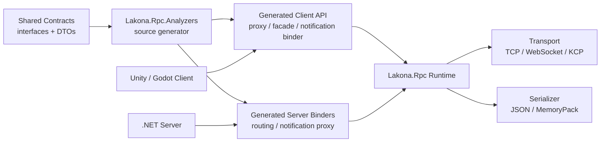
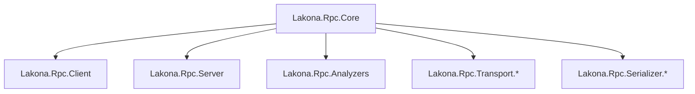

# Lakona.Rpc Overview

Lakona.Rpc lets Unity, Godot, and .NET projects share one C# contract and get typed client/server RPC code at build time.

Write the interface once. Call it from the game client. Implement it on the .NET server. Server-to-client push callbacks use the same contract model, so you do not need a second message system for pushes.

Use it when you want to:

- stop maintaining separate client/server message ids
- share DTOs and service interfaces between game clients and .NET servers
- call server APIs as typed C# methods
- send server-to-client push callbacks without a parallel protocol
- switch TCP / WebSocket / KCP or JSON / MemoryPack without rewriting service code

Typical stack:

- Unity or Godot client
- .NET server
- TCP, WebSocket, or KCP transport
- MemoryPack or JSON serializer

## Two-Minute Start

Install the starter, generate a runnable project, and start the server:

Requires .NET SDK 10.0 or later.

```bash
dotnet tool install -g Lakona.Tool
lakona-tool new --name MyGame --client-engine unity --transport websocket --serializer json
cd MyGame
dotnet run --project Server/Server/Server.csproj
```

Then open `MyGame/Client` with Unity 2022 LTS and run `NuGet -> Restore Packages`, open `Assets/Scenes/ConnectionTest.unity`, and click Play.

For Godot:

```bash
lakona-tool new --name MyGame --client-engine godot --transport websocket --serializer json
cd MyGame
dotnet run --project Server/Server/Server.csproj
```

Open `MyGame/Client` with Godot 4.x, wait for the C# project restore, open `Main.tscn`, and click Play.

For a first integration, start with `websocket + json`. After the path is stable, evaluate MemoryPack, TCP, or KCP.

Full walkthrough:

- [Getting started with `Lakona.Tool`](https://bruce48x.github.io/lakona/rpc/posts/lakona-rpc-getting-started/)

## How It Works

With Lakona.Rpc, you define interfaces and DTOs once. `Lakona.Rpc.Analyzers` generates the RPC glue during compilation, then the client and server use typed services on both sides.



The development loop is:

1. Define service interfaces and DTOs in `Shared`.
2. Build normally so the source generator emits client and server glue.
3. Implement the service on the .NET server.
4. Call the generated typed API from Unity or Godot.

## Contract Example

Shared contract:

```csharp
using System.Threading.Tasks;
using Lakona.Rpc.Core;

namespace Game.Rpc.Contracts
{
    public sealed class LoginRequest
    {
        public string Account { get; set; } = "";
        public string Password { get; set; } = "";
    }

    public sealed class LoginReply
    {
        public int Code { get; set; }
        public string Token { get; set; } = "";
    }

    [RpcService(1)]
    public interface IAccountService
    {
        [RpcMethod(1)]
        ValueTask<LoginReply> LoginAsync(LoginRequest request);
    }
}
```

Client call:

```csharp
using Rpc.Generated;

var options = new RpcClientOptions(
    new WsTransport("ws://127.0.0.1:20000/ws"),
    new JsonRpcSerializer());

await using var client = new RpcClient(options);
await client.ConnectAsync();

var reply = await client.Api.Game.Account.LoginAsync(new LoginRequest
{
    Account = "demo",
    Password = "123456"
});
```

## Server Notifications

Server-to-client notifications are declared as typed notification contracts instead of a separate message system:

```csharp
public sealed class PlayerNotify
{
    public string Message { get; set; } = "";
}

[RpcService(1, NotificationContract = typeof(IPlayerNotifications))]
public interface IPlayerService
{
    [RpcMethod(1)]
    ValueTask<LoginReply> LoginAsync(LoginRequest request);
}

[RpcNotificationContract(typeof(IPlayerService))]
public interface IPlayerNotifications
{
    [RpcNotification(1)]
    void OnNotify(PlayerNotify notify);
}
```

The generated server notification proxy turns `OnNotify(...)` into a push frame on the wire. The generated client notification binder turns that frame back into a typed notification receiver call.

## What Lakona.Rpc Does Not Own

Lakona.Rpc intentionally keeps its boundary at the communication framework layer.

The framework owns:

- transport integration and frame I/O
- frame security, compression, and limits
- session management, request dispatch, push, and keepalive
- serializer boundaries

Your application owns:

- authentication and account systems
- request-level authorization
- reconnect policy and state recovery
- business error codes and recoverable failures
- DTO versioning and rollout strategy
- Unity or Godot main-thread dispatch

Read the boundary page before production integration:

- [Design Boundaries](https://bruce48x.github.io/lakona/rpc/posts/design-boundary/)

If you need a higher-level gameplay/business framework on top of communication, see [bruce48x/Lakona.Game](https://github.com/bruce48x/Lakona.Game). Lakona.Rpc is intentionally focused on the RPC communication layer.

## Samples

- `samples/Rpc.Unity.Json.Websocket`: Unity WebSocket + JSON sample
- `samples/Rpc.Unity.MemoryPack.Tcp`: Unity TCP + MemoryPack sample with multiple services
- `samples/Rpc.Unity.MemoryPack.Kcp`: Unity KCP + MemoryPack sample
- `samples/Rpc.Godot.MixedTransport`: Godot mixed transport sample

Build or regenerate a sample from the repository root:

```powershell
pwsh -NoProfile -File .\scripts\sample.ps1 -Sample Rpc.Unity.Json.Websocket
```

Run a sample server:

```powershell
pwsh -NoProfile -File .\scripts\sample.ps1 -Sample Rpc.Unity.Json.Websocket -Run
```

## Packages

Core packages:



- `Lakona.Rpc.Core`
- `Lakona.Rpc.Client`
- `Lakona.Rpc.Server`

Transport packages:

- `Lakona.Rpc.Transport.Tcp`
- `Lakona.Rpc.Transport.WebSocket`
- `Lakona.Rpc.Transport.Kcp`
- `Lakona.Rpc.Transport.Loopback`

Serializer packages:

- `Lakona.Rpc.Serializer.MemoryPack`
- `Lakona.Rpc.Serializer.Json`

Code generation:

- `Lakona.Rpc.Analyzers`

## Documentation

- API Reference: https://bruce48x.github.io/lakona/rpc/reference/api/
- Generated RpcClient reference: https://bruce48x.github.io/lakona/rpc/reference/generated-client/
- Design boundaries: https://bruce48x.github.io/lakona/rpc/posts/design-boundary/
- Getting started tutorial: https://bruce48x.github.io/lakona/rpc/posts/lakona-rpc-getting-started/
- Architecture deep dive: https://bruce48x.github.io/lakona/rpc/posts/lakona-rpc-design-and-implementation/
- Project docs site: https://bruce48x.github.io/lakona/rpc/

## Repository Layout

- `src/Lakona.Rpc.*`: runtime, transports, serializers, starter, and analyzer/source-generator package
- `samples/`: runnable client + .NET samples
- `blog/`: Hugo documentation/blog site for GitHub Pages
- `design/`: internal design notes and decision records

## For Contributors

Developer-facing rules, architecture notes, testing constraints, publishing steps, and AI agent instructions live in [CONTRIBUTING.md](./CONTRIBUTING.md).
