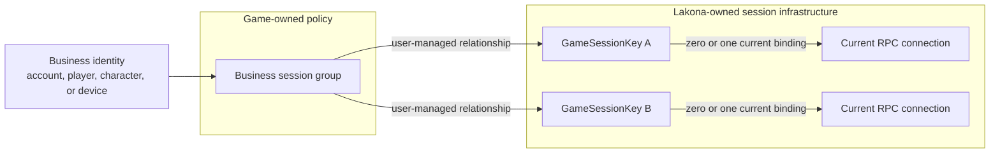
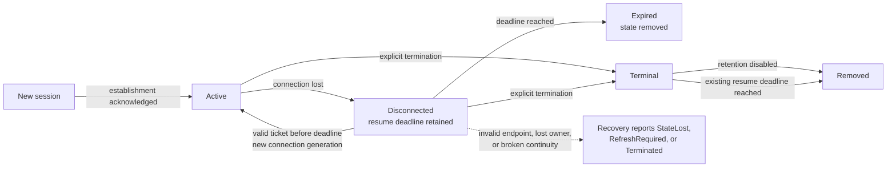
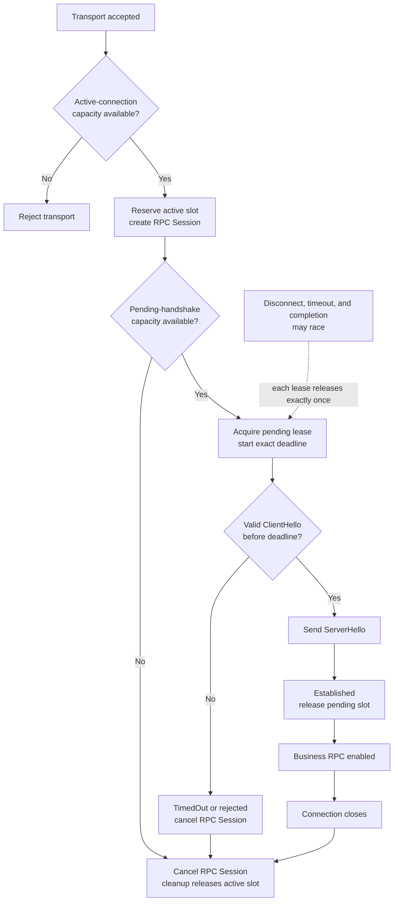
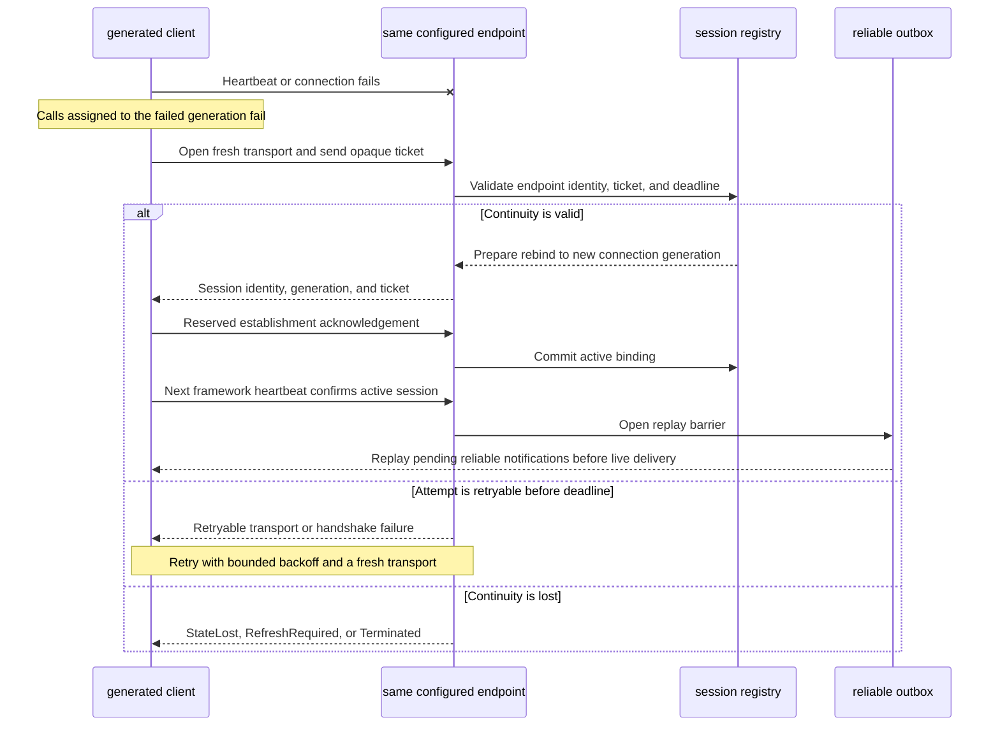
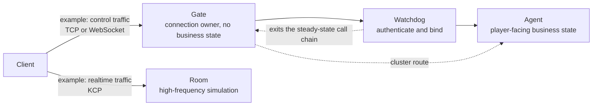
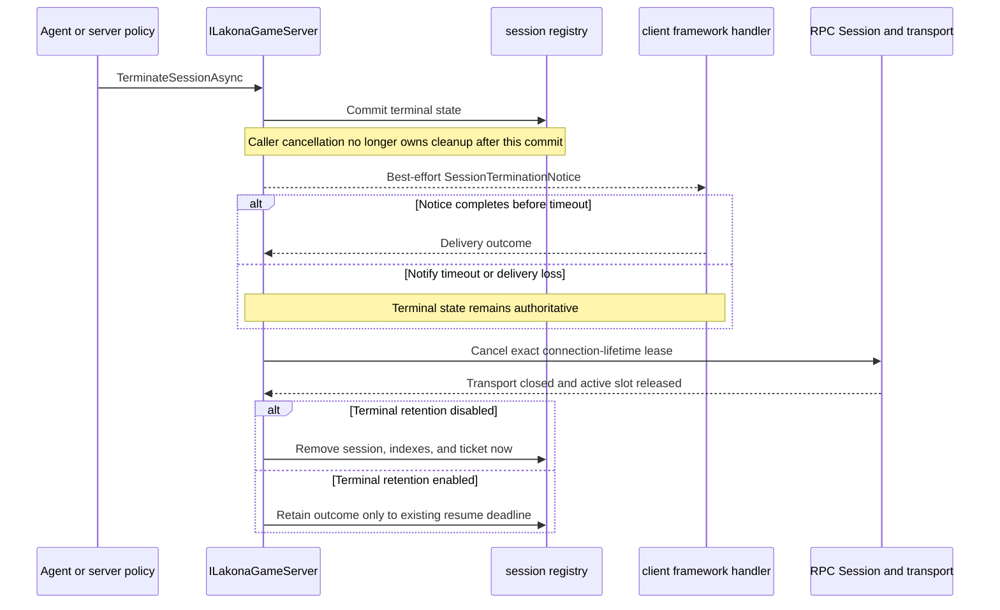
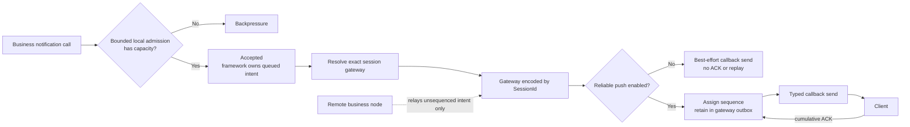
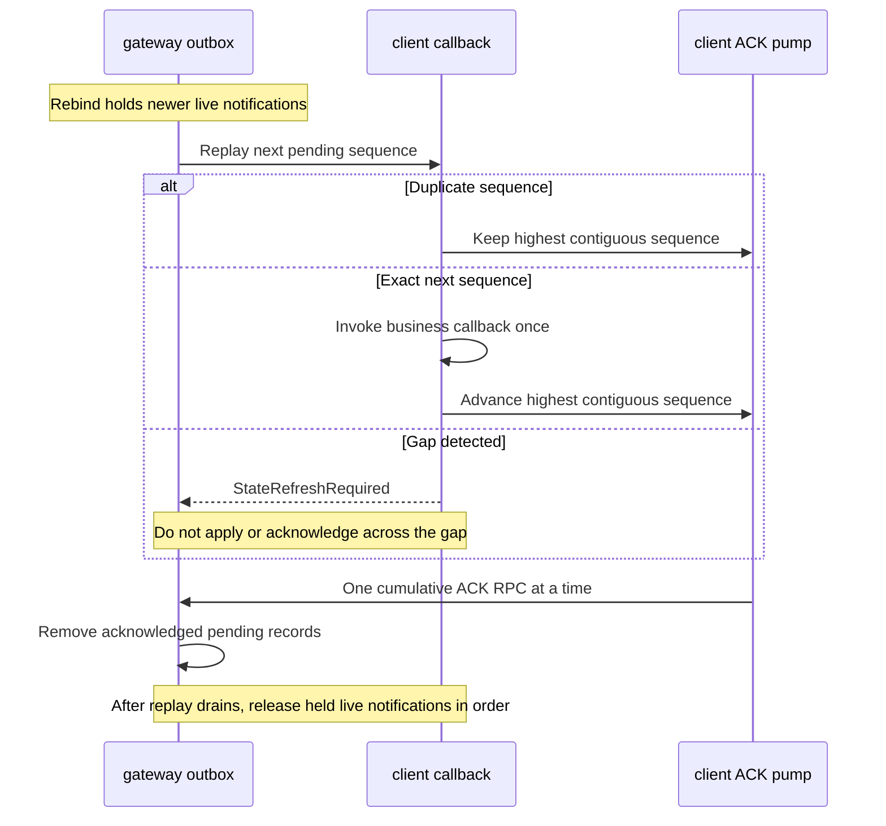

# Session Lifecycle

Lakona owns one framework game session per accepted game RPC session. It does
not own account, player, character, room, or device aggregation.

This document defines session identity, connection binding, callback resolution, disconnect,
expiration, termination, resume, and the Gate / Watchdog / Agent composition
pattern.

For hotfix-backed service binding, see
[hotfix/service-binding.md](hotfix/service-binding.md).

The framework owns individual game sessions and their connection continuity.
The game owns any relationship between those sessions and product identities.



The diagrams establish the lifecycle model. The rules and tables following
them remain the precise contract.

## Reading Map

| Question | Start here |
| --- | --- |
| What exactly is a game session? | [Session Semantics](#session-semantics) |
| When can business RPC begin? | [Handshake Gate](#handshake-gate) |
| What happens after a disconnect? | [Framework Heartbeat](#framework-heartbeat) |
| Which state belongs to Lakona or the game? | [Business Session State](#business-session-state) |
| How does the server end a session? | [Server-Initiated Termination](#server-initiated-termination) |
| How do reliable notifications survive reconnects? | [Reliable Push And Resume](#reliable-push-and-resume) |

## Core Decisions

- A `GameSessionKey` represents exactly one game RPC session.
- One bound RPC connection is associated with at most one active
  `GameSessionKey`.
- Multiple sessions for the same account, player, character, or room are
  user-managed business state.
- `EndpointName` and `GameEndpointName` are not user-facing concepts in
  generated binding, `ILakonaGameServer`, reliable push protocol state, hotfix call
  contexts, or session directory storage.
- `Lakona:Endpoints[]` remains transport listener configuration. It does not
  define framework session sub-identities.
- `GameSessionKey` is server/framework identity. Shared RPC DTOs, generated
  client code, and MemoryPack formatters must not expose, serialize, store, or
  echo it.

## Vocabulary

| Term | Meaning |
| --- | --- |
| RPC connection | One accepted transport connection known to the RPC server. |
| Connection id | Stable framework id for one accepted RPC connection while it exists. |
| Game session | One framework-owned game session identified by `GameSessionKey`. |
| Callback proxy | A transient typed proxy resolved from the session's current RPC connection when sending. |
| Business session group | User-owned grouping such as account, player, character, room member, or device. |
| Transport endpoint | Listener configuration from `Lakona:Endpoints[]`; not part of session identity. |
| Business presence | User-owned online/offline policy derived from session lifecycle hooks. |

One `GameSessionKey` moves through the following framework lifecycle. An RPC
connection may end while the game session remains resumable.



## Session Semantics

`GameSessionKey` identifies one framework-owned game RPC session. It is not an
account, player, character, room member, device, or transport channel group.

Starting a new session for an owner must not automatically invalidate other
sessions for the same owner. `OwnerKey` is a user-provided ownership label for
diagnostics, authorization, lookup, or user-maintained indexing. It is not a
framework uniqueness constraint.

If a game wants only one active session per account, it implements that policy
explicitly in server-side user code. A game may also associate several
independent `GameSessionKey` values with one business identity and assign them
product-specific roles. Lakona neither names nor interprets those roles.

Terminating one `GameSessionKey` does not implicitly terminate another. User
code applies cross-session policy when that is the desired product behavior.

## Session Directory

The framework session directory stores sessions by `GameSessionKey`, not by
owner or endpoint. It is framework infrastructure, not a user-authored
`Server.App` business directory.

Each session stores only its current connection id:

```txt
GameSessionKey
  -> connection id
```

Callback objects and callback contract types are not session state. When code
publishes through `IClientNotifications`, the framework resolves the session's
current connection notification channel and asks the generated endpoint
binders for the requested callback proxy. Any callback contract exposed by
that connection can therefore be used through the same session.

Binding a different active `GameSessionKey` to a connection id that already has
an active session binding is invalid. User code must explicitly terminate or
expire the old session before reusing that RPC connection for another game
session.

The session directory or a companion tracker must support connection-id lookup
so the RPC lifecycle bridge can mark sessions disconnected when an RPC
connection closes.

Do not keep `SessionEndpointKey` in the target model. A game session no longer
has framework-owned endpoint children.

## Game Server API

User-facing game server APIs must stay session-oriented:

```csharp
public interface ILakonaGameServer
{
    ValueTask<GameSessionKey> StartSessionAsync(
        string ownerKey,
        string connectionId,
        CancellationToken cancellationToken = default);

    ValueTask BindSessionAsync(
        GameSessionKey session,
        string connectionId,
        CancellationToken cancellationToken = default);

    ValueTask TerminateSessionAsync(
        GameSessionKey session,
        SessionTerminationReason reason,
        string? message = null,
        SessionTerminationOptions? options = null,
        CancellationToken cancellationToken = default);
}
```

Exact method names can evolve, but the public model must not require users or
generated hotfix proxies to pass endpoint names.

`ILakonaGameServer` is one complete session-management contract. Every method
is required: partial implementations that defer ordinary session operations to
default `NotSupportedException` methods are not supported. Tests may use
focused fakes, but each fake must state its unsupported operations explicitly
so missing production behavior fails at compile time.

## RPC Lifecycle Bridge

`Lakona.Rpc.Server` exposes neutral lifecycle hooks without referencing
`Lakona.Game`. `Lakona.Game.Server` registers an observer that turns RPC
lifetime into game session lifetime:

```txt
RPC session started
  -> game connection opened
  -> optional user lifecycle hooks

RPC session disconnected
  -> mark the game session bound to that connection disconnected
  -> publish one session-disconnected lifecycle hook
  -> cleanup later expires stale disconnected sessions
```

Session disconnection, expiration, and termination are separate events:

- Disconnection means the current RPC connection was lost and the session may
  still resume before retention expires.
- Expiration means disconnected session state was removed by cleanup policy.
- Termination means an explicit framework operation invalidated the session and
  optionally published a terminal notice.

User lifecycle hooks receive game-level context, not `RpcSession` and not
endpoint names. Business presence policy belongs behind these hooks. Stable
framework code owns the lifecycle bridge and required-contract validation.
Generated and sample App code is a thin transport/serializer composition root;
the framework registers the lifecycle bridge as part of the default game-server
graph.

Replaceable presence, cleanup, room leave, and matchmaking decisions belong in
`Server.Hotfix` lifecycle classes such as `ChatSessionLifecycle`, not in App
lifecycle handlers, App runtime contract files, or `*LifecycleService` classes.

## Hotfix Lifecycle Contract

The framework requires the hotfix assembly to implement the framework-owned
`IGameSessionLifecycle` contract when session lifecycle hooks are active:

```csharp
public interface IGameSessionLifecycle
{
    ValueTask SessionDisconnectedAsync(GameSessionDisconnectedRequest request);

    ValueTask SessionExpiredAsync(GameSessionExpiredRequest request);
}
```

`SessionDisconnectedAsync` is published after an RPC connection bound to a game
session is marked disconnected. `SessionExpiredAsync` is published after cleanup
removes a stale disconnected game session. Both methods are invoked through
stable `[RpcMethod]` ids and hotfix lifecycle dispatch helpers; user-authored hotfix
implementations accept `HotfixLifecycleCall<TRequest>`.

Both request types carry framework session state only:

- `OwnerKey`: the game session owner key, such as a player id.
- `SessionId`: the framework session id.
- `ConnectionId`: the last RPC connection associated with the event.

Product policy still belongs in hotfix code, where it can map the session event
to presence, room, matchmaking, or other business cleanup.

## Handshake Gate

No business RPC dispatch occurs before `ClientHello` / `ServerHello`
completes. Handshake failure rejects the connection before user hotfix service
code runs. `ServerHello` reports the selected protocol version plus
server-owned reliable-push and heartbeat policies. The reliable-push handshake
policy is limited to whether reliable push is enabled and whether client acks
are required.

Every game endpoint owns a finite active-connection budget and a smaller
pending-handshake budget. RPC hosting performs the atomic active-connection
admission before Session construction. Game hosting then acquires a
connection-scoped pending-handshake lease and starts the endpoint's exact
handshake deadline. A full budget rejects the new transport immediately; it
never creates another unbounded wait queue.



A successful handshake moves the lease to `Established`, cancels its deadline,
and releases only the pending-handshake slot. Timeout cancels the RPC Session
and releases the pending slot. Disconnect, timeout, and handshake completion
may race, but exactly one transition releases each slot; the RPC host releases
the active-connection slot only after Session cleanup completes. Reaching a
deadline while handshake work is still running cancels that work and does not
publish a successful `ServerHello`.

These are RPC connection limits, not Game Session retention limits. A completed
Game Handshake does not create a maximum connection lifetime, and a resumable
Game Session may outlive the RPC Session as described below. Configuration and
defaults belong to [endpoint configuration](./configuration.md#endpoints).

Handshake payloads are framework-internal Lakona.Game messages. They are
encoded with `LakonaInternalCodec`, not with the endpoint-selected business
serializer. Framework-internal payloads stay on `LakonaInternalCodec`; the
endpoint business serializer is not part of the default framework handshake and
begins only at business RPC payloads after handshake succeeds.
`LakonaInternalCodec` is also separate from the fixed MemoryPack serializer
used for node-to-node cluster, notification-relay, and remote Actor payloads.

`LakonaInternalCodec` is the framework-owned v1 payload codec for
Lakona.Game control messages. It covers `GameClientHello`, `GameServerHello`,
`GameHeartbeatRequest`, `GameHeartbeatReply`, `ReliablePushAckRequest`,
`ReliablePushAckOutcome`, and `SessionTerminationNotice`. New Lakona.Game
framework-internal payloads must add an explicit codec kind and layout instead
of routing DTOs through endpoint `IRpcSerializer`.

Lakona.Game control payload layouts are a package-set contract. This early
framework does not support mixing old and new Lakona.Game protocol packages in
one deployment; update the generated client, client runtime, abstractions, and
server runtime together.

`Lakona.Game.Abstractions` must remain free of concrete serializer package
dependencies such as `Lakona.Rpc.Serializer.Json`,
`Lakona.Rpc.Serializer.MemoryPack`, `MemoryPack`, or
`MemoryPack.Generator`. Framework-control DTOs must not require user projects
to add JSON converters or MemoryPack attributes. Malformed framework-internal
request payloads are protocol-level bad requests (`RpcStatus.BadRequest`), not
business failures.

Service id `0` is reserved for Lakona.Game framework-internal calls and
notifications. Generated business RPC contracts must use positive service ids
outside that reserved range.

Business RPC before a completed handshake is rejected with a structured
`HandshakeRequired` failure. `ClientHello` carries only `ProtocolVersion = 1`.
`ServerHello` returns the selected protocol version plus server-owned
reliable-push and heartbeat policies. Endpoint transport, endpoint serializer,
server node identity, server time, runtime, platform, game-version, build, and
capability metadata are application concerns and are not part of the default
framework handshake unless they gain concrete framework behavior.

## Framework Heartbeat

Game heartbeat is a framework RPC, not a business service method. Generated
`LakonaGameClient` starts one heartbeat loop after the handshake succeeds.

The heartbeat request does not carry the full `GameSessionKey` owner identity.
After the generated client starts a framework session, heartbeat carries the
client's `SessionId`. The server treats heartbeats
without session identity as connection-only heartbeats and only replays pending
reliable push records after the client reports the matching active session. This
upgrade is automatic; business code should not start a second session heartbeat
loop.

The default heartbeat policy uses a 15 second interval and 45 second timeout
unless the resolved server policy says otherwise.

Heartbeat request and reply payloads are encoded with `LakonaInternalCodec`.
They do not require JSON converters, MemoryPack formatters, or generated
business contract DTO metadata.

Heartbeat replies report framework session status:

- `Ok`: the connection or bound session is still valid.
- `StateLost`: the bound session can no longer be resumed.
- `Terminated`: the bound session reached a terminal server-side outcome.

After a Game Session is established, network errors, heartbeat RPC failures, or
heartbeat timeouts start framework-managed recovery. The generated client keeps
the same `LakonaGameClient`, `Api`, service proxies, and callback receivers while
it replaces the internal RPC connection. A framework-only opaque ticket is sent
in the handshake; business RPC contracts do not carry resume identity. Calls
already assigned to the failed connection fail and are never replayed
automatically.



Session establishment uses a reserved framework notification followed by a
reserved acknowledgement. `StartSessionAsync` does not let the surrounding
business RPC complete until the client has applied the Session id, generation,
and opaque ticket. This prevents a successful login response from racing the
client's recovery state. Binding remains prepared and invisible through the
connection index until Session locator issuance, ticket issuance, notification, and
acknowledgement all succeed. A missing connection or any failed step rolls back
the ticket, restores an existing disconnected Session exactly, and
removes a newly created Session instead of retaining a half-established entry.

Recovery retries the same endpoint until the negotiated resume deadline. It
either returns to `Active` or reports `StateLost`, `RefreshRequired`, or
`Terminated`; it never reports success after continuity is lost. Client options
must use the transport-factory constructor so every connection generation gets
a fresh transport.
Retry scheduling uses bounded exponential backoff with jitter through an
injectable recovery scheduler so tests can advance time deterministically.

## Business Session State

The framework owns `GameSessionKey`, connection bindings, resume tokens, reliable
push protocol state, route indexes, and transport connection state. Business
code owns account, player, character, room, and device policy.

Notification admission reports `StateLost` when a well-formed opaque locator
names an exact gateway incarnation that has been committed out of the current
cluster. This is distinct from malformed/foreign `RouteNotFound`, callback
absence, bounded `Backpressure`, and an authority/transport `Failed` result.
The framework does not redirect state owned by the lost process.

### Session Items

Session items are server-side session metadata for latency-sensitive cached
metadata. They are not durable business state.

Only scalar values supported by `GameSessionItemValue` are valid: `string`,
`Int64`, and `Boolean`. Valid examples include `roomId`, `matchId`, a
product-defined session role, an associated session id, and membership
generation after authoritative validation.

Session items must not store callbacks, transport objects, DI services, actor
instances or references, hotfix-defined class instances, mutable collections,
durable player data, or room membership authority.

Each session item container is created empty with its `GameSessionKey`. Items
are preserved across disconnect and resume for the same generation. Items are
cleared or inaccessible after termination, including terminal-state retention,
and removed when a disconnected session expires.

Session item keys are ordinal, case-sensitive, non-empty strings with bounded
length. Missing reads return `null` so latency-sensitive services can treat
absence as stale, unauthenticated, or not-yet-attached state. Setting or
removing an item for a missing or terminated session is a server programming
error, not a client business rejection.

Session items are never serialized to clients or shared RPC DTOs. They are not
framework uniqueness constraints and must not be emitted as metric tags.

Hotfix calls receive `CurrentSessionItems` as an immutable per-dispatch
snapshot captured before the hotfix method runs. Mutations through
`ILakonaGameServer` do not update that snapshot. Use `GetSessionItemAsync` for
fresh reads later in the same call.

The in-memory registry publishes a new immutable item snapshot only when an
item changes. Repeated request reads for an unchanged session reuse the same
snapshot and do not copy the item dictionary. Session, connection, callback,
and terminated-connection indexes remain coordinated during bind,
disconnect, termination, resume, and expiration; high-frequency reads and
heartbeats synchronize only the affected session.

Cached items must not bypass route freshness. A cached room id may choose an
actor key, but generated selectors still resolve placement. No node lease or
epoch exempts a call from that resolution.

Games that need one player-level session aggregate should keep it in a business
actor such as `UserActor`, not in `Server.App` transport helpers. For example,
Agar's `UserActor` is the authority for player session policy and may store
business values such as player id, associated session ids, connection
generations, current room, match ticket, seat, and online state.

Business actors must not store callback objects, `RpcSession`, transport
objects, endpoint names, or framework callback binding containers. Framework
lifecycle requests carry stable data such as owner key, session id, generation,
connection id, and callback contract type names so hotfix lifecycle code can
update business state without holding transport objects.

When business code groups several framework sessions, each session remains
independent. If losing one should affect another, the business actor applies
that product policy.

## Gate / Watchdog / Agent

Gate / Watchdog / Agent is a recommended composition pattern, not a framework
class. It separates connection ownership, admission policy, and player-facing
state so each role can fail and scale independently.

In this example, *control* and *realtime* describe application traffic roles.
They are not Lakona Session types, configuration values, identity fields, or
routing semantics.



| Role | Responsibility | Has business state | Failure impact |
| --- | --- | :---: | --- |
| Gate | Maintain client connections and forward messages. No business logic. | No | Client reconnects to another Gate; Agent can remain unchanged. |
| Watchdog | Authenticate, create or bind Agent, then exit the call chain. | Transient | Affects only new or resuming connections. |
| Agent | One-to-one player service. Holds session-facing state. | Yes | Affects only that player. |

The key point is that Gate is stateless. Public internet traffic can hit cheap
Gate nodes while player state lives behind Agents or actors. For low-latency
games, the realtime channel shown above is a separate connection and session.

The two channels shown above use independent RPC sessions. Losing one does not
directly change the other unless user business code links them and applies that
policy.

Lakona mechanisms for the pattern:

| Need | Mechanism |
| --- | --- |
| Gate TCP/WebSocket listener | endpoint configuration and RPC server hosting |
| Gate to Agent routing | generated typed Actor routing |
| Watchdog auth and session bind | user auth plus `ILakonaGameServer.StartSessionAsync` |
| Agent per-player state | actor runtime with per-player `ActorId` |
| Reconnect to the owning Gate | endpoint-scoped ticket in the framework handshake |
| Realtime channel | KCP endpoint plus separate `GameSessionKey` |
| Reliable delivery | reliable push outbox/inbox |
| Server-initiated disconnect | `ILakonaGameServer.TerminateSessionAsync` |

## Server-Initiated Termination

When the server must remove a player from an active session, treat it as a
terminal lifecycle transition, not as a raw transport close.



Recommended flow:

1. The Agent or server policy decides the session must end.
2. Server code calls `ILakonaGameServer.TerminateSessionAsync`.
3. Lakona marks the session terminal before notifying the client, so new
   business work for that session is rejected deterministically.
4. Lakona sends a fixed `SessionTerminationNotice` directly through the
   framework-owned notification channel for the RPC connection currently bound
   to that `GameSessionKey`. Framework lifecycle notifications do not depend on
   an application RPC service or business callback binder.
5. Lakona waits only up to `SessionTerminationOptions.NotifyTimeout`, then
   cancels the exact RPC Session through its connection-lifetime lease. The RPC
   host disposes the transport and releases the active-connection slot.
6. With `KeepTerminalStateForResume=false`, the Session, reverse mappings, and
   ticket are removed immediately. With retention enabled, framework recovery
   returns the terminal outcome only until the existing Game Session resume
   deadline.

The caller cancellation token applies only before the terminal registry commit.
After that commit, lifecycle publication, best-effort notification, and
connection close run under framework-owned cleanup cancellation so caller
cancellation cannot leave a terminal Session attached to an open connection.
Connection close is idempotent when termination, disconnect, timeout, and host
shutdown race.

Retained terminal outcomes use the Game Session Resume Window; they do not have
a separate retention setting. A Session terminated while already disconnected
keeps the earlier deadline when it is sooner. Once the exact deadline is
reached, recovery reports `StateLost` even before the next cleanup scan. The
mandatory framework cleanup later removes the Session, terminal connection
index, and opaque ticket without publishing a second business
`SessionExpiredAsync` event.

```csharp
await gameServer.TerminateSessionAsync(
    session,
    SessionTerminationReason.ReplacedByNewLogin,
    message: "This account logged in elsewhere.");
```

`SessionTerminationReason` is the only machine-readable reason.
`SessionTerminationNotice.Message` is optional display context and should not
become a second product-specific reason catalog.

The notice is best-effort. Correct clients must still handle the fallback path
where they only observe a disconnect and then receive
`SessionResumeStatus.Terminated` or another terminal outcome during
resume/login.

## Reliable Push And Resume

Reliable push resolves the requested callback proxy from the live connection
for a `GameSessionKey`. Framework recovery may rebind a disconnected game
session to a new RPC connection when the endpoint-scoped ticket and retention
policy allow it.

The generated client's framework handshake is the only client-facing Game
Session recovery entry point. Its resume ticket is opaque, must not reveal
`GameSessionKey`, and must not become business identity. Business code neither
accepts raw Game Session recovery credentials nor invokes a parallel resume
service. Product authentication and authoritative player-state checks remain
business operations after framework recovery; they may terminate or replace a
Session through `ILakonaGameServer` when product policy requires it.

The resume ticket is scoped to the exact endpoint recovery identity,
including transport, serializer, listener address/path, delivery policy, and
exposed RPC-service set. Presenting it to another endpoint returns `StateLost`.

Reliable push is an explicit endpoint policy. Business code publishes through
the same notification API whether reliability is enabled or disabled. When
enabled, the framework owns sequence assignment, ack handling, replay, pending
limits, and route lookup. When disabled, the same accepted publication is sent
as a background best-effort notification with no ack and no replay.



The exact gateway encoded in the framework-created `SessionId` is the only node that assigns
reliable-push sequences, retains pending records, accepts acknowledgements, and
replays records for that session id. A remote business node relays an
unsequenced notification intent to that gateway; it does not create a local
outbox record or attach authoritative reliable-push metadata. The route owner
adds the notification to its outbox before dispatching it through the locally
bound callback.

If the locator is stale, its exact gateway is absent, or the local session no
longer exists, the
background delivery attempt ends without creating an outbox record on the
calling node. That asynchronous route failure is written through framework
diagnostics; it is not returned to business code after admission. The built-in
in-memory outbox is not migrated when an owner process fails or session route
ownership moves to another node. Pending notifications may therefore be lost
during owner failure; durable or replicated outboxes remain an
application-provided infrastructure choice.

The public keys and defaults belong to
[Configuration](./configuration.md#session-resume) and
[endpoint configuration](./configuration.md#endpoints).

Only an endpoint with reliable push enabled receives sequencing,
acknowledgement, and replay. The configured resume window is negotiated during
handshake and is enforced by an exact disconnect deadline.
Capacity overflow or a client sequence gap returns `StateRefreshRequired`
instead of silently applying a partial stream.



Reliable application order is contiguous per Game Session id. A
duplicate is acknowledged without another business invocation; the exact next
sequence is applied and acknowledged; a later sequence across a gap is neither
applied nor acknowledged, and the session remains poisoned until a new
validated session starts with a new id. After rebind, live reliable publication
is retained but withheld until the next framework heartbeat establishes the
replay barrier. Serialized outbox publication then sends pending commands in
order before allowing newer live commands to reach the client.

The client never waits for a reliable-push acknowledgement from inside the
notification callback on the same RPC Session; doing so could deadlock replay
against the framework request that is producing it. Instead, one client-owned
acknowledgement pump sends at most one ACK RPC at a time. ACKs are cumulative,
so while one call is in flight the pump retains only the highest contiguous
Reliable Sequence for the current Game Session and connection generation.
This gives acknowledgement work constant capacity rather than creating one
background task and pending RPC per notification.

The acknowledgement pump uses the negotiated heartbeat timeout as its internal
call deadline. Client disposal cancels and waits for the pump, connection
replacement cancels the previous generation, and a late outcome may update
session state only when its Game Session and connection generation are still
current. Failed or rejected ACKs discard that generation's pending high-water
mark; replay on a valid recovered RPC Session drives acknowledgement again.
These are framework lifecycle rules and do not introduce public ACK queue,
concurrency, or timeout configuration.

The built-in registry and outbox are process-local. Seamless built-in session
recovery therefore requires gateway affinity. Owner restart or reconnecting to
another gateway returns `StateLost`; built-in recovery does not redirect or
pretend that lost pending state was replayed.

Business services must not expose reliable-push ack RPC methods, and
`ILakonaGameServer` must not expose reliable-push publish, replay, or ack
methods. Ack messages and replay bookkeeping are framework-owned protocol and
runtime behavior; replay support, pending limits, and delivery bookkeeping are
not handshake-negotiated client settings. The server reports only the
reliable-push enabled/ack-required policy in `ServerHello`; clients do not need
to know whether the server uses an in-memory store, durable store, plugin, or
built-in implementation.

Business notification APIs should express the intended session target and let
the framework resolve delivery:

```csharp
var status = clientNotifications
    .ForSession<IPlayerCallback>(sessionKey)
    .OnMatchmakingStatus(update);
```

Hotfix call contexts deliberately do not expose the current RPC connection's
callback proxy. A notification emitted from an RPC handler follows the same
session-oriented path as one emitted from an Actor, timer, or application
module. Before `StartSessionAsync` establishes a Game Session, business RPC
uses its response DTO; connection-scoped server push is not a parallel Game
notification interface.

`ForSession<TCallback>` returns a readonly value-type target. Source generation
adds the callback contract's notification methods as synchronous admission
extensions, so normal publication does not allocate a target object or require
`await`, a cancellation token, a capturing lambda, `DispatchProxy`, runtime
method reflection, or argument lists. Local best-effort delivery keeps the
typed payload and does not serialize merely to rediscover the selected method.
Reliable and remote delivery materialize the bounded command payload required
for replay or cluster transport.

### Synchronous Notification Admission Is Intentional

The synchronous generated notification interface is a deliberate throughput
decision. Room and other high-frequency broadcast paths must be able to enqueue
many per-player pushes without awaiting session-owner resolution, remote
backpressure, or one network round trip per notification. Synchronous here
means only local bounded-queue admission; actual callback delivery remains
asynchronous framework work.

`Accepted` therefore remains a local admission result. Delivery, owner lookup,
reliable outbox creation, callback availability, and transport failure may all
occur after it returns. Those later outcomes are diagnostics and do not rewrite
the completed business result. This known post-admission loss window is an
accepted tradeoff, including when process-local queue or outbox state disappears
with a failed process.

Do not change the default generated notification methods to return
`ValueTask<ClientNotificationStatus>` merely to strengthen the meaning of
`Accepted`. Such a change requires a separate measured decision covering Room
throughput, suspended work, queue growth, tail latency, and failure behavior.
An owner-confirmed admission mode must be a clearly named opt-in interface or
delivery class and must not silently change the synchronous contract.

Publication returns synchronously after admission to a bounded framework queue.
The queue is FIFO per `GameSessionKey`, while different sessions drain
independently so a slow client does not stall unrelated clients. One short-lived
drain owns a session's current burst; the framework does not create one
`Task.Run` per notification. Once admitted, the framework owns route resolution,
reliable sequence assignment, serialization, and the actual callback send.

Clustered delivery additionally bounds the total pending commands
per process. Admission returns `Backpressure` when either the per-session or
process-wide capacity is full. Remote commands are grouped by the exact gateway
incarnation and flushed after at most 10 milliseconds by default; applications
may configure `Lakona:Notifications:BatchWindowMilliseconds`, including zero
for immediate flush. The target defaults are 256 pending commands per session
and a provisional, configurable 65,536 pending commands per process; the latter
must be confirmed by Room fan-out measurements and never becomes unbounded.
`MaximumBatchSize` and `MaximumBatchBytes` also flush remote batches early.
Local-owner delivery does not wait for the remote batch window. Short-lived
per-session drains preserve FIFO. A fixed session-affine worker pool is not
part of the contract and requires large-session-count measurements before
adoption.

Every rejected notification increments
`lakona.game.notification.backpressure` on the `Lakona.Game.Session` meter.
The bounded reason is `session_capacity`, `process_capacity`, or `batch_bytes`;
session, owner, callback, and gateway identities are deliberately excluded
from metric tags.

Batching changes only transport framing. It never deduplicates, overwrites, or
coalesces an accepted notification. Whether a newer state update supersedes an
older one is business policy and is not inferred from callback or payload type.

Materialized notification commands use JSON as a serializer-neutral retained
representation. The generated callback proxy decodes that representation back
to the declared notification DTO, then sends the typed value through the live
RPC session so the endpoint-selected serializer, such as MemoryPack, owns the
wire payload. Serialized command bytes must enter the proxy's
`ReadOnlyMemory<byte>` dispatch overload; they are not typed notification DTOs
and must never flow through the generic typed-payload overload.

User-targeted notification policy remains business-layer responsibility in this
iteration. The framework does not own session kind or expose user-and-kind
targeting. Games may still keep business presence and product session policy in
a user actor. Reliable push record identity is derived inside the framework from
the captured callback command; applications do not choose reliable versus
immediate delivery per notification.

`ClientNotificationStatus` reports admission to the framework-owned delivery
pipeline. `Accepted` means the bounded admission module owns the notification;
in clustered hosting it has reserved both the per-session and
process-wide budgets. It does not mean that the client received it.
`Backpressure` means an applicable local budget is full and the framework did
not accept the notification. `Failed` may be returned when the notification
runtime is shutting down. Route lookup, callback availability, and transport
outcomes happen after acceptance and are reported through framework diagnostics
instead of changing the completed business call. When the route owner accepted
a reliable notification but its local callback is temporarily unavailable, the
owner retains the record for framework replay.

## Validation Requirements

Tests and source scans should reject these patterns in generated projects and
framework-facing docs:

```txt
EndpointName
GameEndpointName
SessionEndpointKey
OnEndpointBound
OnEndpointDisconnected
OnEndpointExpired
RpcSession.Disconnected +=
```

Allow those names only in negative tests that verify they remain forbidden or
in release notes.
