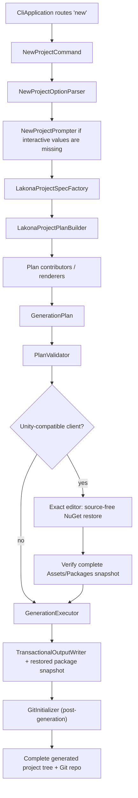

# Lakona Project Generation Architecture

## Purpose

`src/Lakona.ProjectSystem` owns generated Lakona.Game project creation. Both
`Lakona.Tool` and `Lakona.Hub` are adapters over the same public creation
interface and the same generation pipeline:

```txt
user intent -> LakonaProjectCreationRequest -> LakonaProjectSpec
            -> GenerationPlan -> transactional write
```

This document defines the durable maintenance rules behind that pipeline.

The default product remains:

```powershell
lakona-tool new
```

It generates a runnable Lakona.Game project with Shared contracts, Server/App,
Server/Hotfix, a client project, compact configuration, cluster defaults,
hotfix defaults, reliable push defaults, generated project docs, and the
matching project-scoped Agent Skill Pack.

`Lakona.Tool` also exposes the v1 production hotfix package format and local node
operations. It does not own remote deployment or multi-node orchestration.

`ILakonaProjectCreator.CreateAsync` is the canonical creation seam, with
`LakonaProjectCreator` as the framework implementation. It accepts a
`LakonaProjectCreationRequest` and returns a `LakonaProjectCreationResult`.
Defaults, validation, project layout, package versions, rendering,
transactional writes, and Git initialization remain internal to
`Lakona.ProjectSystem`. The CLI remains a supported adapter; the desktop
application does not replace it.

## Architecture Decision

`Lakona.ProjectSystem` is one coherent project generator. Neither adapter may
contain a hidden standalone RPC starter layer, a second renderer graph, or a
two-phase `Starter -> Augment` flow.

The tool answers one question:

```txt
Given a Lakona project specification, what complete project tree should exist?
```

It must not answer:

```txt
Given an existing starter tree, what patches turn it into a Game tree?
```

Shared RPC concerns are part of the Lakona project recipe. They are not a
separate internal product that the Game generator wraps.

## Required Invariants

These invariants are regression boundaries:

- Tool and Hub map their input to one `LakonaProjectCreationRequest`.
- Only `Lakona.ProjectSystem.LakonaProjectCreator` turns that request into one
  `LakonaProjectSpec`.
- One `LakonaProjectSpec` builds one `GenerationPlan`.
- The `new` command writes only from a validated plan.
- No renderer writes to disk directly.
- No renderer reads or mutates files created by another renderer.
- Client template entry points correspond to files emitted by the current
  engine renderer; superseded product recipes do not remain as callable
  template APIs.
- No `new` path performs in-place project XML mutation.
- No generated path contains a `Server/Server/` directory.
- No production code references `Lakona.Tool.RpcStarter`.
- No production code has `Starter*` model names for the generation pipeline.
- No generated user file contains forbidden starter branding.
- Runtime package boundaries remain visible in generated projects.
- Generated RPC glue remains source-generator output, never committed files.
- The complete public Skill Pack is emitted under `.agents/skills/` by
  ProjectSystem and participates in the same transactional write as the rest of
  the project.

The `new` command stays create-from-plan only. Tool and Hub intentionally do
not expose a general `sync` or `upgrade` command for existing projects.
Existing-project package upgrades are AI-agent-assisted project maintenance:
the agent reads the project's actual package declarations, makes
project-specific edits, reviews the resulting source-control diff, and
validates the affected builds or editors. Do not add a generic XML merge
framework, hidden upgrade metadata, or a parallel package manager without a
concrete need.

Reconsider a built-in upgrade interface only when concrete evidence shows a
recurring upgrade failure that agent-assisted maintenance cannot handle
reliably, or when an unattended automation requirement actually exists.

## Module Layout

The implemented source tree is organized by responsibility:

```txt
src/Lakona.Tool/Cli/
  Program.cs
  CliApplication.cs
  Commands/
    NewProjectCommand.cs
  Options/
    NewProjectOptions.cs
    NewProjectOptionParser.cs
    NewProjectPrompter.cs
  Text/
    ToolText.cs
  Terminal/
    ICliTerminal.cs
    ConsoleCliTerminal.cs

src/Lakona.ProjectSystem/
  LakonaProjectCreationRequest.cs
  LakonaProjectCreationResult.cs
  LakonaProjectCreator.cs
  ILakonaProjectCreator.cs

src/Lakona.ProjectSystem/Generation/Domain/
  ClientEngine.cs
  TransportKind.cs
  SerializerKind.cs
  DeploymentProfile.cs
  NuGetForUnitySource.cs
  ProjectCapability.cs
  LakonaProjectSpec.cs
  LakonaProjectSpecFactory.cs
  ProjectLayout.cs
  PackageCatalog.cs

src/Lakona.ProjectSystem/Generation/Planning/
  LakonaProjectGenerator.cs
  LakonaProjectPlanBuilder.cs
  GenerationPlan.cs
  GenerationPlanBuilder.cs
  GeneratedFile.cs
  GeneratedDirectory.cs
  GeneratedArchive.cs
  GeneratedFileKind.cs
  FileWriteMode.cs
  DependencyPlanner.cs
  PackageReferenceSpec.cs
  PlanValidator.cs

src/Lakona.ProjectSystem/Generation/Rendering/
  Common/
  Shared/
  Server/
  Client/
  Operations/
  Docs/

src/Lakona.ProjectSystem/Generation/Execution/
  GenerationExecutor.cs
  TransactionalOutputWriter.cs
  GitInitializer.cs
  GitInitializationResult.cs
  IGitCommandRunner.cs

src/Lakona.ProjectSystem/Generation/Infrastructure/
  GitCommandRunner.cs
```

`CliApplication` routes commands and translates CLI usage failures. It should
not know project layout, package references, Unity, Godot, or file rendering.
For hotfix operations it should route to focused command classes under
`Cli/Commands/Hotfix/`.

`LakonaProjectGenerator` is the high-level generation facade. It builds and
validates a plan, executes it transactionally, and runs post-generation Git
initialization (init + initial commit) when the environment supports it.
Git initialization is not part of the render plan and runs only after
transactional write success. The generator returns a
`LakonaProjectGenerationResult` with the root path and Git status.

## Packaging Boundary

`lakona-tool server pack --runtime linux-x64` and
`lakona-tool hotfix pack` are adapters over the same
`ILakonaProjectPackager` boundary used by Hub. Project generation owns the
shared `Server/BuildTag.props` source file and its imports; it does not own a
second packaging implementation.

The complete BuildTag, automatic version, artifact naming, layout,
installation, activation, rollback, and multi-node rollout contract is defined
by [Packaging and Deployment](../deployment.md).

## Pipeline



Renderers implement `IPlanContributor` and contribute `GeneratedFile`,
`GeneratedDirectory`, and when needed `GeneratedArchive` entries. A renderer
does not call `File.WriteAllText`, `Directory.CreateDirectory`, or
`XDocument.Load`.

Only the selected client renderer contributes client files. A Godot plan must
not include Unity `Assets/` files, Unity `.meta` files, or NuGetForUnity files.

For Unity and Tuanjie, `Lakona.ProjectSystem` locates the exact pinned editor
and launches a temporary source-free bootstrap project before writing the
target. The bootstrap contains only the selected project version,
NuGetForUnity, `packages.config`, and NuGet configuration. Creation fails
without publishing the target when the editor is unavailable, cannot start,
times out, or produces an incomplete restore. On success, the verified
`Assets/Packages` tree is copied into transactional staging before the final
rename and Git initialization. The generated repository intentionally tracks
that tree so a clone can compile on its first editor open without another
NuGetForUnity restore.

## Core Data Flow

### Parse Options

`NewProjectOptionParser` returns typed options. Aliases and strings are
normalized at the CLI edge only; downstream code uses enums.

Supported user-facing options:

- `--name`
- `--output`
- `--client-engine unity|tuanjie|godot|console`
- `--client-engine-version 2022|6.0|6.3` for Unity, `1.6.7` for Tuanjie,
  and `4.6` for Godot; the option does not apply to Console
- `--transport tcp|websocket|kcp`
- `--serializer json|memorypack`
- `--nugetforunity-source embedded|openupm`
- `--deploy-profile none|compose`

`--network-profile`, `single`, and `realtime` generation paths are unsupported.
They fail with normal unsupported-option diagnostics.

Interactive prompting asks for values needed to form a project spec:

1. project name
2. client engine
3. Unity version when Unity is selected
4. transport
5. serializer

Non-interactive generation defaults Unity to `2022`. Tuanjie and Godot resolve
their single current supported versions automatically. NuGetForUnity source,
deployment profile, and output path keep documented defaults unless explicitly
provided.

### Build Project Spec

`LakonaProjectSpec` is the single source of generation intent:

```csharp
internal sealed record LakonaProjectSpec(
    string Name,
    ProjectLayout Layout,
    ClientEngine ClientEngine,
    ClientEngineVersion? ClientEngineVersion,
    TransportKind Transport,
    SerializerKind Serializer,
    NuGetForUnitySource NuGetForUnitySource,
    DeploymentProfile DeploymentProfile,
    IReadOnlyList<ProjectCapability> Capabilities);
```

`LakonaProjectSpecFactory` owns defaulting, naming, layout, and default capability
selection. Keep name sanitation here rather than spreading it across renderers.

Default generation-time capabilities include:

- `ClusterLocal`
- `Hotfix`
- `ReliablePush`
- `LoginSlice`
- `GameSlice`

These are generation choices. They do not become runtime `Enabled` flags in
`appsettings.json`.

### Build Generation Plan

`LakonaProjectPlanBuilder` creates a complete immutable plan:

```csharp
internal sealed record GenerationPlan(
    string RootPath,
    IReadOnlyList<GeneratedFile> Files,
    IReadOnlyList<GeneratedDirectory> Directories,
    IReadOnlyList<PlanDiagnostic> Diagnostics,
    IReadOnlyList<GeneratedArchive>? Archives = null);
```

Plan validation must catch:

- duplicate relative paths
- writes outside the output root
- generated RPC glue directories
- `Server/Server/` paths
- forbidden starter branding in generated user files
- `Cluster.Enabled` or `Hotfix.Enabled` config keys
- generated process-wide reliable-push switches

Validation errors fail generation before a staging directory is created.

### Execute Transactionally

`GenerationExecutor` and `TransactionalOutputWriter` know paths, write modes,
text normalization, embedded archive extraction, and rollback. They should not
understand Unity, Godot, RPC, Game, hotfix, or package rules.

Transactional execution is:

1. Resolve target root.
2. Fail if target root exists and is not empty.
3. Create a sibling staging root named `.<ProjectName>.tmp-<random>`.
4. Write all directories and files into staging.
5. Extract embedded archives into staging only.
6. Move staging root to final target root.
7. On failure before the move, delete staging.
8. On move failure, keep the original target untouched and report cleanup
   failure if cleanup also fails.

The writer must reject path traversal before writing or extracting archives.

## Dependency Planning

`DependencyPlanner` is the single package planner for generated targets:

```csharp
internal enum ProjectTarget
{
    Shared,
    ServerApp,
    ServerHotfix,
    UnityClient,
    GodotClient,
    ConsoleClient
}
```

`PackageCatalog` owns package versions. It keeps MSBuild-generated Lakona
package versions and external dependency versions in one typed catalog.
Package version changes that flow through generated starter projects are covered
by the graph-based release guard in
[Package Version Graph Guard](./package-version-graph.md).

Rules:

- Shared owns `Lakona.Rpc.Core`.
- `Lakona.Rpc.Core` carries the matching RPC analyzer assembly. Generated
  projects never select or version a separate RPC analyzer package.
- Shared always owns MemoryPack and its source generator because stable
  contracts may also be remote Actor payloads, regardless of the selected
  client-facing serializer.
- ServerApp owns `Lakona.Game.Server`, the default
  `Microsoft.Extensions.Logging.Console` provider, hotfix authoring, MemoryPack source
  generation for stable Actor DTOs, and the selected client-facing transport
  and serializer packages. The game server module carries its RPC server,
  fixed cluster TCP transport, and fixed cluster MemoryPack serializer
  transitively.
- Generated server startup explicitly registers only the selected
  client-facing endpoint transport and serializer. Configuration names must
  resolve to those registrations; cluster RPC is not an application choice.
- Unity-compatible clients use NuGetForUnity `packages.config` with
  `targetFramework="netstandard2.1"` on every package entry and keep explicit
  runtime package dependencies needed by Unity and Tuanjie, including the
  default `Microsoft.Extensions.Logging.Console` provider. This physical
  restore closure includes `Lakona.Rpc.Core`, but no independent RPC analyzer
  package.
- Godot clients use SDK-style package references and do not repeat RPC client,
  core, or game abstractions already owned transitively by
  `Lakona.Game.Client`.
- Console clients use SDK-style package references and keep load-test
  orchestration in `Lakona.Game.LoadTesting`, while generated project code owns
  business-specific smoke and load flows.

### Target Dependency Matrix

`DependencyPlanner` should have direct tests for this matrix.

| Target | Always Includes | Conditional Includes |
| --- | --- | --- |
| Shared | `Lakona.Rpc.Core`, `MemoryPack`, `MemoryPack.Generator` | none |
| ServerApp | `Lakona.Game.Server`, `Microsoft.Extensions.Logging.Console`, `MemoryPack`, `MemoryPack.Generator`, selected endpoint transport and serializer | none |
| UnityClient | `Lakona.Rpc.Core` as a physical NuGetForUnity dependency, `Lakona.Rpc.Client`, selected transport, selected serializer, `Lakona.Game.Client`, `Lakona.Game.Abstractions`, `System.Threading.Channels`, `Microsoft.Extensions.Logging.Console` | Unity KCP dependencies, JSON dependencies, MemoryPack/Roslyn dependencies |
| GodotClient | `Lakona.Game.Client`, selected transport, selected serializer, `Microsoft.Extensions.Logging.Console` | local Godot SDK NuGet source if detected |
| ConsoleClient | `Lakona.Game.Client`, `Lakona.Game.LoadTesting`, selected transport, selected serializer, `Microsoft.Extensions.Logging.Console` | none |

Compiler extensions carried by an owning package, such as the hotfix compiler
extension in `Lakona.Game.Server`, do not appear as separate generated package
references. Hotfix authoring and compiler-interface types are compiled directly
into `Lakona.Game.Server`; generated App projects reference that package and
generated Hotfix projects inherit it through their App project reference. The
package's `buildTransitive` assets own the matching `CompilerVisibleProperty`
wiring; generated projects set only the role values that describe what code to
generate.

ServerHotfix has no package dependency plan. Its project renderer emits only
project references to Shared and ServerApp; the framework and Hotfix authoring
interface flow transitively through ServerApp.

## Rendering Boundaries

Renderers are target-oriented:

- They receive `LakonaProjectSpec` and pure helpers.
- They emit plan entries with relative paths.
- They own every path they emit.

If two renderers need to affect one file, the file owner should expose a typed
input model instead of allowing both renderers to emit or mutate the same path.

### Path Ownership Table

| Path Prefix | Owner |
| --- | --- |
| `.gitignore`, `.gitattributes` | `GitRenderer` |
| `Shared/**` | `SharedProjectRenderer` and `SharedContractsRenderer` |
| `Server/BuildTag.props` | `ServerAppRenderer` |
| `Server/Server.slnx` | `ServerAppRenderer` |
| `Server/App/**` | `ServerAppRenderer` |
| `Server/Hotfix/**` | `HotfixRenderer` |
| `Client/**` for Unity/Tuanjie | `UnityClientRenderer` |
| `Client/**` for Godot | `GodotClientRenderer` |
| `Client/**` for Console | `ConsoleClientRenderer` |
| `docker-compose.cluster.yml`, `.env.cluster.example`, `ops/**`, `Server/Dockerfile` | `OperationsRenderer` |
| `.agents/skills/**` | `AgentSkillsRenderer` |
| `README.md`, `AGENTS.md`, `CLAUDE.md` | `GeneratedProjectGuideRenderer` |

`GitRenderer` composes one root `.gitattributes` from two concerns without
exposing new generator interface:

1. The .NET server profile is always present and owns cross-platform line
   endings, C# diff behavior, MSBuild/configuration text, and .NET binary
   classifications.
2. The selected client-engine profile adds Unity/Tuanjie text serialization,
   UnityYAMLMerge, and game-asset LFS rules; Godot text and binary resource
   rules; or no additional rules for Console.

UnityYAMLMerge is assigned only to `.unity` and `.prefab`, the formats for
which the engine documents semantic merge support. Potentially binary
`.asset` files are not forced to text. LFS rules are deterministic generation
output and do not depend on whether Git LFS happens to be installed on the
machine running Tool or Hub.

### Shared Renderer

Shared owns contracts and cross-side project metadata:

- `Shared/Shared.csproj`
- `Shared/Directory.Build.props`
- `Shared/Shared.asmdef`
- `Shared/package.json`
- `Shared/Contracts/**`

Unity-facing shared source stays C# 9 compatible. MemoryPack source generation
stays in Shared, not duplicated in server or Godot clients.

### Server Renderers

`ServerAppRenderer` owns the stable server app:

- `Server/Server.slnx`
- `Server/App/Server.App.csproj`
- `Server/App/Program.cs`
- `Server/App/appsettings.json`
- stable server orchestration files

`Program.cs` should stay a thin composition root and delegate lifecycle to
`LakonaGameServer.RunAsync`. It explicitly registers only the transport and
serializer implementations selected during generation. Do not render a
low-level `RpcServerHostBuilder` program or unrelated framework wiring.
A generated KCP + MemoryPack host has this shape:

```csharp
using Lakona.Game.Server.Hosting;
using Microsoft.Extensions.Logging;

return await LakonaGameServer.RunAsync(args, static server => server
    .ConfigureLogging(static logging => logging.AddSimpleConsole())
    .RegisterEndpointTransport("kcp", static endpoint => new KcpConnectionAcceptor(endpoint.Port, endpoint.Host))
    .RegisterEndpointSerializer("memorypack", static () => new MemoryPackRpcSerializer()));
```

`HotfixRenderer` owns:

- `Server/Hotfix/Server.Hotfix.csproj`
- hotfix rule/service files
- hotfix copy target model

The hotfix project may reference `Server.App.csproj`, but `Server.App.csproj`
must not reference the hotfix project as a normal compile dependency.

### Client Renderers

`UnityClientRenderer` owns Unity and Tuanjie files:

- `Client/Packages/manifest.json`
- the complete version-specific Unity new-project package baseline for Unity
  `2022`, `6.0`, or `6.3`; package identities and versions come from the
  selected editor baseline, and Lakona-specific packages are added on top
- the complete Tuanjie new-project package baseline for Tuanjie clients,
  including Codely Bridge, Tuanjie Version Control, Engineering tools,
  TextMeshPro, Timeline, Visual Scripting, Infinity, and its default built-in
  modules; Lakona-specific packages are added on top
- `Client/ProjectSettings/ProjectVersion.txt`
- `Client/ProjectSettings/ProjectSettings.asset`, including the default 800×600
  windowed, resizable desktop player configuration and the new Input System as
  the sole active input backend
- `Client/Assets/packages.config`
- `Client/Assets/NuGet.config`
- a file-backed Input Actions asset for gameplay movement
- arena login, input, snapshot, and procedural rendering scripts
- UXML, USS, PanelSettings, scene files, meta files
- NuGet package import guard

The generated scene owns an `EventSystem` with `InputSystemUIInputModule` so UI
Toolkit pointer, keyboard, and text-field input is functional without the
legacy Input Manager. Gameplay code reads the generated `Player/Move` action;
it must not fall back to `UnityEngine.Input` or use `Active Input Handling = Both`.

Unity and Tuanjie generated scripts must obey the repository Unity rules:

- C# 9 compatible syntax only
- no `System.Reflection.Emit`
- no runtime code generation
- no checked-in RPC generated client source

Generated Unity and Tuanjie clients consume Lakona's multi-TFM NuGet
packages through Unity's single plugin import model. They must keep shared
Lakona packages multi-targeted for SDK clients, but Unity import state must be
deterministic:

- `Client/Assets/packages.config` declares `targetFramework="netstandard2.1"`
  for every NuGetForUnity package entry. This guides NuGet dependency
  resolution; it does not replace plugin import enforcement.
- `Client/Assets/Editor/LakonaGameNuGetPackageImportGuard.cs` enforces
  `Assets/Packages/**` plugin compatibility after NuGet restore or import.
- Analyzer and generator DLLs must be disabled as Unity plugins.
- Runtime DLLs under incompatible TFM roots such as `lib/net10.0/`,
  `lib/net9.0/`, `lib/net8.0/`, `lib/net7.0/`, `lib/net6.0/`, `lib/net472/`,
  `lib/net48/`, and `lib/net481/` must be disabled for Any Platform, Editor,
  and explicit platform targets.
- Runtime DLLs under `lib/netstandard2.1/` are the preferred enabled Unity
  plugin set. `lib/netstandard2.0/` is enabled only when the same package does
  not contain a `netstandard2.1` sibling for that assembly; shadowed
  `netstandard2.0` DLLs must be disabled.

This policy is a Unity consumption boundary only. Godot and Console clients
continue to use SDK-style `PackageReference` resolution and the modern TFMs
selected by their project files.

`GodotClientRenderer` owns Godot files:

- `Client/project.godot`
- `Client/Client.csproj`
- `Client/NuGet.config` when local Godot SDK packages are used
- `Client/Game.tscn`
- `Client/Theme/LakonaTheme.tres`
- arena login, input, snapshot, and procedural drawing scripts

The generated arena's `WorldSnapshot` is a complete state replacement with a
monotonically increasing tick. Unity, Tuanjie, and Godot clients atomically
retain only the newest snapshot awaiting the scene thread, and the scene
consumes at most one snapshot per frame. Older pending snapshots are
superseded; events that require individual observation must use a distinct
notification contract instead of being encoded as snapshot-delivery history.

Godot UI should be file-backed. The default scene must not use C# `BuildUi`
methods. Unity and Godot game visuals must use engine-provided drawing
primitives and generated runtime textures only; default projects do not pack
external art assets.

The generated Godot `GameScene` also owns the `LAKONA_GODOT_SMOKE` headless
verification hook. That hook must exercise the current default arena contract by
connecting and logging in, emit `Arena smoke ok:` only after login succeeds, and
terminate Godot with a non-zero exit code when connection or login fails. CI must
not depend on smoke behavior in unrelated scenes.

`ConsoleClientRenderer` owns a lightweight SDK-style .NET client:

- `Client/Client.csproj`
- `Client/Program.cs`
- `Client/ClientRuntime/**`
- `Client/LoadScenarios/**`

The generated Console client is a headless operations and load-test client. It
must not emit Unity assets, Godot scenes, or NuGetForUnity files.

Each generated client's composition root owns one static console
`ILoggerFactory` and passes it to `LakonaGameClientOptions`. Users replace that
provider configuration in the same file when adopting a game-engine,
structured, or application-specific logger; `Lakona.Rpc.Client` itself remains
provider-agnostic and uses a null logger when the caller provides no factory.
Provider replacement and client factory lifetime follow
[Logging](../logging.md).

The generated server composition root likewise calls
`LakonaGameServerBuilder.ConfigureLogging` and owns its Console provider.
`Lakona.Game.Server` does not configure logging policy and passes the resulting
root `ILoggerFactory` through inbound RPC hosts and outbound cluster clients;
`Lakona.Rpc.Server` uses a null logger when no factory is provided. Generation
must preserve the ownership boundary defined by [Logging](../logging.md).

### Operations And Docs Renderers

`OperationsRenderer` owns compose output only when
`DeploymentProfile.Compose` is selected.

`GeneratedProjectGuideRenderer` owns generated project guide files:

- `README.md`
- `AGENTS.md`
- `CLAUDE.md`

The generated options table describes only options effective for the selected
client engine. In particular, the NuGetForUnity source appears for Unity and
Tuanjie projects and is omitted from Godot and Console guidance.

## Generated Project Layout

The generated project layout is:

```txt
MyGame/
  .gitattributes
  .gitignore
  README.md
  AGENTS.md
  CLAUDE.md
  .agents/
    skills/
      lakona-*/
  Shared/
    Shared.csproj
    Directory.Build.props
    Shared.asmdef
    package.json
    Contracts/
  Server/
    BuildTag.props
    Server.slnx
    App/
      Server.App.csproj
      Program.cs
      appsettings.json
      Game/
    Hotfix/
      Server.Hotfix.csproj
      Game/
  Client/
    ...
  ops/
    ...
```

There must be no `Server/Server/` directory in newly generated projects.

## Generated Runtime Story

The default generated project demonstrates Lakona.Game as one vertical slice:

```txt
client login RPC
  -> framework/source-generated hotfix-backed service binding
  -> current Server.Hotfix GameService
  -> pre-created GameWorldActor state shell
  -> current Server.Hotfix GameWorldBehavior inside the actor turn
  -> periodic authoritative world simulation
  -> server-pushed world snapshots resolved from each current Game Session
```

The generated server must not use static mutable process state for world
concurrency. Player identity and online state, monsters, bullets, health,
scores, respawn timers, and simulation time belong in one `GameWorldActor`.
The state is intentionally in memory only and is lost on server restart.
A hotfix-enabled actor should keep fields and mailbox ownership only.
Replaceable request and simulation logic belongs in
`Server.Hotfix` Service classes, and actor state behavior belongs in
one-to-one `Server.Hotfix` Behavior classes.

The arena accepts player direction input only; the server computes movement,
automatic firing, monster spawning and pursuit, collision damage, PvP/PvE
scores, death, and five-second respawn. A disconnected player is removed from
published snapshots immediately. The simulation timer publishes authoritative
world snapshots to online players by their current `GameSessionKey`; callback
proxies are resolved at send time and are never stored in actor or session
state. Player state remains available for a
same-name reconnect. Online duplicate names are rejected. Client player colors
come from a stable FNV-1a hash of the server-assigned player id and a fixed
palette that excludes monster green.

Generated RPC bindings are framework/source-generated hotfix-backed bindings,
not generated business orchestration in `Server/App`. They must dispatch to the
current `Server.Hotfix` service implementation so already-connected clients use
new Service logic on their next RPC call after a successful reload.

The generated root guide files (`README.md`, `AGENTS.md`, and `CLAUDE.md`) use
the three routine editing areas defined by
[Default Experience](./default-experience.md#user-facing-project-shape).

`Server/BuildTag.props` still appears in the generated layout, but it is a
deliberate deployment compatibility control rather than a routine editing
area. Its semantics belong to
[Packaging and Deployment](../deployment.md#package-identity).

## Configuration Contract

Generated `Server/App/appsettings.json` contains only compact source values.
The exact key shapes, defaults, environment overrides, and validation rules
belong to [Configuration](../configuration.md). Generation selects the local
node id, session resume window, Hotfix watcher, loopback management listener,
health and local-admin policies, and one client-facing endpoint. WebSocket
generation adds its required path; other transports do not emit an HTTP path.

Actor startup is explicit by default: generated `Program.cs` registers only
the selected transport and serializer implementations and does not emit
business service or actor-registration callbacks. Single-node starter
projects do not generate component selection. If a generated project later
splits into multiple processes, use `Lakona:ActorHosts` to select actor host
capabilities. Startup Actor groups remain declared in
`HotfixStartup.ConfigureActors` with `RegisterStartup<TActor, TKey>()` or its
selector overload.

RPC service exposure is endpoint-local. Put generated service names in the
endpoint's `RpcServices` array and generated serializer names in endpoint
`Serializer`; do not generate endpoint `Name` or
`Lakona:Cluster:Services`.

Starter projects may omit `Lakona:Cluster`; the framework supplies default
one-node cluster values. The `--serializer` choice applies only to
client-facing endpoints. Node-to-node composition belongs to
[Cluster](../cluster.md#cluster-rpc-composition), and framework control-message
encoding belongs to [Session Lifecycle](../session.md#handshake-gate).

Generated hotfix startup hooks own fixed local actor creation through startup
declarations. The arena startup hook declares its world actor with:

```csharp
[HotfixStartup]
public static class HotfixStartup
{
    [HotfixConfigureActors]
    public static void ConfigureActors(ActorHostBuilder actors)
    {
        actors.RegisterStartup<GameWorldActor, string>(static context => context.Candidates[0]);
    }
}
```

Generated `ActorAccess` is the only business-facing Actor façade. It emits
documented, strongly typed selectors with distinct intent:

- `Route` calls an existing logical Actor through directory-backed routing;
- `Local` calls only a current-process activation after ownership is proven;
- `Place` performs cluster-aware `CreateAsync` or `EnsureAsync` provisioning;
- `Startup` calls an Actor owned by a registered startup group.

The generated façade owns no lifecycle state machine. `Place` delegates to
`IActorPlacementService`, and the selected process converges on the internal
`ActorHosting` transaction owner. Generated projects must not emit direct
`ActorHosting` access, `SpawnAsync`, `DestroyAsync`, directory mutation, hidden
call-triggered creation, or any parallel creation path outside generated
placement APIs and the method marked `[HotfixConfigureActors]`.

Single-node local generation emits `Lakona:Hotfix:DebugWatcher=On` so rebuilds
of `Server/Hotfix` use the current output directory and trigger reload through
`reload.signal`.

Default local generation must not emit these keys:

- `Cluster.Enabled`
- `Hotfix.Enabled`
- process-wide reliable-push switches
- `Node.Profile`
- `Hotfix.Directory`
- `ReliablePush.Outbox`
- `Services`
- `Bootstrap`
- endpoint `Name`

Derived runtime state belongs in generated server code and check output, not
default JSON.

Generated business endpoints explicitly emit `"ReliablePush": true`.
Hand-authored endpoints default to best effort when the property is omitted;
there is no global reliable-push enable switch.

Generated local projects bind one loopback management HTTP listener and enable
both health and local-admin routes. The listener address belongs to
`Lakona:Management:Http`; each route family keeps its own enablement and
loopback policy.

## Regression Checks

Generation changes should keep or update public-facade and internal generation
pipeline tests under `tests/Lakona.ProjectSystem.Tests`. Adapter tests under
`tests/Lakona.Tool.Tests` cover only:

- option parsing and interactive prompting
- command-line presentation and delegation to `ILakonaProjectCreator`

ProjectSystem tests cover:

- project spec defaults
- package matrix for every target role
- plan validation rejecting duplicate paths, forbidden paths, and forbidden content
- generated compact `appsettings.json`
- server program delegating to `LakonaGameServer.RunAsync`
- no project-local generated RPC glue
- Unity/Tuanjie package metadata and import guard
- Unity NuGet plugin policy checker for forbidden TFMs and shadowed
  `netstandard2.0` plugin metas
- Godot `.tscn` and `.tres` files generated as files, not C# UI builders
- compose files using `Server/App/Server.App.csproj`, not `Server/Server/`
- transactional rollback leaving no target directory after renderer failure
- generated project scans containing no forbidden starter branding
- client template scans containing no unreachable renderer entry points from
  superseded starter products

Useful source scans:

```powershell
rg "RpcStarter|StarterTemplate|StarterPaths|AugmentProjectWithLakonaGame" src/Lakona.ProjectSystem tests/Lakona.ProjectSystem.Tests src/Lakona.Tool tests/Lakona.Tool.Tests
rg "Server/Server/|Server\\\\Server\\\\|network-profile|realtime|single" src/Lakona.ProjectSystem tests/Lakona.ProjectSystem.Tests src/Lakona.Tool tests/Lakona.Tool.Tests
```

`Server/Server.slnx` is a valid solution path. Nested-directory checks must
target `Server/Server/`, not that filename.

For normal validation, follow `CONTRIBUTING.md`:

```powershell
dotnet build Lakona.slnx
dotnet test Lakona.slnx --no-build
```

For generation changes, run both
`dotnet test tests/Lakona.ProjectSystem.Tests/Lakona.ProjectSystem.Tests.csproj`
and `dotnet test tests/Lakona.Tool.Tests/Lakona.Tool.Tests.csproj`.
