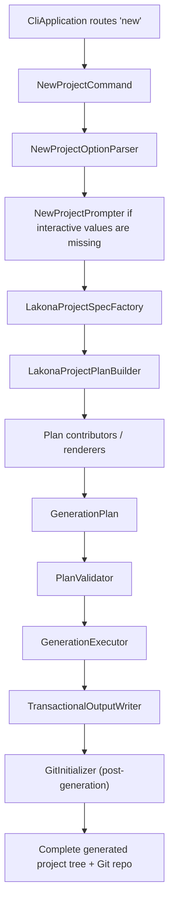

# Lakona Project Generation Architecture

Status: implemented maintenance reference
Date: 2026-06-11
Audience: maintainers and contributors

## Purpose

`src/Lakona.ProjectSystem` owns generated Lakona.Game project creation. Both
`Lakona.Tool` and `Lakona.Hub` are adapters over the same public creation
interface and the same generation pipeline:

```txt
user intent -> LakonaProjectCreationRequest -> LakonaProjectSpec
            -> GenerationPlan -> transactional write
```

This document preserves the durable maintenance rules behind that pipeline. It
is not a migration plan. Historical starter-refactor steps, file disposition
lists, and implementation sequencing have been intentionally removed.

The default product remains:

```powershell
lakona-tool new
```

It generates a runnable Lakona.Game project with Shared contracts, Server/App,
Server/Hotfix, a client project, compact configuration, cluster defaults,
hotfix defaults, reliable push defaults, and generated project docs.

`Lakona.Tool` also exposes the v1 production hotfix package format and local node
operations. It does not own remote deployment or multi-node orchestration.

`LakonaProjectCreator.CreateAsync` is the canonical creation seam. It accepts a
`LakonaProjectCreationRequest` and returns a `LakonaProjectCreationResult`.
Defaults, validation, project layout, package versions, rendering,
transactional writes, and Git initialization remain internal to
`Lakona.ProjectSystem`. The CLI remains a supported adapter; the desktop
application does not replace it.

## Architecture Decision

`Lakona.ProjectSystem` is one coherent project generator. Neither adapter may
contain a hidden standalone RPC starter layer, a second renderer graph, or a
two-phase `Starter -> Augment` flow.

The tool answers one question:

```txt
Given a Lakona project specification, what complete project tree should exist?
```

It must not answer:

```txt
Given an old RPC starter tree, what patches turn it into a Game tree?
```

Shared RPC concerns are part of the Lakona project recipe. They are not a
separate internal product that the Game generator wraps.

## Required Invariants

These invariants are regression boundaries:

- Tool and Hub map their input to one `LakonaProjectCreationRequest`.
- Only `LakonaProjectSystem.LakonaProjectCreator` turns that request into one
  `LakonaProjectSpec`.
- One `LakonaProjectSpec` builds one `GenerationPlan`.
- The `new` command writes only from a validated plan.
- No renderer writes to disk directly.
- No renderer reads or mutates files created by another renderer.
- No `new` path performs in-place project XML mutation.
- No generated path contains a `Server/Server/` directory.
- No production code references `Lakona.Tool.RpcStarter`.
- No production code has `Starter*` model names for the generation pipeline.
- No generated user file contains removed framework branding or old starter
  brand text.
- Runtime package boundaries remain visible in generated projects.
- Generated RPC glue remains source-generator output, never committed files.

`MergeXml` style operations may exist only for future maintenance commands such
as `sync` or `upgrade`. The `new` command stays create-from-plan only.

## Module Layout

The implemented source tree is organized by responsibility:

```txt
src/Lakona.Tool/Cli/
  Program.cs
  CliApplication.cs
  Commands/
    NewProjectCommand.cs
  Options/
    NewProjectOptions.cs
    NewProjectOptionParser.cs
    NewProjectPrompter.cs
  Text/
    ToolText.cs
  Terminal/
    ICliTerminal.cs
    ConsoleCliTerminal.cs

src/Lakona.ProjectSystem/
  LakonaProjectCreationRequest.cs
  LakonaProjectCreationResult.cs
  LakonaProjectCreator.cs

src/Lakona.ProjectSystem/Generation/Domain/
  ClientEngine.cs
  TransportKind.cs
  SerializerKind.cs
  DeploymentProfile.cs
  NuGetForUnitySource.cs
  ProjectCapability.cs
  LakonaProjectSpec.cs
  LakonaProjectSpecFactory.cs
  ProjectLayout.cs
  PackageCatalog.cs

src/Lakona.ProjectSystem/Generation/Planning/
  LakonaProjectGenerator.cs
  LakonaProjectPlanBuilder.cs
  GenerationPlan.cs
  GenerationPlanBuilder.cs
  GeneratedFile.cs
  GeneratedDirectory.cs
  GeneratedArchive.cs
  GeneratedFileKind.cs
  FileWriteMode.cs
  DependencyPlanner.cs
  PackageReferenceSpec.cs
  PlanValidator.cs

src/Lakona.ProjectSystem/Generation/Rendering/
  Common/
  Shared/
  Server/
  Client/
  Operations/
  Docs/

src/Lakona.ProjectSystem/Generation/Execution/
  GenerationExecutor.cs
  TransactionalOutputWriter.cs
  GitInitializer.cs
  GitInitializationResult.cs
  IGitCommandRunner.cs
  ToolFileSystem.cs

src/Lakona.ProjectSystem/Generation/Infrastructure/
  GitCommandRunner.cs
```

`CliApplication` routes commands and translates CLI usage failures. It should
not know project layout, package references, Unity, Godot, or file rendering.
For hotfix operations it should route to focused command classes under
`Cli/Commands/Hotfix/`.

`LakonaProjectGenerator` is the high-level generation facade. It builds and
validates a plan, executes it transactionally, and runs post-generation Git
initialization (init + initial commit) when the environment supports it.
Git initialization is not part of the render plan and runs only after
transactional write success. The generator returns a
`LakonaProjectGenerationResult` with the root path and Git status.

## Server Package Operation

`lakona-tool server pack --runtime linux-x64` creates the initial deployable
server zip. It publishes `Server/App/Server.App.csproj` as a self-contained,
RID-specific, untrimmed application and installs the initial hotfix version into
the production `hotfix/current.txt` plus `hotfix/versions/<version>/READY`
layout.

The server package remains a normal published app tree inside a zip. V1 does
not enable publish trimming, single-file publish, NativeAOT, or Docker image
creation.

`lakona-tool hotfix pack` remains the follow-up patch package command.

## Hotfix Operations

V1 hotfix commands are node-local except for `pack`, which runs in a build or CI
workspace:

```txt
lakona-tool hotfix pack
lakona-tool hotfix install <zip> --root <hotfix-root>
lakona-tool hotfix activate <version> --server http://127.0.0.1:<admin-port>
lakona-tool hotfix status --server http://127.0.0.1:<admin-port>
lakona-tool hotfix rollback --server http://127.0.0.1:<admin-port>
```

The tool must reject non-loopback `--server` URLs in v1. It is a local control
plane client, not a remote deploy client.

`hotfix pack`:

- locates `Server/Hotfix/Server.Hotfix.csproj` by default
- builds or publishes the hotfix project for Release
- reads the shared `BuildTag`
- creates a UTC timestamp version accurate to seconds, such as
  `v20260612-153045Z`
- writes `hotfix.json`
- writes `checksums.sha256`
- emits `artifacts/hotfix/Server.Hotfix-v20260612-153045Z.zip`

`hotfix install`:

- runs on a target node after an external deployment system copies the package
- extracts into `hotfix/staging/<operationId>/`
- validates `hotfix.json` and `checksums.sha256`
- moves the verified directory to `hotfix/versions/<version>/`
- writes `READY` last
- succeeds idempotently if the same version already exists with identical
  checksums
- fails if the same version exists with different content

`hotfix activate`, `status`, and `rollback` call the running node's loopback
HTTP JSON admin endpoint. `activate` performs authoritative validation inside
the running server process before publishing new dispatch tables.

V1 deliberately excludes:

- uploading packages to remote nodes
- rolling over multiple nodes
- public admin endpoint authentication
- production file watchers

## Pipeline



Renderers implement `IPlanContributor` and contribute `GeneratedFile`,
`GeneratedDirectory`, and when needed `GeneratedArchive` entries. A renderer
does not call `File.WriteAllText`, `Directory.CreateDirectory`, or
`XDocument.Load`.

Only the selected client renderer contributes client files. A Godot plan must
not include Unity `Assets/` files, Unity `.meta` files, or NuGetForUnity files.

## Core Data Flow

### Parse Options

`NewProjectOptionParser` returns typed options. Aliases and strings are
normalized at the CLI edge only; downstream code uses enums.

Supported user-facing options:

- `--name`
- `--output`
- `--client-engine unity|tuanjie|godot|console`
- `--client-engine-version 2022|6.0|6.3` for Unity, `1.6.7` for Tuanjie,
  and `4.6` for Godot; the option does not apply to Console
- `--transport tcp|websocket|kcp`
- `--serializer json|memorypack`
- `--nugetforunity-source embedded|openupm`
- `--deploy-profile none|compose`

Do not reintroduce `--network-profile`, `single`, or `realtime` generation
paths. Unsupported historical options should fail with normal
unsupported-option diagnostics.

Interactive prompting asks for values needed to form a project spec:

1. project name
2. client engine
3. Unity version when Unity is selected
4. transport
5. serializer

Non-interactive generation defaults Unity to `2022`. Tuanjie and Godot resolve
their single current supported versions automatically. NuGetForUnity source,
deployment profile, and output path keep documented defaults unless explicitly
provided.

### Build Project Spec

`LakonaProjectSpec` is the single source of generation intent:

```csharp
internal sealed record LakonaProjectSpec(
    string Name,
    ProjectLayout Layout,
    ClientEngine ClientEngine,
    ClientEngineVersion? ClientEngineVersion,
    TransportKind Transport,
    SerializerKind Serializer,
    NuGetForUnitySource NuGetForUnitySource,
    DeploymentProfile DeploymentProfile,
    IReadOnlyList<ProjectCapability> Capabilities);
```

`LakonaProjectSpecFactory` owns defaulting, naming, layout, and default capability
selection. Keep name sanitation here rather than spreading it across renderers.

Default generation-time capabilities include:

- `ClusterLocal`
- `Hotfix`
- `ReliablePush`
- `LoginSlice`
- `GameSlice`

These are generation choices. They do not become runtime `Enabled` flags in
`appsettings.json`.

### Build Generation Plan

`LakonaProjectPlanBuilder` creates a complete immutable plan:

```csharp
internal sealed record GenerationPlan(
    string RootPath,
    IReadOnlyList<GeneratedFile> Files,
    IReadOnlyList<GeneratedDirectory> Directories,
    IReadOnlyList<PlanDiagnostic> Diagnostics,
    IReadOnlyList<GeneratedArchive>? Archives = null);
```

Plan validation must catch:

- duplicate relative paths
- writes outside the output root
- generated RPC glue directories
- `Server/Server/` paths
- removed framework branding or old starter brand text in generated user files
- `Cluster.Enabled` or `Hotfix.Enabled` config keys
- generated process-wide reliable-push switches

Validation errors fail generation before a staging directory is created.

### Execute Transactionally

`GenerationExecutor` and `TransactionalOutputWriter` know paths, write modes,
text normalization, embedded archive extraction, and rollback. They should not
understand Unity, Godot, RPC, Game, hotfix, or package rules.

Transactional execution is:

1. Resolve target root.
2. Fail if target root exists and is not empty.
3. Create a sibling staging root named `.<ProjectName>.tmp-<random>`.
4. Write all directories and files into staging.
5. Extract embedded archives into staging only.
6. Move staging root to final target root.
7. On failure before the move, delete staging.
8. On move failure, keep the original target untouched and report cleanup
   failure if cleanup also fails.

The writer must reject path traversal before writing or extracting archives.

## Dependency Planning

`DependencyPlanner` is the single package planner for generated targets:

```csharp
internal enum ProjectTarget
{
    Shared,
    ServerApp,
    ServerHotfix,
    UnityClient,
    GodotClient,
    ConsoleClient
}
```

`PackageCatalog` owns package versions. It keeps MSBuild-generated Lakona
package versions and external dependency versions in one typed catalog.
Package version changes that flow through generated starter projects are covered
by the graph-based release guard in
[Package Version Graph Guard](./package-version-graph.md).

Rules:

- Shared owns `Lakona.Rpc.Core`.
- Shared owns MemoryPack serializer and MemoryPack generator when serializer is
  MemoryPack.
- ServerApp owns `Lakona.Game.Server`, hotfix runtime, hotfix generators, RPC
  server, cluster packages, RPC analyzers, and the selected client-facing
  transport and serializer packages.
- Every ServerApp owns `Lakona.Game.Cluster.Rpc.Transport.Tcp`. JSON projects
  own `Lakona.Game.Cluster.Rpc.Serializer.Json`; MemoryPack projects own
  `Lakona.Game.Cluster.Rpc.Serializer.MemoryPack`. Neither project restores the
  unselected cluster serializer.
- Generated server startup explicitly registers the selected endpoint
  transport, endpoint serializer, and cluster serializer. Configuration names
  must resolve to those registrations; the framework does not carry or
  silently discover every concrete implementation.
- Unity-compatible clients use NuGetForUnity `packages.config` with
  `targetFramework="netstandard2.1"` on every package entry and keep explicit
  runtime package dependencies needed by Unity and Tuanjie.
- Godot clients use SDK-style package references and do not repeat MemoryPack
  runtime packages already owned by Shared.
- Console clients use SDK-style package references and keep load-test
  orchestration in `Lakona.Game.LoadTesting`, while generated project code owns
  business-specific smoke and load flows.

### Target Dependency Matrix

`DependencyPlanner` should have direct tests for this matrix.

| Target | Always Includes | Conditional Includes |
| --- | --- | --- |
| Shared | `Lakona.Rpc.Core` | MemoryPack serializer package, `MemoryPack`, `MemoryPack.Generator` when serializer is MemoryPack |
| ServerApp | `Microsoft.Extensions.Hosting`, `Lakona.Game.Server`, `Lakona.Game.Server.Hotfix`, `Lakona.Game.Server.Hotfix.Generators`, `Lakona.Rpc.Server`, selected transport, selected serializer, `Lakona.Rpc.Analyzers`, cluster packages for default local cluster | Cluster MemoryPack formatter package for MemoryPack |
| ServerHotfix | project references to Shared and ServerApp | no direct runtime package duplication unless hotfix APIs require it |
| UnityClient | `Lakona.Rpc.Core`, `Lakona.Rpc.Client`, selected transport, selected serializer, `Lakona.Rpc.Analyzers`, `Lakona.Game.Client`, `Lakona.Game.Abstractions`, `System.Threading.Channels` | Unity KCP dependencies, JSON dependencies, MemoryPack/Roslyn dependencies |
| GodotClient | `Lakona.Rpc.Core`, `Lakona.Rpc.Client`, selected transport, `Lakona.Rpc.Analyzers`, `Lakona.Game.Client` | JSON serializer for JSON projects, local Godot SDK NuGet source if detected |
| ConsoleClient | `Lakona.Rpc.Core`, `Lakona.Rpc.Client`, selected transport, selected serializer, `Lakona.Rpc.Analyzers`, `Lakona.Game.Client`, `Lakona.Game.LoadTesting` | none |

Analyzer references must keep private metadata:

```xml
<PackageReference Include="Lakona.Rpc.Analyzers" Version="...">
  <PrivateAssets>all</PrivateAssets>
  <IncludeAssets>runtime; build; native; contentfiles; analyzers; buildtransitive</IncludeAssets>
</PackageReference>
```

Analyzer package references should keep `OutputItemType="Analyzer"` and
`PrivateAssets="all"` when rendered as attributes.

## Rendering Boundaries

Renderers are target-oriented:

- They receive `LakonaProjectSpec` and pure helpers.
- They emit plan entries with relative paths.
- They own every path they emit.

If two renderers need to affect one file, the file owner should expose a typed
input model instead of allowing both renderers to emit or mutate the same path.

### Path Ownership Table

| Path Prefix | Owner |
| --- | --- |
| `.gitignore`, `.gitattributes` | `GitRenderer` |
| `Shared/**` | `SharedProjectRenderer` and `SharedContractsRenderer` |
| `Server/Server.slnx` | `ServerAppRenderer` |
| `Server/App/**` | `ServerAppRenderer` |
| `Server/Hotfix/**` | `HotfixRenderer` |
| `Client/**` for Unity/Tuanjie | `UnityClientRenderer` |
| `Client/**` for Godot | `GodotClientRenderer` |
| `Client/**` for Console | `ConsoleClientRenderer` |
| `docker-compose.cluster.yml`, `.env.cluster.example`, `ops/**`, `Server/Dockerfile` | `OperationsRenderer` |
| `README.md`, `AGENTS.md`, `CLAUDE.md` | `GeneratedProjectGuideRenderer` |

### Shared Renderer

Shared owns contracts and cross-side project metadata:

- `Shared/Shared.csproj`
- `Shared/Directory.Build.props`
- `Shared/Shared.asmdef`
- `Shared/package.json`
- `Shared/Contracts/**`

Unity-facing shared source stays C# 9 compatible. MemoryPack source generation
stays in Shared, not duplicated in server or Godot clients.

### Server Renderers

`ServerAppRenderer` owns the stable server app:

- `Server/Server.slnx`
- `Server/App/Server.App.csproj`
- `Server/App/Program.cs`
- `Server/App/appsettings.json`
- stable server orchestration files

`Program.cs` should stay a thin composition root and delegate lifecycle to
`LakonaGameServer.RunAsync`. It explicitly registers only the transport and
serializer implementations selected during generation. Do not render the old
low-level `RpcServerHostBuilder` starter program or unrelated framework wiring.
A generated KCP + MemoryPack host has this shape:

```csharp
using Lakona.Game.Cluster.Rpc.Serializer.MemoryPack;
using Lakona.Game.Cluster.Rpc.Transport.Tcp;
using Lakona.Game.Server.Hosting;

return await LakonaGameServer.RunAsync(args, static server => server
    .UseClusterRpc(TcpClusterRpcTransport.Default, MemoryPackClusterRpcSerializer.Default)
    .RegisterEndpointTransport("kcp", static endpoint => new KcpConnectionAcceptor(endpoint.Port, endpoint.Host))
    .RegisterEndpointSerializer("memorypack", static () => new MemoryPackRpcSerializer()));
```

`HotfixRenderer` owns:

- `Server/Hotfix/Server.Hotfix.csproj`
- hotfix rule/service files
- hotfix copy target model

The hotfix project may reference `Server.App.csproj`, but `Server.App.csproj`
must not reference the hotfix project as a normal compile dependency.

### Client Renderers

`UnityClientRenderer` owns Unity and Tuanjie files:

- `Client/Packages/manifest.json`
- the complete version-specific Unity new-project package baseline for Unity
  `2022`, `6.0`, or `6.3`; package identities and versions come from the
  selected editor baseline, and Lakona-specific packages are added on top
- the complete Tuanjie new-project package baseline for Tuanjie clients,
  including Codely Bridge, Tuanjie Version Control, Engineering tools,
  TextMeshPro, Timeline, Visual Scripting, Infinity, and its default built-in
  modules; Lakona-specific packages are added on top
- `Client/ProjectSettings/ProjectVersion.txt`
- `Client/ProjectSettings/ProjectSettings.asset`, including the default 800×600
  windowed, resizable desktop player configuration and the new Input System as
  the sole active input backend
- `Client/Assets/packages.config`
- `Client/Assets/NuGet.config`
- a file-backed Input Actions asset for gameplay movement
- arena login, input, snapshot, and procedural rendering scripts
- UXML, USS, PanelSettings, scene files, meta files
- NuGet package import guard

The generated scene owns an `EventSystem` with `InputSystemUIInputModule` so UI
Toolkit pointer, keyboard, and text-field input is functional without the
legacy Input Manager. Gameplay code reads the generated `Player/Move` action;
it must not fall back to `UnityEngine.Input` or use `Active Input Handling = Both`.

Unity and Tuanjie generated scripts must obey the repository Unity rules:

- C# 9 compatible syntax only
- no `System.Reflection.Emit`
- no runtime code generation
- no checked-in RPC generated client source

Generated Unity and Tuanjie clients consume Lakona's multi-TFM NuGet
packages through Unity's single plugin import model. They must keep shared
Lakona packages multi-targeted for SDK clients, but Unity import state must be
deterministic:

- `Client/Assets/packages.config` declares `targetFramework="netstandard2.1"`
  for every NuGetForUnity package entry. This guides NuGet dependency
  resolution; it does not replace plugin import enforcement.
- `Client/Assets/Editor/LakonaGameNuGetPackageImportGuard.cs` enforces
  `Assets/Packages/**` plugin compatibility after NuGet restore or import.
- Analyzer and generator DLLs must be disabled as Unity plugins.
- Runtime DLLs under incompatible TFM roots such as `lib/net10.0/`,
  `lib/net9.0/`, `lib/net8.0/`, `lib/net7.0/`, `lib/net6.0/`, `lib/net472/`,
  `lib/net48/`, and `lib/net481/` must be disabled for Any Platform, Editor,
  and explicit platform targets.
- Runtime DLLs under `lib/netstandard2.1/` are the preferred enabled Unity
  plugin set. `lib/netstandard2.0/` is enabled only when the same package does
  not contain a `netstandard2.1` sibling for that assembly; shadowed
  `netstandard2.0` DLLs must be disabled.

This policy is a Unity consumption boundary only. Godot and Console clients
continue to use SDK-style `PackageReference` resolution and the modern TFMs
selected by their project files.

`GodotClientRenderer` owns Godot files:

- `Client/project.godot`
- `Client/Client.csproj`
- `Client/NuGet.config` when local Godot SDK packages are used
- `Client/Game.tscn`
- `Client/Theme/LakonaTheme.tres`
- arena login, input, snapshot, and procedural drawing scripts

Godot UI should be file-backed. Do not reintroduce C# `BuildUi` methods for
the default scene. Unity and Godot game visuals must use engine-provided drawing
primitives and generated runtime textures only; default projects do not pack
external art assets.

The generated Godot `GameScene` also owns the `LAKONA_GODOT_SMOKE` headless
verification hook. That hook must exercise the current default arena contract by
connecting and logging in, emit `Arena smoke ok:` only after login succeeds, and
terminate Godot with a non-zero exit code when connection or login fails. CI must
not depend on smoke behavior retained in non-default legacy scenes.

`ConsoleClientRenderer` owns a lightweight SDK-style .NET client:

- `Client/Client.csproj`
- `Client/Program.cs`
- `Client/ClientRuntime/**`
- `Client/LoadScenarios/**`

The generated Console client is a headless operations and load-test client. It
must not emit Unity assets, Godot scenes, or NuGetForUnity files.

### Operations And Docs Renderers

`OperationsRenderer` owns compose output only when
`DeploymentProfile.Compose` is selected.

`GeneratedProjectGuideRenderer` owns generated project guide files:

- `README.md`
- `AGENTS.md`
- `CLAUDE.md`

## Generated Project Layout

The generated project layout is:

```txt
MyGame/
  .gitattributes
  .gitignore
  README.md
  AGENTS.md
  CLAUDE.md
  Shared/
    Shared.csproj
    Directory.Build.props
    Shared.asmdef
    package.json
    Contracts/
  Server/
    Server.slnx
    App/
      Server.App.csproj
      Program.cs
      appsettings.json
      Game/
    Hotfix/
      Server.Hotfix.csproj
      Game/
  Client/
    ...
  ops/
    ...
```

There must be no `Server/Server/` directory in newly generated projects.

## Generated Runtime Story

The default generated project demonstrates Lakona.Game as one vertical slice:

```txt
client login RPC
  -> framework/source-generated hotfix-backed service binding
  -> current Server.Hotfix GameService
  -> pre-created GameWorldActor state shell
  -> current Server.Hotfix GameWorldBehavior inside the actor turn
  -> periodic authoritative world simulation
  -> server-pushed world snapshots resolved from each current Game Session
```

The generated server must not use static mutable process state for world
concurrency. Player identity and online state, monsters, bullets, health,
scores, respawn timers, and simulation time belong in one `GameWorldActor`.
The state is intentionally in memory only and is lost on server restart.
A hotfix-enabled actor should keep fields and mailbox ownership only.
Replaceable request and simulation logic belongs in
`Server.Hotfix` Service classes, and actor state behavior belongs in
one-to-one `Server.Hotfix` Behavior classes.

The arena accepts player direction input only; the server computes movement,
automatic firing, monster spawning and pursuit, collision damage, PvP/PvE
scores, death, and five-second respawn. A disconnected player is removed from
published snapshots immediately. The simulation timer publishes authoritative
world snapshots to online players by their current `GameSessionKey`; callback
proxies are resolved at send time and are never stored in actor or session
state. Player state remains available for a
same-name reconnect. Online duplicate names are rejected. Client player colors
come from a stable FNV-1a hash of the server-assigned player id and a fixed
palette that excludes monster green.

Generated RPC bindings are framework/source-generated hotfix-backed bindings,
not generated business orchestration in `Server/App`. They must dispatch to the
current `Server.Hotfix` service implementation so already-connected clients use
new Service logic on their next RPC call after a successful reload.

The generated root guide files (README.md, AGENTS.md, CLAUDE.md) point users to
three edit zones:

- `Shared/Contracts/` for RPC contracts, callback contracts, reliable push DTOs,
  and named contract ids.
- `Server/App/` for thin host composition, compact runtime
  configuration, actor state shells, `BuildTag`, and local admin endpoint
  metadata.
- `Server/Hotfix/` for Services, Actor Behaviors, lifecycle reactions, and
  actor startup and timer callbacks.

## Configuration Contract

Generated `Server/App/appsettings.json` contains only compact source values:

```json
{
  "Lakona": {
    "Node": {
      "Id": "dev-1"
    },
    "Cluster": {
      "Serializer": "memorypack"
    },
    "Sessions": {
      "ResumeWindowSeconds": 60
    },
    "Management": {
      "Http": {
        "Host": "127.0.0.1",
        "Port": 20080
      }
    },
    "Health": {
      "Enabled": true,
      "RequireLoopback": true
    },
    "Observability": {
      "LocalAdmin": {
        "Enabled": true,
        "RequireLoopback": true
      }
    },
    "Endpoints": [
      {
        "Transport": "kcp",
        "Serializer": "memorypack",
        "Host": "127.0.0.1",
        "Port": 20000,
        "ReliablePush": true,
        "RpcServices": [ "game" ]
      }
    ]
  }
}
```

For WebSocket transport, include only `"Path": "/ws"` in the endpoint entry.
Actor startup is explicit by default: generated `Program.cs` registers only
the selected transport and serializer implementations and does not emit
business service or actor-registration callbacks. Single-node starter
projects do not generate component selection. If a generated project later
splits into multiple processes, use `Lakona:ActorHosts` and
`Lakona:StartupActors` to select actor host capabilities and startup actors.

RPC service exposure is endpoint-local. Put generated service names in the
endpoint's `RpcServices` array and generated serializer names in endpoint
`Serializer`; do not generate endpoint `Name` or
`Lakona:Cluster:Services`.

Starter projects may omit `Lakona:Cluster`; the framework supplies default
one-node cluster values. The `--serializer` choice selects the explicit
cluster serializer package and `UseClusterRpc` adapter in generated code; it
does not emit a second serializer selector in configuration. Cluster
serializer selection drives node-to-node cluster RPC payloads and remote actor
payloads. It does not
change the `LakonaInternalCodec` used for framework handshake, heartbeat,
reliable push ack, and session termination notice payloads.

Generated hotfix startup hooks own fixed local actor creation through startup
declarations. The arena startup hook declares its world actor with:

```csharp
[HotfixStartup]
public static class HotfixStartup
{
    [HotfixConfigureActors]
    public static void ConfigureActors(ActorHostBuilder actors)
    {
        actors.RegisterStartup<GameWorldActor, string>(static context => context.Candidates[0]);
    }
}
```

Generated actor access roots are selector surfaces only. They must expose
behavior-first `Route`, `Local`, and `Startup` accessors where applicable, and must
not generate actor lifecycle methods such as `SpawnAsync` or `DestroyAsync`.
Generated projects must not emit parallel actor creation paths outside the
method marked `[HotfixConfigureActors]` and generated actor placement APIs.

Single-node local generation emits `Lakona:Hotfix:DebugWatcher=On` so rebuilds
of `Server/Hotfix` use the current output directory and trigger reload through
`reload.signal`.

Default local generation must not emit these keys:

- `Cluster.Enabled`
- `Hotfix.Enabled`
- process-wide reliable-push switches
- `Node.Profile`
- `Hotfix.Directory`
- `ReliablePush.Outbox`
- `Services`
- `Bootstrap`
- endpoint `Name`

Derived runtime state belongs in generated server code and check output, not
default JSON.

Generated business endpoints explicitly emit `"ReliablePush": true`.
Hand-authored endpoints default to best effort when the property is omitted;
there is no global reliable-push enable switch.

Generated local projects bind one loopback management HTTP listener and enable
both health and local-admin routes. The listener address belongs to
`Lakona:Management:Http`; each route family keeps its own enablement and
loopback policy.

## Regression Checks

Generation changes should keep or update public-facade tests under
`tests/Lakona.ProjectSystem.Tests` and adapter/legacy pipeline tests under
`tests/Lakona.Tool.Tests` for:

- option parsing and interactive prompting
- project spec defaults
- package matrix for every target role
- plan validation rejecting duplicate paths, legacy paths, and forbidden content
- generated compact `appsettings.json`
- server program delegating to `LakonaGameServer.RunAsync`
- no project-local generated RPC glue
- Unity/Tuanjie package metadata and import guard
- Unity NuGet plugin policy checker for forbidden TFMs and shadowed
  `netstandard2.0` plugin metas
- Godot `.tscn` and `.tres` files generated as files, not C# UI builders
- compose files using `Server/App/Server.App.csproj`, not `Server/Server/`
- transactional rollback leaving no target directory after renderer failure
- generated project scans containing no legacy starter brand text

Useful source scans:

```powershell
rg "RpcStarter|StarterTemplate|StarterPaths|AugmentProjectWithLakonaGame" src/Lakona.Tool tests/Lakona.Tool.Tests
rg "Server/Server/|Server\\\\Server\\\\|network-profile|realtime|single" src/Lakona.Tool tests/Lakona.Tool.Tests
```

`Server/Server.slnx` is valid and should not be treated as a legacy nested
server directory.

For normal validation, follow `CONTRIBUTING.md`:

```powershell
dotnet build Lakona.slnx
dotnet test Lakona.slnx --no-build
```

For tool-focused changes, `dotnet test tests/Lakona.Tool.Tests/Lakona.Tool.Tests.csproj`
is the minimum targeted check.
