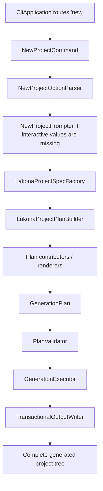

# Lakona.Tool Generation Architecture

Status: implemented maintenance reference
Date: 2026-06-11
Audience: maintainers and contributors

## Purpose

`src/Lakona.Tool` owns generated Lakona.Game project creation. The implemented
architecture is a single generation pipeline:

```txt
CLI options -> LakonaProjectSpec -> GenerationPlan -> transactional write
```

This document preserves the durable maintenance rules behind that pipeline. It
is not a migration plan. Historical starter-refactor steps, file disposition
lists, and implementation sequencing have been intentionally removed.

The default product remains:

```powershell
lakona-tool new
```

It generates a runnable Lakona.Game project with Shared contracts, Server/App,
Server/Hotfix, a client project, compact configuration, cluster defaults,
hotfix defaults, reliable push defaults, and generated project docs.

`Lakona.Tool` also owns the v1 production hotfix package format and local node
operations. It does not own remote deployment or multi-node orchestration.

## Architecture Decision

`Lakona.Tool` is one coherent project generator. It must not contain a hidden
standalone RPC starter layer or a two-phase `Starter -> Augment` flow.

The tool answers one question:

```txt
Given a Lakona project specification, what complete project tree should exist?
```

It must not answer:

```txt
Given an old RPC starter tree, what patches turn it into a Game tree?
```

Shared RPC concerns are part of the Lakona project recipe. They are not a
separate internal product that the Game generator wraps.

## Required Invariants

These invariants are regression boundaries:

- One `new` command builds one `LakonaProjectSpec`.
- One `LakonaProjectSpec` builds one `GenerationPlan`.
- The `new` command writes only from a validated plan.
- No renderer writes to disk directly.
- No renderer reads or mutates files created by another renderer.
- No `new` path performs in-place project XML mutation.
- No generated path contains a `Server/Server/` directory.
- No production code references `Lakona.Tool.RpcStarter`.
- No production code has `Starter*` model names for the generation pipeline.
- No generated user file contains `ULinkRPC`, `ULinkGame`, or `RpcStarter`.
- Runtime package boundaries remain visible in generated projects.
- Generated RPC glue remains source-generator output, never committed files.

`MergeXml` style operations may exist only for future maintenance commands such
as `sync` or `upgrade`. The `new` command stays create-from-plan only.

## Module Layout

The implemented source tree is organized by responsibility:

```txt
Cli/
  Program.cs
  CliApplication.cs
  Commands/
    NewProjectCommand.cs
  Options/
    NewProjectOptions.cs
    NewProjectOptionParser.cs
    NewProjectPrompter.cs
  Text/
    ToolText.cs
  Terminal/
    ICliTerminal.cs
    ConsoleCliTerminal.cs

Domain/
  ClientEngine.cs
  TransportKind.cs
  SerializerKind.cs
  PersistenceKind.cs
  DeploymentProfile.cs
  NuGetForUnitySource.cs
  ProjectFeature.cs
  LakonaProjectSpec.cs
  LakonaProjectSpecFactory.cs
  ProjectLayout.cs
  PackageCatalog.cs

Planning/
  LakonaProjectGenerator.cs
  LakonaProjectPlanBuilder.cs
  GenerationPlan.cs
  GenerationPlanBuilder.cs
  GeneratedFile.cs
  GeneratedDirectory.cs
  GeneratedArchive.cs
  GeneratedFileKind.cs
  FileWriteMode.cs
  DependencyPlanner.cs
  PackageReferenceSpec.cs
  PlanValidator.cs

Rendering/
  Common/
  Project/
  Shared/
  Server/
  Client/
  Operations/
  Docs/

Execution/
  GenerationExecutor.cs
  TransactionalOutputWriter.cs
  ToolFileSystem.cs
```

`CliApplication` routes commands and translates CLI usage failures. It should
not know project layout, package references, Unity, Godot, or file rendering.
For hotfix operations it should route to focused command classes under
`Cli/Commands/Hotfix/`.

`LakonaProjectGenerator` is the high-level generation facade. It builds and
validates a plan, then executes it transactionally.

## Hotfix Operations

V1 hotfix commands are node-local except for `pack`, which runs in a build or CI
workspace:

```txt
lakona-tool hotfix pack
lakona-tool hotfix install <zip> --root <hotfix-root>
lakona-tool hotfix activate <version> --server http://127.0.0.1:<admin-port>
lakona-tool hotfix status --server http://127.0.0.1:<admin-port>
lakona-tool hotfix rollback --server http://127.0.0.1:<admin-port>
```

The tool must reject non-loopback `--server` URLs in v1. It is a local control
plane client, not a remote deploy client.

`hotfix pack`:

- locates `Server/Hotfix/Server.Hotfix.csproj` by default
- builds or publishes the hotfix project for Release
- reads the shared `BuildTag`
- creates a UTC timestamp version accurate to seconds, such as
  `v20260612-153045Z`
- writes `hotfix.json`
- writes `checksums.sha256`
- emits `artifacts/hotfix/Server.Hotfix-v20260612-153045Z.zip`

`hotfix install`:

- runs on a target node after an external deployment system copies the package
- extracts into `hotfix/staging/<operationId>/`
- validates `hotfix.json` and `checksums.sha256`
- moves the verified directory to `hotfix/versions/<version>/`
- writes `READY` last
- succeeds idempotently if the same version already exists with identical
  checksums
- fails if the same version exists with different content

`hotfix activate`, `status`, and `rollback` call the running node's loopback
HTTP JSON admin endpoint. `activate` performs authoritative validation inside
the running server process before publishing new dispatch tables.

V1 deliberately excludes:

- uploading packages to remote nodes
- rolling over multiple nodes
- public admin endpoint authentication
- production file watchers

## Pipeline



Renderers implement `IPlanContributor` and contribute `GeneratedFile`,
`GeneratedDirectory`, and when needed `GeneratedArchive` entries. A renderer
does not call `File.WriteAllText`, `Directory.CreateDirectory`, or
`XDocument.Load`.

Only the selected client renderer contributes client files. A Godot plan must
not include Unity `Assets/` files, Unity `.meta` files, or NuGetForUnity files.

## Core Data Flow

### Parse Options

`NewProjectOptionParser` returns typed options. Aliases and strings are
normalized at the CLI edge only; downstream code uses enums.

Supported user-facing options:

- `--name`
- `--output`
- `--client-engine unity|unity-cn|tuanjie|godot`
- `--transport tcp|websocket|kcp`
- `--serializer json|memorypack`
- `--persistence none|mysql|postgres`
- `--nugetforunity-source embedded|openupm`
- `--deploy-profile none|compose`

Do not reintroduce `--network-profile`, `single`, or `realtime` generation
paths. Unsupported historical options should fail with normal
unsupported-option diagnostics.

Interactive prompting asks only for values needed to form a project spec:

1. project name
2. client engine
3. transport
4. serializer

Persistence, NuGetForUnity source, deployment profile, and output path keep
documented defaults unless explicitly provided.

### Build Project Spec

`LakonaProjectSpec` is the single source of generation intent:

```csharp
internal sealed record LakonaProjectSpec(
    string Name,
    ProjectLayout Layout,
    ClientEngine ClientEngine,
    TransportKind Transport,
    SerializerKind Serializer,
    PersistenceKind Persistence,
    NuGetForUnitySource NuGetForUnitySource,
    DeploymentProfile DeploymentProfile,
    IReadOnlyList<ProjectFeature> Features);
```

`LakonaProjectSpecFactory` owns defaulting, naming, layout, and default feature
selection. Keep name sanitation here rather than spreading it across renderers.

Default generation-time features include:

- `ClusterLocal`
- `Hotfix`
- `ReliablePush`
- `LoginSlice`
- `ChatSlice`

These are generation choices. They do not become runtime `Enabled` flags in
`appsettings.json`.

### Build Generation Plan

`LakonaProjectPlanBuilder` creates a complete immutable plan:

```csharp
internal sealed record GenerationPlan(
    string RootPath,
    IReadOnlyList<GeneratedFile> Files,
    IReadOnlyList<GeneratedDirectory> Directories,
    IReadOnlyList<PlanDiagnostic> Diagnostics,
    IReadOnlyList<GeneratedArchive>? Archives = null);
```

Plan validation must catch:

- duplicate relative paths
- writes outside the output root
- generated RPC glue directories
- `Server/Server/` paths
- `RpcStarter`, `ULinkRPC`, or `ULinkGame` strings in generated user files
- `Cluster.Enabled`, `Hotfix.Enabled`, or `ReliablePush.Enabled` config keys

Validation errors fail generation before a staging directory is created.

### Execute Transactionally

`GenerationExecutor` and `TransactionalOutputWriter` know paths, write modes,
text normalization, embedded archive extraction, and rollback. They should not
understand Unity, Godot, RPC, Game, hotfix, or package rules.

Transactional execution is:

1. Resolve target root.
2. Fail if target root exists and is not empty.
3. Create a sibling staging root named `.<ProjectName>.tmp-<random>`.
4. Write all directories and files into staging.
5. Extract embedded archives into staging only.
6. Move staging root to final target root.
7. On failure before the move, delete staging.
8. On move failure, keep the original target untouched and report cleanup
   failure if cleanup also fails.

The writer must reject path traversal before writing or extracting archives.

## Dependency Planning

`DependencyPlanner` is the single package planner for generated targets:

```csharp
internal enum ProjectTarget
{
    Shared,
    ServerApp,
    ServerHotfix,
    UnityClient,
    GodotClient
}
```

`PackageCatalog` owns package versions. It keeps MSBuild-generated Lakona
package versions and external dependency versions in one typed catalog.

Rules:

- Shared owns `Lakona.Rpc.Core`.
- Shared owns MemoryPack serializer and MemoryPack generator when serializer is
  MemoryPack.
- ServerApp owns `Lakona.Game.Server`, hotfix runtime, server generators, RPC
  server, selected transport, cluster packages, persistence packages, and RPC
  analyzers.
- ServerApp owns JSON serializer only for JSON projects. MemoryPack server
  consumption comes through Shared.
- Unity-compatible clients use `packages.config` and keep explicit runtime
  package dependencies needed by Unity and Tuanjie.
- Godot clients use SDK-style package references and do not repeat MemoryPack
  runtime packages already owned by Shared.

### Target Dependency Matrix

`DependencyPlanner` should have direct tests for this matrix.

| Target | Always Includes | Conditional Includes |
| --- | --- | --- |
| Shared | `Lakona.Rpc.Core` | MemoryPack serializer package, `MemoryPack`, `MemoryPack.Generator` when serializer is MemoryPack |
| ServerApp | `Microsoft.Extensions.Hosting`, `Lakona.Game.Server`, `Lakona.Game.Server.Generators`, `Lakona.Game.Server.Hotfix`, `Lakona.Game.Server.Hotfix.Generators`, `Lakona.Rpc.Server`, selected transport, `Lakona.Rpc.Analyzers` | JSON serializer for JSON projects, cluster packages for default local cluster, Dapper and DB provider for external persistence |
| ServerHotfix | project references to Shared and ServerApp | no direct runtime package duplication unless hotfix APIs require it |
| UnityClient | `Lakona.Rpc.Core`, `Lakona.Rpc.Client`, selected transport, selected serializer, `Lakona.Rpc.Analyzers`, `Lakona.Game.Client`, `Lakona.Game.Abstractions`, `System.Threading.Channels` | Unity KCP dependencies, JSON dependencies, MemoryPack/Roslyn dependencies |
| GodotClient | `Lakona.Rpc.Core`, `Lakona.Rpc.Client`, selected transport, `Lakona.Rpc.Analyzers`, `Lakona.Game.Client` | JSON serializer for JSON projects, local Godot SDK NuGet source if detected |

Analyzer references must keep private metadata:

```xml
<PackageReference Include="Lakona.Rpc.Analyzers" Version="...">
  <PrivateAssets>all</PrivateAssets>
  <IncludeAssets>runtime; build; native; contentfiles; analyzers; buildtransitive</IncludeAssets>
</PackageReference>
```

Server generator references should keep `OutputItemType="Analyzer"` and
`PrivateAssets="all"` when rendered as attributes.

## Rendering Boundaries

Renderers are target-oriented:

- They receive `LakonaProjectSpec` and pure helpers.
- They emit plan entries with relative paths.
- They own every path they emit.

If two renderers need to affect one file, the file owner should expose a typed
input model instead of allowing both renderers to emit or mutate the same path.

### Path Ownership Table

| Path Prefix | Owner |
| --- | --- |
| `.gitignore`, `.gitattributes` | `GitRenderer` |
| `lakona-game.tool.json` | `ProjectConfigRenderer` |
| `Shared/**` | `SharedProjectRenderer` and `SharedContractsRenderer` |
| `Server/Server.slnx` | `ServerAppRenderer` |
| `Server/App/**` | `ServerAppRenderer` |
| `Server/Hotfix/**` | `HotfixRenderer` |
| `Client/**` for Unity/Tuanjie | `UnityClientRenderer` |
| `Client/**` for Godot | `GodotClientRenderer` |
| `docker-compose.cluster.yml`, `.env.cluster.example`, `ops/**`, `Server/Dockerfile` | `OperationsRenderer` |
| `docs/GETTING_STARTED.md`, `docs/EDITING_GUIDE.md`, `docs/OPERATIONS.md` | `GeneratedProjectDocsRenderer` |

### Shared Renderer

Shared owns contracts and cross-side project metadata:

- `Shared/Shared.csproj`
- `Shared/Directory.Build.props`
- `Shared/Shared.asmdef`
- `Shared/package.json`
- `Shared/Contracts/**`

Unity-facing shared source stays C# 9 compatible. MemoryPack source generation
stays in Shared, not duplicated in server or Godot clients.

### Server Renderers

`ServerAppRenderer` owns the stable server app:

- `Server/Server.slnx`
- `Server/App/Server.App.csproj`
- `Server/App/Program.cs`
- `Server/App/appsettings.json`
- stable server orchestration files

`Program.cs` should stay thin and delegate to `LakonaGameServer.RunAsync`. Do
not render the old low-level `RpcServerHostBuilder` starter program.

`HotfixRenderer` owns:

- `Server/Hotfix/Server.Hotfix.csproj`
- hotfix rule/service files
- hotfix copy target model

The hotfix project may reference `Server.App.csproj`, but `Server.App.csproj`
must not reference the hotfix project as a normal compile dependency.

### Client Renderers

`UnityClientRenderer` owns Unity and Tuanjie files:

- `Client/Packages/manifest.json`
- `Client/ProjectSettings/ProjectVersion.txt`
- `Client/Assets/packages.config`
- `Client/Assets/NuGet.config`
- login and chat scripts
- UXML, USS, PanelSettings, scene files, meta files
- NuGet package import guard

Unity and Tuanjie generated scripts must obey the repository Unity rules:

- C# 9 compatible syntax only
- no `System.Reflection.Emit`
- no runtime code generation
- no checked-in RPC generated client source

`GodotClientRenderer` owns Godot files:

- `Client/project.godot`
- `Client/Client.csproj`
- `Client/NuGet.config` when local Godot SDK packages are used
- `Client/Login.tscn`
- `Client/Chat.tscn`
- `Client/Theme/LakonaTheme.tres`
- login and chat scripts

Godot UI should be file-backed. Do not reintroduce C# `BuildUi` methods for
the default scenes.

### Project, Operations, And Docs Renderers

`ProjectConfigRenderer` owns `lakona-game.tool.json`. This is tool metadata, not
server runtime configuration.

`OperationsRenderer` owns compose output only when
`DeploymentProfile.Compose` is selected.

`GeneratedProjectDocsRenderer` owns generated project docs:

- `docs/GETTING_STARTED.md`
- `docs/EDITING_GUIDE.md`
- `docs/OPERATIONS.md`

## Generated Project Layout

The generated project layout is:

```txt
MyGame/
  .gitattributes
  .gitignore
  lakona-game.tool.json
  Shared/
    Shared.csproj
    Directory.Build.props
    Shared.asmdef
    package.json
    Contracts/
  Server/
    Server.slnx
    App/
      Server.App.csproj
      Program.cs
      appsettings.json
      Hosting/
      Chat/
      Login/
    Hotfix/
      Server.Hotfix.csproj
      Login/
      Chat/
  Client/
    ...
  docs/
    GETTING_STARTED.md
    EDITING_GUIDE.md
    OPERATIONS.md
  ops/
    ...
```

There must be no `Server/Server/` directory in newly generated projects.

## Generated Runtime Story

The default generated project demonstrates Lakona.Game as one vertical slice:

```txt
client login RPC
  -> stable Server/App service proxy
  -> current Server.Hotfix ChatService
  -> ChatRoomActor through IActorRuntime
  -> current Server.Hotfix ChatRoomBehavior inside the actor turn
  -> reliable chat callback or notification
```

The generated server must not use static mutable process state for chat room
concurrency. Room state belongs in an actor. A hotfix-enabled actor should keep
fields and mailbox ownership only. Replaceable request logic belongs in
`Server.Hotfix` Service classes, and actor state behavior belongs in
one-to-one `Server.Hotfix` Behavior classes.

Generated RPC bindings must hold stable service proxy instances. They must not
hold instances of types loaded from `Server.Hotfix`, because already-connected
clients must use new Service logic on their next RPC call after a successful
reload.

Generated docs should point users to three edit zones:

- `Shared/Contracts/` for RPC contracts, callback contracts, reliable push DTOs,
  and named contract ids.
- `Server/App/` for stable orchestration, actor fields, service proxies, host
  binding, runtime integration, `BuildTag`, and local admin endpoint wiring.
- `Server/Hotfix/` for replaceable Services and Actor Behaviors.

## Configuration Contract

Generated `Server/App/appsettings.json` contains only compact source values:

```json
{
  "Lakona.Game": {
    "Node": {
      "Id": "dev-1"
    },
    "Endpoints": [
      {
        "Transport": "kcp",
        "Host": "127.0.0.1",
        "Port": 20000
      }
    ]
  }
}
```

For WebSocket transport, include only `"Path": "/ws"` in the endpoint entry.

Do not generate these keys:

- `Cluster.Enabled`
- `Hotfix.Enabled`
- `ReliablePush.Enabled`
- `Node.Profile`
- `Hotfix.Directory`
- `ReliablePush.Outbox`
- `Cluster.Directory`
- `Services`
- `Bootstrap`

Derived runtime state belongs in generated server code and check output, not
default JSON.

## Regression Checks

Tool changes should keep or update focused tests under `tests/Lakona.Tool.Tests`
for:

- option parsing and interactive prompting
- project spec defaults
- package matrix for every target role
- plan validation rejecting duplicate paths, legacy paths, and forbidden content
- generated compact `appsettings.json`
- server program delegating to `LakonaGameServer.RunAsync`
- no project-local generated RPC glue
- Unity/Tuanjie package metadata and import guard
- Godot `.tscn` and `.tres` files generated as files, not C# UI builders
- compose files using `Server/App/Server.App.csproj`, not `Server/Server/`
- transactional rollback leaving no target directory after renderer failure
- generated project scans containing no legacy starter brand text

Useful source scans:

```powershell
rg "RpcStarter|StarterTemplate|StarterPaths|AugmentProjectWithLakonaGame|ULinkRPC|ULinkGame" src/Lakona.Tool tests/Lakona.Tool.Tests
rg "Server/Server/|Server\\\\Server\\\\|network-profile|realtime|single" src/Lakona.Tool tests/Lakona.Tool.Tests
```

`Server/Server.slnx` is valid and should not be treated as a legacy nested
server directory.

For normal validation, follow `CONTRIBUTING.md`:

```powershell
dotnet build Lakona.slnx
dotnet test Lakona.slnx --no-build
```

For tool-focused changes, `dotnet test tests/Lakona.Tool.Tests/Lakona.Tool.Tests.csproj`
is the minimum targeted check.
