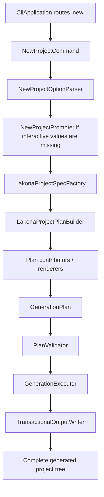
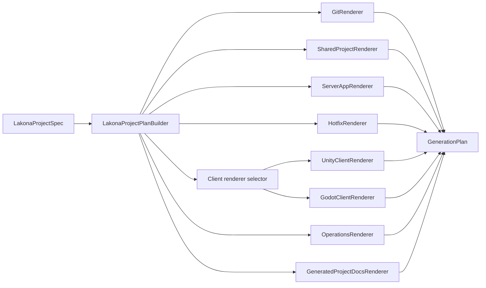

# Lakona.Tool Refactor Architecture

Status: accepted direction
Date: 2026-06-11
Audience: implementation agent

## Purpose

`src/Lakona.Tool` was mechanically merged from `ULinkRPC.Starter` and
`ULinkGame.Tool`. The merged tool still behaves like two products wired
together: create an RPC starter workspace, then patch it into a Lakona.Game
project. This document defines the target architecture for a breaking refactor.

The goal is a single, coherent Lakona project generator:

```txt
CLI options -> Lakona project spec -> generation plan -> transactional write
```

The default product remains `lakona-tool new`: a runnable Lakona.Game project
with Shared contracts, Server/App, Server/Hotfix, a client project, compact
configuration, cluster defaults, hotfix defaults, reliable push defaults, and
the generated check command.

## Architecture Decision

Refactor `Lakona.Tool` as one generation pipeline. Do not keep a hidden RPC
starter layer. Do not implement a thin wrapper around the current two-phase
flow. Do not preserve augment behavior for early-stage compatibility.

The tool should answer one question:

```txt
Given a Lakona project specification, what complete project tree should exist?
```

It should not answer:

```txt
Given an old RPC starter tree, what patches turn it into a Game tree?
```

This distinction is the point of the refactor. The final architecture should
make it difficult to reintroduce the historical `Starter -> Augment` seam.

## Non-Goals

Do not preserve compatibility with these internal or historical surfaces:

- `Lakona.Tool.RpcStarter` namespace
- `Starter*` types, `StarterTemplateContext`, `StarterPaths`, and standalone
  starter tests
- `ProjectScaffolder.AugmentProjectWithLakonaGameAsync`
- pure standalone `ULinkRPC.Starter` command behavior
- `--network-profile`, `single`, and `realtime` generation paths
- console client generation, unless a new Lakona.Game console client goal is
  explicitly designed in a separate document
- `Server/Server/` generated layout

The refactor should preserve the intended user-facing project experience, not
the current internal API shape.

## Current Problems

The current implementation has four architectural problems.

1. Two generation models are interleaved. `ProjectScaffolder` calls RPC starter
   templates for Shared and Client, then writes or mutates Game server, hotfix,
   and client files afterward.
2. Option models are duplicated. CLI options are stringly typed, then mapped
   through `ToolOptionValues` into `RpcStarter` enums.
3. Dependency ownership is split between `StarterDependencyPlanner` and
   `GameDependencyPlanner`, which makes package ownership hard to reason about.
4. Rendering is file-oriented and imperative. Large static classes such as
   `ProjectScaffolder`, `ChatClientTemplates`, and `ServerProjectTemplates`
   mix project planning, file paths, template strings, engine-specific assets,
   XML mutation, and overwrite policy.

The result is fragile: a generated path can be created by one phase and patched
by another phase, tests mirror source-project history, and historical concepts
still leak through names and docs.

## Required Invariants

The new design must enforce these invariants in code, not only by convention:

- One command builds one `LakonaProjectSpec`.
- One `LakonaProjectSpec` builds one `GenerationPlan`.
- The `new` command writes only from a validated plan.
- No renderer writes to disk directly.
- No renderer reads or mutates files created by another renderer.
- No `new` path performs in-place project XML mutation.
- No generated path contains `Server/Server`.
- No production code references `Lakona.Tool.RpcStarter`.
- No production code has `Starter*` model names.
- No generated user file contains `ULinkRPC`, `ULinkGame`, or `RpcStarter`.
- Runtime package boundaries remain visible in generated projects.
- Generated RPC glue remains source-generator output, never committed files.

`MergeXml` style operations may exist only for future maintenance commands such
as `sync` or `upgrade`. The first refactor should keep `lakona-tool new`
create-from-plan only.

## Rejected Approaches

### Approach A: Rename and Flatten

Rename `RpcStarter` types, move files into `Scaffolding`, and keep the two-phase
generation flow.

This is low risk but not enough. It hides merge artifacts without removing the
starter/augment boundary that causes most complexity.

### Approach B: Keep RPC Starter as an Internal Module

Keep a private `RpcWorkspaceGenerator` and let `GameProjectGenerator` build on
top of it.

This is better than the current tree, but still optimizes for a standalone RPC
starter that is not the default Lakona.Tool product. It keeps duplicate
dependency planning and makes the Game project look like an afterthought.

The accepted approach is not a third option among these. It is the constraint
for this refactor: one project recipe graph, one plan, one transactional write.
Shared RPC concerns are part of the Lakona project recipe rather than a
separate starter product.

## Target Module Layout

Use this shape under `src/Lakona.Tool`:

```txt
Cli/
  Program.cs
  CliApplication.cs
  Commands/
    NewProjectCommand.cs
  Options/
    NewProjectOptions.cs
    NewProjectOptionParser.cs
    NewProjectPrompter.cs
  Text/
    ToolText.cs
  Terminal/
    ICliTerminal.cs
    ConsoleCliTerminal.cs

Domain/
  ClientEngine.cs
  TransportKind.cs
  SerializerKind.cs
  PersistenceKind.cs
  DeploymentProfile.cs
  NuGetForUnitySource.cs
  ProjectFeature.cs
  LakonaProjectSpec.cs
  LakonaProjectSpecFactory.cs
  ProjectLayout.cs
  PackageCatalog.cs

Planning/
  LakonaProjectPlanBuilder.cs
  GenerationPlan.cs
  GenerationPlanBuilder.cs
  GeneratedFile.cs
  GeneratedDirectory.cs
  GeneratedFileKind.cs
  FileWriteMode.cs
  DependencyPlanner.cs
  PackageReferenceSpec.cs
  PlanValidator.cs

Rendering/
  Common/
    GitRenderer.cs
    PackageReferenceRenderer.cs
    ProjectXmlRenderer.cs
    TemplateRenderer.cs
  Project/
    ProjectConfigRenderer.cs
  Shared/
    SharedProjectRenderer.cs
    SharedContractsRenderer.cs
  Server/
    ServerAppRenderer.cs
    HotfixRenderer.cs
    ServiceBindingRenderer.cs
    CheckCommandRenderer.cs
  Client/
    IClientRenderer.cs
    UnityClientRenderer.cs
    GodotClientRenderer.cs
    UnityAssetRenderer.cs
    GodotSceneRenderer.cs
  Operations/
    OperationsRenderer.cs
  Docs/
    GeneratedProjectDocsRenderer.cs

Execution/
  GenerationExecutor.cs
  TransactionalOutputWriter.cs
  ToolFileSystem.cs
```

Delete `src/Lakona.Tool/RpcStarter/**`. Move only the durable ideas forward:
transactional output from `StarterOutputManager`, embedded asset extraction from
the file writer, Unity/Godot package matrices, and source-generator based RPC
project configuration.

## Pipeline Diagram



Renderer contribution flow:



Only the selected client renderer contributes files. For example, a Godot plan
must not include Unity `Assets/` files, Unity `.meta` files, or NuGetForUnity
files.

## Public Internal API Shape

These types are internal to `Lakona.Tool`, but they are the architectural API
between modules. The implementation should keep this shape close unless code
review finds a concrete defect.

```csharp
internal sealed class NewProjectCommand(
    NewProjectOptionParser parser,
    NewProjectPrompter prompter,
    LakonaProjectSpecFactory specFactory,
    LakonaProjectPlanBuilder planBuilder,
    PlanValidator validator,
    GenerationExecutor executor,
    ToolText text,
    ICliTerminal terminal)
{
    public Task<int> RunAsync(string[] args, CancellationToken cancellationToken);
}
```

`CliApplication` should only route commands and translate `CliUsageException`
to exit code `1`. It should not know project layout, package references, Unity,
Godot, or file rendering.

```csharp
internal sealed class LakonaProjectGenerator(
    LakonaProjectPlanBuilder planBuilder,
    PlanValidator validator,
    GenerationExecutor executor)
{
    public Task GenerateAsync(LakonaProjectSpec spec, CancellationToken cancellationToken);
}
```

`LakonaProjectGenerator` is the only high-level generation facade. It replaces
`ProjectScaffolder`.

`LakonaProjectSpecFactory` lives in
`src/Lakona.Tool/Domain/LakonaProjectSpecFactory.cs`. It belongs with the domain
model because it converts validated command intent into the canonical project
specification, including defaults, naming, layout, and default feature
selection.

```csharp
internal interface IPlanContributor
{
    void AddFiles(LakonaProjectSpec spec, GenerationPlanBuilder builder);
}
```

Renderers should implement `IPlanContributor`. A renderer returns files to the
plan builder; it does not call `File.WriteAllText`, `Directory.CreateDirectory`,
or `XDocument.Load`.

```csharp
internal interface IClientRenderer : IPlanContributor
{
    ClientEngine Engine { get; }
}
```

The plan builder selects exactly one client renderer based on
`LakonaProjectSpec.ClientEngine`.

## Core Data Flow

### 1. Parse Options

`NewProjectOptionParser` returns typed values:

```csharp
internal sealed record NewProjectOptions(
    string ProjectName,
    string OutputPath,
    ClientEngine ClientEngine,
    TransportKind Transport,
    SerializerKind Serializer,
    PersistenceKind Persistence,
    NuGetForUnitySource NuGetForUnitySource,
    DeploymentProfile DeploymentProfile,
    NewProjectOptionPresence Presence);
```

`--network-profile` should be removed. The generated project is always a
single-node local cluster by default. Future topology choices should be modeled
as `DeploymentProfile` or a new explicit topology option after a separate design.

Use enums at the parser boundary:

```csharp
internal enum ClientEngine
{
    Unity,
    UnityCn,
    Tuanjie,
    Godot
}

internal enum TransportKind
{
    Tcp,
    WebSocket,
    Kcp
}

internal enum SerializerKind
{
    Json,
    MemoryPack
}

internal enum PersistenceKind
{
    None,
    MySql,
    Postgres
}

internal enum DeploymentProfile
{
    None,
    Compose
}

internal enum NuGetForUnitySource
{
    Embedded,
    OpenUpm
}
```

The parser should normalize aliases only at the CLI edge. For example,
`websocket` maps to `TransportKind.WebSocket`, and no downstream code compares
transport strings.

### 2. Build Project Spec

`LakonaProjectSpec` is the single source of generation intent:

```csharp
internal sealed record LakonaProjectSpec(
    string Name,
    ProjectLayout Layout,
    ClientEngine ClientEngine,
    TransportKind Transport,
    SerializerKind Serializer,
    PersistenceKind Persistence,
    NuGetForUnitySource NuGetForUnitySource,
    DeploymentProfile DeploymentProfile,
    IReadOnlyList<ProjectFeature> Features);
```

Default `Features` should include:

- `ClusterLocal`
- `Hotfix`
- `ReliablePush`
- `LoginSlice`
- `ChatSlice`

These are generation-time features. They do not become runtime `Enabled` flags
in `appsettings.json`.

`LakonaProjectSpecFactory` owns defaulting:

```csharp
internal sealed class LakonaProjectSpecFactory
{
    public LakonaProjectSpec Create(NewProjectOptions options)
    {
        var layout = ProjectLayout.Create(options.ProjectName, options.OutputPath);
        return new LakonaProjectSpec(
            options.ProjectName,
            layout,
            options.ClientEngine,
            options.Transport,
            options.Serializer,
            options.Persistence,
            ResolveNuGetForUnitySource(options),
            options.DeploymentProfile,
            ProjectFeatureCatalog.DefaultFeatures);
    }
}
```

Keep project naming decisions here:

- sanitized Unity package/company id
- root namespace names
- server project name
- shared project name
- Godot assembly name
- generated docs title

Do not spread name sanitation across renderers.

### 3. Build Generation Plan

`LakonaProjectPlanBuilder` creates a complete immutable plan:

```csharp
internal sealed record GenerationPlan(
    string RootPath,
    IReadOnlyList<GeneratedFile> Files,
    IReadOnlyList<GeneratedDirectory> Directories,
    IReadOnlyList<PlanDiagnostic> Diagnostics);

internal sealed record GeneratedDirectory(
    string RelativePath);

internal sealed record GeneratedFile(
    string RelativePath,
    string Content,
    FileWriteMode WriteMode,
    GeneratedFileKind Kind);

internal enum GeneratedFileKind
{
    Text,
    Project,
    Solution,
    Json,
    Xml,
    UnityAsset,
    GodotScene,
    GodotTheme,
    Markdown,
    EmbeddedAsset
}

internal enum FileWriteMode
{
    CreateOnly,
    Replace
}
```

`FileWriteMode.Replace` is safe during `new` because writes happen inside a new
staging tree. `CreateOnly` is for files that should fail if a renderer produces
the same path twice through future composition. Do not use in-place merge in the
`new` command.

The plan builder must validate:

- no duplicate relative paths
- no writes outside the output root
- no generated RPC glue directories
- no `Server/Server/` paths
- no `RpcStarter`, `ULinkRPC`, or `ULinkGame` strings in generated user files
- no `Cluster.Enabled`, `Hotfix.Enabled`, or `ReliablePush.Enabled` config keys

Recommended diagnostic shape:

```csharp
internal sealed record PlanDiagnostic(
    PlanDiagnosticSeverity Severity,
    string Code,
    string Message,
    string? Path = null);

internal enum PlanDiagnosticSeverity
{
    Error,
    Warning
}
```

Validation errors should fail generation before a staging directory is created.

### 4. Execute Transactionally

`GenerationExecutor` writes to a staging directory and moves it into place only
after every renderer succeeds. Keep the current rollback behavior from
`StarterOutputManager`, but make it generic and test it outside any recipe.

The executor should not understand Unity, Godot, RPC, Game, hotfix, or package
rules. It only knows paths, write modes, text normalization, embedded asset
extraction, and rollback.

Transactional execution should be:

1. Resolve target root.
2. Fail if target root exists and is not empty.
3. Create sibling staging root named `.<ProjectName>.tmp-<random>`.
4. Write all directories and files into staging.
5. Extract embedded assets into staging only.
6. Move staging root to final target root.
7. On any failure before the move, delete staging.
8. On move failure, keep the original target untouched and report both the
   generation failure and cleanup failure if cleanup also fails.

The executor must reject path traversal before writing:

```csharp
var fullPath = Path.GetFullPath(Path.Combine(stagingRoot, file.RelativePath));
if (!fullPath.StartsWith(stagingRootFullPath, StringComparison.OrdinalIgnoreCase))
{
    throw new InvalidOperationException($"Generated file escapes project root: {file.RelativePath}");
}
```

## Dependency Planning

Replace `StarterDependencyPlanner` and `GameDependencyPlanner` with one
`DependencyPlanner` over target roles:

```csharp
internal enum ProjectTarget
{
    Shared,
    ServerApp,
    ServerHotfix,
    UnityClient,
    GodotClient
}
```

Use one package reference model:

```csharp
internal sealed record PackageReferenceSpec(
    string Id,
    string Version,
    PackageReferenceStyle Style,
    bool ManuallyInstalled = false,
    string? PrivateAssets = null,
    string? IncludeAssets = null,
    string? OutputItemType = null);
```

`PackageCatalog` owns all versions. It should keep MSBuild-generated Lakona
package versions, but expose them as a typed catalog rather than scattered
partial constants. External runtime dependency versions such as MemoryPack,
Godot SDK helper packages, Roslyn packages, and Unity KCP dependencies should
also live here.

Rules:

- Shared owns `Lakona.Rpc.Core`.
- Shared owns MemoryPack serializer and MemoryPack generator when serializer is
  MemoryPack.
- ServerApp owns `Lakona.Game.Server`, hotfix runtime, server generators, RPC
  server, selected transport, cluster packages, persistence packages, and RPC
  analyzers.
- ServerApp owns JSON serializer only for JSON projects. MemoryPack server
  consumption comes through Shared.
- Unity-compatible clients use `packages.config` and keep explicit runtime
  package dependencies needed by Unity and Tuanjie.
- Godot clients use SDK-style package references and do not repeat MemoryPack
  runtime packages already owned by Shared.

Package rendering should be pure and shared:

- SDK `.csproj` package references
- NuGetForUnity `packages.config`
- analyzer metadata
- project references with target framework metadata

### Target Dependency Matrix

`DependencyPlanner` should have direct tests for this matrix.

| Target | Always Includes | Conditional Includes |
| --- | --- | --- |
| Shared | `Lakona.Rpc.Core` | MemoryPack serializer package, `MemoryPack`, `MemoryPack.Generator` when serializer is MemoryPack |
| ServerApp | `Microsoft.Extensions.Hosting`, `Lakona.Game.Server`, `Lakona.Game.Server.Generators`, `Lakona.Game.Server.Hotfix`, `Lakona.Game.Server.Hotfix.Generators`, `Lakona.Rpc.Server`, selected transport, `Lakona.Rpc.Analyzers` | JSON serializer for JSON projects, cluster packages for default local cluster, Dapper and DB provider for external persistence |
| ServerHotfix | project references to Shared and ServerApp | no direct runtime package duplication unless hotfix APIs require it |
| UnityClient | `Lakona.Rpc.Core`, `Lakona.Rpc.Client`, selected transport, selected serializer, `Lakona.Rpc.Analyzers`, `Lakona.Game.Client`, `Lakona.Game.Abstractions`, `System.Threading.Channels` | Unity KCP dependencies, JSON dependencies, MemoryPack/Roslyn dependencies |
| GodotClient | `Lakona.Rpc.Core`, `Lakona.Rpc.Client`, selected transport, `Lakona.Rpc.Analyzers`, `Lakona.Game.Client` | JSON serializer for JSON projects, local Godot SDK NuGet source if detected |

Godot MemoryPack projects should not duplicate Shared-owned MemoryPack package
references as long as generated Godot client source does not directly reference
MemoryPack attributes or runtime types. If a future Godot renderer introduces
direct MemoryPack symbols in the client assembly, either move that usage back
into Shared or update `DependencyPlanner` and tests to add the exact required
client package references. The acceptance check is a generated Godot KCP
MemoryPack project build, not an assumption about transitive package behavior.

Analyzer references must keep private metadata:

```xml
<PackageReference Include="Lakona.Rpc.Analyzers" Version="...">
  <PrivateAssets>all</PrivateAssets>
  <IncludeAssets>runtime; build; native; contentfiles; analyzers; buildtransitive</IncludeAssets>
</PackageReference>
```

Server generator references should keep `OutputItemType="Analyzer"` and
`PrivateAssets="all"` when rendered as attributes, matching current generated
server project behavior.

## Rendering Boundaries

Renderers should be small and target-oriented.

Each renderer should have three constraints:

- It receives only `LakonaProjectSpec` and shared pure helpers.
- It emits `GeneratedFile` entries with relative paths.
- It owns every path it emits.

`SharedProjectRenderer` owns:

- `Shared/Shared.csproj`
- `Shared/Directory.Build.props`
- `Shared/Shared.asmdef`
- `Shared/package.json`
- shared contract files

It should preserve Unity-facing shared source rules:

- Unity-compatible projects target `netstandard2.1;net10.0`.
- Godot projects target the Godot-compatible framework pair used today.
- Shared contracts remain C# 9 compatible for Unity-facing code.
- MemoryPack source generation stays in Shared, not duplicated in server or
  Godot clients.

`ServerAppRenderer` owns:

- `Server/Server.slnx`
- `Server/App/Server.App.csproj`
- `Server/App/Program.cs`
- `Server/App/appsettings.json`
- stable server orchestration files
- generated check command integration

It must render a thin `Program.cs` that delegates to `LakonaGameServer.RunAsync`
and a generated binding/configuration area under `Server/App/Hosting`. It must
not render the old low-level `RpcServerHostBuilder` starter program.

`HotfixRenderer` owns:

- `Server/Hotfix/Server.Hotfix.csproj`
- hotfix rule/service files
- hotfix copy target model

The hotfix project may reference `Server.App.csproj`, but `Server.App.csproj`
must not reference the hotfix project as a normal compile dependency. The
runtime relationship is stable host plus replaceable hotfix assembly.

`UnityClientRenderer` owns Unity/Tuanjie files:

- `Client/Packages/manifest.json`
- `Client/ProjectSettings/ProjectVersion.txt`
- `Client/Assets/packages.config`
- `Client/Assets/NuGet.config`
- login and chat scripts
- UXML, USS, PanelSettings, scene files, meta files
- NuGet package import guard

Unity/Tuanjie generated scripts must obey the repository Unity rules:

- C# 9 compatible syntax only.
- no `System.Reflection.Emit`
- no runtime code generation
- no checked-in RPC generated client source
- NUnit Unity test conventions when generated tests are added

`GodotClientRenderer` owns:

- `Client/project.godot`
- `Client/Client.csproj`
- `Client/NuGet.config` when local Godot SDK packages are used
- `Client/Login.tscn`
- `Client/Chat.tscn`
- `Client/Theme/LakonaTheme.tres`
- login and chat scripts

Godot UI should be file-backed:

- `.tscn` scenes contain the node tree.
- `.tres` contains the theme.
- C# scene scripts use `GetNode` and unique node names.
- Do not reintroduce C# `BuildUi` methods for the default scenes.

`OperationsRenderer` owns compose output only when
`DeploymentProfile.Compose` is selected.

`ProjectConfigRenderer` owns `lakona-game.tool.json`. This file describes the
tool-generated project choices and is not server runtime configuration, so it
should not be owned by `ServerAppRenderer`.

`GeneratedProjectDocsRenderer` should add generated project docs described by
`docs/game/lakona-tool-default-experience.md`:

- `docs/GETTING_STARTED.md`
- `docs/EDITING_GUIDE.md`
- `docs/OPERATIONS.md`

Large static assets should move out of giant C# string classes into resource
templates where possible. C# renderers should compose small, named templates
from typed inputs instead of exposing one catch-all `ToolTemplates` facade.

### Path Ownership Table

| Path Prefix | Owner |
| --- | --- |
| `.gitignore`, `.gitattributes` | `GitRenderer` |
| `lakona-game.tool.json` | `ProjectConfigRenderer` |
| `Shared/**` | `SharedProjectRenderer` |
| `Server/Server.slnx` | `ServerAppRenderer` |
| `Server/App/**` | `ServerAppRenderer` except app docs |
| `Server/Hotfix/**` | `HotfixRenderer` |
| `Client/**` for Unity/Tuanjie | `UnityClientRenderer` |
| `Client/**` for Godot | `GodotClientRenderer` |
| `docker-compose.cluster.yml`, `.env.cluster.example`, `ops/**`, `Server/Dockerfile` | `OperationsRenderer` |
| `docs/GETTING_STARTED.md`, `docs/EDITING_GUIDE.md`, `docs/OPERATIONS.md` | `GeneratedProjectDocsRenderer` |

If two renderers need to affect one file, the file owner should expose a typed
input model instead of allowing both renderers to emit or mutate the same path.

## Generated Project Layout

The generated project layout should be:

```txt
MyGame/
  .gitattributes
  .gitignore
  lakona-game.tool.json
  Shared/
    Shared.csproj
    Directory.Build.props
    Shared.asmdef
    package.json
    Contracts/
  Server/
    Server.slnx
    App/
      Server.App.csproj
      Program.cs
      appsettings.json
      Hosting/
      Chat/
      Login/
    Hotfix/
      Server.Hotfix.csproj
      Login/
      Chat/
  Client/
    ...
  docs/
    GETTING_STARTED.md
    EDITING_GUIDE.md
    OPERATIONS.md
  ops/
    ...
```

There should be no `Server/Server/` directory in newly generated projects.

## Generated Runtime Story

The default generated project should demonstrate Lakona.Game as one vertical
slice rather than disconnected framework examples:

```txt
client login RPC
  -> stable Server/App binding
  -> session identity and endpoint binding
  -> route registration
  -> reliable welcome notification
  -> chat bind RPC
  -> ChatRoomActor through IActorRuntime
  -> hotfix ChatService filters message text
  -> reliable chat notification
```

The generated server must not use static mutable process state for chat room
concurrency. The room state belongs in an actor. Stable server code owns actor
runtime access and hotfix dispatch wrappers. Hotfix code owns replaceable
business rule behavior only.

Generated docs should point users to three edit zones:

- `Shared/Contracts/` for RPC contracts, callback contracts, reliable push DTOs,
  and named contract ids.
- `Server/App/` for stable orchestration, actor state, host binding, and runtime
  integration.
- `Server/Hotfix/` for replaceable rules and services.

## CLI Contract

Keep the default command:

```powershell
lakona-tool new
```

Non-interactive use should require:

```powershell
lakona-tool new --name MyGame --client-engine unity --transport kcp --serializer memorypack
```

Supported user-facing options:

- `--name`
- `--output`
- `--client-engine unity|unity-cn|tuanjie|godot`
- `--transport tcp|websocket|kcp`
- `--serializer json|memorypack`
- `--persistence none|mysql|postgres`
- `--nugetforunity-source embedded|openupm`
- `--deploy-profile none|compose`

Remove `--network-profile` from help, parser, option presence tracking, tests,
and README. Do not add flags that disable cluster, hotfix, or reliable push.

Unsupported historical options should fail with normal unsupported-option
diagnostics. Do not silently ignore `--network-profile`; that would hide stale
automation.

Interactive prompting should ask only for values needed to form
`LakonaProjectSpec`:

1. project name
2. client engine
3. transport
4. serializer

Persistence, NuGetForUnity source, deployment profile, and output path keep
documented defaults unless explicitly provided.

The target layout intentionally moves CLI support files into subdirectories:

- `Cli/Text/ToolText.cs`
- `Cli/Terminal/ICliTerminal.cs`
- `Cli/Terminal/ConsoleCliTerminal.cs`

This is a physical move, not only a conceptual grouping. The refactor has no
internal compatibility requirement, and the directory layout should make command
routing, text, terminal abstraction, and option parsing easy to scan.

## Configuration Contract

Generated `Server/App/appsettings.json` must contain only the compact source
values:

```json
{
  "Lakona.Game": {
    "Node": {
      "Id": "dev-1"
    },
    "Endpoints": [
      {
        "Transport": "kcp",
        "Host": "127.0.0.1",
        "Port": 20000
      }
    ]
  }
}
```

For WebSocket transport, include only `"Path": "/ws"` in the endpoint entry.

Do not generate these keys:

- `Cluster.Enabled`
- `Hotfix.Enabled`
- `ReliablePush.Enabled`
- `Node.Profile`
- `Hotfix.Directory`
- `ReliablePush.Outbox`
- `Cluster.Directory`
- `Services`
- `Bootstrap`

Derived runtime state belongs in generated server code and check output, not
default JSON.

## Test Architecture

Restructure tests around the new pipeline:

```txt
tests/Lakona.Tool.Tests/
  Cli/
    NewProjectOptionParserTests.cs
    NewProjectPrompterTests.cs
    ToolTextTests.cs
  Domain/
    ProjectSpecFactoryTests.cs
  Planning/
    DependencyPlannerTests.cs
    GenerationPlanTests.cs
    PlanValidatorTests.cs
  Rendering/
    SharedProjectRendererTests.cs
    ServerAppRendererTests.cs
    UnityClientRendererTests.cs
    GodotClientRendererTests.cs
    OperationsRendererTests.cs
  Execution/
    TransactionalOutputWriterTests.cs
  Integration/
    NewProjectGenerationTests.cs
  Golden/
    GodotKcpMemoryPack/
    UnityWebSocketJson/
```

Delete `tests/Lakona.Tool.Tests/RpcStarter/**`.

Required coverage:

- option parsing and interactive prompting
- project spec defaults
- package matrix for every target role
- plan validation rejects duplicate paths and legacy paths
- generated compact `appsettings.json`
- server program uses `LakonaGameServer.RunAsync`
- no project-local generated RPC glue
- Unity/Tuanjie package metadata and import guard
- Godot `.tscn` and `.tres` files are generated as files, not C# UI builders
- compose files use `Server/App/Server.App.csproj`, not `Server/Server`
- transactional rollback leaves no target directory after renderer failure
- generated project source scan contains no `ULinkRPC`, `ULinkGame`,
  `RpcStarter`, or `Server/Server`

For end-to-end validation, generate at least:

- Unity, KCP, MemoryPack, OpenUPM
- Unity CN, TCP, JSON, embedded NuGetForUnity
- Tuanjie, TCP, JSON, embedded NuGetForUnity
- Godot, WebSocket, JSON
- Godot, KCP, MemoryPack
- Compose deployment profile

Build generated .NET server projects for representative cases. Unity editor
validation can remain focused and should follow the repository Unity rules when
available.

### Critical Test Examples

Add a source-scan test that fails if the old architecture returns:

```csharp
[Fact]
public void ToolSource_DoesNotContainStarterPipelineArtifacts()
{
    var source = ReadAllToolSource();

    Assert.DoesNotContain("namespace Lakona.Tool.RpcStarter", source);
    Assert.DoesNotContain("StarterTemplateContext", source);
    Assert.DoesNotContain("StarterPaths", source);
    Assert.DoesNotContain("AugmentProjectWithLakonaGameAsync", source);
    Assert.DoesNotContain("ToolOptionValues", source);
}
```

Add a generated-project scan:

```csharp
[Fact]
public async Task NewProject_DoesNotGenerateLegacyStarterLayout()
{
    var root = await GenerateAsync("MyGame", ClientEngine.Unity, TransportKind.Kcp, SerializerKind.MemoryPack);

    Assert.False(Directory.Exists(Path.Combine(root, "Server", "Server")));
    Assert.True(File.Exists(Path.Combine(root, "Server", "App", "Server.App.csproj")));
    Assert.False(Directory.Exists(Path.Combine(root, "Client", "Assets", "Scripts", "Rpc", "Generated")));

    var generatedText = ReadAllGeneratedText(root);
    Assert.DoesNotContain("ULinkRPC", generatedText);
    Assert.DoesNotContain("ULinkGame", generatedText);
    Assert.DoesNotContain("RpcStarter", generatedText);
}
```

Add a plan validator test:

```csharp
[Fact]
public void PlanValidator_RejectsDuplicatePaths()
{
    var plan = new GenerationPlan(
        "Root",
        [
            new GeneratedFile("Shared/Shared.csproj", "a", FileWriteMode.Replace, GeneratedFileKind.Project),
            new GeneratedFile("Shared/Shared.csproj", "b", FileWriteMode.Replace, GeneratedFileKind.Project)
        ],
        [],
        []);

    var result = PlanValidator.Validate(plan);

    Assert.Contains(result.Diagnostics, d => d.Code == "LTPLAN001");
}
```

The exact helper names can differ, but the tests should enforce the same
contracts.

## Implementation Sequence

1. Add typed domain enums, `NewProjectOptions`, and parser tests. Remove
   `--network-profile` at this step.
2. Add `LakonaProjectSpec`, `ProjectLayout`, `ProjectFeature`, and
   `LakonaProjectSpecFactory`. Test default features and path layout.
3. Add `PackageCatalog`, `PackageReferenceSpec`, and unified
   `DependencyPlanner`. Port package matrix tests from both old planners.
4. Add `GeneratedFile`, `GenerationPlan`, `GenerationPlanBuilder`,
   `PlanValidator`, and diagnostics. Test duplicate paths, legacy paths, and
   forbidden generated content.
5. Add `TransactionalOutputWriter` and `GenerationExecutor`. Port rollback
   tests from `StarterOutputManager`.
6. Add renderers one target at a time: git, shared, server app, hotfix, one
   client renderer, operations, docs.
7. Wire `NewProjectCommand` to `LakonaProjectGenerator`.
8. Move integration tests from `ProjectScaffolder` to full `lakona-tool new`
   generation tests.
9. Delete `ProjectScaffolder.AugmentProjectWithLakonaGameAsync`; do not keep an
   obsolete method that calls the new generator.
10. Delete `src/Lakona.Tool/RpcStarter/**`, `ToolOptionValues`, standalone
    starter tests, and old docs that describe standalone starter internals.
11. Update `src/Lakona.Tool/README.md`, `docs/rpc/starter/**`, and any tests
    that refer to `Server/Server` or `RpcStarter`.
12. Bump `src/Lakona.Tool/Lakona.Tool.csproj` version because this changes a
    shippable tool package.

Each step should leave `tests/Lakona.Tool.Tests` either passing or with only
known tests being deleted/replaced in that same step. Avoid a long-lived state
where old starter tests fail while the new pipeline is half-built.

## Migration Map From Current Code

| Current File | Target |
| --- | --- |
| `Cli/CliApplication.cs` | keep as router; move `new` handling into `Cli/Commands/NewProjectCommand.cs` |
| `Cli/CliParser.cs` | replace with `Cli/Options/NewProjectOptionParser.cs` returning typed options |
| `Cli/NewCommandPrompter.cs` | move to `Cli/Options/NewProjectPrompter.cs` and prompt typed options |
| `Cli/ToolText.cs` | move physically to `Cli/Text/ToolText.cs` |
| `Cli/CliTerminal.cs` | split and move physically to `Cli/Terminal/ICliTerminal.cs` and `Cli/Terminal/ConsoleCliTerminal.cs` |
| `Scaffolding/ToolModels.cs` | split into `Domain/*` and CLI option records |
| `Scaffolding/ToolOptionValues.cs` | delete |
| `Scaffolding/GameDependencyPlanner.cs` | replace with `Planning/DependencyPlanner.cs` |
| `RpcStarter/Generation/StarterDependencyPlanner.cs` | delete after porting package matrix |
| `RpcStarter/Generation/StarterModels.cs` | delete after porting enums and version constants |
| `RpcStarter/Infrastructure/StarterOutputManager.cs` | port behavior to `Execution/TransactionalOutputWriter.cs` |
| `RpcStarter/Infrastructure/StarterTemplateRenderer.cs` | port generic resource rendering to `Rendering/Common/TemplateRenderer.cs` |
| `Scaffolding/ProjectScaffolder.cs` | replace with `LakonaProjectGenerator` plus plan contributors |
| `Scaffolding/Templates/ToolTemplates.cs` | delete facade after callers move to renderers |
| `Scaffolding/Templates/ServerProjectTemplates.cs` | split into `ServerAppRenderer`, `HotfixRenderer`, `ServiceBindingRenderer`, `CheckCommandRenderer` |
| `Scaffolding/Templates/ChatClientTemplates.cs` | split into Unity and Godot client renderers |
| `Scaffolding/Templates/UnityAssetTemplates.cs` | move to `Rendering/Client/UnityAssetRenderer.cs` or resource templates |
| `Scaffolding/Templates/OperationsTemplates.cs` | move to `Rendering/Operations/OperationsRenderer.cs` |
| current config save logic in `CliApplication` | move to `Rendering/Project/ProjectConfigRenderer.cs` |
| `Infrastructure/ToolFileWriter.cs` | keep as low-level text/asset helper used by executor only |
| `Infrastructure/ProjectXmlMutator.cs` | keep only for future maintenance commands or remove from `new` path |
| `Infrastructure/PackageReferenceText.cs` | replace or adapt as `Rendering/Common/PackageReferenceRenderer.cs` |

## Documentation Cleanup

The current `docs/rpc/starter/**` documents standalone RPC starter internals.
After the refactor:

- Move historical standalone starter decisions to `docs/rpc/archive/starter/`
  if they remain useful.
- Rewrite active RPC starter docs so they describe source-generator constraints
  that still apply to Lakona.Tool generated projects.
- Remove active instructions that point maintainers at
  `src/Lakona.Tool/RpcStarter/**`.
- Keep `docs/game/lakona-tool-default-experience.md` as the user-experience
  authority for generated Game projects.
- Keep this document as the implementation architecture authority for the tool
  refactor.

The Definition of Done source scans intentionally cover
`src/Lakona.Tool` and `tests/Lakona.Tool.Tests`. The wider documentation cleanup
does not require all historical mentions of `ULinkRPC` or `ULinkGame` to
disappear from the repository; archive docs may keep historical names when they
are clearly archival. Active tool docs must not instruct contributors to edit
`src/Lakona.Tool/RpcStarter/**` or preserve the old starter pipeline.

## Source File Disposition

Delete:

- `src/Lakona.Tool/RpcStarter/**`
- `src/Lakona.Tool/Scaffolding/ToolOptionValues.cs`
- `tests/Lakona.Tool.Tests/RpcStarter/**`

Replace:

- `src/Lakona.Tool/Scaffolding/ProjectScaffolder.cs`
- `src/Lakona.Tool/Scaffolding/ToolModels.cs`
- `src/Lakona.Tool/Scaffolding/GameDependencyPlanner.cs`
- `src/Lakona.Tool/Scaffolding/ToolTemplates.cs`
- `src/Lakona.Tool/Cli/CliParser.cs`
- `src/Lakona.Tool/Cli/NewCommandPrompter.cs`

Split:

- `src/Lakona.Tool/Scaffolding/Templates/ChatClientTemplates.cs`
- `src/Lakona.Tool/Scaffolding/Templates/ServerProjectTemplates.cs`
- `src/Lakona.Tool/Scaffolding/Templates/UnityAssetTemplates.cs`
- `src/Lakona.Tool/Scaffolding/Templates/OperationsTemplates.cs`

Keep and adapt:

- `src/Lakona.Tool/Infrastructure/ToolFileWriter.cs`
- `src/Lakona.Tool/Infrastructure/ProjectXmlMutator.cs`
- `src/Lakona.Tool/Infrastructure/PackageReferenceText.cs`
- `src/Lakona.Tool/Cli/Text/ToolText.cs`
- `src/Lakona.Tool/Cli/Terminal/ICliTerminal.cs`
- `src/Lakona.Tool/Cli/Terminal/ConsoleCliTerminal.cs`
- `src/Lakona.Tool/Cli/Program.cs`

## Definition of Done

The refactor is done when all of these are true:

- `rg "RpcStarter|StarterTemplate|StarterPaths|AugmentProjectWithLakonaGame|ULinkRPC|ULinkGame" src/Lakona.Tool tests/Lakona.Tool.Tests` returns no production references except intentional archive docs or comments explaining deletion history.
- `rg "Server/Server|Server\\\\Server|network-profile|realtime|single" src/Lakona.Tool tests/Lakona.Tool.Tests` returns no active generation paths.
- `lakona-tool new` generates the target layout in one pass from a single
  generation plan.
- No generated project contains committed RPC glue under `Generated/`.
- Generated `appsettings.json` stays compact and matches
  `docs/game/lakona-tool-default-experience.md`.
- `dotnet build Lakona.slnx` passes.
- `dotnet test Lakona.slnx --no-build` passes, or tool-related tests pass and
  any unrelated solution failures are recorded with exact failure output.
- `src/Lakona.Tool/Lakona.Tool.csproj` has a version bump.
