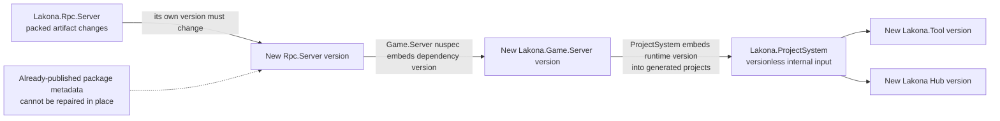
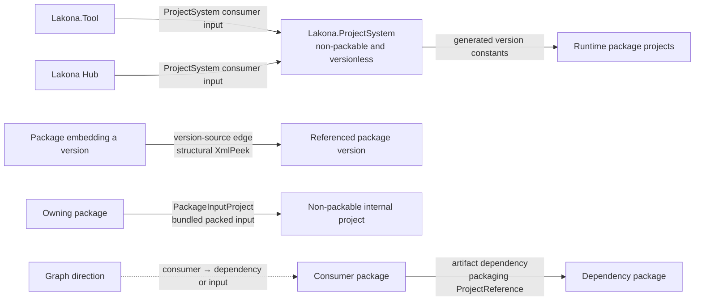
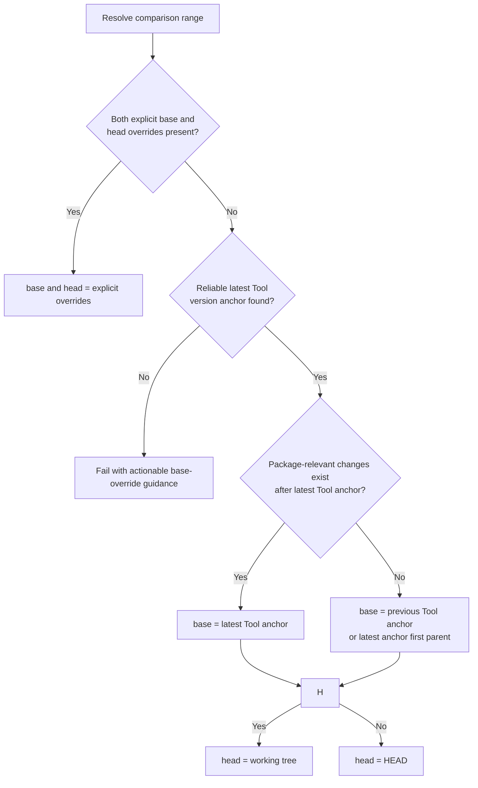
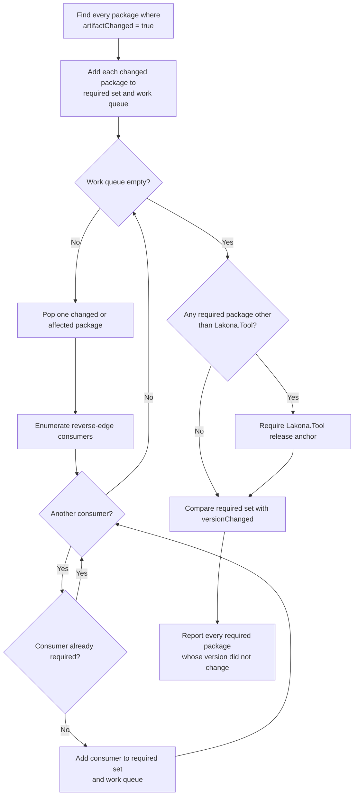
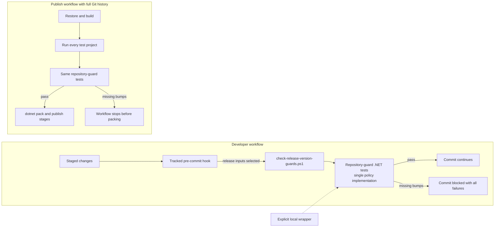

# Package Version Graph Guard

## Purpose

Lakona packages are published from a monorepo, but NuGet packages are immutable
once a `PackageId` + `Version` pair exists. If a package dependency changes and
the consuming package keeps the same version, a later publish with
`--skip-duplicate` cannot repair the already-published consumer package. Users
then restore stale dependency metadata even though the source tree looks
correct.

This document defines a local, graph-based version guard. It detects when a
package or generated-template dependency edge changed and requires every
affected published package to receive a new version. It intentionally does not
query nuget.org or compare against already-published remote packages.

The diagrams explain graph direction and propagation. The definitions,
algorithms, and maintenance rules following them remain the precise contract.

## Reading Map

| Question | Start here |
| --- | --- |
| Why must downstream package versions change? | [Problem Model](#problem-model) |
| Which repository relationships become graph edges? | [Graph Construction](#graph-construction) |
| Which Git trees are compared? | [Change Detection](#change-detection) |
| How are required bumps propagated? | [Required Bump Algorithm](#required-bump-algorithm) |
| Where does the guard run? | [Execution Model](#execution-model) |

## Non-Goals

- Detecting or repairing already-published bad packages.
- Deciding semantic version numbers or major/minor/patch policy.
- Replacing focused API or runtime compatibility tests.
- Requiring every downstream application to upgrade all packages together.
- Inferring external package compatibility from NuGet ranges.

## Problem Model

`dotnet pack` converts most `ProjectReference` edges between packable projects
into package dependencies in the generated `.nuspec`.

For example, one runtime-package change can require several new immutable
artifacts even though only the first package's implementation changed:



If `Lakona.Rpc.Server` changes from version `X` to `Y`, then
`Lakona.Game.Server` must publish a new version so its `.nuspec` depends on
`Y`. Because the internal `Lakona.ProjectSystem` module embeds that Game Server
version into generated projects, its published consumers `Lakona.Tool` and
Lakona Hub must also receive new versions. `Lakona.ProjectSystem` itself has no
package identity or independently published version.

Some package assets come from internal, non-packable projects. Their owning
package declares each such project with `PackageInputProject`; a source change
under that project requires a new owner package version even though there is no
NuGet dependency edge. `Lakona.Game.Server.Hotfix.Generators` uses this path
because its compiler extension ships inside `Lakona.Game.Server`.
`Lakona.Rpc.Analyzers` uses the same path because its compiler extension ships
inside `Lakona.Rpc.Core`. Hotfix authoring types are compiled directly into
`Lakona.Game.Server` and therefore do not form a separate artifact edge.

The required behavior is not specific to Hotfix packages. It applies to every
packable package dependency chain in `src/**`.

## Definitions

- **Package node**: a `src/**.csproj` with a `PackageId` and a package version,
  unless explicitly marked non-packable with `IsPackable=false`.
- **Artifact dependency edge**: a dependency from package node `A` to package
  node `B` that can appear in `A`'s generated package metadata.
- **Version-source edge**: a dependency from package node `A` to package node
  `B` where `A` embeds `B`'s package version into generated code, templates, or
  other packed content.
- **ProjectSystem consumer input**: source owned by the internal ProjectSystem
  module, or a package project whose version it embeds; changes require new
  Tool and Hub versions without turning ProjectSystem into a package node.
- **Bundled project input**: a non-packable project named by a package node's
  `PackageInputProject` item whose output is embedded in the owner's package.
- **Changed package artifact**: a package node whose packed source/content or
  package version changed between the selected Git base and head.
- **Required bump**: a package node that must change its `<Version>` because
  its own packed artifact changed or because an upstream dependency node
  changed.

## Graph Construction

The guard builds directed edges from each consumer toward the input whose
artifact or version it consumes. Required bumps later walk those edges in
reverse, from a changed input to every affected consumer.



### Package Nodes

Scan `src/**/*.csproj`. A project is a package node when all are true:

- It has `PackageId`.
- It has `Version`.
- `IsPackable` is not `false`.

`PackAsTool=true` projects are normal package nodes.

### Artifact Dependency Edges

For each package node, parse `ProjectReference` items. If the referenced project
is also a package node, add an artifact dependency edge unless the reference is
explicitly configured as a non-package implementation detail.

Suppression rule:

- Ignore a `ProjectReference` only when it has both
  `ReferenceOutputAssembly="false"` and `PrivateAssets="all"`.

This rule is intentionally conservative. If a non-packaging reference does not
match it, add an explicit metadata marker instead of special-casing package
names.

### Bundled Project Inputs

For each `PackageInputProject`, treat the referenced project file and every
source file under its directory as packed inputs of the declaring package.
This is an ownership marker, not a NuGet dependency edge, so the internal
project does not become a package node or appear in a generated `.nuspec`.

### Version-Source Edges and ProjectSystem Consumer Inputs

Some package metadata changes are not `ProjectReference` edges. For package
nodes, the graph discovers these edges by parsing `XmlPeek` tasks whose `Query`
is `/Project/PropertyGroup/Version/text()` and whose `XmlInputPath` resolves to
another package node.

`Lakona.ProjectSystem` uses the same structural `XmlPeek` pattern to write
`GeneratedProjectPackageVersions.g.cs`, but it is an internal non-packable
module rather than a package node. The separate ProjectSystem consumer guard
treats its source tree and every referenced runtime package project as release
inputs of both `Lakona.Tool` and Lakona Hub.

Both rules are intentionally structural; neither uses a package-name allowlist.
Do not attempt general MSBuild property dataflow analysis.

## Change Detection

The guard compares two Git trees:

- `base`: the selected comparison base.
- `head`: the commit or working tree being validated.

Default base/head resolution:

- If explicit `LAKONA_VERSION_GUARD_BASE` and `LAKONA_VERSION_GUARD_HEAD`
  overrides are present, use them.
- Otherwise find the most recent commit where
  `src/Lakona.Tool/Lakona.Tool.csproj` changed its `<Version>` value.
- If package-relevant changes exist after that latest Tool version anchor, use
  the latest Tool version anchor commit as `base`.
- If no package-relevant changes exist after the latest Tool version anchor,
  use the previous Tool version anchor commit as `base`, falling back to the
  latest anchor's first parent when there is no previous anchor.
- Use `HEAD` as `head` for a clean working tree.
- Use the working tree as `head` when tracked or untracked local changes are
  present.



This keeps package-only changes after a completed Tool release anchored after
that committed Tool version anchor, so a missing new Tool bump is still
reported. When
the latest Tool bump is the current release boundary, the guard falls back to
the previous Tool anchor so the current Tool bump and the package changes that
caused it stay in the same comparison range.

For each package node:

1. Read current and base `<Version>`.
2. Detect whether any file that can affect the packed artifact changed.
3. Mark `versionChanged` when the `<Version>` value differs.
4. Mark `artifactChanged` when packed inputs changed or `versionChanged` is
   true.

Packed input detection is conservative:

- Include files under the package project directory.
- Include files linked into the project with `Compile Include`, `None Include`,
  `EmbeddedResource Include`, or equivalent packable item metadata.
- Include project directories declared through `PackageInputProject`.
- Include repository-level build inputs that can affect all package outputs:
  `Directory.Build.props`, `Directory.Build.targets`, `global.json`, and shared
  imported `.props` or `.targets` files under repository-owned build paths.
- Exclude `bin/**`, `obj/**`, editor caches, and generated build outputs.
- Exclude test projects and docs outside the package directory unless the
  package explicitly packs them.

## Required Bump Algorithm

The algorithm computes required version bumps from changed package artifacts and
the reverse dependency graph.



The transitive walk is required. If `B` changes, `A -> B` must bump. Once `A`
bumps, `C -> A` must also bump so `C`'s `.nuspec` points at the new `A`
version.

`Lakona.Tool` is the repository release anchor. If any package in the required
set other than `Lakona.Tool` changes, `Lakona.Tool` must also change version.
This keeps generated project package constants aligned with each repository
release and gives the guard a stable local comparison anchor for the next run.

The guard reports all failures in one run. A failure message shows:

- the package that must bump,
- the changed dependency path that forced the bump,
- the current version,
- the file or dependency edge that changed.

Example shape:

```txt
Lakona.Game.Server must bump because:
  Lakona.Game.Server changed its packed inputs.
Current Lakona.Game.Server version is unchanged at <current>.
```

## Expected Behavior

### Runtime Package Change

If `Lakona.Rpc.Core` source changes and its version changes, every packable
package that directly or transitively depends on `Lakona.Rpc.Core` through
artifact dependency edges must also change version.

### Bundled Hotfix Asset Change

If the internal Hotfix abstractions or generator project changes, its
`PackageInputProject` owner must publish a new version:

```txt
Lakona.Game.Server
```

The ProjectSystem consumer guard then observes the generated
`Lakona.Game.Server` version input and requires new `Lakona.Tool` and Lakona Hub
versions, without assigning ProjectSystem a package version.

### Bundled RPC Analyzer Change

If the internal `Lakona.Rpc.Analyzers` project changes, its
`PackageInputProject` owner `Lakona.Rpc.Core` must publish a new version. The
normal package graph carries that change through every RPC runtime consumer and
`Lakona.Game.Server`; the ProjectSystem consumer guard carries the generated
version change into Tool and Hub without an analyzer-specific rule.

### Tool Template Version Change

If a runtime package version changes and `Lakona.ProjectSystem` embeds that
version into generated starter projects, `Lakona.Tool` and Lakona Hub must
change version even if neither adapter implementation changed. ProjectSystem
remains versionless and non-packable.

### Isolated Tool Code Change

If only `src/Lakona.Tool` implementation changes, only `Lakona.Tool` is
required to bump unless other graph edges or packed inputs changed.

## Execution Model

The guard is implemented in the non-packable .NET repository-guard test
project included in the normal test solutions. A thin PowerShell wrapper
provides explicit local invocation without duplicating graph or Git logic.

Current source shape:

```txt
tests/Lakona.RepositoryGuards.Tests/
  Lakona.RepositoryGuards.Tests.csproj
  PackageVersions/
    PackageVersionGraphFixtureTests.cs
    PackageVersionGraphRepositoryTests.cs
    PackageGraph.cs
    PackageProjectReader.cs
    GitChangeSetReader.cs
scripts/nuget/check-package-version-graph.ps1
```

This shape keeps the policy in one implementation:

- The guard runs automatically during `dotnet test Lakona.slnx` and
  `dotnet test tests/Tests.slnx`.
- It is cross-platform and uses normal .NET XML/path handling.
- The graph algorithm can have fast fixture tests without shelling out to Git.
- The repository integration test can shell out to Git once, then run the
  in-memory graph algorithm.
- The PowerShell script is a convenience entry point, not the source of truth.



### Local Commit Enforcement

Each clone should configure the tracked hooks with:

```powershell
pwsh -NoProfile -File scripts/git/install-hooks.ps1
```

When NuGet or Hub release inputs are staged, `.githooks/pre-commit` delegates
to `scripts/check-release-version-guards.ps1`. The hook only selects whether
the guards need to run; the .NET repository tests remain the single authority
for graph construction, base selection, and required version bumps. This moves
the same failure from post-push CI to the local commit boundary without
duplicating release policy.

The guard must be fast enough to run on every development finish pass:

- It must not restore, build, pack, or query NuGet.
- It reads only project files, relevant repository metadata, and `git
  diff --name-only` output.
- Its expected cost is proportional to package projects plus dependency edges
  plus changed paths.
- For the current repository size, the target runtime is under one second after
  the test assembly is loaded.

The guard must be precise enough that maintainers do not learn to ignore it:

- It must report all missing version bumps in one failure.
- It must show the dependency path that forced each bump.
- It must fail when the comparison base cannot be resolved instead of
  silently skipping.
- It must use explicit suppressions for known structural exceptions rather
  than package-name special cases.

## Local Base Resolution

The test project resolves base/head the same way whether invoked through
`dotnet test` or the wrapper script.

Input overrides:

- `LAKONA_VERSION_GUARD_BASE`
- `LAKONA_VERSION_GUARD_HEAD`

Default behavior:

1. If both overrides are present, use them.
2. Resolve the latest committed `Lakona.Tool.csproj` `<Version>` change.
3. If package-relevant changes exist after that latest Tool anchor, use the
   latest Tool anchor commit as `base`; otherwise use the previous Tool anchor,
   falling back to the latest anchor's first parent when needed.
4. If the working tree has tracked or untracked changes, use the working tree
   as head; otherwise use `HEAD`.
5. If no reliable Tool version anchor can be resolved, fail with an actionable
   message telling the developer to set `LAKONA_VERSION_GUARD_BASE`.

The guard prints the resolved base/head at the start of the test output.
It must not skip silently.

## CI Enforcement

`.github/workflows/publish-nuget.yml` checks out full history, restores and
builds the repository, then runs every test project. The repository-guard test
project therefore validates the package graph before the workflow reaches
`dotnet pack`. A missing required bump fails the test job and prevents stale
dependency metadata from being packed or published.

Full history is required so the guard can resolve the latest
`Lakona.Tool` version anchor and its predecessor. CI relies on the default
anchor. Explicit base/head overrides remain limited to maintainer diagnostics
and unusual repository-history repairs.

## Maintenance Rules

- Do not encode accident-specific package IDs or version thresholds.
- Treat new packable projects as graph nodes automatically.
- Treat new `ProjectReference` edges between package nodes as dependency edges
  automatically.
- Add explicit edge metadata only for structural exceptions.
- Keep parser and graph-algorithm tests fixture-based, including direct,
  transitive, version-source, non-packable, and suppressed-reference cases.
- Do not hard-code real published package versions into algorithm fixtures.
- Keep failure output concrete enough that a maintainer knows exactly which
  package version must change and why.
- Keep online NuGet metadata comparison separate if it is added.
